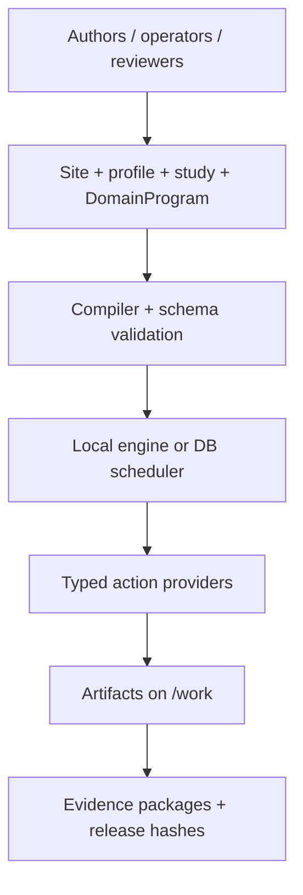
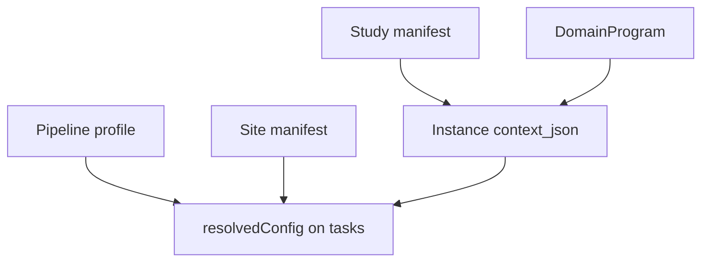
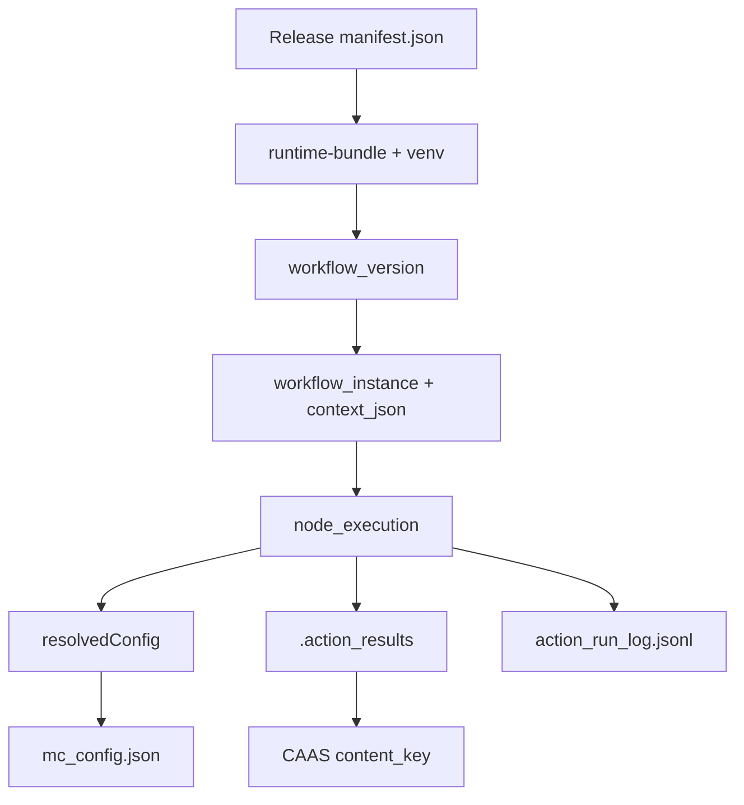
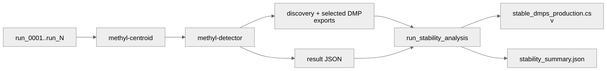
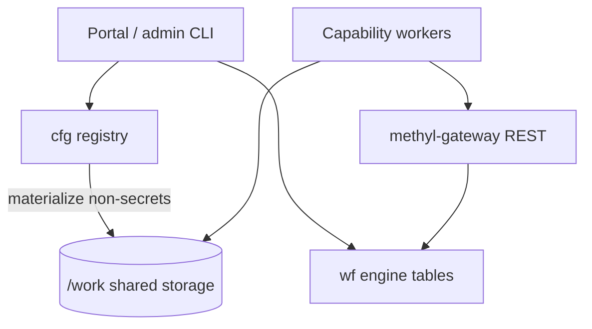
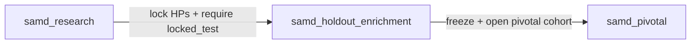
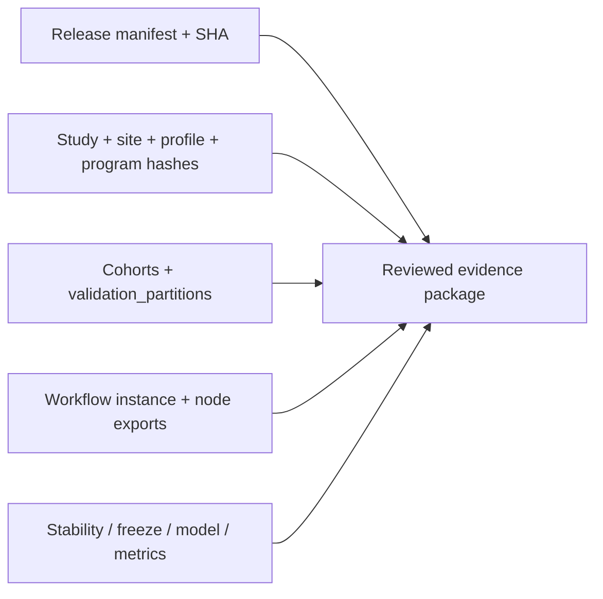
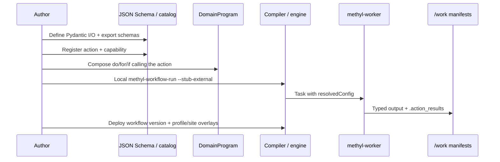

# MethylPipeline Platform Overview

**Audience:** mixed technical, product, and SaMD-review readers  
**Format:** print-friendly Markdown synthesis (~24–36 pages)  
**Companion Canvas:** [methylpipeline-platform-overview.canvas.tsx](../canvas/methylpipeline-platform-overview.canvas.tsx)  
**Status:** canonical quick platform overview (2026-07)

> **Not a regulatory claim.** Architecture, profiles, schemas, and scaffolds support
> controlled evidence generation. They do **not** constitute FDA clearance, De Novo
> authorization, or completed clinical validation. Live evidence packages today are
> feasibility / engineering only unless a reviewed pivotal package says otherwise.

---

## Table of contents

1. [Executive overview](#1-executive-overview)
2. [Capability map](#2-capability-map)
3. [Workflow authoring model](#3-workflow-authoring-model)
4. [Configuration and reproducibility](#4-configuration-and-reproducibility)
5. [Scientific process pack](#5-scientific-process-pack)
6. [Runtime, operations, and security](#6-runtime-operations-and-security)
7. [SaMD fitness framework](#7-samd-fitness-framework)
8. [Extension guide and worked example](#8-extension-guide-and-worked-example)
9. [Limitations, readiness, and references](#9-limitations-readiness-and-references)

---

## 1. Executive overview

### What MethylPipeline is

MethylPipeline is a **schema-driven workflow platform** for describing, training,
testing, and deploying analysis pipelines. Its primary shipping process pack is
**DNA methylation study analysis**—sample preparation through model validation—but
the control plane is intentional and reusable:

| Layer | Role |
|-------|------|
| **DomainProgram** | Versioned workflow topology (`for` / `if` / `parallel` / actions) |
| **Typed actions** | Cataloged workers with Pydantic I/O and JSON Schema contracts |
| **Four-layer config** | Site, profile, study, program—precedence without hidden Python defaults |
| **Execution** | Local engine **or** portal → DB → gateway → capability workers on `/work` |
| **Evidence** | Action manifests, CAAS content keys, release hashes, SaMD profile ladder |

**Platform thesis:** operators and authors compose **registered actions** into
validated programs; code **resolves and validates** configuration; workers execute
frozen task payloads. New process types are added by typed adapters—not by embedding
operational knobs in application code.

### Who this overview serves

| Reader | What to take away |
|--------|-------------------|
| Product / leadership | Capability map, claim boundary, readiness posture |
| Architect / developer | Authoring model, config precedence, extension path |
| Operator / DevOps | Runtime topology, release bundle, storage rules |
| Quality / SaMD reviewer | Evidence ladder, controls inventory, explicit gaps |

Deep method detail lives in the [Theory book](../theory/index.qmd); runbooks live in the
[Usage manual](../usage/index.qmd); engine internals live in
[Implementation](../implementation/index.md).

### Critical qualifications

| Claim | Qualification |
|-------|---------------|
| “Flexible workflow platform” | Flexible within **registered actions + DomainProgram IR**. Arbitrary ungoverned scripts are out of scope. |
| “Disease-agnostic” | Topology and config are disease-agnostic; study cohorts live on `/work/projects/<study>/`. |
| “SaMD-ready architecture” | **Controls and scaffolds exist.** Pivotal clinical performance evidence is **not** yet registered as claim-ready. |
| “Canonical entry point” | Prefer `methyl-workflow-run`. Monolithic `methyl-validation --stability/--freeze/--model` is transitional only. |

### Platform vs process pack

Think of MethylPipeline as two nested products:

1. **Control plane (platform)** — DomainProgram language, action catalog, config registry,
   local/distributed engines, typed observability, release bundles, evidence templates.
2. **Methylation process pack** — sample prep through blind prediction packages and
   SaMD study profiles that exercise the control plane for epigenetic studies.

A team can:

- run the methylation pack end-to-end on a new disease cohort without editing Python,
- compose alternate statistical modes via profiles (`researchMode`),
- add adjacent assays by registering typed actions and programs,
- assemble regulatory narratives from the same provenance chain used in operations.

What a team cannot honestly claim without more work:

- that any DomainProgram is automatically a cleared SaMD,
- that WF2 random-split metrics are pivotal clinical performance,
- that feasibility prostate packages in the evidence index are claim-ready.



### Document length and how to read

This overview is designed as a **few-dozen-page print synthesis**. Prefer:

- §1–2 for leadership and product framing,
- §3–6 for architects and operators,
- §7 for quality / SaMD reviewers,
- §8 for engineers extending the platform,
- §9 and appendices as claim-boundary and index.

### Source map (this document)

| Section | Primary sources |
|---------|-----------------|
| Capabilities | [Product and operational controls](../regulatory/methylpipeline-product-and-operational-controls.md) |
| Authoring | [DomainProgram language](../reference/domain-program-language.md), [orchestration paths](../architecture/orchestration-paths.md) |
| Config | [Layer model](../architecture/layer-model.md), [config registry](../architecture/config-registry.md) |
| Science stages | [Pipeline stages](../architecture/pipeline-stages.md), Usage ch.03–09 |
| Runtime | [Distributed runtime](../architecture/distributed-runtime.md), [WORKER_PROTOCOL](../../workers/WORKER_PROTOCOL.md) |
| SaMD | [Usage ch.18](../usage/18-samd-study-lifecycle.qmd), [submission scaffold](../regulatory/samd-submission-scaffold.md), [evidence index](../regulatory/validation-evidence-index.md) |

---

## 2. Capability map

MethylPipeline delivers two complementary surfaces: a **scientific process pack**
(methylation) and a **platform control plane** (workflow, config, execution, audit).

### Scientific capabilities

| Area | Capability | Canonical docs |
|------|------------|----------------|
| Sample preparation | FASTQ ingress, Parabricks alignment, remediation, methylation extraction, archive | [Usage ch.03](../usage/03-sample-prep-and-qc.qmd) |
| Quality control | Alignment QC, extraction QC, branchable remediation | [Usage ch.10](../usage/10-artifacts-and-qa-checks.qmd) |
| DMP discovery | Centroid, detector, Storey FDR, panel modes | Theory ch.02–03 |
| Stability and freeze | Monte Carlo recurrence, stable panel, freeze readiness | [Usage ch.05–06](../usage/05-stage-stability.qmd) |
| Interpretation | Mapper, enricher, PPI/Enrichr, progression | Theory ch.07–08 |
| Modeling and prediction | Classifier, predictor, holdout evaluation | Theory ch.04, 15 |
| Optional measures | Fragmentomics, derived measures, info-theory covariates | Package docs under `packages/*/docs/` |

### Platform capabilities

| Area | Capability | Canonical docs |
|------|------------|----------------|
| Workflow engine | DomainProgram compile, graph scheduling, local + DB execution | [Implementation: engine](../implementation/workflow-engine.md) |
| Distributed runtime | Portal, `cfg`+`wf` DB, gateway, workers, shared storage | [Distributed runtime](../architecture/distributed-runtime.md) |
| Typed contracts | Action catalog (~45 actions), task schemas, OpenAPI | [Schema index](../reference/schema-index.md) |
| Config registry | Sites, profiles, programs, studies, storage endpoints | [Config registry](../architecture/config-registry.md) |
| Reuse / versioning | Idempotent skip, CAAS content keys, `hyperparamSetId` | [Usage ch.17](../usage/17-content-addressed-action-store.qmd) |
| Release | Versioned runtime bundle, manifest hashes, gated deploy | [Production release](../deployment/production_release.md) |
| Regulatory synthesis | Traceability, change management, evidence templates | [Regulatory](../regulatory/README.md) |

### Describe → train → test → deploy (platform reading)

| Verb | MethylPipeline meaning |
|------|------------------------|
| **Describe** | Author DomainProgram + study manifest + profile/site overlays; validate schemas and partitions |
| **Train** | Run MC stability / freeze / model actions that produce panels and model bundles |
| **Test** | Post-model validation, WF3 holdout eval, readiness gates, CI regression |
| **Deploy** | Promote runtime-bundle release; start portal/DB instances; workers execute frozen payloads |

### Capability stack (control plane)


### Active package inventory (process pack)

| Package | Role |
|---------|------|
| `methylutils` | Shared helpers / config resolve |
| `methyldomain` | Domain types, storage models, action results, CAAS helpers |
| `methylcentroid` | Group methylation centroids |
| `methyldetector` | DMP detection |
| `methyldmpselect` | DMP FeatureCuts / panel selection |
| `methylmapper` | DMP→gene / feature mapping |
| `methylenricher` | Pathway / PPI enrichment |
| `methyldiseaseprogression` | Staged progression analysis |
| `methylgeneselect` / `methylgenefeatureselect` | Gene / gene-feature selection |
| `methylclassifier` / `methylpredictor` | Model train and predict |
| `methylvalidation` | MC, freeze, readiness, holdout, regulatory artifacts |
| `methylalignmentqc` / `methylextractionqc` | QC guardrails |
| `methylfragmentomics` / `methylderivedmeasures` / `methylinfotheory` | Optional covariates |

`methylcluster` is **archived** and not on the supervised ECDF path.

### What “almost any workflow” means in practice

MethylPipeline can host **additional process packs** when each new capability is:

1. modeled as typed action I/O (Pydantic → JSON Schema),
2. registered in the action catalog with a capability tag,
3. invoked from a DomainProgram (not ad-hoc remote code),
4. parameterized via site/profile/instance config (config-not-code),
5. observable via `result_code`, manifests, and optional CAAS.

It does **not** claim unrestricted embedding of arbitrary third-party pipelines without
those contracts.

---

## 3. Workflow authoring model

### Artifact ladder

```text
*.program.json                 Authoring IR (git / cfg publish)
        │ compile
        ▼
WorkflowDefinitionSpec         Nodes, FOREACH, templates, bindings
        │ deploy or local run
        ▼
Instance context_json          projectPath, pipelineProfile, samples, …
        │ finalize
        ▼
Task input_json                resolvedConfig (+ optional resolvedProject)
        │ worker
        ▼
Artifacts + .action_results    Typed outputs, signatures, logs
```

### DomainProgram constructs

| IR | Engine | Use |
|----|--------|-----|
| `do` / `action` | ACTION | Run a catalog action |
| `for` / `foreach` | FOREACH | Iterate chromosomes, samples, iterations (`parallel` optional) |
| `if` / `then` / `else` | IF | Branch on scope variables (e.g. QC pass) |
| `parallel` | PARALLEL | Concurrent child blocks |
| `switch` / `while` / `repeat` / `assign` | v2 controls | Multi-way branch and typed assign — see [language v2](../reference/domain-program-language-v2.md) |

Branching prefers **boolean scope bindings** from action outputs (`qcPass`,
`remediateAlignment`). Integer `result_code` drives SWITCH cases (`0` success /
false, `1` true / remediate, `2..N` multi-way).

### Worked topology fragment (sample prep remediation)

```json
{
  "if": "${remediateAlignment}",
  "then": [
    { "action": "sample.trim_fastq", "node_key": "trim_fastq" },
    { "action": "sample.parabricks_fq2bam", "node_key": "parabricks_realign" },
    { "action": "sample.methyl_qc", "node_key": "methyl_qc_retry" }
  ],
  "else": [{ "action": "sample.qc_failed", "node_key": "qc_failed" }]
}
```

The engine does not encode trim thresholds; QC actions emit branch variables and
profiles/site overlays supply tunable guardrails.

### Canonical programs

| Program | Purpose |
|---------|---------|
| `fixtures/sample_prep.program.json` | Per-sample FASTQ → QC → extract → archive |
| `fixtures/mc_stability.program.json` / staged variants | Monte Carlo stability |
| `fixtures/study_validation_lifecycle.program.json` | Freeze → model → post-model |
| `fixtures/samd_*.program.json` | SaMD ladder pairings |
| `fixtures/interpretation.program.json` | Mapper/enricher-style interpretation |

### Orchestration paths

| Path | Status |
|------|--------|
| `methyl-workflow-run` | **Canonical** (local, CI, production workers) |
| `methyl-gateway` + `methyl-worker` | Production distributed |
| `methyl-study-start` / portal SQL | Instance compile/start (not gateway admin) |
| `methyl-validation --stability/--freeze/--model` | **Legacy** transitional only |
| File-queue `plan-runs` / `run-task` | **Legacy** MC queue |

```bash
source .venv/bin/activate
methyl-workflow-run \
  --program workflow_engine/domain/fixtures/study_validation_lifecycle.program.json \
  --context '{"projectPath":"/work/projects/<study>/configs/project_*.json","pipelineProfile":"samd_research"}' \
  --parallel-workers 1
```

### Local vs distributed (same programs)

| Mode | Engine | When |
|------|--------|------|
| Local | `LocalWorkflowEngine` in-process | Developer, CI, `--stub-external` |
| Distributed | DB scheduler + gateway + workers | Production cluster |

Instance context is finalized by portal or `methyl-study-start` **before** create.
The gateway does **not** re-merge profiles at task claim.

### Typed action boundary

Every workflow-exposed action defines **input and output Pydantic models**. Tunable
fields use `Field(default=None, …)` with schema descriptions pointing operators to
site/profile overlays—not hardcoded science defaults in Python
([typed I/O rule](../../.cursor/rules/python-typed-io.mdc),
[config-not-code](../../.cursor/rules/config-not-code.mdc)).

Workers on the distributed path consume **`--resolved-config`** (and optional
`--step-override`). They must **not** re-read `project.json`, profiles, or
`METHYL_*` env for tool parameters when resolved config is present.

### Provider registry note

Actions are process-pack providers registered for the compiler/catalog—not a
general-purpose DI container. See
[action provider registry](../architecture/action-provider-registry.md).

---

## 4. Configuration and reproducibility

### Four layers

| Layer | Artifact | Owns |
|-------|----------|------|
| Site | `/work/site/methyl_site.json` | Genomes, GTF, caches, deployment caps |
| Profile | `*.profile.json` | Reusable `actionConfig` packs + IF scope flags |
| Study | `project_*.json` on `/work/projects/<study>/` | Cohorts, paths, comparisons, partitions, regulatory |
| Program | `*.program.json` | Topology and optional per-node `with` / `stepOverride` |

**Precedence (highest wins):** program/instance override → profile `actionConfig` →
analyte defaults → site → *(no Python fallback for tunable science knobs)*.

Study manifests must **not** contain `step_config` or tool parameters.




### Repo vs `/work` vs `cfg`

| Concern | Where |
|---------|-------|
| Contracts, CI fixtures, import seeds | Git repo |
| Published non-secret objects for workers | `/work` via `methyl-cfg materialize` / release promote |
| Sites, profiles, programs, studies, credentials | `cfg` database (production SoT) |
| Sample CSVs and run artifacts | `/work/projects/<study>/` |
| Secrets | `cfg.credential` (DB SoT) — never under project trees; Key Vault optional escape hatch |

### Configuration registry (`cfg`)

Production source of truth for sites, profiles, DomainPrograms, studies, storage
endpoints/credentials, and reference assets is the **`cfg` schema** (Azure SQL or
PostgreSQL). **Storage accounts and credentials** are authored by lab/infra admins
via EpiPortal (`portal.sp_*` upsert/publish). `methyl-cfg` (`import-fs`, `upsert`,
`materialize`, `publish-program`, `sync-actions`) remains the **dev/CI/bootstrap** path.

- **Materialize** writes non-secret published objects onto `/work` / runtime-bundle.
- **Credentials never materialize** to shared storage. Schedule-time expand embeds
  concrete auth fields (plus `credentialName` / `contentHash`) into task `input_json`
  over gateway TLS; dumb workers refresh a **node-local** Fernet cache. Azure Key Vault
  / `encrypted_file` remain optional escape hatches—not the default production path.
- Git keeps contracts, CI fixtures, and import seeds.

See [config-registry](../architecture/config-registry.md) and
[Usage ch.19](../usage/19-config-registry.qmd).

### Example: gene FeatureCuts caps (config-not-code)

Set at site and/or profile—not as Python defaults:

```json
"actionConfig": {
  "validation": {
    "stability_gene_featurecuts_max_dmps": 1000,
    "stability_gene_featurecuts_max_genes": 200
  },
  "gene_selection": {
    "max_dmps": 1000,
    "max_genes": 200
  }
}
```

### Reproducibility mechanisms

| Mechanism | What it binds |
|-----------|---------------|
| Instance `context_json` | Frozen study/profile/program bindings for a run |
| `resolvedConfig` | Merged action parameters baked at instance configuration |
| `mc_config.json` | MC validation snapshot under `monte_carlo_runs/queue/` |
| `.action_results/*.json` | Per-action manifests with `action_revision`, input/output signatures |
| CAAS | Content-addressed reuse via `content_key` / `hyperparamSetId` |
| Release `manifest.json` | Deployed runtime bundle identity + SHA256 |

Idempotency is **action-level** (safe re-run after partial failure), not automatic
workflow-wide retry of failed nodes.

### Provenance identity chain



Details: [traceability-provenance](../reference/traceability-provenance.md).

---

## 5. Scientific process pack

Methylation is the shipping process pack. Algorithms live in Theory; this section
is the **operational stage map**.


### Stage summary

| Stage | Packages | Operator chapter |
|-------|----------|------------------|
| Sample prep / QC | workers, `methylalignmentqc`, Parabricks, MethylExtractor | [ch.03](../usage/03-sample-prep-and-qc.qmd) |
| Stability (WF1 core) | `methylcentroid`, `methyldetector`, `methylvalidation` | [ch.05](../usage/05-stage-stability.qmd) |
| Freeze | + `methylmapper`, `methylenricher`, optional progression | [ch.06](../usage/06-stage-freeze.qmd) |
| Model | `methylclassifier`, `methylpredictor` | [ch.07](../usage/07-stage-model.qmd) |
| Post-model validation | `methylvalidation` | [ch.08](../usage/08-stage-post-model-validation.qmd) |
| Blind prediction | `methylpredictor` | [ch.09](../usage/09-stage-blind-prediction.qmd) |

### Statistical workflow distinction (do not conflate)

| Workflow | Meaning | Use for claims? |
|----------|---------|-----------------|
| **WF1** | MC stability → freeze → model on development cohort | Panel/model creation |
| **WF2** | Random-split evaluation of a frozen model | Engineering / exploratory |
| **WF3** | True held-out partitions (`locked_test` / `pivotal_validation`) | Classical holdout / pivotal path |

Theory: [two workflows](../theory/chapters/12-two-workflows.qmd).



### Research modeling modes

Under `pipelineProfile: samd_research`, optional `researchMode` overlays select
statistical branches (`dmp_raw`, `dmp_fc`, `gene_enricher`, `gene_fc`, `dual_fc`).
Legacy `mc_*` profile names are **deprecated aliases** that fold into these modes.
Holdout enrichment and pivotal remain a **separate three-profile claim ladder**—do
not fold them into research modes.

| Mode | Intent (short) |
|------|----------------|
| `dmp_raw` | Exploratory DMP recurrence |
| `dmp_fc` | BA-gated DMP FeatureCuts |
| `gene_enricher` | Enricher/PPI gene recurrence |
| `gene_fc` | Gene-axis FeatureCuts |
| `dual_fc` | DMP + gene FeatureCuts (common research default) |

### Sample preparation sketch


Typical path: download FASTQ → Parabricks `fq2bam_meth` → alignment QC → optional
trim/realign → extract → extraction QC → archive to retention storage. QC actions
emit branchable outputs so DomainPrograms can remediate without hard-coding
biology in the engine.

### Analyte note

Operational analyte differences (e.g. buffy coat vs cfDNA) are documented in
[ANALYTE_PROFILES](../ANALYTE_PROFILES.md). The platform is analyte-aware via study
and site configuration; biology fit remains a scientific judgment, not an engine
guarantee.

### Hyperparameter search

Optional Tier A/B search helpers exist for research tiers; enrichment/pivotal
profiles expect locked hyperparameters. See
[Usage ch.15](../usage/15-optional-hyperparameter-search.qmd) and CAAS
([Usage ch.17](../usage/17-content-addressed-action-store.qmd)) for versioning
results across hyperparameter sets without silently mixing claim stages.

---

## 6. Runtime, operations, and security

### Topology




| Layer | Responsibility |
|-------|----------------|
| Portal | Study/program editing; start SamplePrep / validation instances via SQL |
| `cfg` | Published config objects; credentials in `cfg.credential` (DB SoT) |
| `wf` | Workflow versions, instances, node executions, leases, hyperparameter sets |
| Gateway | Stateless worker claim/submit (no science merge at claim) |
| Workers | Capability-matched execution; read/write `/work` |
| `/work` | Samples, projects, genomes, caches, runtime-bundle |

**Boundary:** portal does **not** call the gateway for worker tasks. Gateway is
worker-facing. Admin compile/start uses DB clients (`methyl-study-start`).
**Worker credentials:** portal preregisters each VM public IP; the VM calls
`POST /v1/workers/enroll` once to mint `worker_id`/`worker_token`; day-2
`authenticate` / claim / submit use that token (no SQL on the worker).

### Operator journey (compressed)

| Phase | Actions |
|-------|---------|
| Day 0 | Install release bundle; configure site; provision GPU/CPU workers |
| Day 1 | Enroll samples; set `fastqStorage`; start SamplePrepPipeline |
| Day N | Start validation lifecycle with SaMD profile; monitor instances |
| Release | Assemble → approve → promote `/work/epimethyl/current`; verify hashes |

Full path: [operator journey](../deployment/operator-journey.md).

### Production release model

Workers run from `/work/epimethyl/current/runtime-bundle/` (profiles, fixtures,
schemas)—**not** a git checkout. Releases carry `manifest.json` hashes; promote
and rollback are operator-gated (see [production release](../deployment/production_release.md)).

### Storage and credentials

| Concern | Rule |
|---------|------|
| Study science | `/work/projects/<study>/` |
| References | `/work/genomes`, `/work/cache` |
| Secrets | `cfg.credential` via portal admin upsert — **not** under `/work/projects` or shared `/work` |
| Sample ingress | Laboratory `fastqStorage` (S3 / Azure / file), selected from published endpoints |
| Retention archive | `portal.resource_profile` → named `cfg.storage_endpoint` (e.g. `epimethyl-archive`) |
| Bulk genomes mirror | Operator `aws s3 sync` via `scripts/sync_genomes_to_s3.sh` |
| Per-sample transfers | Hardened worker transfer layer (multipart, skip, node-local cache via `contentHash`) |

Production default: expand embeds concrete keys in claim `input_json` over TLS with
`contentHash` for node-local cache refresh. Prefer ambient identity
(`instance_profile` / `default_credential`) when the deployment supports it. Do **not**
persist cloud keys under `/work`. Azure Key Vault on workers is an optional escape hatch.
Workers forbid env-var fallback for storage Access Keys on the typed ingress path.

### Observability (honest inventory)

| Record | Location | Status |
|--------|----------|--------|
| `node_execution` | DB | Implemented |
| `.action_results/*.json` | `/work` outputs | Implemented |
| `action_run_log.jsonl` / `sample_prep_log.jsonl` | `/work` | Implemented |
| Portal status / Gantt-style views | Portal over DB | Capability depends on portal UI depth |
| Central metrics / alerting | — | **Not shipped** as productized Prometheus/Datadog |
| Unified trace IDs | — | **Partial** (correlate instance/node IDs) |

### Reliability qualifications

| Topic | Reality |
|-------|---------|
| Idempotent re-run | Action-level signatures / CAAS |
| Auto-retry failed nodes | **Not** a full automatic requeue story |
| Lease recovery | Documented gaps; stuck nodes may need operator intervention |
| Stub external tools | CI/dev `--stub-external` / `WORKER_STUB_EXTERNAL` |

### Security posture (summary)

Documented controls include TLS gateway routes, worker identity tokens, capability
dispatch, Managed Identity for gateway→DB, and optional Arc attestation headers.
Threat-model details: [worker security review](../architecture/worker-security-review.md).
Treat security docs as **engineering controls**, not a certified QMS attestation.

---

## 7. SaMD fitness framework

### Positioning

MethylPipeline provides an **internal SaMD scaffold**:

- three-profile lifecycle ladder,
- patient-disjoint partition schema,
- code-enforced clinical-claim gates,
- freeze readiness and locked model specs,
- evidence package template + submission topic map,
- CI / change-control / release traceability synthesis.

This is **fitness of the software control system for generating and binding
evidence**—not authorization to market a medical device.

### Profile ladder



| Profile | Stage default | Holdouts | Hyperparameters |
|---------|---------------|----------|----------------|
| `samd_research` | `expanded_development` | `locked_test` recommended | Early-stop; exploratory BA |
| `samd_holdout_enrichment` | `internal_validation` | **Required** non-empty `locked_test` | Locked from research; freeze readiness |
| `samd_pivotal` | `pivotal_validation` | **Required** non-empty `pivotal_validation` | Fully locked; hard BA fail |

Operator SOP: [Usage ch.18](../usage/18-samd-study-lifecycle.qmd).

### Partition promotion example

| Milestone | Train CSVs | `locked_test` | `pivotal_validation` |
|-----------|------------|---------------|----------------------|
| After research | Development cohort | Reserved never-trained patients | empty |
| Enrichment | Add **new** train patients only | Unchanged (or grow with new never-trained) | empty |
| Open pivotal | Unchanged | Unchanged | New trial patients only |

Never move holdout patients back into training. Use `independence_keys` so the same
patient cannot appear in train and holdout.

### Claim gate (code-enforced)

| Requirement | Enforcement |
|-------------|-------------|
| Clinical performance claims only at/after `pivotal_validation` | `RegulatoryLifecycleConfig` |
| `allow_clinical_performance_claims: true` blocked earlier | same |
| Enrichment/pivotal profiles require partitions | `methyl-study-validate-manifest` |

### Evidence package chain



Template and registry: [validation-evidence-index](../regulatory/validation-evidence-index.md).  
Submission topic map (scaffold only): [samd-submission-scaffold](../regulatory/samd-submission-scaffold.md).

### Minimum evidence set for an external model claim

From the evidence index:

- release manifest and deploy record,
- frozen study/profile/program/site inputs,
- sample prep and QC summary,
- stability summary and stable panel,
- production freeze summary and biological readiness,
- classifier/predictor artifacts,
- true holdout evaluation when claiming clinical performance,
- bootstrap CIs for primary metrics,
- node exports / action timelines,
- documented limitations and decision rationale.

### Current evidence posture (as documented)

Registered prostate packages (EV-PCA-*) are labeled **feasibility / engineering**:

- `regulatory.stage` feasibility or expanded development,
- empty or undeclared holdout partitions,
- not suitable as pivotal clinical performance citations,
- some chains incomplete (e.g. stability-only without production freeze).

**Path to claim-ready evidence** (from repo SOP):

1. Scaffold study; assign patient-disjoint `locked_test` early.
2. Research with `samd_research`; lock hyperparameters.
3. Enrichment with `samd_holdout_enrichment`; WF3 on `locked_test`.
4. Open `pivotal_validation`; run `samd_pivotal`; human review of intended use.
5. Fill a **new** evidence package bound to release SHA, CI, and partition IDs.

### Control → verification snapshot

Selected rows distilled from [traceability-matrix](../regulatory/traceability-matrix.md):

| Control | Verification / runtime evidence |
|---------|----------------------------------|
| Config-driven workflows | Schema export checks; `context_json` / `resolvedConfig` |
| No tool params in study manifests | Boundary CI guards; task input contract |
| Typed action outputs | `methyl-export-task-schemas --check`; `output_json` |
| Auditable actions | `.action_results`, `action_run_log.jsonl` |
| Versioned production workers | Release manifest SHA; `/work/epimethyl/current` |
| Holdout exclusion | Partition validation; holdout metrics |
| Regression gate | CI JUnit / coverage artifacts |

### Change control and verification

| Control | Doc |
|---------|-----|
| Change classification / revalidation triggers | [change-management-plan](../regulatory/change-management-plan.md) |
| CI taxonomy and regression gate | [continuous-integration-and-regression-testing](../regulatory/continuous-integration-and-regression-testing.md) |
| Claim ↔ artifact matrix | [traceability-matrix](../regulatory/traceability-matrix.md) |
| Provenance identity chain | [traceability-provenance](../reference/traceability-provenance.md) |

Regulatory folder documents are a **synthesis layer**; many are marked proposed
relative to a formal QMS until adopted as SOPs.

### Open regulatory/ops gaps called out by the repo

- Portal Gantt export format not fully canonicalized,
- signed approval workflow for evidence packages not productized,
- retention policy for node exports / logs operator-defined,
- global coverage `fail_under` not enforced (measure-and-report + spine ratchet),
- hosted CI skips GPU/DB/real-data unless self-hosted pools are used.

---

## 8. Extension guide and worked example

This section shows how the platform accepts a **new typed workflow**—using a
domain-neutral “assay QC gate” example—so the methylation pack is not the only
mental model.

### Extension sequence



### Minimal steps (illustrative)

1. **Define typed I/O** in `workers/methyl_worker/task_models/` (or package models
   re-exported there), e.g. `AssayQcTaskInput` / `AssayQcTaskOutput` with
   `Field(default=None, description=…)` for tunable thresholds.
2. **Export schemas** (`methyl-export-task-schemas`, `scripts/export_config_schemas.sh`
   as needed) so operators edit via schema-driven config.
3. **Implement handler or CLI action** returning integer `result_code` and typed
   `output_json` (e.g. `0` = pass, `1` = remediate, `2` = fail).
4. **Register** in `schemas/actions/catalog.json` / `action_catalog.py` with a
   capability string workers can advertise.
5. **Compose DomainProgram** fragment:

```json
{
  "do": "assay.qc_gate",
  "node_key": "assay_qc",
  "with": {
    "sampleId": { "ref": "sampleId" },
    "sampleDir": { "ref": "sampleDir" }
  }
}
```

6. **Parameterize** thresholds under site or profile `actionConfig.assay_qc`—never
   as Python `DEFAULT_*` science constants.
7. **Test locally** with `methyl-workflow-run --stub-external` (or focused pytest).
8. **Deploy** via `deploy_workflow_definitions.sh` / `methyl-cfg publish-program`.
9. **Collect evidence** the same way as methylation actions: manifests, logs,
   release binding, and (if clinical) partition-gated profiles.

### Checklist for a new process pack

| Gate | Done when |
|------|-----------|
| Contracts | Schemas exported and drift-checked in CI |
| Catalog | Action name + capability seeded to DB |
| Config | Tunables documented in schema descriptions (site vs profile) |
| Program | Fixture program under `workflow_engine/domain/fixtures/` |
| Local proof | Stubbed `methyl-workflow-run` green |
| Distributed proof | Worker claims task; artifacts on `/work` |
| Observability | Manifest + JSONL entries present |
| Docs | Usage/architecture notes + this overview link if platform-visible |

### What not to do

- Hide operational thresholds in package constants.
- Require workers to re-read study manifests for tool knobs.
- Persist cloud keys under `/work/projects` or shared `/work` (claim `input_json` over TLS with `contentHash` is the intentional delivery path; node-local cache only).
- Cite smoke/stub runs as analytical or clinical validation.
- Fold pivotal claim stages into exploratory research modes.

---

## 9. Limitations, readiness, and references

### Implemented vs scaffolded vs evidence-bound

| Class | Examples |
|-------|----------|
| **Implemented platform** | DomainProgram compile/run, typed catalog, four-layer config, gateway workers, CAAS/skip, SaMD profiles + claim gates |
| **Scaffolded / proposed** | Regulatory synthesis docs pending formal QMS adoption; PCCP draft artifacts; portal Gantt depth |
| **Evidence-bound (study)** | Must cite release SHA, partitions, metrics paths in the evidence index—architecture alone is insufficient |

### Known gaps (do not overclaim)

- No approved pivotal clinical performance packages in the evidence index.
- Centralized metrics/alerting and unified distributed tracing are incomplete.
- Lease-expiry auto-requeue is not a fully automatic recovery story—operators may
  need to intervene on stuck nodes.
- Hosted CI skips GPU/DB/`/work` real-data paths unless self-hosted pools are used.
- External GPU tools (Parabricks, MethylExtractor) and some enrichment services are
  dependencies outside the Python package tree.
- Some storage providers appear in registry schemas before every worker path implements them.

### Readiness statement suitable for leadership

MethylPipeline is **architecturally prepared** to describe, execute, version, and
audit schema-defined workflows—including methylation study training/testing and a
documented SaMD evidence ladder. It is **not yet substantiated** for external
clinical performance claims until pivotal partitions, locked models, and reviewed
evidence packages are completed and bound to a released software version.

### Role-based further reading

| Need | Start |
|------|-------|
| Run a study | [Usage manual](../usage/index.qmd), [SaMD lifecycle](../usage/18-samd-study-lifecycle.qmd) |
| Methods | [Theory book](../theory/index.qmd) |
| Author workflows | [DomainProgram language](../reference/domain-program-language.md) |
| Deploy cluster | [Operator journey](../deployment/operator-journey.md), [production runbook](../deployment/production_runbook.md) |
| Audit / quality | [Regulatory](../regulatory/README.md), [traceability](../reference/traceability-provenance.md) |
| Architecture detail | [Architecture index](../architecture/index.md) |
| Doc registry | [DOCUMENTATION_AUDIT](../DOCUMENTATION_AUDIT.md) |

### Glossary (short)

| Term | Meaning |
|------|---------|
| DomainProgram | JSON IR for workflow topology |
| `resolvedConfig` | Merged action parameters on worker tasks |
| Profile | Reusable procedure pack (`actionConfig` + scope flags) |
| CAAS | Content-addressed action store for cross-instance reuse |
| WF3 | True holdout evaluation on declared partitions |
| SaMD ladder | `samd_research` → `samd_holdout_enrichment` → `samd_pivotal` |
| Runtime-bundle | Versioned non-git worker payload under `/work/epimethyl/current` |
| Action revision | Catalog/schema identity that invalidates idempotent skip |

### Companion interactive view

Open the Docs Canvas for a navigable visual summary of this overview:

- Git source: [`docs/canvas/methylpipeline-platform-overview.canvas.tsx`](../canvas/methylpipeline-platform-overview.canvas.tsx)
- Sync: `bash scripts/sync_cursor_canvases.sh`

---

## Appendix A — Canonical programs and profiles (index)

### Programs (representative)

| Path under `workflow_engine/domain/` | Use |
|--------------------------------------|-----|
| `fixtures/sample_prep.program.json` | Sample preparation |
| `fixtures/mc_stability.program.json` | Binary MC stability |
| `fixtures/mc_stability_staged.program.json` | Staged MC stability |
| `fixtures/study_validation_lifecycle.program.json` | Freeze → model → PMV |
| `fixtures/samd_research.program.json` | SaMD research pairing |
| `fixtures/samd_holdout_enrichment.program.json` | SaMD enrichment pairing |
| `fixtures/samd_pivotal.program.json` | SaMD pivotal pairing |

### Profiles (representative)

| Profile | Notes |
|---------|-------|
| `samd_research` | Claim-ladder research (+ optional `researchMode`) |
| `samd_holdout_enrichment` | Requires `locked_test` |
| `samd_pivotal` | Requires `pivotal_validation` |
| `staged_ovr_mc` / `staged_full_lifecycle` | Multi-stage OvR packs |
| Legacy `mc_*` | Deprecated aliases → `samd_research` + mode |

Presets: `scripts/workflow_presets.sh`.

---

## Appendix B — Operator command card

```bash
# Local / CI (stub external GPU tools)
source .venv/bin/activate
methyl-workflow-run \
  --program workflow_engine/domain/fixtures/mc_stability.program.json \
  --context-file workflow_engine/domain/profiles/samd_research.profile.json \
  --context '{"projectPath":"/work/projects/<study>/configs/project_*.json","pipelineProfile":"samd_research"}' \
  --stub-external

# Validate SaMD partitions before enrichment/pivotal
methyl-study-validate-manifest \
  --project /work/projects/<study>/configs/project_*.json \
  --profile samd_holdout_enrichment

# Deploy compiled programs to DB
bash scripts/deploy_workflow_definitions.sh

# Sync documentation canvases into Cursor IDE folder
bash scripts/sync_cursor_canvases.sh
```

---

## Appendix C — Fitness-for-purpose narrative (platform)

Use this section when explaining **why** MethylPipeline is a plausible substrate for
SaMD-style software lifecycle control—without asserting clearance.

### Describe

Workflows are **declared** as DomainPrograms and validated against JSON Schema.
Studies declare cohorts and partitions separately from tool knobs. That separation
makes intended use, claim stage, and holdout policy reviewable as configuration.

### Train

Training is an explicit graph of actions (centroid → detect → select → map →
enrich → freeze → model) with frozen `resolvedConfig` and optional CAAS content
keys. Hyperparameter exploration is versionable without rewriting topology.

### Test

Testing spans engineering (CI, schema drift, stubbed local runs), analytical
(stability, freeze readiness, post-model metrics), and classical holdout (WF3)
when partitions exist. Result codes and manifests make pass/fail inspectable.

### Deploy

Production workers consume hashed runtime bundles. Portal/DB instances bind a
specific program version and context. Workers never become an alternate config
authority at claim time.

### Prove

Evidence packages bind release identity, configuration hashes, data partitions,
instance IDs, and metric artifacts. The submission scaffold maps FDA-style topics
to these controls. Completing the pivotal ladder remains a **study/ops obligation**.

### Explicit non-claims

| Tempting claim | Accurate statement |
|----------------|--------------------|
| “We have SaMD software” | We have SaMD **scaffolds and gates** in a controlled pipeline platform |
| “Architecture proves clinical performance” | Architecture proves **traceability**; performance needs pivotal evidence |
| “Any workflow can be plugged in” | Any workflow that accepts **typed actions + config layers** can be plugged in |
| “Feasibility packages are pivotal” | Current EV-PCA packages are **feasibility / engineering** only |

---

## Appendix D — Documentation routing (avoid duplication)

| If you need… | Read… | Not… |
|--------------|-------|------|
| Equations / assumptions | Theory book | This overview |
| Exact CLI flags / artifact paths | Usage chapters | This overview |
| Compiler/SQL internals | Implementation + engine docs | This overview |
| End-to-end platform story | **This overview** | Scattered pillars alone |
| Auditor matrix | Regulatory folder | Research notes |

Maintenance rule: keep this overview as synthesis; update pillars for detail; do
not revive retired root Quarto stubs (`MethylPipeline-overview.qmd`).

---

*End of MethylPipeline Platform Overview.*
