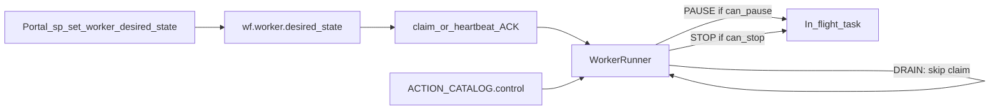

# Action catalog worker control

## Goal

Operators control remote workers from the portal (no SSH). The **worker stays process-agnostic**: it only consults catalog `control` for the claimed `action_name` and applies drain / cooperative pause / stop. Science knobs stay on `actionConfig`.

## Control model (two layers)



| Layer | Always available? | Meaning |
|-------|-------------------|---------|
| **Worker desired_state** | Yes | `ACTIVE` \| `DRAINING` \| `STOPPING` — claim/heartbeat echo this |
| **Action `control`** | Per action | What the runner may do to the **in-flight** task |

Semantics:

- **Continue** (worker): set `desired_state=ACTIVE` → resume claiming.
- **Pause** (worker): `DRAINING` → finish or hold current work; **no new claims**. In-flight cooperative pause only if `control.can_pause`.
- **Stop**: if `can_stop`, abort current task (`fail_task` / cancel child) and drain until cleared; if not `can_stop`, refuse abort (keep heartbeating) and only drain.

WGBS Align example:

```json
"control": {
  "can_pause": false,
  "can_continue": false,
  "can_stop": true
}
```

## Implementation touchpoints

- [`workers/methyl_worker/action_catalog.py`](../../workers/methyl_worker/action_catalog.py) — `ActionControl`, `control_for`
- [`schemas/actions/catalog.json`](../../schemas/actions/catalog.json)
- [`workers/methyl_worker/execution_handle.py`](../../workers/methyl_worker/execution_handle.py), [`runner.py`](../../workers/methyl_worker/runner.py), [`client.py`](../../workers/methyl_worker/client.py)
- [`workflow_engine/sql_pg/wf_worker_desired_state.sql`](../../workflow_engine/sql_pg/wf_worker_desired_state.sql), [`workflow_engine/sql_mssql/wf_worker_desired_state.sql`](../../workflow_engine/sql_mssql/wf_worker_desired_state.sql)
- Docs: [`constrained-worker-ops-actions.md`](../architecture/constrained-worker-ops-actions.md), [`action-provider-registry.md`](../architecture/action-provider-registry.md)

## Operator API

```sql
EXEC portal.sp_set_worker_desired_state @worker_id = 12, @desired_state = N'DRAINING';
EXEC portal.sp_set_worker_desired_state @worker_id = 12, @desired_state = N'STOPPING';
EXEC portal.sp_set_worker_desired_state @worker_id = 12, @desired_state = N'ACTIVE';
-- or bulk: @cluster_id = …, @worker_id = NULL
```

Deploy SQL via `workflow_engine/sql_{pg,mssql}/deploy_azure.sh` (includes `wf_worker_desired_state.sql`).

**Out of scope:** full EpiPortal UI chrome; instance-level PAUSED workflow status; ops env/fs diagnostic actions.
