# Alignment QC Screening and Remediation Plan

## Problem diagnosis

Today's alignment QC ([`packages/methylalignmentqc/methyl_alignment_qc/core/wgbs_parabricks_qc.py`](packages/methylalignmentqc/methyl_alignment_qc/core/wgbs_parabricks_qc.py)) is **too coarse** for the prostate cohort findings:

| Report category | Count | Current pipeline behavior |
|-----------------|-------|---------------------------|
| `USE_CURRENT_ALIGNMENT` | 79 | `overall_pass: true` — works |
| `READ2_START_LOW_QUALITY` (fixable trim) | 148 | Often fails `min_quality_post20` with generic `"FAIL: Do NOT proceed"` — **no trim count, no realign path** |
| Multi-region low quality | 6 | Same generic fail — no `SLIDINGWINDOW`/tail guidance |
| Guardrail-only fail (cycles OK) | 7 | Fails on insert/dropout/deam but **duplication rate is not a guardrail** despite being in `summary_stats` |

**Root cause:** Parabricks `mean_quality_by_cycle` already contains per-cycle Phred (302 cycles = 151 R1 + 151 R2; R2 starts at cycle **152** — visible dip in repo fixture [`packages/methylalignmentqc/data/003772_8C9_3/003772_8C9_3.json`](packages/methylalignmentqc/data/003772_8C9_3/003772_8C9_3.json) at cycle 152), but the code only computes `min(mq[20:])` over the **combined** series and emits free-text recommendations.

There is **no** `fastp`/trim step and **no** remediation branch in [`workflow_engine/domain/fixtures/sample_prep.program.json`](workflow_engine/domain/fixtures/sample_prep.program.json).

**Critical ordering bug (current + prior plan draft):** [`sample_prep.program.json`](workflow_engine/domain/fixtures/sample_prep.program.json) runs `delete_fastqs` **before** `methyl_qc`. That makes Read-2 trimming impossible on the remediation path, because `fastp` requires the original FASTQs. **FASTQs must stay on disk until QC is fully resolved** (pass, or final reject after any trim/realign retry).

```mermaid
flowchart TB
  subgraph today [Current SamplePrep — broken for remediation]
    dl[download_fastq]
    pb[parabricks_fq2bam]
    del[delete_fastqs]
    qc[methyl_qc]
    gate{qcPass}
    dl --> pb --> del --> qc --> gate
    gate -->|pass| extract[methyl_extract]
    gate -->|fail| fail[mark_failed]
  end
  subgraph target [Target SamplePrep — FASTQs retained until final QC]
    dl2[download_fastq]
    pb2[parabricks_fq2bam]
    qc2[methyl_qc + screening]
    gate2{qcPass}
    trim[trim_fastq R2 front]
    pb3[parabricks force realign]
    qc3[methyl_qc retry]
    del2[delete_fastqs]
    dl2 --> pb2 --> qc2 --> gate2
    gate2 -->|pass| del2 --> extract2[methyl_extract]
    gate2 -->|REALIGN_READ2_TRIM| trim --> pb3 --> qc3
    qc3 -->|pass| del2
    qc3 -->|fail| del2b[delete_fastqs] --> fail2[mark_failed]
    gate2 -->|not fixable| del2c[delete_fastqs] --> fail3[mark_failed]
  end
```



**Storage tradeoff:** FASTQs remain in `sampleDir` through initial align + QC (and through remediation if triggered). `delete_fastqs` moves to **after final disposition**, not immediately after Parabricks. Optional `step_config.sample_prep.retain_fastqs_on_fail` (default false) can keep FASTQs on final reject for manual investigation.

---

## Phase 1 — Cycle-quality screening (methylalignmentqc)

### 1a. New screening module

Add [`packages/methylalignmentqc/methyl_alignment_qc/core/cycle_quality_screening.py`](packages/methylalignmentqc/methyl_alignment_qc/core/cycle_quality_screening.py):

**Inputs:** V2 `mean_quality_by_cycle.rows` (or V1 parallel arrays).

**Logic:**
- `read_length = max_cycle // 2` (validate even cycle count; override via config)
- `r2_start_cycle = read_length + 1`
- **R2-start dip:** in window `[r2_start, r2_start + W)` (default W=5), find consecutive cycles below `r2_quality_threshold` (default 30) that recover within `recovery_cycles` (default 10)
- **Recommended `trim_front2`:** number of low-quality cycles at R2 start (cap e.g. 8; min 1 when pattern detected)
- **Multi-region:** count separate dip regions outside the R2-start window → `INVESTIGATE_MULTI_REGION`
- **Guardrail-only:** all cycle checks pass but `overall_pass` false due to non-cycle metrics

**Disposition enum** (stored in export JSON):

| Disposition | Meaning |
|-------------|---------|
| `USE_CURRENT_ALIGNMENT` | `overall_pass` true |
| `REALIGN_READ2_TRIM` | Fixable R2-start-only pattern; `trim_front2 >= 1` |
| `INVESTIGATE_MULTI_REGION` | Multiple dips; manual FastQC / sliding-window |
| `INVESTIGATE_GUARDRAIL_ONLY` | Cycles acceptable; investigate dup/insert/read depth |
| `NOT_FIXABLE` | Severe / ambiguous |

### 1b. Extend models and schema — screening + audit trail

Extend [`GuardrailReport`](packages/methylalignmentqc/methyl_alignment_qc/models/sample_qc.py) with optional `screening` block:

```python
class QcScreeningReport(BaseModel):
    disposition: Literal["USE_CURRENT_ALIGNMENT", "REALIGN_READ2_TRIM", ...]
    read_length: int
    r2_start_cycle: int
    trim_front2: int = 0
    r2_start_mean_quality: float | None
    r2_recovery_mean_quality: float | None
    dip_regions: list[dict]  # optional diagnostics
    message: str
```

Add top-level **`qc_history`** on exported V2 JSON (append-only across retries):

```python
class QcAttemptRecord(BaseModel):
    attempt: int                          # 1 = initial align QC, 2+ = post-remediation
    evaluated_at_utc: str
    alignment_pass: str                   # "initial" | "post_trim_realign"
    reason: str                           # human-readable why this attempt ran
    trigger_disposition: str | None       # screening.disposition that triggered fix (retry only)
    trigger_action: str | None            # e.g. "sample.trim_fastq" + "sample.parabricks_fq2bam"
    trim_front2: int | None
    overall_pass: bool
    disposition: str                      # screening result for this attempt
    failed_guardrails: list[str]          # keys where pass=false
    workflow_node_key: str | None         # e.g. methyl_qc vs methyl_qc_retry
```

**Retry QC requirement:** when `methyl_qc` runs as attempt 2+, the writer **must**:
1. Load existing `{sampleId}.json` if present and **preserve** prior `qc_history` entries
2. Append a new `QcAttemptRecord` with explicit `reason`, e.g.:
   - `"Read 2 start low quality (cycles 152–156); recommended trim_front2=5 before realign"`
3. Set `metadata.qc_attempt = N` on the export

Workflow passes retry context via `input_json` on the second `methyl_qc` task:
- `qcAttempt` (int)
- `qcAttemptReason` (string, built from prior screening message + trim params)
- `remediationTrigger` (object: disposition, trimFront2, priorOverallPass)

Update [`schemas/config/alignment_qc/exported_sample_qc_v2.schema.json`](schemas/config/alignment_qc/exported_sample_qc_v2.schema.json) and regenerate if using export script.

Add `cycle_screening` config to [`schemas/config/alignment_qc.schema.json`](schemas/config/alignment_qc.schema.json) (thresholds, window sizes, max trim).

### 1c. Wire into writer

In [`writer.py`](packages/methylalignmentqc/methyl_alignment_qc/core/writer.py), after `check_wgbs_guardrails` (+ fragmentomics/bisulfite):

1. Run `screen_cycle_quality(payload, config)`
2. Attach `guardrails.screening`
3. Replace generic `recommendation` / `next_steps` with disposition-specific text, e.g.:
   - `REALIGN_READ2_TRIM`: `"Trim {N} bases from Read 2 start (fastp --trim_front2 {N}) and realign."`
   - `INVESTIGATE_GUARDRAIL_ONLY`: list failing non-cycle guardrail keys + suggest dup/insert review
4. **Merge `qc_history`:** read existing export at `output_path` when present; append `QcAttemptRecord` for this evaluation (never drop prior attempts)
5. Accept optional `QcWriteContext` kwargs: `attempt`, `attempt_reason`, `alignment_pass`, `workflow_node_key`, `remediation_trigger`

### 1f. Sample-prep operation log (every action leaves a trace)

In addition to QC JSON history, every SamplePrep worker action appends one JSON line to:

**`{sampleDir}/{sampleId}.sample_prep_log.jsonl`**

Shared helper: [`workers/methyl_worker/sample_prep_log.py`](workers/methyl_worker/sample_prep_log.py) (or under `methylalignmentqc` if QC-only — prefer workers so all prep actions use it):

```python
{
  "ts_utc": "2026-06-15T12:00:00Z",
  "action": "sample.trim_fastq",
  "capability": "sample.trim-fastq",
  "attempt": 1,
  "reason": "REALIGN_READ2_TRIM: trim_front2=5 after initial QC fail",
  "inputs": { "trimFront2": 5, "sampleDir": "..." },
  "outputs": { "trimmedR1": "...", "trimmedR2": "..." },
  "result_code": 0,
  "workflow_node_key": "trim_fastq"
}
```

**Required callers:** `download_fastq`, `parabricks_fq2bam`, `trim_fastq`, `methyl_qc` (initial + retry), `delete_fastqs`, `methyl_extract`, `mark_failed`, `fragmentomics`.

Each handler calls `append_sample_prep_log(...)` on success and on permanent failure. Trim and realign log the **reason** copied from workflow scope / prior QC screening. The retry `methyl_qc` log line and the `qc_history` record must carry the **same reason string** for traceability.

QC export may include `"sample_prep_log_path"` pointing at the JSONL file.

### 1d. Optional guardrail additions

Add **config-gated** guardrails (default off for backward compat, enable in prostate project `step_config.alignment_qc`):

- `duplication_rate` from `summary_stats` (e.g. max 0.25)
- `min_pf_reads` from `quality_yield` (catch critically low depth)

This explains the 7 “cycles OK but failed” samples without changing default behavior for other projects.

### 1e. Tests

- Unit tests with synthetic cycle profiles: R2-start dip only, multi-region, clean pass
- Regression on [`003772_8C9_3.json`](packages/methylalignmentqc/data/003772_8C9_3/003772_8C9_3.json) — expect non-zero `trim_front2` at cycle-152 dip
- **Retry merge test:** write QC attempt 1 → re-run writer with attempt 2 + reason → assert `qc_history` length 2 and reason preserved
- **JSONL append test:** trim + qc handlers append lines without clobbering prior entries
- Update [`test_writer_guardrails.py`](packages/methylalignmentqc/tests/test_writer_guardrails.py)

---

## Phase 2 — Cohort screening report (prostate 240)

Add [`scripts/alignment_qc_cohort_screening.py`](scripts/alignment_qc_cohort_screening.py):

- Input: `--qc-dir` (default `/work/AlignmentQC` or `{project}/alignment_qc`), sample list CSV(s) with group column
- Re-run screening on existing V2 JSONs (no re-align required for classification)
- Output (mirrors your report sections):
  - `cohort_screening_summary.json` — counts per disposition and per group (`healthy` vs `pca`)
  - `remediation_manifest.csv` — `sample_id, group, disposition, trim_front2, qc_path` for `REALIGN_READ2_TRIM`
  - `investigate_manifest.csv` — multi-region and guardrail-only samples with failing metric keys
  - Batch prefix summary table (`DBCST`, `HBCST`, `5929`, `1401`) for operator validation against known 5/2-3/1-4 bp patterns

Extend [`scripts/compare_alignment_qc_groups.py`](scripts/compare_alignment_qc_groups.py) to include `screening_disposition` and `trim_front2` columns when present.

---

## Phase 3 — fastp trim worker action

### 3a. New capability `sample.trim-fastq`

| Piece | Location |
|-------|----------|
| Runner | [`workers/methyl_worker/fastq_trim_runner.py`](workers/methyl_worker/fastq_trim_runner.py) — invoke `fastp` |
| Handler | [`handlers.py`](workers/methyl_worker/handlers.py) `_handle_trim_fastq` |
| Catalog | [`action_catalog.py`](workers/methyl_worker/action_catalog.py) — `sample.trim_fastq` / `sample.trim-fastq` |
| Schema | `schemas/tasks/sample.trim_fastq.*.json` |

**CLI pattern** (from your report):

```bash
fastp -i "${sampleId}_1.fastq.gz" -I "${sampleId}_2.fastq.gz" \
  -o "${sampleId}_1.trimmed.fastq.gz" -O "${sampleId}_2.trimmed.fastq.gz" \
  --trim_front2 "${trimFront2}" --disable_quality_filtering
```

- Only trim **Read 2 front** (`--trim_front2`); leave R1 untouched
- Write trimmed FASTQs beside originals; update `parabricks_runner.resolve_paired_fastqs()` to prefer `*_trimmed.fastq.gz` when present (or replace in place per config)
- `trimFront2` from task `input_json` or bound from `$.guardrails.screening.trim_front2`
- Append `sample_prep_log.jsonl` with reason from `input_json.remediationReason` / workflow scope
- Return `output_json` including `trimFront2`, `trimmedPaths`, and `logReason` for downstream methyl_qc binding

**Dependency:** document `fastp` in [`scripts/setup_host.sh`](scripts/setup_host.sh) `--system-deps` (apt package `fastp` on Ubuntu 22.04+).

### 3b. Parabricks forced realign

Extend [`parabricks_runner.py`](workers/methyl_worker/parabricks_runner.py):

- `forceRealign: true` in `input_json` bypasses `alignment_outputs_complete()` idempotency skip
- Deletes or ignores existing `{sampleId}.bam` + QC artifacts before `docker run`
- Log to `sample_prep_log.jsonl` with `reason` (e.g. `"forceRealign after trim_front2=5"`) and `alignment_pass: post_trim_realign`

---

## Phase 4 — Workflow integration (workflow now)

### 4a. Reorder `delete_fastqs` (prerequisite for trimming)

**Change the canonical step order** in [`sample_prep.program.json`](workflow_engine/domain/fixtures/sample_prep.program.json) and [`wf_sample_prep_pipeline_seed.sql`](workflow_engine/sql/wf_sample_prep_pipeline_seed.sql):

| Before (current) | After (required) |
|------------------|------------------|
| download → parabricks → **delete_fastqs** → methyl_qc → gate | download → parabricks → methyl_qc → gate → **delete_fastqs only on exit paths** |

Update [`sample_prep_capabilities.md`](workflow_engine/contract/sample_prep_capabilities.md) and [`SamplePrepFlow.md`](workflow_engine/sql/SamplePrepFlow.md):
- Document that FASTQs are retained until final QC
- Revise Parabricks idempotency notes: re-align after trim requires FASTQs still present
- `sample.delete-fastqs` runs once per sample on **every terminal path** (pass or final fail), unless `retain_fastqs_on_fail` is set

**Pass path (after final `qcPass`):**
```
delete_fastqs → [fragmentomics if cfDNA] → methyl_extract → delete_bam
```

**Final fail path (no further remediation):**
```
delete_fastqs → mark_failed
```
(or skip delete when `retain_fastqs_on_fail=true` for operator review)

### 4b. Update SamplePrepPipeline — screening + remediation branch

**New scope bindings** from `sample.methyl_qc` output:
- `qcDisposition` ← `$.guardrails.screening.disposition`
- `trimFront2` ← `$.guardrails.screening.trim_front2`
- `qcAttemptReason` ← `$.guardrails.screening.message` (or composed remediation reason)
- Keep `qcPass` ← `$.guardrails.overall_pass`

**Retry `methyl_qc` task** (second node, e.g. `methyl_qc_retry`) input_template must include:
- `qcAttempt: 2`
- `qcAttemptReason: "${var.qcAttemptReason}"` (or template composing disposition + trimFront2)
- `alignmentPass: "post_trim_realign"`
- `remediationTrigger: { disposition, trimFront2, priorNode: "methyl_qc" }`

**Revised gate** after first `methyl_qc` (FASTQs still on disk):

```
IF qcPass →
  delete_fastqs → [existing pass path: fragmentomics → extract → delete_bam]
ELIF qcDisposition == REALIGN_READ2_TRIM AND trimFront2 > 0 →
  trim_fastq → parabricks (forceRealign=true) → methyl_qc (retry)
  → IF qcPass → delete_fastqs → pass path
  → ELSE delete_fastqs → mark_failed
ELSE →
  delete_fastqs → mark_failed
```

Note: `trim_fastq` reads **original** `*_1.fastq.gz` / `*_2.fastq.gz`; Parabricks then uses trimmed outputs (see Phase 3). Originals are removed only at `delete_fastqs` after the retry QC outcome is known.

Compiler output bindings in [`domain/compiler.py`](workflow_engine/domain/compiler.py) for the new scope vars.

### 4c. SamplePrepRemediationPipeline (cohort batch)

New [`workflow_engine/domain/fixtures/sample_prep_remediate.program.json`](workflow_engine/domain/fixtures/sample_prep_remediate.program.json) for the **148-sample rerun** (re-download FASTQs because prior runs deleted them):

```
download_fastq → trim_fastq (trimFront2 from manifest) → parabricks → methyl_qc →
  IF qcPass → delete_fastqs → extract → delete_bam
  ELSE delete_fastqs → mark_failed
```

Same rule: **no `delete_fastqs` until after final `methyl_qc`**. Instance `context_json.samples[]` includes `trimFront2` per sample. Samples in `USE_CURRENT_ALIGNMENT` are excluded.

Deploy via [`scripts/deploy_workflow_definitions.sh`](scripts/deploy_workflow_definitions.sh) (add third program).

### 4d. Handler / domain updates

- [`handlers.py`](workers/methyl_worker/handlers.py) `_handle_methyl_qc`: pass attempt/reason into writer; return `screening` + `qcHistory` summary in output for bindings
- [`methyl_domain/helpers.py`](packages/methyldomain/methyl_domain/helpers.py): map disposition + latest `qc_history` entry into `AlignmentQcRef.guardrails`
- [`sample_prep_capabilities.md`](workflow_engine/contract/sample_prep_capabilities.md): document FASTQ retention policy, trim + remediation branch, **`sample_prep_log.jsonl` contract**, and **`qc_history` on retry**

---

## Phase 5 — Validation on prostate cohort

1. Run `alignment_qc_cohort_screening.py` on `/work/AlignmentQC` — confirm ~79 / ~148 / ~13 split (tolerate small drift vs manual report)
2. Spot-check batch medians: `DBCST`/`HBCST` → trim ≈ 5; `5929` → 2–3; `1401` → 1–4
3. Pilot **5 samples** (one per batch prefix) through `SamplePrepRemediationPipeline` with `WORKER_STUB_EXTERNAL=0`
4. Compare pre/post `guardrails.details` and mapping rates
5. Document operator flow in [`docs/deployment/production_runbook.md`](docs/deployment/production_runbook.md) and [`packages/methylalignmentqc/docs/USAGE.md`](packages/methylalignmentqc/docs/USAGE.md)

---

## Files to touch (summary)

| Area | Primary files |
|------|----------------|
| Screening + audit | `cycle_quality_screening.py`, `writer.py`, `sample_qc.py`, `sample_prep_log.py`, `alignment_qc.schema.json` |
| Cohort tooling | `alignment_qc_cohort_screening.py`, `compare_alignment_qc_groups.py` |
| Worker trim | `fastq_trim_runner.py`, `handlers.py`, `action_catalog.py`, `parabricks_runner.py` |
| Workflow | `sample_prep.program.json`, `sample_prep_remediate.program.json`, `wf_sample_prep_pipeline_seed.sql`, `compiler.py` bindings |
| Deploy | `deploy_workflow_definitions.sh`, action catalog export, tests |

---

## Out of scope (this plan)

- Automatic sliding-window / tail trim for the 6 multi-region samples (manual FastQC path only; disposition flags them)
- Re-downloading FASTQs for samples where originals were already deleted under the **old** pipeline order (148-sample remediation instance assumes re-download from blob)
- Changing `overall_pass` to true for fixable samples **before** realign (extract remains gated on post-remediation QC)

## Design constraint (confirmed)

**Do not delete FASTQs before QC acceptance or final rejection.** Any workflow diagram or implementation that places `delete_fastqs` before `methyl_qc` or before the trim/realign retry completes is invalid for this feature.

**Audit trail (confirmed):** Every SamplePrep operation appends to `{sampleDir}/{sampleId}.sample_prep_log.jsonl`. Every `methyl_qc` evaluation appends to `qc_history` in the export JSON; retry attempts **must** record the reason for the fix (disposition, trim params, triggering actions). Do not overwrite history on re-export.
