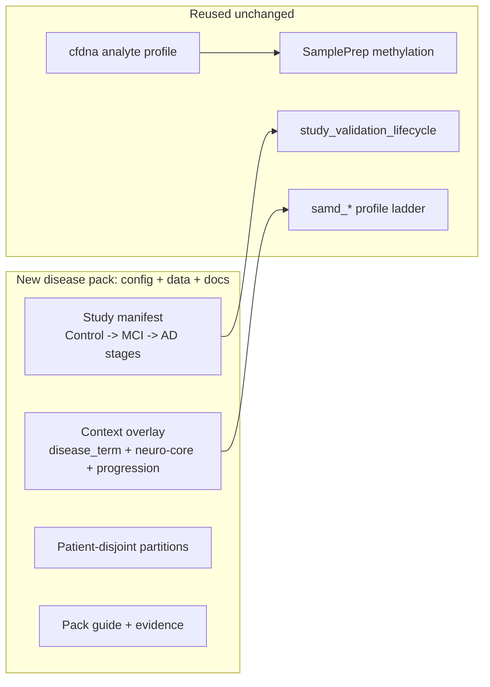

# Alzheimer cfDNA Disease Pack

> **Status: Implemented** (2026-07). Alzheimer detection ships as a disease pack (config + cohorts + partitions + overlay) on the existing methylation control plane. Enrichment library presets were also promoted to a cfg registry artifact (new kind `enrichment_library_preset`) with a new `neuro-core` preset. Cohort data and validation evidence are wired per study.

## Framing: disease pack, not a new modality
Unlike RNA-Seq (a new omics modality with new aligners/actions), Alzheimer detection is the **existing DNA-methylation process** applied to a new disease. It reuses `sample_prep.program.json`, `study_validation_lifecycle.program.json` / `mc_stability_staged.program.json`, the `samd_research -> samd_holdout_enrichment -> samd_pivotal` ladder, and the cfDNA analyte profile.

## Implemented components

### Study scaffold (committed example)
- `docs/examples/samd/alzheimer-cfdna/project_Healthy_vs_AD_Stages.json` (Control vs MCI vs AD stages, `primary_modality=methylation`, `primary_analyte=cfdna`, `progression_labels=[AD_MCI, AD_AD]`, partitions), cohort CSV stubs, and a README with the SaMD-ladder run recipe. `methyl-study-init --stages 2` scaffolds the on-`/work` study.

### Enrichment library presets as a cfg registry artifact (+ neuro-core)
- SoT `packages/methylenricher/methyl_enricher/data/library_presets.json` + `methyl_enricher.preset_registry` (`LibraryPreset`, `LibraryPresetCatalog`); `enricher.py` now loads `DEFAULT_LIBRARIES` / `LIBRARY_PRESETS` from the registry instead of a hardcoded dict.
- Committed schema `schemas/config/library_presets.schema.json` via a `ConfigSchemaSpec` (`scripts/export_config_schemas.sh --check`).
- cfg kind `enrichment_library_preset` in `workflow_engine/cfg/kinds.py`, DDL in `sql_pg` / `sql_mssql` `cfg_registry_tables.sql` + `cfg_repo_api.sql` branches; `methyl-cfg sync-library-presets` (`cfg/sync_library_presets.py`) and materialize to `/work/site/enrichment/`.
- New `neuro-core` preset (brain/CNS + aging gene sets; drops oncology-only drug libraries).

### Disease overlay
- `docs/examples/samd/alzheimer-cfdna/context_alzheimer_cfdna.json`: `mapper.disease_term="Alzheimer's disease"` + `enrich_disease`, `enricher.library_preset="neuro-core"`, `runProgressionAnalysis`, optional blood-immune covariates.

### CI fixture + tests
- `workflow_engine/domain/checks/alzheimer_cfdna/` smoke manifest + CSVs; `workflow_engine/tests/test_alzheimer_cfdna_pack.py` (staged comparison/progression resolution, neuro-core resolves, overlay selects neuro-core + Alzheimer term).

### Docs
- `docs/usage/21-alzheimer-cfdna-pack.qmd`; links from `docs/usage/18-samd-study-lifecycle.qmd` and `docs/ANALYTE_PROFILES.md`; preset registry documented in `packages/methylenricher/docs/USAGE.md` and `docs/architecture/config-registry.md`; regulatory roadmap row moved to Shipped disease pack (research).

## Explicitly NOT in scope
- A brain/CNS cell-deconvolution basis asset (shipped bases are blood-only).
- Any new DomainProgram, workflow action, or aligner.
- Seeding presets into `wf.workflow_action` (presets are config, cfg registry only).

## Validation
- `methyl-study-validate-manifest --profile samd_holdout_enrichment` passes on the example manifest.
- Comparisons resolve to `all` vs `AD_MCI` / `AD_AD`; `progression_labels=[AD_MCI, AD_AD]`.
- `methyl-cfg sync-library-presets` upserts `cancer-core` / `cancer-extended` / `neuro-core`; config-schema drift check passes.
