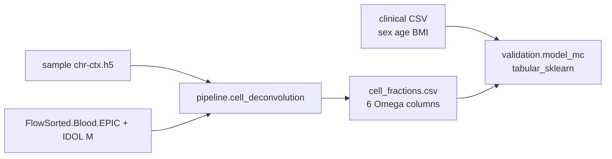

# Buffy-coat cell deconvolution (simple Ω → tabular)

> **Status: IMPLEMENTED.** Packaged methyldeconv + FlowSorted IDOL asset + action/program/profile wiring.

## Design

| Piece | Role |
|-------|------|
| FlowSorted.Blood.EPIC + IDOL (~450 CpGs) | Published \(M\) for Houseman QP |
| Six Ω per sample (CD8T, CD4T, NK, Bcell, Mono, Neu) | Always-on features (no selection) |
| Sex, age, BMI | Covariates via existing `covariates_path` |
| Control centroid / ΔΩ / Jaccard | Not used |

Deconvolution is deterministic given sample H5 and fixed \(M\). No MC feature-panel stability loop: the feature set is fixed.

## Scale now vs later

| Concern | v1 (now) | Later (not in this plan’s delivery) |
|---------|----------|-------------------------------------|
| Cohort size | Implement deconvolution to **batch thousands of samples** efficiently (I/O + optional GPU via MethylUtils; write one `cell_fractions.csv`) | Same action; no API change expected |
| Labels / model | Wire tabular path for the **current study design** (existing binary or whatever classes the project already defines) | **Multi-class model evaluation** (OvR / multi-way metrics sweeps) — deferred; do not build a special multi-class Ω evaluator now |
| GPU | Worth wiring because N can be large even if QP is small per sample | Same |

So: **scale the deconvolution path for large N now**; **do not** expand model_mc for multi-class Ω experiments in this feature.

## Fit into current stack

| Reuse | Skip |
|-------|------|
| `covariate_preprocessor` + `tabular_sklearn` / `validation.model_mc` | `pipeline.centroid`, `pipeline.detector`, mapper, gene_select |
| Action/catalog/schema patterns from `derived_measures` | `validation.stability` Jaccard / DMP–gene frequency panels |
| **MethylUtils NVIDIA/CuPy GPU framework** (same as centroid/metrics) | Extending `samd_research` dual_fc topology |
| New slim DomainProgram (cell_deconv → model_mc) | |

Existing DMP/gene SaMD MC remains a separate track for methylation signatures.

## GPU (MethylUtils)

Do **not** invent a separate CUDA path. Follow the existing MethylUtils pattern used by centroid and metrics:

- [`methyl_utils/gpu_detection.py`](packages/methylutils/methyl_utils/gpu_detection.py) — `is_gpu_available()`, `get_cupy()`, cleanup / optional NVML
- [`methyl_utils/gpu_utils.py`](packages/methylutils/methyl_utils/gpu_utils.py) — backend array prep
- Config: `use_gpu: Optional[bool] = Field(default=None, …)` on `CellDeconvStepConfig` (operator-set; same style as centroid `use_gpu`), honor `METHYL_DISABLE_GPU` via detection helpers
- Runtime: prefer batched per-sample (or mini-batch) QP over the cohort so **thousands of samples** stay practical; CuPy when `use_gpu` for shared matrix ops / batching; else NumPy/SciPy. Per-sample QP is ~450×6 — cost is dominated by H5 marker extract × N, not the QP.

## Implementation

1. **`packages/methyldeconv/`** — IDOL extract → Houseman QP (MethylUtils GPU/CPU backend) → `cell_fractions.csv` + manifest
2. **FlowSorted asset** — offline export of IDOL probes + cell-type mean β → hg38 JSON/HDF5; `actionConfig.cell_deconvolution.seed_basis_path`
3. **`pipeline.cell_deconvolution`** — catalog, Pydantic I/O (incl. `use_gpu`), worker handler, config schema
4. **Program + profile** — slim program: deconvolution once per cohort, then `validation.model_mc` with tabular enabled, Ω as features, clinical sidecar as covariates; ECDF off
5. **Tests + docs** — CPU path required; GPU path when CuPy present (parity smoke); promote to `docs/plans/buffy-cell-deconvolution.plan.md`

## Non-goals

- Control-centroid biological null
- Jaccard / early-stop on proportion panels
- Selecting a subset of the six proportions
- Detector residualization or DMP→gene as part of this path
- R/minfi at worker runtime
- **Multi-class model evaluation** specialized for Ω (deferred; not now)
