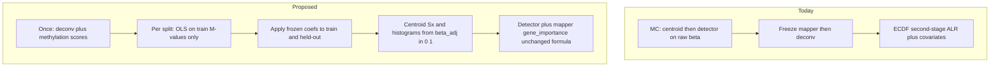
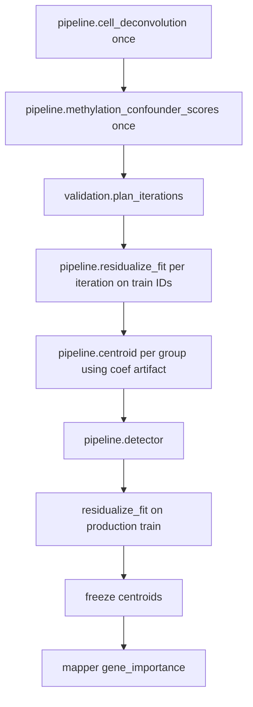

# Buffy confounder-aware DMP calling (M-value residualization)

> The [Grok share URL](https://grok.com/share/bGVnYWN5LWNvcHk_b40f9cbb-7478-4529-8dfd-52c91f31feb9) did not contain the chat; this plan uses the pasted thread plus the current MethylPipeline topology.

## Isolation contract (why a new pack, and what must not move)

**Current process-packs must not change behavior.** Residualization is scientifically invasive (it rewrites the betas that centroids, DMPs, and `gene_importance` see). Shipping it by editing the shared methylation lifecycle would be a dangerous side-effect on every buffy, cfDNA, plant, RNA, and proteomics study that already runs.

That is the right reason to create a **new pack**. In this repo’s taxonomy that pack is **not** a new omics process-pack (still `primary_modality: methylation`). It is a **new assay procedure + forked DomainPrograms** that reuse the same actions.

| Shipped artifact | Touched? | Rule |
|------------------|----------|------|
| Methylation / RNA-Seq / proteomics **process packs** | No behavior change | Same modality, same default programs |
| [`buffy_wgbs_pangenome_gene_fc`](workflow_engine/domain/profiles/procedures/buffy_wgbs_pangenome_gene_fc.procedure.json) and other **procedures** | Untouched | Operators keep today’s unadjusted DMP path unless they pick the new procedure |
| [`mc_stability.program.json`](workflow_engine/domain/fixtures/mc_stability.program.json), [`study_validation_lifecycle.program.json`](workflow_engine/domain/fixtures/study_validation_lifecycle.program.json) | **Do not edit in place** | Fork residual-aware copies (same pattern as `study_validation_lifecycle_no_deconv`) |
| Shared actions `pipeline.centroid`, `pipeline.detector`, `pipeline.mapper`, classifier | Code may grow **opt-in branches only** | Transform runs iff `residualizeCoefDir` / equivalent is bound; absent artifact = bit-identical to today |
| New actions `pipeline.methylation_confounder_scores`, `pipeline.residualize_fit` | Catalog add only | Existing programs never call them |
| `analyte_profiles.py` buffy defaults | Untouched | Do not auto-enable residualization for `buffy_coat` |

**Do not** “gate nodes onto the existing programs.” Optional `if` flags on the production lifecycle still put residualization on the default graph and risk a profile merge turning it on. Isolation = **separate program JSON + separate procedure id**.

Reuse: the new programs call the same catalog actions with extra `with` bindings. Detector, mapper, enricher, stability math stay as-is.

## Verdict: packing layer

| Layer | What this work is |
|-------|-------------------|
| **Not a new process pack** | Still DNA methylation WGBS |
| **New isolated pack** | Procedure `buffy_wgbs_mvalue_residual_gene_fc` + forked MC/lifecycle programs |
| **Engine capability (dead unless bound)** | Train-only M-value residualization + frozen inference transform |
| **Application pack** | Unchanged (PCa / other cancers overlay disease_term + partitions) |

Existing buffy procedure [`buffy_wgbs_pangenome_gene_fc.procedure.json`](workflow_engine/domain/profiles/procedures/buffy_wgbs_pangenome_gene_fc.procedure.json) already stacks Houseman Ω **after** freeze in the ECDF second-stage. That does **not** de-confound DMP discovery or `gene_importance`. Cell-type–adjusted discovery was explicitly deferred in [`docs/plans/buffy-cell-deconvolution.plan.md`](docs/plans/buffy-cell-deconvolution.plan.md).

## Locked statistical rules (from the Grok thread)

1. **Label-free covariates may be computed on all samples.** Houseman/HiTIMED Ω and smoking/age/BMI/inflammation **scores** do not use healthy/cancer. Computing them once on the cohort is acceptable.
2. **The residual regression must not see held-out samples.** Fit `M ~ covariates` on the **training samples of that split only** (pooled healthy+cancer, **no Group term**). Apply the same coefficients to train and held-out.
3. **Monte Carlo:** repeat (2) inside every iteration. Do **not** residualize on the full cohort and then split.
4. **Production / new sample:** compute the same scores on the new sample independently; apply the **frozen** freeze-time coefficients. Never re-fit on the incoming sample.

Constant covariates (all never-smokers, etc.) contribute ~0; drop near-zero-variance columns before OLS so they cannot numerically explode.

## Why M-values, and what stays a beta

MethylCentroid and MethylDetector are defined on \(x_{si}=m_{si}/(m_{si}+u_{si})\in[0,1]\). Raw OLS residuals are not betas. Locked transform:

\[
M=\log_2\frac{\beta}{1-\beta},\quad
\beta_{\mathrm{adj}}=\frac{2^{M_{\mathrm{res}}}}{1+2^{M_{\mathrm{res}}}}
\]

Clip \(\beta\) to \([\varepsilon,1-\varepsilon]\) before \(M\); clip \(\beta_{\mathrm{adj}}\) to \((0,1)\) after the inverse. \(\varepsilon\) is a profile/site knob (`default=None` in Pydantic, documented in schema).

**Honesty about quality:** \(\beta_{\mathrm{adj}}\) is an adjusted signal forced back into \((0,1)\), not a methylation proportion. Detector ECDFs at strongly smoking- or cell-type–driven loci will move. That is the point of the adjustment, and it is why the first deliverable after the engine is a **sensitivity compare** (unadjusted vs adjusted DMP Jaccard, `gene_importance` rank correlation, ECDF shift at AHRR/`cg05575921`).

## Preserve biological DMP importance

Do **not** invent a second importance formula. Keep the canonical chain in [`packages/methylmapper/docs/BIOLOGICAL_IMPORTANCE_AUDIT.md`](packages/methylmapper/docs/BIOLOGICAL_IMPORTANCE_AUDIT.md):

`effect_size` from detector \(\rightarrow\) `w_i = frequency × bio_weight(feature, hyper|hypo)` \(\rightarrow\) `gene_importance`.

What changes is the **input beta** to centroid `Sx` / histogram bins (detector `mean1`/`mean2`/`delta_mean` come from `Sx/N`, not from raw `Sm/(Sm+Su)`). After residualization, `gene_importance` means **residual (confounder-adjusted) host-response**, not composition-dominated leukocyte mix.

**Causal caveat (must stay in the research note):** if cancer \(\rightarrow\) inflammation \(\rightarrow\) Ω \(\rightarrow\) methylation, residualizing Ω **removes part of the buffy cancer signal** from the DMP list. That is the Grok recommendation for “forced buffy + multiple confounders.” Operators can omit Ω from `residualize_covariate_columns` and keep today’s ALR second-stage if they want composition-mediated DMPs. Procedure default: **include Ω**.

Count summaries `Sm`/`Su` stay **raw** (coverage gating, binomial thinning). Only \(x_{si}\) that enter `Sx`, `Sx2`, and `bin_counts` are replaced by \(\beta_{\mathrm{adj}}\). Do not reconstruct fake integer counts.

## Engine design (where the code actually changes)

Centroid tasks are per-group; OLS must see **all train samples**. Insert a per-iteration (and freeze-time) action, then pass a coefficient artifact into centroid and classifier.

**New shared transform** in `methyl_utils` (used by centroid builder + `get_methylation_levels()` / classifier scoring). **Default path is today’s path:** if no coefficient artifact is bound, do not convert to M-values, do not touch `Sx`/`bin_counts`, do not alter classifier features. A unit/golden test must fail if that no-artifact path drifts.

- Design matrix \(Z\) from `cell_fractions.csv` + score CSV (ALR or raw Ω: **raw Ω + drop one column or use ALR**; prefer the same Neu-referenced ALR already used in [`independent-lr-stack-features`](docs/plans/independent-lr-stack-features.plan.md) so composition is not a simplex dummy trap).
- Per-chromosome chunked OLS: \(M = Z\gamma + \varepsilon\), store \(\hat\gamma\) (intercept + slopes) keyed by position.
- Apply: \(M_{\mathrm{res}}=M-Z\hat\gamma\), inverse logit \(\rightarrow\beta_{\mathrm{adj}}\).

**Do not write residualized genome-wide H5 per MC iteration** (disk explosion). Fit on the fly per iteration; persist coefficients **once** at freeze for inference (`production/residualize/` per chrom).

Classifier/predictor today reads raw `sample.get_methylation_levels()` ([`methyl_classifier/utils/data_loader.py`](packages/methylclassifier/methyl_classifier/utils/data_loader.py)). Scoring a new sample against residualized centroids **without** the same transform is invalid. The transform must be applied on the sample path with frozen \(\hat\gamma\).

**New action** `pipeline.methylation_confounder_scores` (once per study, label-free):

| Score | Practical panel | Asset form |
|-------|-----------------|------------|
| Smoking | AHRR `cg05575921` plus a small locked multi-CpG set (Joehanes/Zeilinger top sites) | hg38 BED/JSON + weights |
| Epigenetic age | One operator-selected clock (`horvath2013` / `hannum2013` / `phenoage`) | coefficient JSON (site/reference asset) |
| BMI / adiposity | Small replicated set (HIF3A, ABCG1, CPT1A, …) | BED + weights |
| Inflammation / CRP | Small Wielscher/Ligthart-derived set | BED + weights |

Panels live as **versioned reference assets** (cfg / `/work/genomes` or package `data/`), not Python literals. `actionConfig` points at paths. Missing/low-coverage score CpGs: document a coverage floor and a sample-level `score_status` flag (do not silently invent clinical BMI).

Houseman already exists on the **default** freeze lifecycle (after mapper). **Do not reorder that node** on `study_validation_lifecycle.program.json`. The forked residual programs run `cell_deconvolution` + scores **before** their own MC centroid loop; the shipped lifecycle keeps post-freeze deconv for today’s ALR stacker.

## Topology

Today freeze order is `freeze_detect → mapper → derived_measures → cell_deconvolution → …` ([`study_validation_lifecycle.program.json`](workflow_engine/domain/fixtures/study_validation_lifecycle.program.json)). MC stability has no deconv at all.

Proposed:

**Fork only** (same isolation pattern as [`study_validation_lifecycle_no_deconv.program.json`](workflow_engine/domain/fixtures/study_validation_lifecycle_no_deconv.program.json)):

- `mc_stability_residual.program.json`
- `study_validation_lifecycle_residual.program.json` (or equivalent name)

The new procedure’s `lifecycleProgram` / `samplePrepProgram` point at these forks. Shipped `mc_stability` and `study_validation_lifecycle` stay byte-stable aside from unrelated work.

Centroid tasks remain per-group; `pipeline.residualize_fit` runs once per iteration on the **pooled train IDs**, then each `pipeline.centroid` receives `residualizeCoefDir`. Existing centroid tasks do not pass that binding.

## Procedure overlay (config-not-code)

New [`workflow_engine/domain/profiles/procedures/buffy_wgbs_mvalue_residual_gene_fc.procedure.json`](workflow_engine/domain/profiles/procedures/buffy_wgbs_pangenome_gene_fc.procedure.json) cloning the current buffy pangenome procedure and adding:

- `actionConfig.centroid.residualize_enabled`
- `residualize_covariate_columns` (Ω ALR + score names)
- score asset paths
- `lifecycleProgram` pointing at the residual-aware programs

No disease names, no `DEFAULT_*` science numbers in Python.

## Sensitivity and operator honesty

Ship a small analysis CLI (reuse style of [`methyl-omega-cluster`](docs/research/omega-cluster-detection.md)):

- Overlap of stable DMPs / top `gene_importance` with vs without residualization
- Residual association of smoking/age/BMI/CRP/Ω with the cancer label (incomplete control)
- Overlap of called DMPs with the smoking/clock/BMI/CRP panel BEDs (those sites should largely disappear if adjustment worked)

If the adjusted panel barely changes, confounding was weak. If it changes dramatically, confounding was large — report both; do not silently pick one.

## Explicitly out of scope

- Changing behavior of shipped methylation / RNA / proteomics process-packs or existing assay procedures
- Editing `mc_stability.program.json` or `study_validation_lifecycle.program.json` in place (no gated residualize nodes on the default graph)
- Auto-enabling residualization from `primary_analyte: buffy_coat`
- Weighted ECDFs / stratified detector (Grok B/C; rejected)
- Residualizing on raw beta without M-value round-trip
- Ω-cluster DomainProgram leaves (still gated false)
- Claiming \(\beta_{\mathrm{adj}}\) is a biological methylation fraction
- A new omics process pack (RNA-style) — isolation is a **procedure + program fork**, not a new modality

## Docs / canvas

- Research note: `docs/research/buffy-mvalue-residualization.md` (leakage table, M-value formulas, confounder panel citations, inference recipe, Ω-as-confounder caveat)
- Theory: short subsection under centroid + two-workflows (pre-MC covariates vs post-freeze)
- Usage ch.24: new procedure row
- Canvas: `docs/canvas/buffy-mvalue-residualization.canvas.tsx` (analysis hub) + index row in [`docs/canvas/README.md`](docs/canvas/README.md)
- Promote this plan to `docs/plans/buffy-mvalue-residualization.plan.md` + README row under AB#413
