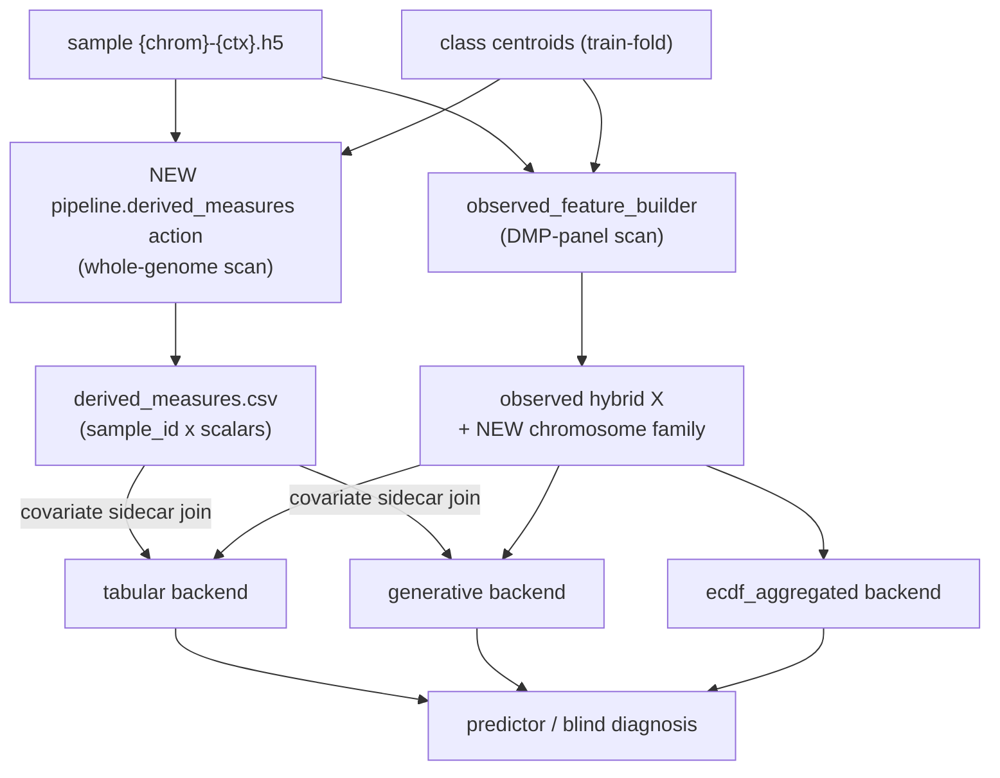

# Chromosome / Sample-Level Derived Measures for MethylPipeline

## 1. Where things stand (analysis)

MethylPipeline turns WGBS samples into three model-ready surfaces, all of which are good insertion points:

- **Per-DMP betas** at frozen loci (production ECDF path).
- **Observed-hybrid per-sample aggregates** over the DMP panel (already includes a weighted Jensen-Shannon distance to class centroids, cosine similarity, directional agreement, tail evidence) in [`observed_feature_builder.py`](packages/methylvalidation/methyl_validation/observed_feature_builder.py).
- **Per-gene / per-region tables** from the mapper.

Two facts make this task low-friction:

1. **The distance math already exists** (used only for clustering, not modeling): `compute_entropy`, `compute_hellinger_distance`, `compute_jensen_shannon_distance`, `compute_wasserstein_distance`, `compute_sample_centroid_jsd`, `get_sample_beta_mom` in [`packages/methylutils/methyl_utils/metrics_core.py`](packages/methylutils/methyl_utils/metrics_core.py).
2. **The schema already reserves the hooks.** `build_observed_hybrid_feature_table` accepts `include_chromosome_features` / `include_dmr_features` / `dmr_window_bp` / `max_dmr_features` but currently discards them (`del ...` at [observed_feature_builder.py:1314-1316](packages/methylvalidation/methyl_validation/observed_feature_builder.py)) and reports `"chromosome": False, "dmr": False` at [line 1967-1975](packages/methylvalidation/methyl_validation/observed_feature_builder.py). The family enum `HYBRID_FEATURE_FAMILY_SETS` ([line 45](packages/methylvalidation/methyl_validation/observed_feature_builder.py)) has no `chromosome` member yet.

Existing model consumers we will target:
- **Tabular** (`RandomForest`/`HistGradientBoosting`/`LogisticRegression`/`XGBoost`) and **generative (torch)** backends already merge external covariates via `fit_covariates` -> `np.concatenate([X, cov], axis=1)` ([`tabular_backend.py`](packages/methylvalidation/methyl_validation/tabular_backend.py) covariate seam ~L842-860; [`covariate_preprocessor.py`](packages/methylvalidation/methyl_validation/covariate_preprocessor.py)).
- **Production ECDF blind predictor** ([`methyl_predictor/core/predictor.py`](packages/methylpredictor/methyl_predictor/core/predictor.py)) has **no** covariate hook - its features are strictly methylation at frozen DMP loci ([`data_loader.py`](packages/methylclassifier/methyl_classifier/utils/data_loader.py)).

## 2. Recommended design: two complementary seams

### Seam A (panel-scoped, ship first): activate the reserved `chromosome` family
Compute chromosome-level and genome-wide summaries **over the existing DMP-panel locus matrix** `X_raw` that the builder already extracts (no new I/O). This is the smallest change with immediate reach into tabular / generative / ecdf-aggregated backends because they all consume the observed-hybrid table.

- Add `chromosome` (and `dmp_scored+chromosome`, include in `hybrid-all`) to `HYBRID_FEATURE_FAMILY_SETS` and `_family_flags` / `describe_active_feature_families`.
- Implement a `_build_chromosome_features(X_raw, locus_df, per_label_weights, centroid_dir_by_class_label)` producing, per sample, columns like `chrom::{chr}::mean_beta`, `chrom::{chr}::entropy`, `chrom::{chr}::js_to__{class}`, `chrom::{chr}::hellinger_to__{class}`, plus genome-wide `sample::global_hypo_frac`, `sample::intermediate_meth_frac`, `sample::global_entropy`, `sample::js_margin`. Reuse `metrics_core` functions.
- Register names in `observed_hybrid_feature_names()` and flip `feature_families["chromosome"]` to reflect activation.

### Seam B (genome-wide, higher ceiling): new `pipeline.derived_measures` action
For measures that need the **whole sample**, not just the DMP panel (global hypomethylation blocks/PMDs, arm-level coverage CN shadow, PDR, imprinting/X signals). Emit a per-sample `derived_measures.csv` keyed by `sample_id`.

- New package `packages/methylderivedmeasures/` with `methyl-derived-measures` CLI using the standard `--resolved-config` contract (mirror [`methyl_mapper/cli.py`](packages/methylmapper/methyl_mapper/cli.py)).
- Typed I/O `DerivedMeasuresTaskInput/Output` in [`pipeline_models.py`](workers/methyl_worker/task_models/pipeline_models.py); step-config Pydantic model registered in [`config_schema_registry.py`](packages/methylvalidation/methyl_validation/config_schema_registry.py) -> `schemas/config/derived_measures.schema.json` (config-not-code: knobs `default=None`, profile/site set values).
- Catalog entry in [`action_catalog.py`](workers/methyl_worker/action_catalog.py) with `action_config_key="derived_measures"`; export + seed via the standard scripts.
- **Incorporation with zero model change:** point the tabular/generative backend `covariates_path` at `derived_measures.csv` (optionally merged with clinical age/BMI). The existing `fit_covariates`/`transform_covariates` join handles train/predict schema freezing.

## 3. Measure menu (prioritized; synthesis of code review + GPT-5.5 + Grok 4.3)

Tier 1 - biggest expected gain at low cfDNA coverage, cheap, robust:
- `global_mean_beta`, `global_hypo_frac` (beta<0.2), `intermediate_meth_frac` (0.25<=beta<=0.75), `global_entropy`.
- Per-chromosome `mean_beta`, `entropy`, and **sample-vs-centroid** `js` / `hellinger` / `wasserstein` to each class centroid + **distance margin** (`d(control) - d(disease)`).
- Coverage/QC scalars as their own features (fraction of panel covered, mean depth, covered CpGs/chrom) - needed both as signal and to let models discount technical quality.

Tier 2 - orthogonal signal reviewers often miss (Grok):
- Arm-level / whole-chromosome **coverage ratio z-scores** (methylation-derived CNV/aneuploidy shadow).
- **PMD / hypomethylation-block load** via lightweight segmentation of chromosome-smoothed betas.
- **PDR / epipolymorphism** at DMP-linked positions (needs read/fragment linkage; approximate with adjacent-CpG disagreement if unavailable).
- Imprinted-DMR deviation and X/autosome contrast (also doubles as QC / sample-swap detection).

Tier 3 - region/gene-set:
- Promoter hypermethylation burden, gene-body hypomethylation burden, region-type entropy, gene-set (pathway) methylation burden. Implement as the reserved `dmr` family or extend `gene_scored`/`structural_scored`.

Full annotated menus (with formulas, robustness, and generative-vs-tabular suitability) from the consulted models: [GPT-5.5 ideas](312952dc-071b-44a4-8802-3dbde0f7723a), [Grok 4.3 ideas](eb27501d-0b17-47f2-9432-79db1fedc876). Underlying code map: [feature-path exploration](39ebd2dc-f542-45a7-946f-d3f4e4c99b78), [modeling exploration](8aef202b-f27d-4a60-804a-4f6c1eb5c1fd), [action-wiring exploration](ba69765d-cacb-4269-b352-eb75c8cb3ad8).

## 4. Model incorporation per backend
- **Tabular / generative:** automatic once features exist - Seam A columns arrive in the observed-hybrid X; Seam B columns arrive via the covariate sidecar concat. Add a `feature_family_set` value (e.g. `dmp_scored+chromosome`) and/or `covariates_path` in the profile.
- **ECDF-aggregated:** consumes the observed-hybrid table, so Seam A works; verify schema fingerprint plumbing.
- **Production ECDF blind predictor:** decision required (see open questions) - either route production scoring through the aggregated/tabular backend that already supports these features, or add a covariate-join seam in the ECDF feature assembly and extend the saved model schema.
- **Fusion strategy:** start with regularized early concatenation (family-grouped), then evaluate meta-stacking (DMP expert + global/chromosome expert) - both consulted models independently ranked stacking highest for letting the model discount global scalars when tumor fraction is low.

## 5. Leakage & normalization guardrails (must-have)
- Any centroid-referenced or quantile-referenced measure must be computed with **train-fold-only** centroids/quantiles. The MC stability loop already refits per fold ([`pipeline_runner.py`](packages/methylvalidation/methyl_validation/pipeline_runner.py)); derived measures must be computed inside that loop, and the predict path must reuse frozen references (same pattern as `CovariatePreprocessor.transform_covariates`).
- Coverage-aware aggregation (`sum(mC)/sum(n)`, capped per-site weights), minimum-depth handling, and explicit missingness indicators for low-coverage chromosomes.
- Batch/technical confounds: keep conversion-efficiency/depth as covariates; prefer grouped/leave-batch-out CV; never fit correction on the full dataset.

## 6. Config-not-code compliance
All thresholds (beta cutoffs, `dmr_window_bp`, min depth, which distances, which chromosomes) live in `schemas/config/*.schema.json` with `default=None`, set in [`mc_gene_fc.profile.json`](workflow_engine/domain/profiles/mc_gene_fc.profile.json) `actionConfig` and site manifest - not as Python constants. Regenerate schemas via `scripts/export_config_schemas.sh` and re-seed the catalog.

## 7. Validation
- Unit tests for each `metrics_core`-backed measure and for train/predict schema freezing (fixture manifests only).
- A/B: DMP-only vs DMP+chromosome vs DMP+chromosome+sidecar, reported through the existing `feature_family_ablation.json` mechanism.

## Resolved decisions (user)
- **Extend the ECDF pickle.** Production blind diagnosis must see the derived measures, so the ECDF model bundle (built by MethylDetector `_save_unified_model`, consumed by `ECDFClassifier` / `MethylClassifier` / `data_loader.extract_sample_features`) is extended to carry a derived-measures schema (ordered names + train-fold reference stats + effect_size weights) and to append these columns at both train and blind-predict feature assembly.
- **Execute both seams A and B** in this pass.
- **Data contract:** each sample stores `(mC, uC)` per position; keep coverage `n = mC + uC` (not just point beta). Distances to centroids use the Beta method-of-moments path (`get_sample_beta_mom(m, n)` + `compute_sample_centroid_jsd`) so low-coverage positions are downweighted naturally.

### ECDF pickle extension — concrete anchors (confirmed)
- `ECDFClassifier` ([`packages/methylutils/methyl_utils/ecdf_classifier.py`](packages/methylutils/methyl_utils/ecdf_classifier.py)) already carries per-locus `dmpDF` (columns `pos`, `weight`, `delta_sign`/`mean1`,`mean2`, `context`) plus `bin_counts_c1/c2`; `to_dict`/`from_dict` (L355-391), `from_dmp_dataframe` (L409+), and `get_feature_info` (L474) are the persistence/schema seams to extend with a `derived_measures` block (ordered names, train-fold reference means/quantiles, per-locus `effect_size` + region weight).
- Detector export path `MethylDetector._save_unified_model` in [`methyldetector.py`](packages/methyldetector/methyl_detector/core/methyldetector.py) already has `effect_size` on the DMP frame (biological filter at L67-90, L1097-1103) — reuse it as the stored weight vector rather than recomputing.
- Blind assembly extends `data_loader.extract_sample_features` + the batch predict seam in [`methyl_classifier/cli/main.py`](packages/methylclassifier/methyl_classifier/cli/main.py); append the derived block after the DMP methylation vector and validate against the stored fingerprint.

## Weighting principle (user) — effect_size drives biological importance
Statistical significance (p/q) only gates candidacy; **`effect_size` is the effective biological filter** and is already what the mapper turns into gene / gene-feature importance (`|effect_size| x region_weight`, gene_importance). Therefore every panel-scoped derived measure must be **effect_size-weighted**, consistent with existing observed-hybrid and gene aggregation:
- Per-chromosome and genome-wide sample-vs-centroid distances, directional agreement, and tail evidence weight each DMP by `|effect_size|` (optionally `x region_weight`), not uniformly.
- Genome-wide "tumor-likeness" scalar = effect_size-signed, effect_size-weighted mean of `(beta - centroid_mean)` over the panel.
- The ECDF-pickle derived block stores the per-locus `effect_size` (and region weight when present) so blind prediction reproduces identical weighting.