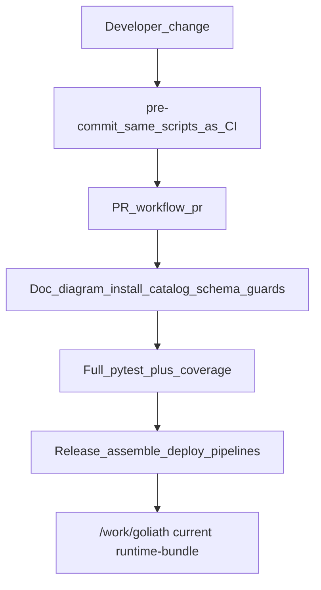

# CI / Dev / Deploy synchronization

## Problem

Deployment and PR builds keep failing on **sync surfaces** — artifacts that must stay paired with source — rather than on core science logic. Each failure is cheap to fix alone and expensive as a sequence, because the next broken contract only appears after the previous gate passes.

This session’s failure modes (Jul 2026):

| Failure mode | Example | Why local missed it |
|--------------|---------|---------------------|
| Gitignore over-match | bare `env/` hid `deploy/env/*.example` | Files existed on disk; never committed |
| Mtime freshness | `render_diagrams.sh --check` used `-nt` | Local mtimes correct; Azure checkout order makes `src/` newer than `out/` |
| Dist name ≠ dep key | `methylenricher` vs `methyl-enricher` | Older pip was lenient; pip 26 rejects |
| Install order | `rnaexpress` before `omicsfeatures` | Bare PEP 621 deps need prior install; Poetry path deps do not |
| Missing package README | `methylderivedmeasures` `readme = "README.md"` | Poetry metadata build requires the file |
| Catalog without fixtures | new actions, no golden I/O | Guard runs only after install succeeds |
| Test/contract drift | tests still use `step_config`; code uses `actionConfig` | Tests not updated with the migration |
| Policy drift | `json.dumps` outside `_json_text()` | Lint/policy test exists but change bypassed it |

Related completed work: [ci-regression-testing](ci-regression-testing.plan.md) (AB#591), [regression-protection-test-coverage](regression-protection-test-coverage.plan.md) (AB#604), [documentation-and-deployment-reliability](documentation-and-deployment-reliability.plan.md) (AB#517), [devops-ci-cd-release](devops-ci-cd-release.plan.md) (AB#422). This plan does **not** redo those — it closes the **sync-contract** gap between them.

## Immediate fixes (done / in flight)

1. `.gitignore`: `/env/` and `/ENV/` (root-only) so `deploy/env/*.example` can be committed.
2. Diagram freshness: content-hash sidecars (`*.mmd.sha256`), not mtimes.
3. Package install: dist-name keys for path deps; `omicsfeatures` before dependents in `packages.list`; missing READMEs.
4. Pytest collection: unique test basenames; worker DI tests aligned with `depends.py`.
5. Golden fixtures for new catalog actions; MSSQL `_json_text` policy; tests updated for `actionConfig` and current validation messages.

## Permanent strategy

### Principle

Every **paired artifact** is an explicit **sync contract**:

```text
source change → companion update → same script CI runs → pre-commit + PR gate
```

If a companion can drift, a check must fail **before** merge — preferably on the developer machine, always on the PR pipeline that feeds deployment.

### Sync matrix (contracts to enforce)

| Source | Companion | Gate script / test | Pre-commit | PR CI |
|--------|-----------|--------------------|------------|-------|
| `docs/diagrams/src/*.mmd` | `out/*.{svg,png,mmd.sha256}` | `scripts/render_diagrams.sh --check` | yes | yes |
| Active docs | forbidden stale patterns | `scripts/check_doc_freshness.sh` | yes | yes |
| `deploy/env` examples | files exist + not gitignored | freshness script + install-contract | yes | yes |
| `packages/*/pyproject.toml` | dist name = dep keys; README exists | `check_package_install_contract.py` | yes | yes |
| `scripts/packages.list` | topological vs path/bare deps | same | yes | yes |
| `schemas/actions/catalog.json` | `schemas/tasks/*`, golden I/O | catalog + golden drift tests | yes | yes |
| Pydantic config/task models | committed JSON Schema | `export_*` / `--check` | yes | yes |
| `workflow_engine/rest/db/mssql.py` | `_json_text` only | `test_mssql_json_binding_policy` | optional | yes |
| DomainProgram / profiles | compiler + composable program tests | existing pipeline profile tests | no | yes |

### Layered gates



1. **Pre-commit** — cheap sync contracts only (seconds–low minutes).
2. **PR pipeline** — same scripts + full pytest (already) + spine coverage ratchet.
3. **Release/deploy** — consume only artifacts that already passed PR; no new sync inventions at promote time.
4. **Runtime `/work`** — materialized cfg + runtime-bundle; workers never invent config from git checkout.

### New tooling (to implement)

**`scripts/check_package_install_contract.py`** (fail PR on):

- Every `packages/*/pyproject.toml` `readme` path exists.
- Poetry path-dep **keys** match distribution `name` (PEP 503 / pip 26 strictness).
- PEP 621 bare local deps appear in `packages.list` **before** the dependent package.
- Optional: warn when `pythonpath` omits a package that has tests under `testpaths`.

**`scripts/ci_preflight.sh`** (local mirror of PR guards):

```bash
bash scripts/check_doc_freshness.sh
bash scripts/render_diagrams.sh --check
python scripts/check_package_install_contract.py
methyl-export-action-catalog --check
methyl-export-domain-schemas --check
# task schema / golden drift as already wired in pytest
```

Document in `ci/README.md`: “Before push: `./scripts/ci_preflight.sh`”.

### Editable install hygiene

`install_packages.sh --with-deps` must not leave foundational packages (especially `methylutils`, `methyldomain`) as stale non-editable site-packages copies mid-bootstrap. Options:

- Install in topological order with `--no-deps` first (entire list), then a second pass only for third-party deps; or
- After the list, force `pip install -e packages/methylutils packages/methyldomain` again; or
- Assert in CI that `pip show methylutils` reports `Editable project location`.

### Catalog → schema → golden rule

Any PR that adds/changes an action in `schemas/actions/catalog.json` must fail unless:

1. Task JSON schemas exist and match Pydantic models (`--check` exporters).
2. Golden I/O entries exist and `generate_golden_fixtures.py` / golden tests pass.

Extend pre-commit and the “Schema and action catalog drift check” PR step accordingly.

### What not to do

- Do not rely on filesystem **mtimes** for CI freshness (diagrams taught this).
- Do not use bare gitignore directory names that collide with repo paths (`env/`).
- Do not document or test retired surfaces (`step_config`, admin gateway routes, old profile filenames).
- Do not add Python `DEFAULT_*` for operator-tunable science knobs (existing config-not-code rule).

## Success criteria

- `scripts/ci_preflight.sh` exits 0 on a clean main checkout on a blank VM after `install_packages.sh --with-deps`.
- Adding a catalog action without goldens/schemas fails pre-commit and PR CI.
- Renaming a Poetry package without updating dependents fails install-contract.
- Reordering `packages.list` against bare local deps fails install-contract.
- Deployment/release pipelines do not introduce sync checks that PR CI skipped.
