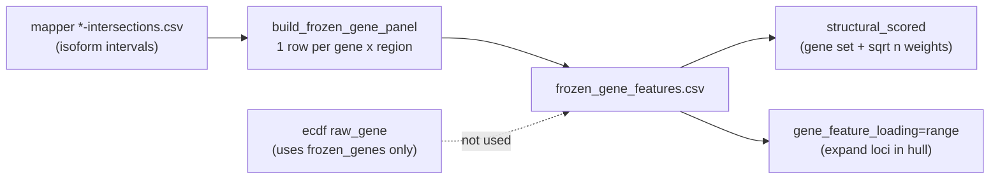

# Collapse frozen gene-feature panel to one row per gene×region

## Decision

**Option A:** In [`build_frozen_gene_panel`](../../packages/methylvalidation/methyl_validation/model_bundle.py), emit **exactly one row** per `(comparison_label, gene_name, chromosome, feature_type)`:

- `feature_start = min(starts)`
- `feature_end = max(ends)`
- `n_dmps_in_feature = nunique(dmp_name)` over all isoform/GTF intervals for that key
- Keep existing merges for `feature_effect_compound` / `gene_importance`

Do **not** change mapper `*-intersections.csv` (raw hit audit stays isoform-detailed). Gene summaries (`all-gene_name-combined.csv`) already collapse at gene level.

## Code change (single producer)

In [`packages/methylvalidation/methyl_validation/model_bundle.py`](../../packages/methylvalidation/methyl_validation/model_bundle.py), replace the groupby that includes `feature_start`/`feature_end` with:

1. Aggregate `n_dmps_in_feature = dmp_name.nunique()` and hull bounds by `(comparison_label, gene_name, chromosome, feature_type)`.
2. Apply `min_dmps_per_feature` on the **union** count (not per-isoform segment).
3. Then merge compound / importance as today.

Schema columns stay the same so loaders/H5/`fixed_gene_features` wiring need no path changes.

## Cross-flow impact

| Flow | Effect of Option A |
|------|-------------------|
| **ECDF `raw_gene` / model-mc ecdf** | No scoring change — uses `frozen_genes_production.csv`, not this file. Symlink still present. |
| **Config / freeze wiring / model-mc links** | Safe — paths and keys unchanged; file content and SHA change on re-freeze. |
| **H5 `gene_feature_ranges` I/O** | Safe — fewer rows, same columns. |
| **`structural_scored`** | Behavior can change at the margin: panel membership uses union `n_dmps` vs per-interval filter before `drop_duplicates(gene)`; weights use `sqrt(union_n)` instead of the first/largest isoform segment. Usually closer to the intended gene×region unit. No API change. |
| **`gene_feature_loading=range`** | **Behavior-changing for discontinuous features:** exon/intron hull can span gaps (intronic bases become eligible under an `exon` row). Document this. Gene-body isoform nests (the DLGAP2 case) become a single sensible span. |
| **Mapper / gene FeatureCuts / enricher** | Unaffected — they do not consume this CSV. |

No profile/schema knobs required (config-not-code: this is aggregation semantics of an existing freeze artifact, not a new tunable).

## Tests

Update/extend [`packages/methylvalidation/tests/test_model_bundle_tabular_backend.py`](../../packages/methylvalidation/tests/test_model_bundle_tabular_backend.py):

- Overlapping isoform intervals for same gene×`gene_body` → **one row**, hull min/max, unique DMP count (not sum of per-interval counts).
- Two disjoint exons for same gene → **still one row** under Option A (hull spans the gap); assert that explicitly so the contract is locked.
- Existing single-interval tests keep passing.

## Docs

- [`packages/methylvalidation/docs/USAGE.md`](../../packages/methylvalidation/docs/USAGE.md) — freeze `fixed_gene_features`: one row per comparison×gene×region; union hull; unique DMP support; note range-loading gap-fill for exon/intron.
- [`packages/methylvalidation/docs/IMPLEMENTATION.md`](../../packages/methylvalidation/docs/IMPLEMENTATION.md) — same contract for `structural_scored` panel support / `sqrt(n_dmps)`.
- Soften “segment” wording in freeze_min_dmps description ([`config.py`](../../packages/methylvalidation/methyl_validation/config.py) / validation schema descriptions).

## Operator follow-up

Existing studies keep the old multi-interval CSV until **re-freeze** (`finalize_production_model_bundle` / freeze DomainProgram). Model-mc then re-links the new file. No migration script — freeze rebuild is the migration.

## Non-goals

- Changing mapper intersection exports or SP region BED construction.
- Changing `structural_scored` scoring formulas beyond consuming the cleaner panel.
- Interval-merge of only overlapping segments (Option B) or largest-interval-only (Option C).
