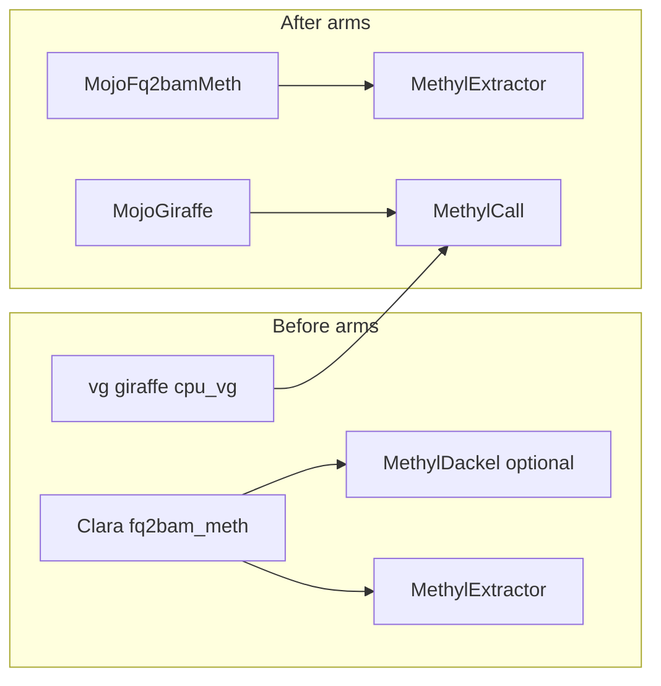

# Comparison arms + bakeoff (keep originals)

> **Constraint:** Do **not** remove or fail-closed away NVIDIA Clara Parabricks `fq2bam_meth`, `vg giraffe` (`cpu_vg`), or optional upstream **MethylDackel**. Mojo / MethylExtractor / MethylCall are the preferred science path; originals stay selectable for full before/after comparison.

P0/P2 from [cross-repo-tool-analysis.plan.md](cross-repo-tool-analysis.plan.md) (AB#703) are done. This plan continues former “out of scope” bakeoff work **without** changing production site defaults or doing Giraffe ≤2h kernel work.

## Product rule (replaces P4 “reduce Clara surface area”)

| Arm | Align | Extract | Role |
|-----|-------|---------|------|
| **Before (baseline)** | Clara `fq2bam_meth` | MethylExtractor **or** optional MethylDackel | Linear WGBS baseline |
| **Before (graph oracle)** | `vg giraffe` (`align_engine=cpu_vg`) | methylGrapher MethylCall | Named-coordinate GAF science baseline |
| **After (Mojo linear)** | `MojoFq2bamMeth` | MethylExtractor | Portable Clara substitute |
| **After (Mojo WGBS)** | MojoGiraffe dual-graph | MethylCall / MergeCpG | Preferred pangenome_wgbs science |

Clara stock `pangenome` giraffe (BAM) remains available for non-BS stock graphs; it is **not** a WGBS GAF substitute ([PHASE0](https://github.com/Goliath-Research/mojo-align/blob/main/giraffe/docs/PHASE0_GH200_ALIGN.md)).



## Approach

### 1. Document the comparison contract (MethylPipeline + mojo-align)

Extend [docs/architecture/sample-prep-tooling.md](../architecture/sample-prep-tooling.md) and mojo-align [README.md](/home/ubuntu/mojo-align/README.md) align-path table with an explicit **before/after matrix** and config knobs:

- Linear: `actionConfig.parabricks.engine=parabricks|mojo` (already in [parabricks_runner.py](../../workers/methyl_worker/parabricks_runner.py))
- WGBS: `actionConfig.methylgrapher_wgbs.align_engine=cpu_vg|mojo_giraffe|gpu_giraffe` (already in mojo-align [align_backends.py](/home/ubuntu/mojo-align/methylgrapher/engine/align_backends.py))
- Extract: production = MethylExtractor / MethylCall; **MethylDackel = comparison-only** (see §3)

State clearly: production Buffy procedures may prefer Mojo WGBS; comparison runs use coexisting sample subdirs and must not delete baseline images/binaries from release pins.

### 2. Side-by-side sample layout (owned by MethylPipeline)

Align with mojo-align canonical IDs under `/work/samples/<sampleId>/`:

```text
align.linear.parabricks/     # Clara
align.linear.mojo/           # MojoFq2bamMeth
align.pangenome_wgbs.vg/     # cpu_vg (alias align.pangenome.vg if already used)
align.pangenome_wgbs.mojo/   # MojoGiraffe
extract.methylextractor/     # or H5s inside align dir (match existing runners)
extract.methyldackel/        # optional comparison extract
```

Implement a small harness (extend [packages/methylutils/methyl_utils/testing/sample_prep_mode_compare.py](../../packages/methylutils/methyl_utils/testing/sample_prep_mode_compare.py) / [workflow_engine/ops/sample_prep_mode_compare.py](../../workflow_engine/ops/sample_prep_mode_compare.py)) that:

- Creates the coexisting dirs
- Runs each arm with explicit `sampleDir` + `alignmentMode` + engine overlays (no site default change)
- Writes `/work/samples/_comparisons/<stamp>/comparison.md` + JSON (wall time, flagstat Δ, optional CpG Spearman) by calling existing mojo-align scripts:
  - [fq2bam-meth/scripts/parity_linear_parabricks_vs_mojo.sh](/home/ubuntu/mojo-align/fq2bam-meth/scripts/parity_linear_parabricks_vs_mojo.sh)
  - Giraffe wall notes from [giraffe/docs/BENCHMARK_GIRAFFE.md](/home/ubuntu/mojo-align/giraffe/docs/BENCHMARK_GIRAFFE.md)

### 3. Optional MethylDackel comparison extract (not production)

Do **not** replace `sample.methyl_extract`. Add an operator/compare path:

- Script under MethylPipeline `scripts/compare_extract_methyldackel.sh` that runs upstream MethylDackel on a BAM and stages bedGraph/cytosine-report under `extract.methyldackel/`
- Document how to juxtapose vs MethylExtractor H5 / manifest (coverage and site-level concordance summary only; no new production action catalog entry)
- Pin: document that MethylDackel is an **optional** host tool for A/B, version recorded in the comparison report

### 4. Bakeoff gates — record, do not flip defaults

Update gate docs only (site/profile defaults unchanged):

| Gate | Pass criteria | Where recorded |
|------|---------------|----------------|
| Clara vs Mojo linear wall | Mojo wall ≤ Clara on agreed GH200 subset | [fq2bam-meth/docs/BENCHMARK_FQ2BAM_METH.md](/home/ubuntu/mojo-align/fq2bam-meth/docs/BENCHMARK_FQ2BAM_METH.md) + MethylPipeline [mojo-fq2bam-meth-parity.md](../reference/mojo-fq2bam-meth-parity.md) |
| Linear BAM concordance | Existing flagstat / GATK-style Δ thresholds | Existing parity scripts |
| vg vs Mojo dual-map wall | Report hours; ≤2h remains aspirational | [BENCHMARK_GIRAFFE.md](/home/ubuntu/mojo-align/giraffe/docs/BENCHMARK_GIRAFFE.md) |
| Extract A/B | MethylExtractor vs MethylDackel site concordance on toy + one real BAM | Comparison report section |

**Explicit non-goals this pass:** changing `buffy_wgbs_*` procedure defaults; Giraffe GPU hotpath coding; retiring Clara image from release assemble.

### 5. Procedure / profile hygiene (comparison packs, not default flip)

Add or document comparison procedure packs that pin engines without becoming fleet default, e.g.:

- Existing `buffy_wgbs_linear_gene_fc` (Clara) + `buffy_wgbs_linear_mojo_gene_fc` (Mojo)
- WGBS: document `align_engine=cpu_vg` overlay for vg arm vs production Mojo procedure

Ensure [sample-prep-tooling.md](../architecture/sample-prep-tooling.md) lists these as **comparison** packs.

### 6. Promote follow-on plan under AB#413

Copy to `docs/plans/comparison-arms-bakeoff.plan.md`, README row, new ADO Feature under Epic 413 (child stories for todos below).

## Key files

- [docs/architecture/sample-prep-tooling.md](../architecture/sample-prep-tooling.md) — matrix + “originals retained”
- [workers/methyl_worker/parabricks_runner.py](../../workers/methyl_worker/parabricks_runner.py) — Clara vs Mojo (no removal)
- [workers/methyl_worker/methylgrapher_wgbs_runner.py](../../workers/methyl_worker/methylgrapher_wgbs_runner.py) — `cpu_vg` remains valid
- [packages/methylutils/methyl_utils/testing/sample_prep_mode_compare.py](../../packages/methylutils/methyl_utils/testing/sample_prep_mode_compare.py) — extend for multi-arm layout
- mojo-align parity/benchmark docs + scripts under `fq2bam-meth/` and `giraffe/`

## Out of scope

- Implementing Giraffe ≤2h kernel work
- Flipping production site `actionConfig` defaults to Mojo-only
- Removing Clara / vg / MethylDackel from release or docs
- Renaming historical plan filenames that still use the former tree’s name
