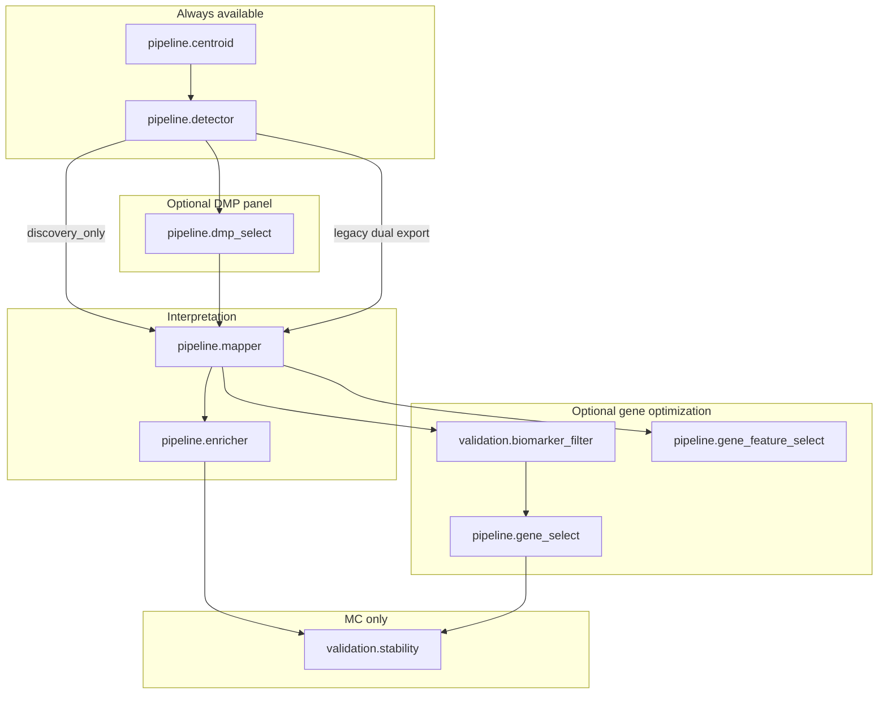

# Composable Pipeline Flexibility Plan

## Goal

Enable **selectable pipeline paths** (single-run and MC) using split actions, with your preferred default for gene-focused stability:

**Discovery DMPs → MethylMapper → MethylEnricher → `validation.stability` (gene frequency from enricher genes)** — no DMP FeatureCuts, no gene FeatureCuts k-search required.

Optional branches remain available for DMP panel stability, gene FeatureCuts, biomarker/PPI filtering, and (later) structural gene×region selection.



## Current gaps (why this plan is needed)

| Gap | Impact |
|-----|--------|
| [buffy_data_driven.program.json](workflow_engine/domain/fixtures/data_driven.program.json) uses **legacy inline detector** only | No composable split path for Buffy |
| [mc_stability_staged.program.json](workflow_engine/domain/fixtures/mc_stability_staged.program.json) uses **invalid IF syntax** (`{ condition: { ref } }` + single `do`) | Optional `gene_select` / `biomarker_filter` never compile ([IfStep](packages/methyldomain/methyl_domain/program.py) requires `"if": "${var}"`, `then`/`else` lists) |
| Scope flags like `project.stabilityGeneFeaturecutsEnabled` are **not seeded** from `step_config.validation` | IF branches cannot resolve |
| `step_config.dmp_selection` / `gene_selection` **absent** from bundle project JSONs | Split CLIs fall back to legacy `detection` keys inconsistently |
| `pipeline.gene_feature_select` is a **Phase 3 scaffold** ([runner.py](packages/methylgenefeatureselect/methyl_gene_feature_select/core/runner.py)) | Promoter/exon/intron/terminator k-search not production-ready |
| `validation.biomarker_filter` **requires** `stability_gene_featurecuts_enabled` ([mc_config_load.py](packages/methylvalidation/methyl_validation/mc_config_load.py)) | PPI-only pre-filter cannot run on mapper genes alone |

**Already works today** for your chosen gene path (enricher frequency):

- Detector exports `dmps-*-discovery.csv` (`detection_mode: discovery_only` or legacy dual export).
- Mapper reads discovery pattern (`step_config.mapper.csv_pattern: "dmps-*-discovery.csv"`).
- Enricher applies disease filters statically via [project enricher block](workflow_engine/domain/checks/buffy_healthy_vs_pca/configs/project_Buffy_healthy_vs_PCa.json).
- `validation.stability` with `stability_featurecuts_enabled: false` and `stability_gene_featurecuts_enabled: false` aggregates genes via `load_enricher_genes()` ([stability.py](packages/methylvalidation/methyl_validation/stability.py) ~L1234).

---

## Pipeline profiles (config + program presets)

Define **named profiles** as small JSON files under `workflow_engine/domain/profiles/` (referenced by programs via `variables.profile` or explicit `--context-file`).

| Profile | Detector | dmp_select | Mapper CSV | Enricher | Stability axes | Use case |
|---------|----------|------------|------------|----------|----------------|----------|
| **legacy_dual** | legacy + inline FeatureCuts | skip | `dmps-*-discovery.csv` | project defaults | DMP classifier + enricher genes (optional) | Parity with old Buffy |
| **discovery_interpretation** | `discovery_only` | skip | `dmps-*-discovery.csv` | project defaults | none (single-run) | Mapper + enricher only |
| **gene_enricher_stability** | `discovery_only` | skip | `dmps-*-discovery.csv` | `disease_only` / full | **gene_freq only** (`stability_featurecuts_enabled: false`) | **Your preferred MC path** |
| **dmp_panel_stability** | `discovery_only` | yes (FeatureCuts) | `dmps-*-classifier-extended.csv` | optional | DMP classifier freq | Minimal DMP panel MC |
| **full_biomarker_gene_fc** | discovery + dmp_select | yes | extended classifier | optional | DMP + gene classifier panels | Current mc_stability intent |
| **structural_features** | discovery | skip | discovery + intersections | skip | gene×region catalog (phase 2) | Promoter/exon/intron panels |

Example profile snippet (`gene_enricher_stability.profile.json`):

```json
{
  "pipelineProfile": "gene_enricher_stability",
  "step_config_overrides": {
    "detection": { "detection_mode": "discovery_only", "export_classifier": false },
    "mapper": { "csv_pattern": "dmps-*-discovery.csv", "enrich_disease": true },
    "enricher": { "disease_only": true, "min_dmp_count": 2 },
    "validation": {
      "run_stability": true,
      "stability_featurecuts_enabled": false,
      "stability_gene_featurecuts_enabled": false,
      "stability_gene_freq": 0.7,
      "stability_dmp_freq": 0.0
    }
  }
}
```

PPI / disease filtering without full enricher ORA:

- **Enricher path**: `enricher.disease_only`, `disease_association_type`, `min_disease_score`, optional `network_refinement` (STRING) — already in project config.
- **Biomarker path** (optional future): decouple `validation.biomarker_filter` from gene FeatureCuts so `ppi_only` / `disease_only` can shrink the mapper gene pool **before** enricher or as a parallel interpretation branch.

Region filtering (promoter, gene_body, exon, intron, terminator):

- **Today**: `stability_gene_region_hits` in biomarker/gene_select config ([biomarker_gene_pool.py](packages/methylgeneselect/methyl_gene_select/core/biomarker_gene_pool.py)).
- **Phase 2**: complete `pipeline.gene_feature_select` using mapper `*-intersections.csv` ([REGION_TYPES](packages/methylgenefeatureselect/methyl_gene_feature_select/core/runner.py)).

---

## DomainProgram library (composable fragments)

Add under [workflow_engine/domain/fixtures/](workflow_engine/domain/fixtures/) and [workflow_engine/domain/checks/](workflow_engine/domain/checks/):

| Program | Purpose |
|---------|---------|
| `detection_discovery_only.program.json` | centroids + per-chr detector (`stepOverride: discovery_only`) |
| `dmp_select_optional.program.json` | IF `${runDmpSelection}` → `pipeline.dmp_select` |
| `mapper_per_comparison.program.json` | `pipeline.mapper` with comparison scope |
| `enricher_with_overrides.program.json` | `pipeline.enricher` + optional `stepOverride` for disease filters |
| `mc_gene_enricher_stability.program.json` | Full MC: plan_iterations → centroids → discovery detector → mapper → enricher → stability (**no dmp_select, no gene_select**) |
| `buffy_interpretation.program.json` | Single-run Buffy: centroids → discovery detector → mapper → enricher |
| `buffy_legacy.program.json` | Existing monolithic path (unchanged for parity) |

**Composed MC body** (correct IF syntax):

```json
{
  "if": "${runDmpSelection}",
  "then": [{ "do": "pipeline.dmp_select", "with": { "chromosome": { "ref": "chromosome" }, "group": { "ref": "comparison.label" } } }],
  "else": []
}
```

Instance context / profile sets booleans: `runDmpSelection`, `runGeneFeaturecuts`, `runBiomarkerFilter`, `runGeneFeatureSelect`.

---

## Engine and compiler work

### 1. Scope seeding for profile flags

Extend [workflow_context.py](workflow_engine/domain/workflow_context.py) `enrich_instance_context()` to flatten validation/gene_selection keys into camelCase scope vars used by IF:

- `stabilityFeaturecutsEnabled` ← `validation.stability_featurecuts_enabled`
- `stabilityGeneFeaturecutsEnabled` ← `validation.stability_gene_featurecuts_enabled`
- `stabilityGeneBiomarkerFilterEnabled` ← `validation.stability_gene_biomarker_filter_enabled`
- `runDmpSelection` ← profile or `step_config.dmp_selection.enabled`

Alternatively add `collection_bindings` jsonPath reads from inline `project` for `${project.stability_gene_featurecuts_enabled}` — compiler already emits bindings for `project.*`.

### 2. Fix mc_stability programs

Rewrite [mc_stability_staged.program.json](workflow_engine/domain/fixtures/mc_stability_staged.program.json) and [healthy_pca_mc_stability.program.json](workflow_engine/domain/fixtures/mc_stability.program.json):

- Replace invalid IF blocks with `"if": "${flag}"`, `"then": [...]`, `"else": []`.
- Add sibling program `mc_gene_enricher_stability.program.json` without dmp_select/gene_select.
- Recompile and verify compiled workflow contains IF + optional actions (today [compiled artifact](workflow_engine/domain/checks/pca1_5_cg/compiled/pca1_5_mc_stability/compiled_workflow.json) omits them).

### 3. Optional: detector → mapper handoff bindings

Low priority for discovery path (mapper globs by pattern). Add `domain_effects.output_bindings` for `pipeline.detector` → `discoveryCsv` if explicit wiring is needed later.

### 4. Project config migration

Run [migrate_detection_config.py](packages/methylvalidation/methyl_validation/utils/migrate_detection_config.py) on bundle projects:

- [project_Buffy_healthy_vs_PCa.json](workflow_engine/domain/checks/buffy_healthy_vs_pca/configs/project_Buffy_healthy_vs_PCa.json)
- [project_Healthy_vs_PCa1-5-CG.json](workflow_engine/domain/checks/pca1_5_cg/configs/project_Healthy_vs_PCa1-5-CG.json)

Move FeatureCuts keys to `dmp_selection`; MC gene keys to `gene_selection`; keep `detection` for statistical discovery only.

---

## Validation / methyl-validation alignment

| Entry point | Change |
|-------------|--------|
| `methyl-validation run-workflow --program ...` | Document profile context files |
| `methyl-validation --via-workflow --stability` | Map CLI flags → instance context booleans (`runDmpSelection`, etc.) |
| [mc_manifest.py](packages/methylvalidation/methyl_validation/mc_manifest.py) | Only write `detector_step_override.json` when `stability_featurecuts_enabled`; skip when gene-enricher-only profile |
| Stability summary | Document which axis is active in `stability_summary.json` metadata (`dmp_axis: none|discovery|classifier`, `gene_axis: enricher|classifier`) |

---

## Phase 2 (structural gene features + biomarker decoupling)

Not required for initial gene-enricher stability, but completes “maximum flexibility”:

1. **Finish `pipeline.gene_feature_select`**: ECDF OvR k-search on `(gene_name, feature_type)` from mapper intersections; wire into MC program behind `${runGeneFeatureSelect}`.
2. **Decouple biomarker filter**: Allow `validation.biomarker_filter` when `stability_gene_biomarker_filter_enabled` without requiring `stability_gene_featurecuts_enabled`; input = mapper `all-gene_name-combined.csv`; modes `ppi_only`, `disease_only`, `disease_and_ppi` ([config.py](packages/methylvalidation/methyl_validation/config.py)).
3. **Stability aggregation for structural features**: New loader for `gene-features-classifier.csv` when present.

---

## Documentation and user manual

Update [docs/reference/domain-program-language.md](docs/reference/domain-program-language.md) and usage chapters:

- **Pipeline profile matrix** (table above).
- **When to use discovery vs classifier CSVs** for mapper.
- **Gene stability without DMP stability**: set `stability_featurecuts_enabled: false`, run mapper+enricher, set `stability_gene_freq`.
- **Disease vs PPI**: enricher config vs biomarker_filter modes.
- **Region hits**: `stability_gene_region_hits` vs future `gene_feature_select`.

---

## Tests and acceptance

| Test | Validates |
|------|-----------|
| Compile all new programs + assert IF nodes present | Compiler fix |
| `test_mc_gene_enricher_stability_program.py` (dry-run) | discovery → mapper → enricher → stability trace |
| Extend [test_check_pipeline.py](workflow_engine/domain/checks/pca1_5_cg/test_check_pipeline.py) | gene_select remains iteration-scoped; new program skips it |
| Stability unit test: `prefer_classifier_gene_panels=False` uses enricher genes | Gene path without DMP FC |
| Profile migration smoke on Buffy JSON | Split step_config |

**Acceptance (Buffy single-run):**

```bash
methyl-workflow-run --program workflow_engine/domain/fixtures/interpretation.program.json \
  --context-file workflow_engine/domain/profiles/gene_enricher_single_run.context.json
```

**Acceptance (MC gene-enricher stability):**

```bash
methyl-validation run-workflow --program workflow_engine/domain/fixtures/mc_gene_enricher_stability.program.json \
  --context-file workflow_engine/domain/profiles/gene_enricher_stability.profile.json
```

Expect: discovery CSVs, mapper outputs, enricher gene tables, `stability/gene_frequency.csv` — no `dmps-*-classifier.csv` requirement.

---

## Implementation order

1. **Profiles + config migration** — explicit step_config sections and profile JSON.
2. **Scope seeding + IF syntax fix** — unblock optional branches.
3. **`mc_gene_enricher_stability.program.json` + `buffy_interpretation.program.json`** — deliver your primary path.
4. **Fix existing mc_stability programs** — full FeatureCuts path as optional profile.
5. **Docs + tests**.
6. **Phase 2**: gene_feature_select + biomarker decoupling.

---

## Statistical modeling modes (implemented)

Process-agnostic DMP/gene axes live in `MonteCarloConfig` (`dmp_modeling_mode`, `gene_modeling_mode`) and generic profiles under `workflow_engine/domain/profiles/mc_*.profile.json`. See [`docs/reference/domain-program-language.md`](../reference/domain-program-language.md) for the five-mode matrix and two-phase (`phase_a_dmp_stability` / `phase_b_gene_from_stable_dmps`) wiring via `stableDmpCsv` in instance context.

| Mode | Profile | Notes |
|------|---------|-------|
| 1 | `mc_dmp_discovery` | Discovery pool + enricher gene stability |
| 2 | `mc_dmp_featurecuts` | DMP FC with separate `dmp_featurecuts_target_ba` |
| 3 | `mc_gene_mapper` | `stability_gene_recurrence_source: mapper` |
| 4 | `mc_gene_featurecuts` | Gene FC on discovery-mapped loci; split BA targets |
| 5 | `phase_a_*` → `phase_b_*` | Artifact-driven stable panel for Phase B gene FC |

Downstream DMP consumers should read `dmps-*-selected.csv` (written alongside legacy classifier exports).
