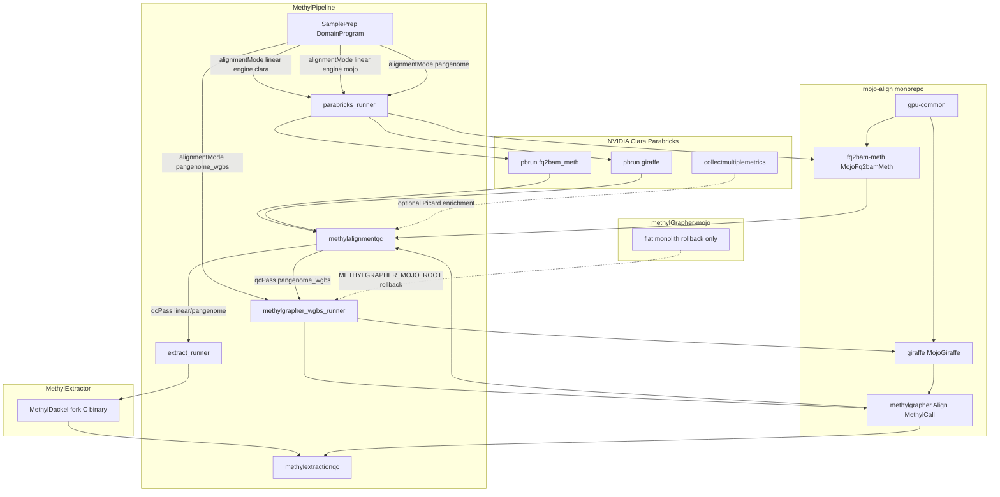

# Cross-repo genomics tool analysis

> **Status: Implementing** — analysis + ranked improvements; P0/P2 code follow-ups tracked below (AB#703).

## Verdict

MethylPipeline is the **orchestrator**; mojo-align is the **canonical science align stack** (linear + pangenome WGBS); MethylExtractor is the **linear/stock-pangenome methylation caller** with JSON for **extraction QC** (not alignment QC); methylGrapher-mojo is a **rollback monolith** superseded by mojo-align. The architecture is coherent, but production still depends on Clara for Picard metrics, dual-repo drift, open performance gates, and naming/contract friction between QC stages.

Operator-facing summary: [`docs/architecture/sample-prep-tooling.md`](../architecture/sample-prep-tooling.md).

---

## Relationship map

### Role of each repo

| Repo | Role | Consumed by MethylPipeline as |
|------|------|-------------------------------|
| mojo-align | Canonical Mojo monorepo: `gpu-common`, `fq2bam-meth`, `giraffe`, `methylgrapher` | Baked into `epimethyl/methylgrapher:1.70-mojo-{cuda,rocm}`; CLI `methylGrapher` |
| methylGrapher-mojo | Pre-split monolith; dual-CI / rollback | Only if `METHYLGRAPHER_MOJO_ROOT` still points here |
| MethylExtractor | Heavily modified MethylDackel → HDF5 + JSON | Host binary `METHYL_EXTRACTOR_BIN` via `sample.methyl_extract` |
| MethylPipeline | Workflow, workers, QC packages, `/work` contracts | Owners of mode branching and QC Pass/Fail |

### Alignment modes (science choice) vs engines (site choice)

Documented in [`docs/usage/alignment-engines.md`](../usage/alignment-engines.md):

| `alignmentMode` | Align | Extract | Why |
|-----------------|-------|---------|-----|
| `linear` | Clara `fq2bam_meth` **or** `MojoFq2bamMeth` | MethylExtractor | Linear BAM; Mojo is portable Parabricks substitute |
| `pangenome` | Clara `giraffe` → BAM | MethylExtractor | Stock (non-BS) HPRC path; **not** mojo-align Giraffe |
| `pangenome_wgbs` | Mojo Giraffe dual-graph → **GAF** | methylGrapher `MethylCall`/`MergeCpG` | Better science than linear; Parabricks cannot emit named-coordinate GAF |

**Key correction:** MethylExtractor JSON feeds **`methylextractionqc`** (post-extract). **Alignment QC** (`methylalignmentqc`) consumes Parabricks-shaped metrics / methylGrapher `alignment_metrics.json` / optional Picard tar **before** extract.

---

## Concrete coupling points

- Linear Clara/Mojo switch: [`workers/methyl_worker/parabricks_runner.py`](../../workers/methyl_worker/parabricks_runner.py)
- Pangenome WGBS: [`workers/methyl_worker/methylgrapher_wgbs_runner.py`](../../workers/methyl_worker/methylgrapher_wgbs_runner.py)
- MethylExtractor CLI: [`workers/methyl_worker/extract_runner.py`](../../workers/methyl_worker/extract_runner.py)
- Mode branch: [`workflow_engine/domain/fixtures/sample_prep.program.json`](../../workflow_engine/domain/fixtures/sample_prep.program.json)
- Image bake: [`scripts/build_methylgrapher_mojo_image.sh`](../../scripts/build_methylgrapher_mojo_image.sh) + mojo-align `scripts/stage_flat_image_tree.sh`
- Extract QC contract: MethylExtractor `docs/extraction_qc_contract.md` ↔ [`packages/methylextractionqc/`](../../packages/methylextractionqc/)

---

## Ranked improvement backlog

### P0 — Production risk / contract integrity (this Feature)

1. Finish mojo-align cutover; retire dual-root hardcoded path fallbacks (`p0-cutover-paths`, AB#708).
2. Distinct `MOJO_LINEAR` metrics family for placeholder Picard fields (`p0-mojo-metrics`, AB#707).
3. Pass `alignmentMode` on `MethylQcTaskInput`; fail-closed family detection (`p0-qc-mode`, AB#706).
4. GAF named-coordinates translation via env / overlay / in-image roots only (same cutover todo).

### P1 — Science / performance gates (mojo-align; separate Features)

5. Buffy dual-map ≤ ~2 h gate — still NOT MET.
6. Clara linear bakeoff before flipping default `parabricks.engine` to `mojo`.
7. GPU-native Giraffe hotpath completion.
8. MethylCall full-Buffy GAF wall/RSS remeasure.

### P2 — MethylExtractor hardening

9. Clarify QC naming (alignment vs extraction).
10. Refresh `ANALYSIS_REPORT.md` (overlap mate handling is implemented).
11. Real BAM → manifest integration tests (`p2-extractor-tests`, AB#709).
12. Chromosome-level parallelism (future).
13. Version/capability probing contract (future).

### P3 / P4 — Ops DX and product direction

See original analysis: runner split, engine default fail-closed, Clara surface reduction, shared metrics schemas.

---

## Out of scope for this Feature

- Implementing Giraffe performance work or Clara bakeoffs
- Changing production site defaults
- Merging methylGrapher-mojo into mojo-align git history (already migrated; archive is ops)
