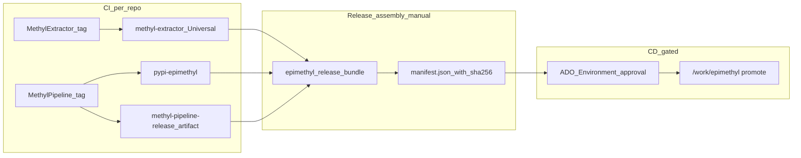

# Full CI/CD for GPU worker releases

## Is this the right approach?

**Yes, with one important refinement:** do **not** make every MethylExtractor change automatically rebuild MethylPipeline wheels. You chose **independent versioning**, which is the right fit for two repos with different change rates.

| Layer | What runs in DevOps | Trigger | Output |
|-------|---------------------|---------|--------|
| **CI (per repo)** | Build + test + publish | Git tag `v*` (SemVer, e.g. `v2026.6.1`) | Artifacts feed |
| **Release assembly** | Download + manifest + bundle | Manual pipeline with version params | Combined release artifact |
| **CD (gated)** | `promote_release.sh` on cluster | Manual approval in ADO Environment | `/work/epimethyl/releases/<ver>` + `current` |

MethylExtractor updates trigger **only** the MethylExtractor pipeline. MethylPipeline updates trigger **only** the MethylPipeline pipeline. You ship together by running the **assembly** pipeline with compatible version pins—not by coupling build triggers.



This matches your existing scripts ([`build_release.sh`](../../scripts/build_release.sh), [`download_methyl_extractor_artifacts.sh`](../../scripts/download_methyl_extractor_artifacts.sh), [`promote_release.sh`](../../scripts/promote_release.sh)) and extends them rather than replacing the production layout in [`docs/deployment/production_release.md`](../deployment/production_release.md).

---

## Phase 1 — Register CI pipelines in Azure DevOps

### 1A. MethylExtractor repo (`Development/MethylExtractor`)

- Add per-arch release pipelines in the **MethylExtractor** repo: `ci/azure-pipelines-release-arm64.yml`, `ci/azure-pipelines-release-x64.yml`, and `ci/azure-pipelines-pr.yml`.
- **Pools:** native `GPU-ARM64` and `GPU-x86_64` (already assumed in template).
- **Tag trigger:** `v*` only for publish; add a separate **PR pipeline** (`make` + smoke test, no publish).
- **Enable publish** (currently commented):
  - `az artifacts universal publish` per arch to feed **`methyl-extractor`** (project-scoped, SemVer `2026.6.1`).
  - Remove reliance on client-side `package_methyl_extractor.sh` except as script invoked **inside** the pipeline.
- **Checkout MethylPipeline** (sparse: `scripts/package_methyl_extractor.sh` + `scripts/detect_platform.sh`) via `resources.repositories` or a pinned pipeline artifact—avoid `../MethylPipeline` on agents.

### 1B. MethylPipeline repo (`Development/MethylPipeline`)

- Register [`ci/azure-pipelines-release.yml`](../../ci/azure-pipelines-release.yml) and [`ci/azure-pipelines-pr.yml`](../../ci/azure-pipelines-pr.yml) as release and PR pipelines.
- **Tag trigger:** `v*` → run `build_release.sh --with-gpu-reqs`.
- **Enable publish:**
  - `TwineAuthenticate` + `twine upload` to PyPI feed (e.g. `pypi-epimethyl`).
  - Keep `PublishPipelineArtifact` for `runtime-bundle/`, lockfile, manifest stub.
- **PR pipeline:** `pytest` (existing suites) + `build_release.sh --skip-wheels` on PR (validates packaging without publishing).
- **Version alignment:** ensure each package `pyproject.toml` version bumps on release tags so lockfile pins are meaningful.

---

## Phase 2 — Release assembly (new orchestrator)

Today the gap is: **two independent artifact versions must become one `/work/epimethyl/releases/<bundle>` folder with a complete `manifest.json`**. Add:

### New script: `scripts/assemble_release.sh`

Parameters (conceptual):

- `--release-version` — bundle id on `/work` (SemVer, e.g. `2026.6.1`)
- `--methyl-pipeline-version` — MP tag/artifact version to pull wheels + runtime-bundle from
- `--methyl-extractor-version` — ME Universal Package version for both arches
- `--output` — staging directory (default `/work/epimethyl/releases/<release-version>`)

Steps:

1. Create output dir.
2. Pull MP release: download pipeline artifact **or** copy wheels from PyPI feed + fetch runtime-bundle from artifact.
3. Call existing [`download_methyl_extractor_artifacts.sh`](../../scripts/download_methyl_extractor_artifacts.sh) (or inline `az artifacts universal download`) for both arches.
4. Compute sha256 for tarballs; write final [`manifest.json`](../../schemas/deployment/epimethyl_release_manifest.schema.json) with **component pins**:

```json
{
  "version": "2026.6.1",
  "components": {
    "methyl_pipeline": "2026.6.1",
    "methyl_extractor": "2026.5.2"
  },
  ...
}
```

5. Publish assembled folder as pipeline artifact `epimethyl-release-<version>` (optional Universal Package for offline restore).

### Schema update

Extend [`schemas/deployment/epimethyl_release_manifest.schema.json`](../../schemas/deployment/epimethyl_release_manifest.schema.json) with optional `components` object (backward compatible). `version` remains the **deploy bundle id** used by `promote_release.sh` and `current` symlink.

### New pipeline: `ci/azure-pipelines-release-assemble.yml`

- **Trigger:** manual only (`trigger: none`, `parameters` for three version strings).
- **No `/work` required** on Microsoft-hosted agents—only Artifacts + pipeline artifact download.
- Output: immutable release bundle artifact ready for CD.

---

## Phase 3 — Gated CD to `/work` (your choice)

### Azure DevOps Environment

- Create environment **`production-work`** with **approvals** (you + one backup approver).
- Register a **self-hosted agent** on a node with:
  - `/work/epimethyl` mounted read/write
  - Docker + NGC creds (for optional `--pull-parabricks` during promote)
  - `az` CLI + `azure-devops` extension (if promote downloads from Artifacts instead of using downloaded artifact)

### New pipeline stage: `ci/azure-pipelines-release-deploy.yml`

- **Trigger:** pipeline resource completion of `release-assemble` **or** manual run with release version parameter.
- **Stage 1:** download `epimethyl-release-<version>` artifact to agent.
- **Stage 2 (Environment `production-work`, approval required):**
  - Rsync artifact → `/work/epimethyl/releases/<version>/`
  - Run [`promote_release.sh`](../../scripts/promote_release.sh) per arch (`aarch64`, `amd64`) with `--pull-parabricks` only when Parabricks tag changed in manifest.
  - Optional: smoke `verify_e2e_node.sh` on agent before flipping `current` (or after, with rollback doc).

Keep [`docs/deployment/production_release.md`](../deployment/production_release.md) rollback path: re-run deploy pipeline with previous bundle version + approval.

---

## Phase 4 — What stays manual vs automated

| Action | Automated | Gated / manual |
|--------|-----------|----------------|
| ME native build per arch | Tag CI | — |
| MP wheels + runtime-bundle | Tag CI | — |
| Compose manifest + sha256 | Assembly pipeline | Assembly is manual-triggered |
| Copy to `/work` + venv + extract + flip `current` | Deploy pipeline | **Approval required** |
| New GPU VM join (`setup_gpu_node.sh`, register worker) | — | Runbook (infrequent) |
| Control plane (`workflow_versions.json`) | — | Separate deploy |

---

## Recommended release workflow (operational)

1. Tag MethylExtractor `v2026.5.2` when native code changes → CI publishes Universal Packages.
2. Tag MethylPipeline `v2026.6.1` when Python/worker changes → CI publishes wheels + runtime-bundle.
3. Run **assemble** pipeline: `releaseVersion=2026.6.1`, `methylPipelineVersion=2026.6.1`, `methylExtractorVersion=2026.5.2`.
4. Approve **deploy** pipeline → `/work/epimethyl/current` updated.
5. Restart workers or rely on next task pickup (document restart policy).

Use the **same** `releaseVersion` for the bundle even when component versions differ—bundle id is the deploy unit; `components` records what was pinned.

---

## Repo changes summary (MethylPipeline)

| File | Change |
|------|--------|
| [`ci/azure-pipelines-release.yml`](../../ci/azure-pipelines-release.yml) | Enable Twine publish; tag-triggered wheel + runtime-bundle |
| [`ci/azure-pipelines-pr.yml`](../../ci/azure-pipelines-pr.yml) | Test + packaging smoke on PR |
| MethylExtractor `ci/azure-pipelines-release-*.yml` | Per-arch Universal Package publish; multi-repo checkout |
| `ci/azure-pipelines-release-assemble.yml` | New: compose release bundle |
| `ci/azure-pipelines-release-deploy.yml` | New: gated promote to `/work` |
| [`scripts/assemble_release.sh`](../../scripts/assemble_release.sh) | New: version-pinned assembly |
| [`schemas/deployment/epimethyl_release_manifest.schema.json`](../../schemas/deployment/epimethyl_release_manifest.schema.json) | Optional `components` block |
| [`docs/deployment/production_release.md`](../deployment/production_release.md) | Document CI/CD flow; deprecate client-side build as primary path |

---

## Why not "ME change triggers MP wheels"?

- Wastes CI when only the native binary changed.
- Creates version skew (MP wheel set tagged `2026.6.1` built from unchanged code at an arbitrary commit).
- Independent pins in `manifest.json` are clearer for audit and rollback (re-assemble old ME version with current MP, or vice versa).

If you later want **coordinated releases**, trigger the **assemble** pipeline from both CI completions via `resources.pipelines`—not a full MP rebuild on every ME commit.

---

## Prerequisites in Azure DevOps (one-time)

- Feeds: `methyl-extractor` (Universal), `pypi-epimethyl` (Python)—already started.
- Build service **Contributor** on both feeds.
- Self-hosted agent pool for `/work` deploy stage.
- Environment **`production-work`** with approvers.
- Variable group for NGC docker pull creds (if promote pulls Parabricks).
- SemVer tags only: `v2026.6.1` (no `v2026.06.1`).
