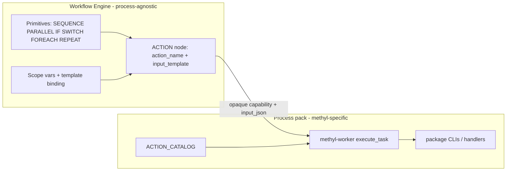

# Dependency injection vs action-agnostic Workflow Engine

## Verdict

**Do not adopt `fast_depends` as the main path to action-agnosticism.** The Workflow Engine (graph primitives, SQL scheduler, gateway, template binding) is already process-agnostic. Remaining coupling lives in the **methyl worker / action catalog** layer. That layer needs a clearer **action provider registry**, not request-scoped DI.

`fast_depends` solves “inject typed deps into a callable’s signature.” MethylPipeline’s harder problem is “register, configure, and dispatch opaque actions without the engine knowing methylation.” That is already mostly solved by the catalog + `resolvedConfig` contract; DI would not move the needle on engine agnosticism.

## What is already action-agnostic

- **Primitives** live in [`workflow_engine/contract/workflow_definition_spec.py`](../../workflow_engine/contract/workflow_definition_spec.py); the SQL engine never branches on pipeline meaning ([`docs/architecture/component-boundaries.md`](../architecture/component-boundaries.md)).
- **Process actions** are data: [`workers/methyl_worker/action_catalog.py`](../../workers/methyl_worker/action_catalog.py) → [`schemas/actions/catalog.json`](../../schemas/actions/catalog.json) → `wf.workflow_action`.
- **Config injection** is already instance-time baking: `resolvedConfig__*` via [`finalize_instance_context`](../../workflow_engine/domain/workflow_context.py) / Universal Action Input Contract — workers must not re-read profiles.

So the split you described (engine primitives vs process-registered actions) is the intended architecture and largely works.

## Where coupling still hurts (and DI does / does not help)

| Coupling | Location | Would `fast_depends` help? | Better fix |
|----------|----------|----------------------------|------------|
| Growing `if action_name == …` for CLI subclasses | [`build_action_from_catalog`](../../workers/methyl_worker/actions/base.py) | No | Catalog field / registry: `action_class` or decorator map |
| Monolithic string-named handlers | [`handlers.py`](../../workers/methyl_worker/handlers.py) (~1500 lines) | Marginally (inject `runtime`) | Split modules + registry keyed by catalog `in_process_handler` |
| Compiler special-cases centroid/detector templates | [`compiler.py`](../../workflow_engine/domain/compiler.py) `_action_template` | No | Catalog-driven template/binding rules (`domain_effects`, argv/template metadata) |
| Hardcoded capability lists | [`capabilities.py`](../../workers/methyl_worker/capabilities.py) | No | Derive from catalog |
| Adding an action touches many files | catalog + models + export + handler + seed | No | Scaffold from catalog metadata; keep explicit catalog (no silent entry-point discovery) |

`fast_depends` would mainly tidy **in-process handler signatures** (e.g. inject `TaskRuntimeContext`, artifact collectors). That is a local ergonomics win inside the worker, not an engine-boundary win. The worker already has a small version of this via `inspect.signature` / `_handler_accepts_runtime` in [`actions/base.py`](../../workers/methyl_worker/actions/base.py).

## Recommended direction (if you pursue this)

Treat “more action-agnostic” as **hardening the process-pack boundary**, not introducing a DI framework into the engine.

### Phase 1 — Action provider registry (high value)

Make worker dispatch fully catalog-driven:

1. Extend `ActionCatalogEntry` with optional `cli_action_class` / collector metadata (or a side registry keyed by `action_name`).
2. Replace the `build_action_from_catalog` if/elif chain with registry lookup → default `CliAction` / `InProcessAction`.
3. Split `handlers.py` into domain modules (`handlers/sample_prep.py`, `handlers/validation.py`, …) still referenced by catalog string names.
4. Derive worker capability probing from the catalog where possible.

No new dependency. Preserves explicit catalog as source of truth (important for CI drift checks and DB seed).

### Phase 2 — Catalog-driven compiler bindings (medium value)

Push remaining `_action_template` special cases into catalog `domain_effects` / template rules so [`compiler.py`](../../workflow_engine/domain/compiler.py) only knows: look up entry → emit ACTION node + generic template fields (`resolvedConfig`, `context_vars`, `with` overlays).

### Phase 3 — Optional DI for in-process handlers only (low priority)

If handler signatures keep growing, introduce **worker-local** dependency providers (could be `fast_depends` or a tiny custom `Depends`) for:

- `TaskRuntimeContext`
- logging / metrics
- path helpers

Keep this **out of** the SQL engine, gateway, and DomainProgram compiler. Those layers should continue to see only `action_name` + JSON.

### Explicitly out of scope

- Dynamic plugin discovery via setuptools entry points as the sole registration path (conflicts with “catalog is data + CI-checked”).
- Putting DI containers in the gateway or SQL engine.
- Making engine primitives themselves injectable “actions” (IF/FOREACH stay first-class graph nodes).

## Mental model to keep

| Layer | Knows about | Injection style today |
|-------|-------------|------------------------|
| Engine | Node types, scope, templates | None — opaque ACTION |
| Catalog / process pack | Action names, I/O schemas, dispatch | Static registry |
| Instance config | Merged `actionConfig` | Baked `resolvedConfig` in payload |
| Worker handler | Domain packages | Manual / `getattr` |

True action-agnosticism = **engine stays in row 1**; improvements belong in rows 2–4 as a cleaner registry, not FastAPI-style DI across the stack.

## When this would be worth implementing

Pursue Phase 1–2 when the next wave of actions would otherwise grow `build_action_from_catalog` / compiler special cases further (e.g. new sample-prep or modeling actions). Skip Phase 3 unless in-process handler boilerplate becomes painful.

## Docs touch (if implemented later)

- Short note in [`docs/architecture/component-boundaries.md`](../architecture/component-boundaries.md): engine vs process-pack registry.
- Optionally a small ADR under `docs/architecture/` recording “registry over DI for action dispatch.”
