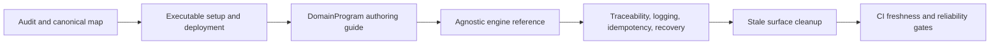

# Documentation and Deployment Reliability

See attached implementation plan in Cursor for full section breakdown. This file is the committed plan register; do not edit the Cursor-only plan copy.

## Delivery structure

