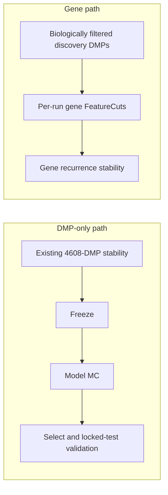

# ECDF DMP-only finish and gene discovery experiment

> **Status: IN PROGRESS.** The DMP configuration uses the existing extval10
> stability evidence; the gene configuration starts an independent study tree.

## Execution checkpoint (2026-07-18)

The workstation was intentionally stopped for reboot during DMP model-MC.

- Freeze is complete and readiness is `go_with_risks`: stability, freeze, and
  enricher pass; progression is skipped for this single-comparison feasibility
  study.
- The frozen production panel has exactly 4,608 loci.
- DMP model-MC shared runs `run_0001` through `run_0006` completed.
- `run_0007` was interrupted during `methyl-detector`; restart from run 7.
- The workflow and detector processes were interrupted and verified stopped
  before reboot.
- Model-MC must run with `requireArtifactReuse: false` because the original
  discovery-only MC runs have no `classifier-*.pkl`; primary train/validation
  splits are still reused exactly.
- Resume input: `resume: 7`. The resume helper repeats and replaces run 7,
  preserves completed runs 1–6, and continues through run 10.
- Run the resume command in `tmux` (or another host-managed session), not in a
  Cursor-managed terminal.

After DMP model-MC completes, run `validation_model.program.json` to select the
single ECDF backend and perform post-model validation. Then start the independent
gene MC experiment from
`/work/projects/prostate-cancer/configs/context_H_PCa_ecdf_gene_covariates.json`.

## Goals

| Model | Context | Study outputs | MC rerun |
|---|---|---|---|
| DMP-only | `/work/projects/prostate-cancer/configs/context_H_PCa_ecdf_dmp_covariates.json` | Existing `H_PCa_good_ecdf_covariates_extval10` | No |
| Genes | `/work/projects/prostate-cancer/configs/context_H_PCa_ecdf_gene_covariates.json` | New `H_PCa_ecdf_gene_covariates` | Yes |

The DMP candidate freezes the 4,608 loci observed in all 10 successful MC runs.
The gene experiment uses `mc_gene_fc`: detector discovery DMPs are subject only
to the detector's biological/statistical filters, with no DMP FeatureCuts or
PPI/disease biomarker restriction before per-run gene FeatureCuts.



## DMP-only candidate

The context points to
`/work/projects/prostate-cancer/configs/project_H_PCa_good_ecdf_covariates.json`
and reuses the existing extval10 output tree. It disables the gene arm, selects
ECDF `raw_dmp` / `dmp_scored` features, retains the six cell-fraction covariates
with ALR transformation, and pins:

```text
monte_carlo_runs/stability/stable_dmps_freq1.csv
```

This generated panel contains exactly 4,608 frequency-1.0 loci. The execution
sequence is `validation_freeze.program.json`,
`validation_model_mc.program.json`, then `validation_model.program.json`.
Success requires a successful production freeze, model-MC outputs, and
post-model metrics on the manifest's 23-sample locked test partition.

## Gene discovery experiment

The new study manifest
`/work/projects/prostate-cancer/configs/project_H_PCa_ecdf_gene_covariates.json`
clones the original cohort and validation partitions while assigning the output
root `H_PCa_ecdf_gene_covariates`.

The context fixes these contracts:

- `dmp_modeling_mode: raw_pool`
- `gene_modeling_mode: featurecuts`
- `runDmpSelection: false`
- `runGeneFeaturecuts: true`
- `gene_featurecuts_loci_source: raw_pool`
- `stability_gene_featurecuts_dmp_source: discovery`
- `stability_gene_featurecuts_max_dmps: null`
- `stability_gene_biomarker_filter_enabled: false`
- `stability_gene_recurrence_source: classifier`
- `stability_min_balanced_accuracy: null`
- ECDF `raw_gene` / `gene` features with the same ALR cell-fraction covariates

The discovery dynamic cutoff is explicitly disabled, so the uncapped per-run
discovery pool reaches gene feature construction after the detector's basic
biological/statistical filtering.

Run:

```bash
source .venv/bin/activate
methyl-workflow-run \
  --program /work/epimethyl/current/runtime-bundle/domain/fixtures/mc_stability.program.json \
  --context-file /work/projects/prostate-cancer/configs/context_H_PCa_ecdf_gene_covariates.json \
  --parallel-workers 1 -v
```

Success requires 10 gene panels, classifier-source gene recurrence with no
BA-gate skips, discovery DMP source in each gene FeatureCuts metric, no biomarker
filter, and an uncapped discovery-locus count. Gene BA and recurrence remain
feasibility evidence and must be reviewed before this arm proceeds to freeze.
