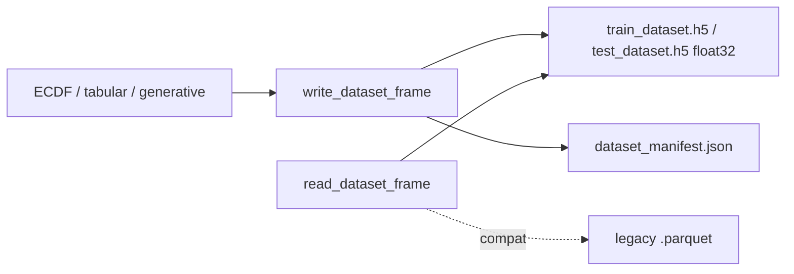

# ECDF design matrices: HDF5 float32 + binary raw p

## Decisions (confirmed)

1. **Format:** All `model_bundle` design matrices (ECDF second-stage, tabular, generative) move from Parquet → **HDF5**, with continuous feature columns forced to **`float32`** (match `model_feature_bundle.h5` / sample H5).
2. **Binary simplex:** For any 2-part composition (ECDF `prob_class*` or declared covariate groups with exactly two columns), use the **non-reference closed probability \(p\)** in the design matrix and exports. **ALR remains only when \(K>2\)**.

## 1. Canonical dataset I/O (HDF5 float32)

Update [`packages/methylvalidation/methyl_validation/model_datasets.py`](../../packages/methylvalidation/methyl_validation/model_datasets.py):

- Rename constants: `train_dataset.h5` / `test_dataset.h5` (keep `dataset_manifest.json`).
- `write_dataset_frame`: write HDF5 via `h5py`:
  - identity: `sample_id` (utf-8/string), `class_index` (`int32`), `class_label` (string)
  - every numeric feature column: **`np.float32`**
  - store `feature_names` dataset for column order
- `read_dataset_frame`: read `.h5`; **compat**: still read legacy `.parquet` (and csv/tsv).
- `dataset_sidecar_meta_path`: `.h5.meta.json` (tabular cache fingerprint).

Callers already go through this helper (`ecdf_second_stage.py`, `tabular_backend.py`, `generative_backend.py`).

## 2. Binary raw p; ALR only for K>2

### Shared transform helper

In [`covariate_preprocessor.py`](../../packages/methylvalidation/methyl_validation/covariate_preprocessor.py):

- `_simplex_encode`: \(K=2\) → `p_<nonref>`; \(K>2\) → ALR (`ε` required).
- `fit_covariates` / `transform_covariates` use `_simplex_encode`.

### ECDF class probabilities

In [`ecdf_second_stage._probability_design`](../../packages/methylvalidation/methyl_validation/ecdf_second_stage.py):

- Binary: stack/export `prob_class1` (closed \(p\)); epsilon not required.
- Multiclass: ALR + required epsilon.
- Legacy `logit_class1` means default simplex encode.

## 3. Tests

- Composition groups, ECDF second-stage covariates, model_datasets HDF5 + legacy parquet, tabular/generative path assertions.

## 4. Docs

- Usage ch.07, theory ch.15, methylvalidation USAGE/IMPLEMENTATION.
- Supersession note on [`unify-model-bundle-datasets.plan.md`](unify-model-bundle-datasets.plan.md).

## 5. Operator note

- Existing on-disk `train_dataset.parquet`: reader compat only; re-run Model-MC / `--force-rerun` for `.h5` + binary-\(p\) features.
- No change to `model_feature_bundle.h5` DMP schema.

## Key files

- `packages/methylvalidation/methyl_validation/model_datasets.py`
- `packages/methylvalidation/methyl_validation/covariate_preprocessor.py`
- `packages/methylvalidation/methyl_validation/ecdf_second_stage.py`
- Tabular/generative backends (path constants via shared helper)
