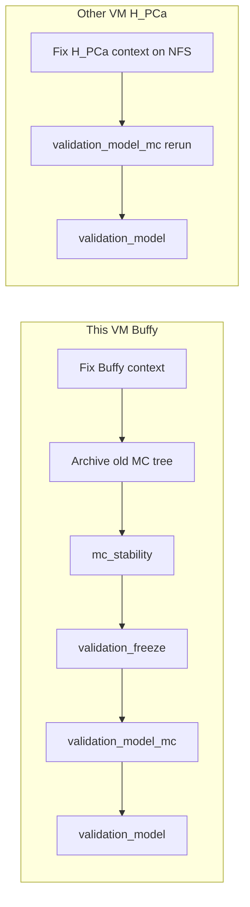

# Cross-VM ECDF covariate study reruns

Choices locked: **Buffy 1A**, **H_PCa 2A**.

## Why these adjustments

Current `EcdfBackendParams` rejects listing the same cell-fraction columns in both `covariate_numeric_columns` and composition/ALR roles. The working contract (already used by `/work/projects/prostate-cancer/configs/context_Healthy_vs_PCa_low_ecdf_covariates.json`) is composition-groups only.

Buffy also needs an **explicit** `stability_gene_featurecuts_max_dmps` — prior MC used site default **1000** despite `null` in context, and freeze readiness was `ready: false`.



## Config edits (shared `/work` NFS)

### Buffy

- [`/work/projects/prostate-cancer/configs/context_Buffy_ecdf_gene_covariates.json`](/work/projects/prostate-cancer/configs/context_Buffy_ecdf_gene_covariates.json) — composition-groups; `stability_gene_featurecuts_max_dmps` / `gene_selection.max_dmps` = **100000**
- [`/work/projects/prostate-cancer/configs/project_Buffy_ecdf_gene_covariates.json`](/work/projects/prostate-cancer/configs/project_Buffy_ecdf_gene_covariates.json) — same caps

### H_PCa

- [`/work/projects/prostate-cancer/configs/context_H_PCa_good_ecdf_covariates.json`](/work/projects/prostate-cancer/configs/context_H_PCa_good_ecdf_covariates.json) — composition-groups; keep gene-FC cap **5000**

## This VM — Buffy sequence (1A)

Host: `192-222-50-58`.

Archived capped tree: `Buffy_ecdf_gene_covariates.capped1000.bak`.

Chained driver (repo `.venv` + runtime-bundle programs):

```bash
tmux attach -t buffy-gene-baseline
# script: /work/projects/prostate-cancer/configs/run_Buffy_ecdf_gene_covariates_baseline.sh
```

Note: release `venv-aarch64` `methyl-workflow-run` currently fails (`No module named 'compiler'`); baseline uses `/home/ubuntu/MethylPipeline/.venv`. `validation_model_mc.program.json` was synced into the runtime-bundle fixtures from the repo.

## Other VM — H_PCa sequence (2A)

Old model-MC archived to `monte_carlo_runs/model_mc.pre_alr_stacker.bak`.

Operator guide: [`docs/deployment/hpca_ecdf_extval10_other_vm.md`](../deployment/hpca_ecdf_extval10_other_vm.md)

```bash
tmux new-session -d -s hpca-extval10-model \
  'bash /work/projects/prostate-cancer/configs/run_H_PCa_good_ecdf_covariates_extval10_model.sh'
```

## Verification checklist

- Buffy gene-FC runs report `n_dmp_loci_for_features` ≫ 1000.
- Both contexts validate under current `EcdfBackendParams`.
- H_PCa model-MC manifests use composition-group ALR features (logit + 5 ALR coords).
- Only `validation_model` evaluates `locked_test`.
