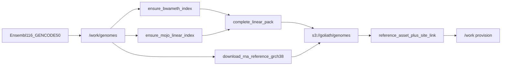

# Ensembl 116 / GENCODE 50 QNAP inventory and default pin

Switch the **default** human linear FASTA + GTF + RNA indexes from Ensembl **114** / GENCODE **v49** to Ensembl **116** / GENCODE **50** (still GRCh38.p14; pairing 50↔116). Keep 114/v49 on QNAP for historical BAMs. Do **not** mix 114-aligned BAMs with a 116 FASTA.

Operator execution in this environment is in scope (download → index → upload → SQL relink → provision `/work`). Indexing and `aws s3 sync` will take hours. Do not put QNAP secrets in git.



## Inventory layout (do not invent a second path)

Follow [`docs/deployment/reference-inventory-qnap.md`](../deployment/reference-inventory-qnap.md) and [`scripts/sync_genomes_to_s3.sh`](../../scripts/sync_genomes_to_s3.sh).

| Asset | Local dest | QNAP prefix |
|-------|------------|-------------|
| `linear-grch38-ensembl-116@1` (new default) | `/work/genomes/linear/GRCh38/ensembl-116/` | `s3://goliath/genomes/linear/GRCh38/ensembl-116/` |
| `gencode-v50@1` (new default) | `/work/genomes/annotation/gencode/v50/` | `s3://goliath/genomes/annotation/gencode/v50/` |
| Keep `linear-grch38-ensembl-114@1` / `gencode-v49@1` | unchanged | unchanged |
| Keep HPRC `d9` / `d9-bs` 1.70 | unchanged (~43 GB graphs **not** rebuilt) | unchanged |
| RNA (out of band for site roles; still uploaded) | `/work/genomes/rna/GRCh38/star/ensembl-116/` + `kallisto/gencode.v50.*` | `s3://goliath/genomes/rna/...` |

**Linear pack must be complete before upload** (same rule as 114):

- `Homo_sapiens.GRCh38.dna.primary_assembly.fa` + `.fai`
- Clara: `${FASTA}.bwameth.c2t` + `.amb/.ann/.bwt/.pac/.sa` via `mojo-align/fq2bam-meth/scripts/ensure_bwameth_index.sh`
- Mojo: `${FASTA}.C2T.fa` + `${FASTA}.mojo_linear_k15/{meta.json,kmers.bin,offsets.bin,postings.bin,ref.fa}` via `mojo-align/fq2bam-meth/scripts/ensure_mojo_linear_index.sh`

**GTF filename convention stays** `gencode.v50.annotation.gtf` so `apply_reference_selection` keeps deriving `gencode.{version}.annotation.gtf` from the pin dir. Download GENCODE **PRI comprehensive** (`gencode.v50.primary_assembly.annotation.gtf.gz`) so it matches the Ensembl **primary_assembly** FASTA, then install under that inventory name.

**RNA** stays without a `cfg.site_reference_asset` role. Recipes `rna-grch38-star-ensembl-116` and `rna-grch38-kallisto-gencode-v50` support provision-by-name; `--selected-only` will not pull them.

**Pangenome:** keep assets. After the linear pin switch, `linear_ref_fasta` follows 116 via overwrite fill.

**Do not** cancel, fail, rebake, or relink live SamplePrep **instance 67**.

## Sources

- FASTA: `https://ftp.ensembl.org/pub/release-116/fasta/homo_sapiens/dna/Homo_sapiens.GRCh38.dna.primary_assembly.fa.gz`
- GTF (PRI): `https://ftp.ebi.ac.uk/pub/databases/gencode/Gencode_human/release_50/gencode.v50.primary_assembly.annotation.gtf.gz`
- Transcripts: `https://ftp.ebi.ac.uk/pub/databases/gencode/Gencode_human/release_50/gencode.v50.transcripts.fa.gz`

## Relink `default@1`

```sql
(N'linear-grch38-ensembl-116', N'1', N'reference_genome'),
(N'gencode-v50', N'1', N'annotation_gtf'),
```

No git commit unless asked.
