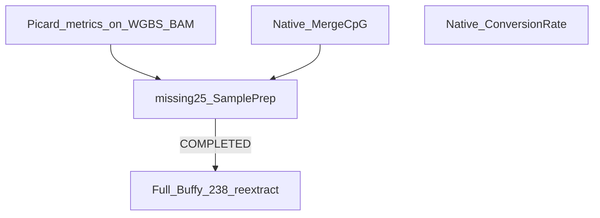

# Bring easy former out-of-scope items in-scope

## Locked decisions

| Former out-of-scope | Decision |
|---------------------|----------|
| Full Buffy 238 re-align / rewrite Feb linear H5 | **Wait** until first 25 samples SamplePrep COMPLETED successfully |
| Picard `collectmultiplemetrics` for WGBS QC | **In scope** — after QC BAM in the **worker** (not inside methylGrapher binary) |
| Native MergeCpG (+ ConversionRate port) | **In scope** — mojo-align, same dual-ship pattern as MethylCall |
| Long-read path | **Stay deferred** — ONT/PacBio surface; irrelevant to Illumina WGBS Buffy |
| re-PrepareGenome | **Stay deferred** — keep QNAP `d9-bs/1.70`; rebuild only on asset change |
| Move QC BAM/H5 packaging into Mojo | **Stay deferred** — already correct in [`methylgrapher_wgbs_runner.py`](../../workers/methyl_worker/methylgrapher_wgbs_runner.py) |

## Implementation notes

### 1. Picard-shaped metrics on WGBS QC BAM (worker)

- [`methylgrapher_wgbs_runner.py`](../../workers/methyl_worker/methylgrapher_wgbs_runner.py): `_maybe_collect_picard_metrics` after markdup BAM (soft-fail).
- Provenance sets `collectmultiplemetrics: true` when collect succeeds.
- Mode-aware QC optionally merges Parabricks core + cycle screening only when that flag is set; never from stale linear stubs.
- BS chemistry can skew artifact/GC metrics — operational screening only.

### 2. Native Mojo MergeCpG (+ ConversionRate)

- Primary code: `/home/ubuntu/mojo-align` (`methylgrapher/src/merge_cpg.mojo`, `methylgrapher/src/conversion_rate.mojo`).
- Toy + DS20M `graph.cpg.tsv` parity; ConversionRate CLI requires lambda spike-in (Buffy may not call it).
- Rollback: `METHYLGRAPHER_MCALL_ENGINE=python` in [`methylGrapher.mojo.sh`](../../workers/docker/methylgrapher/methylGrapher.mojo.sh) or site `engine=python` + `:1.70`.

### 3. Gate Buffy 238 on missing25

- Gateway instance **59** (Buffy missing25 SamplePrep): monitor until **COMPLETED** with science H5.
- As of plan close: status was **RUNNING** — do **not** start full 238 re-extract from this plan.
- Ops notes: [`docs/deployment/production_runbook.md`](../deployment/production_runbook.md).

### 4. Docs

- [`pangenome-wgbs-methyl-qc.plan.md`](pangenome-wgbs-methyl-qc.plan.md) follow-on table
- [`docs/usage/03-sample-prep-and-qc.qmd`](../usage/03-sample-prep-and-qc.md)
- [`methylgrapher-mojo-cutover-gate.md`](methylgrapher-mojo-cutover-gate.md)

## Out of scope (hard deferrals)

- Long-read / `mainL` / MM-ML path
- re-PrepareGenome / republish d9-bs indexes
- Moving QC BAM or H5 packaging from the worker into the Mojo binary
- Full Buffy 238 until missing25 COMPLETED
