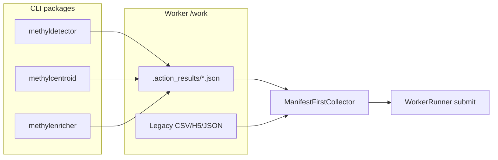

# Finish CLI Manifest Writers and Typed Handlers

## Current state

Infrastructure is already in place:

- Manifest convention: `{output_dir}/.action_results/{action_name}.{run_key}.json` via [`packages/methyldomain/methyl_domain/action_result.py`](packages/methyldomain/methyl_domain/action_result.py)
- Worker collectors: [`ManifestFirstCollector`](workers/methyl_worker/collectors.py) reads manifests first, falls back to legacy scrapers
- **Done:** `pipeline.dmp_select`, `pipeline.mapper` write manifests; worker wired with manifest-first collectors
- **Pending:** `pipeline.detector`, `pipeline.centroid` have legacy collectors only; `pipeline.enricher` uses [`GenericPipelineCollector`](workers/methyl_worker/collectors.py) (stdout-only)
- **Pending:** ~17 in-process handlers in [`handlers.py`](workers/methyl_worker/handlers.py) still return `Dict[str, Any]`; [`InProcessAction`](workers/methyl_worker/actions/base.py) accepts dict or `BaseModel` and runs `finalize_output`



---

## Phase A — CLI manifest writers

Follow the established pattern from [`packages/methyldmpselect/methyl_dmp_select/core/runner.py`](packages/methyldmpselect/methyl_dmp_select/core/runner.py) and [`packages/methylmapper/methyl_mapper/mapper.py`](packages/methylmapper/methyl_mapper/mapper.py):

```python
from methyl_domain.action_result import atomic_write_json, manifest_path_for
manifest = manifest_path_for(out_dir, "pipeline.detector", run_key)
atomic_write_json(manifest, {..., "result_code": 0})
```

**Run key must match worker `_run_key()`** in [`collectors.py`](workers/methyl_worker/collectors.py): join non-empty `{chromosome, context, group|comparison, sampleId}` with `_`.

### A1. Add `methyl-domain` dependency

Add to pyproject (same as dmp_select):

- [`packages/methyldetector/pyproject.toml`](packages/methyldetector/pyproject.toml)
- [`packages/methylcentroid/pyproject.toml`](packages/methylcentroid/pyproject.toml)
- [`packages/methylenricher/pyproject.toml`](packages/methylenricher/pyproject.toml)

### A2. `pipeline.detector` — [`packages/methyldetector`](packages/methyldetector)

**Hook:** [`MethylDetector._save_results()`](packages/methyldetector/methyl_detector/core/methyldetector.py) (after `result-{chrom}-{ctx}.json` is written; discovery CSV already on disk).

**Payload** (maps to [`DetectorTaskOutput`](workers/methyl_worker/task_models/pipeline_models.py)):

| Field | Source |
|-------|--------|
| `group` | `config.comparison` or group label from config |
| `chromosome`, `context` | `self.chromosome`, `self.ctx` |
| `output_dir` | `config.output_dir` |
| `n_statistical_dmps`, `n_biological_dmps` | `MethylDetectorResult` |
| `discovery_csv` | `{output_dir}/dmps-{chrom}-discovery.csv` |
| `result_json_path` | `{output_dir}/result-{chrom}-{ctx}.json` |
| `status`, `action_name`, `result_code` | `"ok"`, `"pipeline.detector"`, `0` |

Wrap in try/except + debug log (same as mapper) so manifest failure never fails the run.

### A3. `pipeline.centroid` — [`packages/methylcentroid`](packages/methylcentroid)

**Hook:** [`run_single_processing()`](packages/methylcentroid/methyl_centroid/cli.py) immediately after `mc.build_centroid()` returns [`CentroidResults`](packages/methylcentroid/methyl_centroid/config.py).

**Payload** (maps to [`CentroidTaskOutput`](workers/methyl_worker/task_models/pipeline_models.py)):

| Field | Source |
|-------|--------|
| `group` | from `MethylCentroidConfig` / batch label if available |
| `chromosome`, `context` | `config.chrom`, `config.ctx` |
| `output_dir` | `config.output_dir` |
| `centroid_h5_path` | `results.final_centroid_path` |
| `n_samples` | `results.total_samples_processed` |
| `n_positions` | optional: read from H5 shape or leave `None` |

Batch path (`run_batch_processing`) already calls `run_single_processing` per chrom×ctx, so one manifest per workflow-scoped combination is emitted automatically.

### A4. `pipeline.enricher` — [`packages/methylenricher`](packages/methylenricher)

**Hook:** [`write_project_completeness_manifest()`](packages/methylenricher/methyl_enricher/ensure_complete.py) (primary worker path via `--ensure-complete`) and, if needed, the end of the standard single-comparison CLI run in [`cli.py`](packages/methylenricher/methyl_enricher/cli.py).

**Payload** (maps to [`EnricherTaskOutput`](workers/methyl_worker/task_models/pipeline_models.py)):

| Field | Source |
|-------|--------|
| `comparison` | comparison label from input / reports dict key |
| `output_dir` | `production_enricher_root(project)` or per-comparison dir |
| `all_complete` | existing completeness flag |
| `completeness_manifest_path` | existing manifest path (keep legacy location; also write typed manifest under `.action_results/`) |
| `n_comparisons` | `len(comparison_reports)` |

**Worker wiring:** In [`actions/base.py`](workers/methyl_worker/actions/base.py), replace `GenericPipelineCollector` for `pipeline.enricher` with:

```python
ManifestFirstCollector(
    output_model=EnricherTaskOutput,
    resolve_output_dir=_resolve_enricher_output_dir,  # new helper using project resolver
    legacy_collect=EnricherLegacyCollector(),         # scrape completeness manifest if present
)
```

Add `EnricherLegacyCollector` in [`collectors.py`](workers/methyl_worker/collectors.py) mirroring [`DetectorLegacyCollector`](workers/methyl_worker/collectors.py) (read existing completeness JSON, map fields).

---

## Phase B — Typed in-process handlers

### Pattern (copy from completed handlers)

Reference: [`_handle_validation_stability`](workers/methyl_worker/handlers.py) returns `ValidationStabilityOutput`; [`_handle_methyl_qc`](workers/methyl_worker/handlers.py) returns `MethylQcTaskOutput` with nested `GuardrailsOutput`.

For each remaining handler:

1. Import the catalog output model from [`task_models/sample_prep_models.py`](workers/methyl_worker/task_models/sample_prep_models.py) or [`task_models/validation_models.py`](workers/methyl_worker/task_models/validation_models.py)
2. Replace `return {"status": "ok", ...}` with `return SomeTaskOutput(...)` — map existing dict keys to model field names (models already exist for every action)
3. Optionally validate input with the catalog input model at the top (like `_handle_download_fastq` already does for input)

### Handler inventory

| Handler | Output model | Notes |
|---------|--------------|-------|
| `_handle_download_fastq` | `DownloadFastqTaskOutput` | set `n_files=len(fastqFiles)` |
| `_handle_trim_fastq` | `TrimFastqTaskOutput` | map `run_fastp_trim` result keys |
| `_handle_parabricks_fq2bam` | `ParabricksTaskOutput` | |
| `_handle_delete_fastqs`, `_handle_delete_bam` | `DeleteTaskOutput` | shared shape |
| `_handle_methyl_extract` | `MethylExtractTaskOutput` | |
| `_handle_archive_sample`, `_handle_upload_h5` | `ArchiveSampleTaskOutput` / `UploadH5TaskOutput` | |
| `_handle_methyl_fragmentomics` | `FragmentomicsTaskOutput` | |
| `_handle_validation_link_artifacts` | `ValidationLinkArtifactsOutput` | |
| `_handle_validation_model_bundle` | `ValidationModelBundleOutput` | |
| `_handle_validation_model_train` | `ValidationModelTrainOutput` | |
| `_handle_validation_model_predict` | `ValidationModelPredictOutput` | |
| `_handle_validation_model_mc` | `ValidationModelMcOutput` | |
| `_handle_validation_select_best_model` | `ValidationSelectBestModelOutput` | |
| `_handle_validation_post_model_validation` | `ValidationPostModelValidationOutput` | set `result_code` when `passed` is false |
| `_handle_stub_external` | keep dict or add minimal stub output model | only if catalog defines one |

### Tighten `InProcessAction`

After all handlers return `BaseModel`:

1. Change handler return type annotation to `BaseModel`
2. Remove the `elif isinstance(raw, dict)` branch in [`InProcessAction.execute()`](workers/methyl_worker/actions/base.py)
3. Simplify to: `output = raw` then attach telemetry via a small helper (either call `finalize_output` with `raw.model_dump()` or add `enrich_telemetry(output, timer)` that returns a new validated copy with `duration_ms`, etc.)

**Do not** change handler input from `dict` to `BaseModel` in this pass unless trivial — input validation already happens in `InProcessAction` via `validate_input`.

---

## Phase C — Tests and verification

### New unit tests

- **`workers/tests/test_collectors_manifest.py`**: temp dir with a typed manifest → `ManifestFirstCollector` returns parsed fields; without manifest → legacy fallback still works for detector/centroid/enricher
- **Package-level smoke tests** (minimal, no full pipeline run):
  - detector: call manifest writer helper with fake `MethylDetectorResult` + tmp paths
  - centroid: call after mock `CentroidResults`
  - enricher: call after fake completeness reports dict

### Regression gate (existing)

```bash
source .venv/bin/activate && pytest workers/tests/ -q && methyl-export-task-schemas --check
```

Update any handler tests that assert on raw dict keys to assert `isinstance(result.output, ExpectedModel)` via `ActionExecutionResult`.

---

## Suggested implementation order

1. **Detector manifest** — highest scrape complexity (`result*.json`, discovery CSV, pandas row count)
2. **Centroid manifest** — single clear hook in `run_single_processing`
3. **Enricher manifest + collector wiring** — unblocks enricher from `GenericPipelineCollector`
4. **Sample-prep handlers** — mechanical, high volume, low risk
5. **Validation handlers** — map backend return dicts to existing output models
6. **Remove dict branch in `InProcessAction`**
7. **Collector + handler tests**

---

## Out of scope (optional later)

- [`docs/domain_program_language.md`](docs/domain_program_language.md) result_code section (WORKER_PROTOCOL + user manual already updated)
- CI golden-fixture test per catalog action
- `action_run_log.jsonl` for MC run dirs
- Passing validated `InputModel` directly to handlers instead of `model_dump()`
