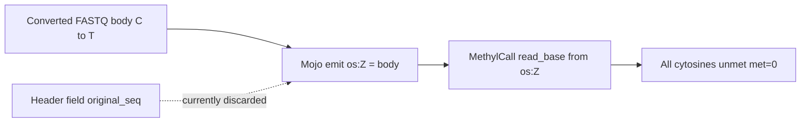

# Fix Mojo `os:Z` (root cause of all-zero MethylCall met)

## Diagnosis

MethylCall decides met vs unmet from **`os:Z` (original bisulfite read) vs graph base**, not from the converted alignment string:

```356:376:/home/ubuntu/methylGrapher-mojo/src/mcall.mojo
# CT: C→met=1, T→met=0; GA: G→met=1, A→met=0
```

Classic methylGrapher embeds the original sequence in the converted FASTQ header:

```534:534:/home/ubuntu/methylGrapher-mojo/engine/utility.py
newl = f"{original_qn1}_{conversion_str}_{reminder}_{seq}\n{converted_seq}\n+\n{phred}\n"
```

and `tmp_gaf_processing` recovers it into `os:Z`. Mojo Align skips that recovery and instead:

1. Strips the header to bare qname ([`_read_one`](methylGrapher-mojo/src/giraffe_stream_map.mojo))
2. Emits `os:Z:` + **converted** `a.seq`

Converted C2T bodies have no remaining `C` → every CT call is `T` → `met=0`. Observed on Feb goldens and on post-CS-fix Aligns (111803/48267): `mC_sum=0`, Clara has real mC.



Do **not** change `alignment_to_methylation` bit logic (it matches [`engine/mcall.py`](../../../../methylGrapher-mojo/engine/mcall.py) / `python_reference`).

## Implementation

### 1. Carry original + conversion on read structs

Extend read carriers with `original_seq` and `conversion` (e.g. `C2T`/`G2A`):

- [`src/giraffe_stream_map.mojo`](../../../../methylGrapher-mojo/src/giraffe_stream_map.mojo) — `StreamRead`
- [`src/giraffe_gpu_map_kernels.mojo`](../../../../methylGrapher-mojo/src/giraffe_gpu_map_kernels.mojo) — `StreamReadGPU`
- [`src/giraffe_mapper.mojo`](../../../../methylGrapher-mojo/src/giraffe_mapper.mojo) — `FastqRead`
- [`engine/quartet_map.py`](../../../../methylGrapher-mojo/engine/quartet_map.py) — `_iter_fastq` yield

Parse methylGrapher headers: `{qname}_{C2T|G2A}_{shard}_{original_seq}`:

- `bare = parts[0]` (mapping / GAF qname)
- `conversion = parts[1]` when present
- `original_seq = parts[3]` when present; else fall back to body `seq` (non-methylGrapher FASTQ)

### 2. Emit correct GAF tags

Replace every:

```text
os:Z: + a.seq + rc:Z:CT/GA  (hardcoded by mate)
```

with:

```text
os:Z: + original_seq
rc:Z: + (C2T→CT, G2A→GA) from header conversion (mate hardcode only as fallback)
```

Touch emit sites in:

- `giraffe_stream_map.mojo`
- `giraffe_gpu_map_kernels.mojo`
- `giraffe_mapper.mojo`
- `engine/quartet_map.py`

Mapping still uses converted `seq`; only tags change.

### 3. Regression test

[`tests/test_os_z_from_fastq_header.py`](../../../../methylGrapher-mojo/tests/test_os_z_from_fastq_header.py) — header parse + tag builder + MethylCall met=0 vs met=1 when `os:Z` is converted vs original.

### 4. Deploy overlay + worker sync

Overlay: `/work/epimethyl/images/methylgrapher-mojo-overlay/` (includes `giraffe_gpu_map_kernels.mojo`, `quartet_map.py`).

Worker mounts: [`add_mojo_src_overlay_mounts`](../../workers/methyl_worker/methylgrapher_wgbs_runner.py) mounts stream_map / GPU kernels / mapper / quartet_map.

### 5. Re-validate science path

Existing GAFs cannot be repaired in place (`os:Z` already lost original). For Feb Clara goldens (`95676`, `74758`, `42608`):

1. Force Mojo re-Align (overlay emit) → named-coords → MethylCall extract
2. Assert `graph.methyl` has `met > 0` and chr1 H5 `mC_sum > 0`
3. Re-run `compare_golden_feb_cg.py` → refresh [`MOJO_VS_FEB_CLARA_CG_PARITY.md`](/work/epimethyl/images/MOJO_VS_FEB_CLARA_CG_PARITY.md)

Start with **one** sample (74758) before the other two.

## Success criteria

- New Align GAF: `os:Z` contains residual `C` (CT) / `G` (GA) matching FASTQ header original
- MethylCall on that GAF: `graph.methyl` met column non-zero; `{chr}-CG.h5` `mC_sum > 0`
- Feb Clara compare: Pearson β defined; mean \|Δβ\| no longer stuck at ~0.80 from all-β=0
- Unit/fixture test covers header→`os:Z` contract
