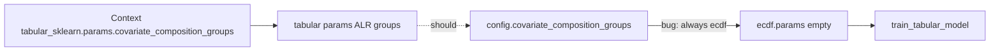

# Fix ALR routing for tabular (and generative) backends

## Problem

[`MonteCarloConfig._resolve_runtime_backend_attr`](../../packages/methylvalidation/methyl_validation/config.py) hardwires all `covariate_composition_*` keys to **`backend_profiles.ecdf.params`**.

[`trainer_api.py`](../../packages/methylvalidation/methyl_validation/trainer_api.py) passes `config.covariate_composition_groups` into `train_tabular_model`. For tabular RF/LR runs, ecdf params omit those groups → empty composition → raw `CD8T`…`Neu` (sum-to-1), even when ALR is correctly declared under `tabular_sklearn.params`.

Docs already require ALR for all covariate-consuming backends ([`USAGE.md`](../../packages/methylvalidation/docs/USAGE.md) § composition groups).

## Fix (code)

In [`packages/methylvalidation/methyl_validation/config.py`](../../packages/methylvalidation/methyl_validation/config.py) `_resolve_runtime_backend_attr`:

- Keep **ECDF-only** keys on the ecdf branch: `ecdf_second_stage_*`, `ecdf_aggregated_*`.
- **Remove** from that branch: `covariate_composition_transform`, `covariate_composition_columns`, `covariate_composition_reference`, `covariate_composition_pseudocount`, `covariate_composition_groups`.
- Those five then fall through to `get_backend_params(self.model_backend)` (same path as `covariates_path`).

No change needed in `tabular_backend` / preprocessor ALR math — they already work when groups are passed.

ECDF second stage stays correct: with `model_backend="ecdf"` (via `with_backend_selection`), composition groups still resolve from ecdf params.

## Tests

Add a focused regression in [`packages/methylvalidation/tests/test_backend_profiles_strict.py`](../../packages/methylvalidation/tests/test_backend_profiles_strict.py):

1. Build `MonteCarloConfig` with composition groups **only** on `tabular_sklearn.params` (ecdf groups `null`/absent).
2. `cfg.with_backend_selection("tabular_sklearn").covariate_composition_groups` returns the tabular groups (non-empty; columns/reference match).
3. Same pattern for `generative_hybrid`.
4. `with_backend_selection("ecdf")` still reads ecdf’s groups when set (no regression for second stage).

Run: `source .venv/bin/activate && pytest packages/methylvalidation/tests/test_backend_profiles_strict.py packages/methylvalidation/tests/test_composition_groups.py -q`

## Operator follow-up (after code lands)

Re-run prostate tabular with existing LR/RF contexts (ALR already declared) so artifacts show `alr_*_vs_Neu` (5 cov features + 4 gene_scored). Archive current `model_mc/tabular_sklearn` / `tabular_sklearn_RF` first; use stock `validation_model_mc_rebuild.program.json` + `--force-rerun`.
