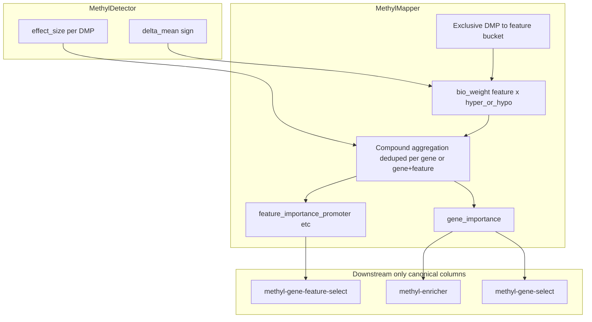

# Gene and feature biological importance — implementation plan

**Decisions locked in:**
- **Option C** — biology-weighted direction: each DMP contribution is scaled by `bio_weight(feature, hyper|hypo)` from a curated matrix.
- **Remove legacy** — delete duplicate score paths and columns; do not keep them as “diagnostic” fallbacks.
- **Retain biological foundation** — DMP `effect_size` remains the atomic signal; gene/feature scores are transparent aggregations with interpretable components (direction, coherence, support).

---

## Target architecture



---

## 1. DMP layer — unchanged foundation

**Where:** [`packages/methylutils/methyl_utils/statistical_tests.py`](packages/methylutils/methyl_utils/statistical_tests.py), [`packages/methyldetector/methyl_detector/core/methyldetector.py`](packages/methyldetector/methyl_detector/core/methyldetector.py)

Per-position biological unit:

```
effect_size = |delta_mean| × (1 − overlap) × exp(−λ·(√var1 + √var2)) × mean_level_weight
```

Statistical testing: ECDF KS → `p_value` / `q_value`. Biological filter: `effect_size_coverage`.

**No change** to detector math. Mapper must consume detector `effect_size` and `delta_mean` (for sign), never re-derive from raw overlap/std heuristics.

---

## 2. Biology-weight matrix (Option C) — core new behavior

**Where:** [`packages/methylmapper/methyl_mapper/config.py`](packages/methylmapper/methyl_mapper/config.py), [`packages/methylmapper/methyl_mapper/bedtools_mapper.py`](packages/methylmapper/methyl_mapper/bedtools_mapper.py) (`_build_compound_effect_metrics`)

### Per-DMP weight

For each deduped mapping row `i` with exclusive feature bucket `f_i` and direction `s_i = sign(delta_mean_i)` (fallback `sign(effect_size_i)`):

```
w_i = frequency_i × bio_weight(f_i, hyper if s_i > 0 else hypo)
```

Default starter matrix (tunable via config; values illustrate relative biology, not final science):

| Feature | hyper | hypo |
|---------|-------|------|
| promoter | 2.0 | 1.0 |
| exon | 1.5 | 1.0 |
| intron | 0.5 | 0.7 |
| gene_body | 1.0 | 1.0 |
| terminator | 0.5 | 0.5 |

This **replaces** the parallel weighting systems:
- `w_promoter` / `w_exon` / … composition weights (remove from config and `gene_feature_effect_compound`)
- `region_weight` from BED overlap (remove from importance math; was redundant with feature typing)
- `calculate_biological_importance()` delta/overlap/std heuristic (delete entirely)

`frequency` stays — it encodes stability/recurrence support, orthogonal to feature biology.

### Aggregation (gene level)

Over unique `(gene, dmp_name)`:

```
abs_term_i   = w_i × |effect_size_i|
signed_term_i = abs_term_i × s_i

gene_effect_abs_wsum      = Σ abs_term_i
gene_effect_signed_wsum   = Σ signed_term_i
gene_effect_abs_wmean     = Σ abs_term_i / Σ w_i
gene_direction            = sign(gene_effect_signed_wsum)
gene_direction_coherence  = |Σ signed_term_i| / Σ abs_term_i
gene_support_n            = count unique DMPs
gene_support_freq         = mean(frequency_i)

gene_importance = gene_effect_abs_wsum × gene_direction_coherence × √(gene_support_freq)
```

`gene_effect_compound` (wmean variant) may be kept as a **secondary normalized diagnostic** only if still useful for cross-gene scale comparison; it is not a ranking field.

### Aggregation (feature level)

Same formula per `(gene, feature_norm)` with dedup key `(gene, feature_norm, dmp_name)`:

```
feature_importance_{bucket} = Σ abs_term_i × coherence_bucket × √(mean frequency in bucket)
feature_direction_{bucket}  = sign(Σ signed_term_i in bucket)
feature_effect_signed_wsum_{bucket} = Σ signed_term_i in bucket
```

**Gene-level rank** uses `gene_importance`. **Feature-level rank** uses `feature_importance_{bucket}` with `feature_direction_{bucket}` for hyper/hypo interpretation.

Whole-gene composition from features (if needed for a single composite view):

```
gene_feature_importance = Σ_bucket feature_importance_{bucket}
```

This is a **sum of biology-aware feature burdens**, not a separate heuristic path. Use only where a single scalar per gene is required; primary ranking remains `gene_importance`.

---

## 3. Legacy removal — what goes away

### Code to delete

| Item | Location | Reason |
|------|----------|--------|
| `calculate_biological_importance()` | [`bedtools_mapper.py`](packages/methylmapper/methyl_mapper/bedtools_mapper.py) ~line 31 | Re-implements biology without DMP `effect_size` |
| `_build_feature_effect_scores()` | same file ~line 1168 | Parallel score family; superseded by compound + biology matrix |
| `_directional_effect_from_effect_sizes()` | same file ~line 1147 | Only used by legacy feature scores |
| `w_promoter`, `w_exon`, … config fields | [`config.py`](packages/methylmapper/methyl_mapper/config.py) | Replaced by biology matrix |
| `gene_feature_effect_compound` computation | `aggregate_by_feature` | Redundant composed scalar |

### Export columns to remove from gene summary CSV

- `mean_effect_size`, `max_effect_size`, `mean_delta_mean`, `max_delta_mean` (row-density biased)
- `gene_score`, `gene_feature_score`
- `effect_size_promoter`, `effect_size_exon`, … `effect_size_terminator`
- `direction_balance_*` (coherence already in compound path)
- `gene_feature_importance` (old weighted sum of legacy `effect_size_*`)
- `gene_feature_effect_compound`
- `biological_importance` (row-level heuristic column)

### Export columns to **keep** (interpretation + ranking)

**Ranking:** `gene_importance`, `feature_importance_{promoter,exon,intron,gene_body,terminator}`

**Interpretation:** `gene_direction`, `gene_direction_coherence`, `gene_effect_abs_wsum`, `gene_effect_signed_wsum`, `gene_support_n`, `gene_support_freq`, `feature_direction_{*}`, `feature_effect_signed_wsum_{*}`, `hits_{*}`

**Statistics (orthogonal):** `gene_p_value`, `gene_q_value`, `min_p_value`, `min_q_value` — p/q remain statistical, not biological rank.

**Optional diagnostic:** `gene_effect_compound`, `gene_effect_abs_wmean`, `gene_effect_size` (signed wmean) — document as non-canonical diagnostics only; never used for downstream sort/filter.

---

## 4. Downstream changes — canonical columns only

| Package | Change |
|---------|--------|
| [`methylgenefeatureselect`](packages/methylgenefeatureselect/methyl_gene_feature_select/core/runner.py) | Read gene summary export; rank by `feature_importance_{feature_type}`; drop intersection-CSV fallback chain |
| [`methylgeneselect`](packages/methylgeneselect/methyl_gene_select/core/gene_featurecuts.py), [`raw_gene_features.py`](packages/methylgeneselect/methyl_gene_select/core/raw_gene_features.py) | Default weight column `gene_importance`; remove `mean_effect_size` defaults and fallbacks |
| [`methylenricher`](packages/methylenricher/methyl_enricher/cli.py), [`module_pipeline.py`](packages/methylenricher/methyl_enricher/module_pipeline.py) | Sort/filter on `gene_importance`; remove `min_mean_effect_size` CLI flag and config field |
| [`methylvalidation`](packages/methylvalidation/) tests | Update fixtures to use `gene_importance` instead of `mean_effect_size` |
| Project JSON / enricher config | Remove `min_mean_effect_size`; add optional `biology_weights` override block |

No downstream package should reference removed column names. CI grep check recommended: fail if `mean_effect_size`, `gene_score`, or `calculate_biological_importance` appear outside migration notes.

---

## 5. Implementation phases

### Phase 1 — Biology matrix in mapper

- Add `BiologyWeightConfig` (10 floats: `{feature}_{hyper|hypo}`) to mapper config with defaults above; allow project JSON override.
- In `_build_compound_effect_metrics`, resolve `feature_norm` + `effect_sign` → `bio_weight`; set `bio_weight_eff = frequency × bio_weight(feature, sign)`.
- Remove `region_weight` from `bio_weight` product (stop reading it for scoring; BED weight column may remain for other uses or be ignored with a one-time log warning).

### Phase 2 — Delete legacy mapper paths

- Remove `_build_feature_effect_scores`, merge logic for legacy columns, and `calculate_biological_importance` call sites.
- Prune `_prune_gene_output_columns` to canonical set only.
- Update [`test_gene_stat_export.py`](packages/methylmapper/tests/test_gene_stat_export.py): replace legacy assertions with biology-matrix cases (e.g. promoter hyper DMP ranks above equal-magnitude intron hypo DMP).

### Phase 3 — Downstream purge

- Fix gene-feature-select source CSV and score column.
- Switch gene-select ECDF weights to `gene_importance`.
- Remove enricher `min_mean_effect_size` and legacy sort fallbacks.
- Update validation test fixtures.

### Phase 4 — Documentation

- Rewrite [`BIOLOGICAL_IMPORTANCE_AUDIT.md`](packages/methylmapper/docs/BIOLOGICAL_IMPORTANCE_AUDIT.md) as the canonical spec (not “audit of legacy”).
- Update [`IMPLEMENTATION.md`](packages/methylmapper/docs/IMPLEMENTATION.md), theory config reference, and usage artifact glossary: one propagation story from CpG → DMP `effect_size` → biology-weighted gene/feature importance.

---

## 6. Summary

| Layer | Action |
|-------|--------|
| DMP `effect_size` | Keep as-is |
| Gene rank | `gene_importance` with biology-weighted `w_i`; DMP count via `gene_effect_abs_wsum` + `gene_support_n` |
| Feature rank | `feature_importance_{bucket}` with Option C matrix; `feature_direction_{bucket}` for hyper/hypo readout |
| Legacy heuristics | **Remove** code, columns, config, and downstream references |
| Interpretation | Preserve component columns (direction, coherence, support, signed sums) so scores remain auditable |

**Bottom line:** One biological propagation path from detector to enricher. Hyper and hypo matter differently per feature through the biology matrix. Legacy duplicate calculations are deleted, not deprecated.
