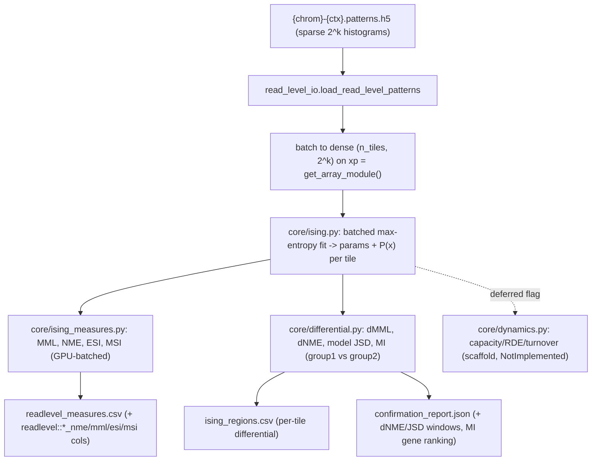

## Ising/MRF v2 for `methylinfotheory` (GPU-batched, phased)

Decisions locked in from clarification: **equilibrium Ising set now, scaffold capacity/RDE later (phased)**; **per-tile granularity at existing `k`** (no sidecar contract change, no MethylExtractor change beyond what v1 already needs).

### What v2 adds over v1

v1 treats each tile's `2^k` pattern histogram as a black-box distribution (empirical entropy, epipolymorphism, PDR, empirical JSD). v2 **fits a parametric Ising/max-entropy model** per tile, which (a) regularizes sparse tiles and (b) unlocks measures that require a model, not just a histogram: sensitivities (ESI/MSI) and clean differential quantities (dMML/dNME, model JSD, mutual information).

### Reuse the existing GPU abstraction (no new CUDA)

The batched math rides entirely on `methyl_utils` primitives found in the exploration:
- `get_array_module(prefer_gpu)` / `to_cpu(x)` / `gpu_disabled_by_env()` from [packages/methylutils/methyl_utils/array_backend.py](packages/methylutils/methyl_utils/array_backend.py) — pick `xp = cupy|numpy` once, write kernels as `xp.*` ops over `(n_tiles, 2^k)` tensors.
- `get_special_backend(prefer_gpu)` (digamma/polygamma via `cupyx.scipy.special`) for any special-function needs.
- `cleanup_gpu_memory()` / `force_gpu_cleanup()` from [packages/methylutils/methyl_utils/gpu_detection.py](packages/methylutils/methyl_utils/gpu_detection.py) and [memory_manager.py](packages/methylutils/methyl_utils/memory_manager.py) after each cohort/chromosome batch.
- Honor the global `METHYL_DISABLE_GPU` kill-switch automatically (it is inside `get_array_module`).
- Mirror the CPU/GPU parity test style in [packages/methylutils/methyl_utils/tests/test_gpu_kernel_parity.py](packages/methylutils/methyl_utils/tests/test_gpu_kernel_parity.py).

Because `k` is small (default 4 → 16 states), the whole per-tile distribution is enumerable. v2 builds a static state-design matrix `S` of shape `(2^k, n_features)` (k singletons `x_i` + `C(k,2)` nearest/all pairs `x_i x_j`, spins in `{-1,+1}`) once, then fits all tiles in a chromosome as one batched tensor op — the ideal shape for CuPy.

### 1. Config (`InfoTheoryStepConfig`) — new tunable knobs, all `default=None`

Extend [packages/methylinfotheory/methyl_infotheory/config.py](packages/methylinfotheory/methyl_infotheory/config.py) per config-not-code (no numeric Python defaults; runtime fallback only):
- `ising_enabled: Optional[bool]` — master switch for the v2 equilibrium layer.
- `ising_max_iter: Optional[int]` (ge=1), `ising_tol: Optional[float]` (gt=0), `ising_l2: Optional[float]` (ge=0) — fit controls (iterations, convergence tol, L2 ridge on params for sparse tiles).
- `ising_coupling: Optional[Literal["nearest","all"]]` — pairwise structure (nearest-neighbor vs all-pairs).
- `ising_min_tile_reads: Optional[int]` (ge=1) — separate, usually higher, read floor for model fitting.
- `prefer_gpu: Optional[bool]` — `None` = auto (`array_backend` decides); explicit override still subject to `METHYL_DISABLE_GPU`.
- `ising_batch_tiles: Optional[int]` (ge=1) — max tiles per GPU batch (memory cap).
- `dynamics_enabled: Optional[bool]` — deferred capacity/RDE/turnover; when true today, emits a clear "not_computed" note (phased scaffold).

Regenerate [schemas/config/info_measures.schema.json](schemas/config/info_measures.schema.json) from the Pydantic model.

### 2. New core modules

- **[packages/methylinfotheory/methyl_infotheory/core/ising.py](packages/methylinfotheory/methyl_infotheory/core/ising.py)** (new)
  - `build_state_design(k, coupling) -> (states, S)`: enumerate `2^k` bitmask states → spin matrix and sufficient-statistic design `S` (cached per `(k, coupling)`).
  - `fit_ising_batch(hist_dense, S, *, xp, max_iter, tol, l2) -> IsingFit`: batched maximum-entropy / MLE fit across tiles (gradient/Newton matching empirical moments `⟨S⟩`); returns per-tile `theta`, fitted `P(x)` `(n_tiles, 2^k)`, log-Z, and convergence mask. All ops via `xp` so it runs on CuPy or NumPy unchanged.
  - Dense builder `histograms_to_dense(patterns, tile_indices, xp)` reusing the sparse triplets from `ReadLevelPatterns.tile_histogram` / the parallel `pattern_tile_id/pattern_id/pattern_count` arrays (vectorized scatter, same approach [core/cohort_jsd.py](packages/methylinfotheory/methyl_infotheory/core/cohort_jsd.py) already uses to densify).

- **[packages/methylinfotheory/methyl_infotheory/core/ising_measures.py](packages/methylinfotheory/methyl_infotheory/core/ising_measures.py)** (new)
  - From fitted `P(x)`: `mml` (mean methylation level over CpGs), `nme` (normalized methylation entropy = `H(P)/k` bits), `esi` (entropic sensitivity: norm of ∂NME/∂θ), `msi` (methylation sensitivity: norm of ∂MML/∂θ) — sensitivities via analytic covariance of sufficient stats (or batched finite differences), all `xp`-vectorized over tiles. Returns CPU arrays via `to_cpu`.

- **[packages/methylinfotheory/methyl_infotheory/core/differential.py](packages/methylinfotheory/methyl_infotheory/core/differential.py)** (new)
  - Fit each cohort group's summed per-tile histograms (reuse `_accumulate_group_histograms` from [core/cohort_jsd.py](packages/methylinfotheory/methyl_infotheory/core/cohort_jsd.py)); compute `dMML`, `dNME`, and **model-based JSD** between fitted `P1(x)`,`P2(x)`; produce per-tile records and gene-level **mutual-information ranking** (map tiles→genes via mapper CSV, aggregate MI). Emits a `TileDifferentialRecord` list analogous to `TileJsdRecord`.

- **[packages/methylinfotheory/methyl_infotheory/core/dynamics.py](packages/methylinfotheory/methyl_infotheory/core/dynamics.py)** (new, scaffold)
  - Signatures for `channel_capacity`, `relative_dissipated_energy`, `turnover_ratio` with docstrings citing Nat. Genet. 2017; guarded so `dynamics_enabled` currently records `{"status": "not_computed", "reason": "deferred_v2_phase2"}`. Keeps the "leave room behind the same action" promise concrete.

### 3. Wire into existing outputs

- **[core/sample_measures.py](packages/methylinfotheory/methyl_infotheory/core/sample_measures.py)**: when `ising_enabled`, add `readlevel::global_nme|mml|esi|msi` and `readlevel::chrom_{c}::nme|mml|esi|msi` columns (read-weighted, same weighting pattern as the existing entropy/epipolymorphism/pdr aggregation), computed through `ising.py`/`ising_measures.py`. v1 columns stay unchanged.
- **[core/runner.py](packages/methylinfotheory/methyl_infotheory/core/runner.py)**: after `readlevel_measures.csv`, when `ising_enabled` and cohort groups exist, compute `differential.py` records → write new `ising_regions.csv` (chrom, tile_start, positions, dMML, dNME, model_JSD, MI) and enrich `confirmation_report.json` with top-dNME windows and MI-based gene ranking (alongside v1's empirical-JSD concordance). Preserve the `_any_pattern_files` skip gate and manifest; add `ising_regions` path + `gpu_used` to the manifest. Call `cleanup_gpu_memory()` after batches.
- **[core/confirmation.py](packages/methylinfotheory/methyl_infotheory/core/confirmation.py)**: extend the report builder to accept differential records (DMP overlap now also runs against high-dNME windows; gene concordance can compare mapper `gene_importance` vs the new MI ranking).

### 4. Action / schema / profile (no new action needed)

- No new catalog action — v2 rides `pipeline.info_measures`. Confirm [workers/methyl_worker/actions/info_measures.py](workers/methyl_worker/actions/info_measures.py) argv already passes `--resolved-config`; new knobs flow through `resolvedConfig.info_measures` with no worker change.
- Add an example v2 block to `actionConfig.info_measures` in [workflow_engine/domain/profiles/mc_gene_fc.profile.json](workflow_engine/domain/profiles/mc_gene_fc.profile.json) (`ising_enabled: true`, `ising_coupling: "nearest"`, `ising_min_tile_reads`, `ising_max_iter`, `ising_tol`, `ising_l2`).
- Regenerate config + task schemas and action catalog: `python -m methyl_validation.schema_export`, `python -m methyl_worker.task_schema_export`, `python -m methyl_worker.action_catalog_export --check`.
- Add `scipy`/`h5py` already present; ensure `methylutils[gpu]` extra is documented as the GPU path (CuPy). CPU path needs no extra.

### 5. Tests (run under `.venv`)

- `tests/test_ising_fit.py`: on a synthetic tile with a known distribution (e.g. strongly coupled all-hypo/all-hyper) the fit recovers high entropy vs low entropy correctly; convergence flag set.
- `tests/test_ising_measures.py`: NME of uniform `2^k` = 1.0; NME of single-pattern = 0.0; MML matches per-CpG methylated fraction; ESI/MSI ≥ 0 and larger for flatter landscapes.
- `tests/test_differential.py`: identical groups → dMML≈0, dNME≈0, model JSD≈0; disjoint patterns → JSD≈1.
- `tests/test_ising_gpu_parity.py`: CPU vs GPU allclose with `METHYL_DISABLE_GPU` toggled (skips if no CuPy), mirroring [test_gpu_kernel_parity.py](packages/methylutils/methyl_utils/tests/test_gpu_kernel_parity.py).
- `tests/test_runner_ising.py`: `ising_enabled=false` → v1 output unchanged (no new columns/files); `ising_enabled=true` on synthetic sidecars → new columns + `ising_regions.csv` present; skip logic still holds when no sidecars.

### 6. Docs

- Extend [docs/research/methylpipeline_informme_integration.md](docs/research/methylpipeline_informme_integration.md) with a short "v2 equilibrium Ising (implemented) vs dynamic capacity/RDE (deferred)" section and the GPU-batching approach.
- Add a v2 note to [docs/reference/read_level_pattern_contract.md](docs/reference/read_level_pattern_contract.md) clarifying the contract is unchanged (per-tile `k`), and to the promoted plan [docs/plans/read-level-info-measures.plan.md](docs/plans/read-level-info-measures.plan.md) referencing the follow-on.

### Out of scope (phase 2, scaffolded)

Channel capacity, relative dissipated energy, and turnover ratio (the dynamic de novo/maintenance/demethylation model from Nat. Genet. 2017) remain deferred behind `dynamics_enabled`; `core/dynamics.py` holds the signatures so phase 2 slots in without touching the action, sidecar contract, or marginal `.h5` consumers. Larger-`k` and cross-tile region stitching are not pursued in this cut.