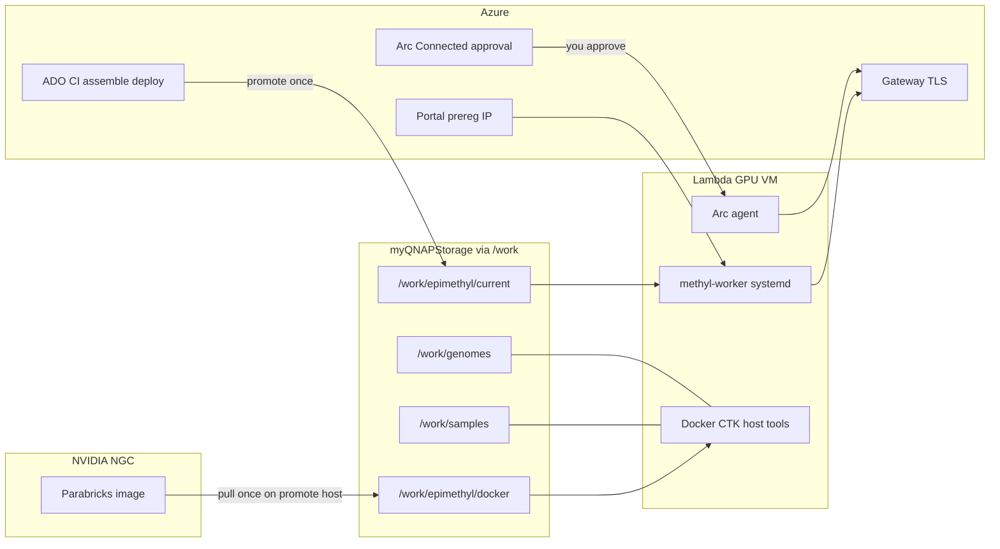

# Lambda worker join — easy, safe, fast

## What we decided before (decoded)

Three stores, not one:

| Store | Holds | Who writes | Workers use it for |
|-------|-------|------------|--------------------|
| **Azure DevOps / Artifacts** | MethylPipeline wheels + runtime-bundle, MethylExtractor arch tarballs, assemble/deploy pipelines | CI on tag + manual assemble/deploy | Source of the **release** that gets promoted to QNAP |
| **myQNAPStorage → `/work`** | `epimethyl/` (current release, venvs, extractor, shared Docker data-root), `genomes/`, `samples/`, `site/`, projects | Deploy pipeline / ops / provision-assets | Day-2 runtime (no git on workers) |
| **NGC (not Azure)** | Clara Parabricks container layers | One promote host with NGC login → `/work/epimethyl/docker` | GPU SamplePrep linear/Giraffe paths |

Azure Arc is **governance + attest** (inventory, policy, `X-Arc-Resource-Id`), **not** where we store containers or release bits, and **not** the enroll API.

Portal prereg + gateway enroll is the **trust join** for claim/submit (IP allowlist → one-time `worker_token`).

## Recommended operating model

**Principle:** Do slow/shared/human-gated work **once**. Make every Lambda VM a **join-only** machine.

### A. Cluster bootstrap (once) — not on every VM

1. Mount QNAP paths: `/work/epimethyl`, `/work/genomes`, `/work/samples`, `/work/site`.
2. GoliathOmics-Release-Assemble + Deploy → `/work/epimethyl/current/manifest.json`.
3. One Parabricks pull into `/work/epimethyl/docker` (NGC; first arch).
4. Genomes/site: Phase 0.

### B. Per worker

1. Portal preregister public IP + `cluster_key` + worker key.
2. Mount `/work`; `preflight_worker_join.sh --require-current` fails closed if release missing.
3. `--prepare-only`: Docker/CTK + host tools; no Arc/enroll.
4. Human-gated Arc Connected + `verify_arc_prereqs.sh`.
5. `--finish-enroll`: gateway enroll + systemd.

## Implementation delivered

| Artifact | Change |
|----------|--------|
| [`docs/deployment/lambda_worker_join.md`](../deployment/lambda_worker_join.md) | Mental model + A/B checklist |
| [`scripts/preflight_worker_join.sh`](../../scripts/preflight_worker_join.sh) | Fail-closed QNAP join checks |
| [`scripts/provision_worker_node.sh`](../../scripts/provision_worker_node.sh) | `--join-mode join\|first`, `--prepare-only`, `--finish-enroll` |
| [`scripts/bootstrap_epimethyl.sh`](../../scripts/bootstrap_epimethyl.sh) | Install Docker/CTK on join; Parabricks pull stays cluster-once |
| [`deploy/terraform/modules/worker-common/main.tf`](../../deploy/terraform/modules/worker-common/main.tf) | Seed → `/opt/methyl`; default prepare-only; no Key Vault worker token |

## Decision: do **not** containerize MethylPipeline / MethylExtractor (like mojo)

Keep CI artifacts — MP wheels + per-arch native MethylExtractor — on shared `/work/epimethyl`. Containers remain for GPU/tool side-cars (Parabricks/NGC, mojo-align, DIA-NN, etc.).

## Out of scope

- Automating QNAP/NFS mount creation (mount remains ops)
- Putting Parabricks/mojo/MP/ME images into Azure Container Registry
- Rebuilding MethylPipeline/MethylExtractor as primary runtime containers
- Building mojo-align in ADO CI
- Replacing Arc approval with fully unattended onboarding (document SP path later)

## Success criteria

- Operator can explain in one page where CI, QNAP, NGC, Arc, and portal each fit
- A new Lambda VM with `/work` mounted and release already promoted becomes a claiming worker via prepare → (Arc approve) → finish-enroll
- Missing QNAP `current` fails immediately with “deploy release first”
- Second worker never re-promotes or re-pulls Parabricks
