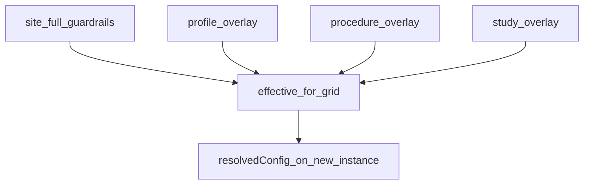

# Layered SamplePrep guardrail editors

> **Status: IMPLEMENTED.** Feature under Epic **AB#413**. EpiPortal Delphi screens stay in the other repo; this repo owns types, SQL twins, seeds, and IA.

## Decision

Two `wf.data_type` documents, not four copies of `AlignmentQCConfig`:

| Type name | Bind | Persist |
|-----------|------|---------|
| `sample_prep_guardrails` | Site grid | **Full** `alignment_qc` + `extraction_qc` slice (no `sample_paths` / `output_dir`) |
| `sample_prep_guardrails_overlay` | Profile, procedure, study grids | **Sparse** diff vs inherited (omit = inherit, JSON `null` = clear) |

Study GET keeps returning `schema_id = study_action_config_overlay` as an alias of the overlay type so existing IA/Delphi wiring does not break.

Do **not** bind [`schemas/config/alignment_qc.schema.json`](../../schemas/config/alignment_qc.schema.json) or `ExtractionQCConfig`.



Inherited merge for overlay editors: site (full) → profile overlay → procedure overlay → study overlay. Analyte fill-missing stays at instance bake (caption on the grid; **not** in SQL GET for v1).

Python `CoreGuardrailsConfig` / `ExtractionQCGuardrailConfig` defaults stay as **fail-closed** if a site slice is still empty during migration. They are no longer the operator-facing source of the published window.

## 1. Types and committed schemas

Extend [`packages/methylutils/methyl_utils/study_action_config.py`](../../packages/methylutils/methyl_utils/study_action_config.py):

- Add `SamplePrepGuardrails` (same keys as overlay, **required** / published-window defaults copied from `CoreGuardrailsConfig` + `ExtractionQCGuardrailConfig`; `extra=forbid`; no identity fields).
- Keep `StudyActionConfigOverlay` as the overlay model; set overlay `SCHEMA_ID` plus `FULL_SCHEMA_ID = "sample_prep_guardrails"`.
- `compose_guardrails(through_layer=...)` parameterized by site / profile / procedure / study.

Registry + export:

- Add `ConfigSchemaSpec` for `sample_prep_guardrails` in [`packages/methylvalidation/methyl_validation/config_schema_registry.py`](../../packages/methylvalidation/methyl_validation/config_schema_registry.py).
- Run [`scripts/export_config_schemas.sh`](../../scripts/export_config_schemas.sh) → `schemas/config/sample_prep_guardrails.schema.json`.
- `$ref` the full type from [`schemas/config/site_manifest.schema.json`](../../schemas/config/site_manifest.schema.json) under `actionConfig` (QC keys only; other site knobs unchanged).
- `$ref` the overlay type from [`schemas/config/profile.schema.json`](../../schemas/config/profile.schema.json) and [`schemas/config/procedure.schema.json`](../../schemas/config/procedure.schema.json) for the QC slice (replace `additionalProperties: true` **only** for `alignment_qc` / `extraction_qc`).

Populate the published window on site fixtures (not on `samd_research.profile.json`):

- [`tools/methyl-config-editor/configs/site_grch38.example.json`](../../tools/methyl-config-editor/configs/site_grch38.example.json)
- [`workflow_engine/domain/profiles/site_grch38.example.json`](../../workflow_engine/domain/profiles/site_grch38.example.json)

## 2. Seed `wf.data_type`

[`workflow_engine/sql_mssql/seed_data_types.py`](../../workflow_engine/sql_mssql/seed_data_types.py) currently seeds `schemas/domain` + `schemas/tasks` only.

- Add `seed_config_types()` for the two guardrail schemas (and `$defs` nested objects).
- Call it from `main()` and from `methyl-cfg sync-actions` / [`workflow_engine/sql_mssql/seed_action_catalog.py`](../../workflow_engine/sql_mssql/seed_action_catalog.py) so both backends get `schema_json` for SchemaPropertyGrid.
- Portal already binds via `portal.sp_get_data_type(name)` ([portal-ia DataType editor](../architecture/portal-ia.md)).

## 3. SQL twins (MSSQL + PG)

Prefer a new twin pair so [`portal_study_ops_api.sql`](../../workflow_engine/sql_pg/portal_study_ops_api.sql) does not grow further:

- [`workflow_engine/sql_mssql/portal_guardrails_editor.sql`](../../workflow_engine/sql_mssql/portal_guardrails_editor.sql)
- [`workflow_engine/sql_pg/portal_guardrails_editor.sql`](../../workflow_engine/sql_pg/portal_guardrails_editor.sql)

List both in [`workflow_engine/sql_mssql/deploy_azure.sh`](../../workflow_engine/sql_mssql/deploy_azure.sh) and [`workflow_engine/sql_pg/deploy_azure.sh`](../../workflow_engine/sql_pg/deploy_azure.sh) immediately after `portal_study_ops_api.sql`. `scripts/check_sql_deploy_twins.py` must stay green.

Reuse existing helpers (`fn_json(b)_deep_merge`, `fn_json(b)_sparse_diff`, `fn_json(b)_guardrail_slice`) already in `portal_study_ops_api.sql`. Add parameterized inherited compose:

| Proc | Persist |
|------|---------|
| `portal.sp_get/set_site_guardrails_editor` | Replace QC slice with **full** edited document; reject partial core window; preserve other `actionConfig` |
| `portal.sp_get/set_profile_guardrails_editor` | Sparse vs site; SET upserts a draft version |
| `portal.sp_get/set_assay_procedure_guardrails_editor` | Sparse vs site+profile; SET upserts a draft version |
| `portal.sp_get/set_study_guardrails_editor` | Keep; inherited now includes full site numbers; `schema_id` stays `study_action_config_overlay` |

Overlay GET columns (match study): `schema_id`, `inherited_guardrails`, `<layer>_guardrail_overlay`, `effective_guardrails`, plus identity captions (site name / profile / procedure). Profile/procedure GET also return `version` / `status` so the UI can publish the draft.

Site GET: `schema_id = sample_prep_guardrails`, `effective_guardrails` = stored full slice (no sparse overlay column required).

Portal façades missing today (list/get only):

- `portal.sp_upsert/publish_pipeline_profile`
- `portal.sp_upsert/publish_assay_procedure`

Wrap `cfg.cfg_repo_upsert` / `cfg.cfg_repo_publish` in [`cfg_process_pack_catalog.sql`](../../workflow_engine/sql_pg/cfg_process_pack_catalog.sql) (MSSQL twin). Profile/procedure SET editors upsert a **new version** (or draft) then the UI calls publish; do not mutate the in-use published row in place.

Contract: add all new objects to [`workflow_engine/contract/db_objects.yaml`](../../workflow_engine/contract/db_objects.yaml) and the table in [`workflow_engine/contract/db_objects.md`](../../workflow_engine/contract/db_objects.md).

## 4. Tests

- Python: full model has published-window numbers; overlay has `null` defaults; identity fields forbidden; `sparse_overlay_diff` round-trip; site persist-full vs profile sparse; extend [`packages/methylutils/tests/test_study_action_config.py`](../../packages/methylutils/tests/test_study_action_config.py).
- SQL static: [`workflow_engine/tests/test_layered_guardrails_editor_sql.py`](../../workflow_engine/tests/test_layered_guardrails_editor_sql.py) so both backends define the four GET/SET pairs, profile/procedure upsert, and site SET does **not** call `sparse_diff`.
- Schema export pytest already in [`packages/methylvalidation/tests/test_config_schema_export.py`](../../packages/methylvalidation/tests/test_config_schema_export.py).

## 5. Deploy and MCP verification (both databases)

**Scripts (apply DDL, do not paste large CREATE via MCP):**

```bash
source .venv/bin/activate
./scripts/export_config_schemas.sh
./workflow_engine/sql_mssql/deploy_azure.sh   # after AZURE_SQL_* env
./workflow_engine/sql_pg/deploy_azure.sh
PYTHONPATH=workflow_engine:workers python workflow_engine/sql_mssql/seed_data_types.py --backend mssql
PYTHONPATH=workflow_engine:workers python workflow_engine/sql_mssql/seed_data_types.py --backend postgres
```

**Azure SQL MCP** (`user-azure-sql-dev`): `mcp_SQL_discover` / `mcp_SQL_procedure_details` for each `portal.sp_*guardrails*` and `sp_upsert_pipeline_profile`; `mcp_SQL_execute_query` smoke:

- `SELECT name, schema_json IS NOT NULL FROM wf.data_type WHERE name IN ('sample_prep_guardrails','sample_prep_guardrails_overlay','study_action_config_overlay')` (exact column names from `mcp_SQL_table_details` on `wf.data_type`).
- `EXEC portal.sp_get_site_guardrails_editor` / study GET on a known id if present.

**PostgreSQL MCP** (`user-pgsql-dev`): `pgsql_list_connection_profiles` → `pgsql_connect` → `pgsql_query` the same checks (`pg_proc` / `wf.data_type` / `SELECT * FROM portal.sp_get_site_guardrails_editor(...)`).

If a live site row lacks the full QC slice, upsert from the updated `site_grch38.example.json` via existing `portal.sp_upsert_site` then GET again.

## 6. Documentation

- [`docs/architecture/portal-ia.md`](../architecture/portal-ia.md): four screens (Platform Site / Profile / Procedure + Studies Guardrails); two `schema_id`s; site = full persist; others = effective-in / sparse-out; caption + deep-link; study grid must not POST to shared layers; RBAC (sysadmin site, platform admin packs, study lead overlay).
- [`docs/canvas/portal-ia.canvas.tsx`](../canvas/portal-ia.canvas.tsx): add the three Platform editor leaves.
- [`docs/usage/03-sample-prep-and-qc.md`](../usage/03-sample-prep-and-qc.md): published window lives on **site**; profile/procedure/study only pin diffs.
- [`docs/architecture/config-registry.md`](../architecture/config-registry.md) + [`docs/ANALYTE_PROFILES.md`](../ANALYTE_PROFILES.md): site owns core window; analyte packs still fill-missing at bake.
- [`tools/methyl-config-editor/README.md`](../../tools/methyl-config-editor/README.md): bind overlay vs full type.
- [`AGENTS.md`](../../AGENTS.md) / config-not-code: example for `alignment_qc.core_guardrails` on site, not Python.

Out of scope: Delphi grid implementation; `cfg.*.document_type_id` FKs; putting analyte packs into SQL inherited merge; deleting `CoreGuardrailsConfig` defaults in the same change.

## Important files

- [`packages/methylutils/methyl_utils/study_action_config.py`](../../packages/methylutils/methyl_utils/study_action_config.py) — models + compose/diff
- [`workflow_engine/sql_mssql/portal_study_ops_api.sql`](../../workflow_engine/sql_mssql/portal_study_ops_api.sql) / PG twin — existing slice/merge (reuse)
- New `portal_guardrails_editor.sql` twins + `cfg_process_pack_catalog.sql` upsert/publish
- [`workflow_engine/sql_mssql/seed_data_types.py`](../../workflow_engine/sql_mssql/seed_data_types.py)
- [`docs/architecture/portal-ia.md`](../architecture/portal-ia.md)
