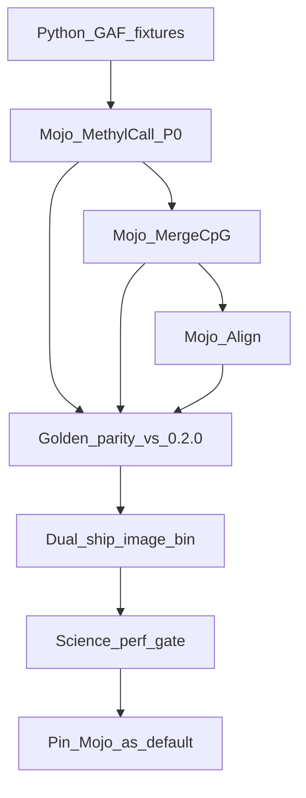

# methylGrapher-mojo cutover (performance successor)

## Defaults (locked)

- **Primary code**: `/home/ubuntu/mojo-align` (package monorepo: `gpu-common/`, `fq2bam-meth/`, `giraffe/`, `methylgrapher/`). Legacy `/home/ubuntu/methylGrapher-mojo` is rollback-only. MethylPipeline gets contracts, dual-ship hooks, and this plan; the in-container prefix remains `/opt/methylgrapher-mojo`.
- **Slice order**: **MethylCall-first** against existing Python GAFs under `/work/samples/*/pangenome_wgbs/`, then **MergeCpG**, then **Align**, then image dual-ship. PrepareGenome assets already on QNAP are reused.
- **Toolchain**: Pixi + Modular `modular` package (Mojo 1.0) on this aarch64 host. Python interop for subprocess / GFA bridge acceptable until native Mojo I/O stabilizes.
- **Architecture**: Mojo 1.0 CLI + patched Python `engine/` (GAF header skip, single GFA worker) + native Mojo `mcall_core` helpers; dual-ship via `engine: python|mojo` and image tag `:1.70-mojo`.

## What MethylPipeline needs from the binary

From [`workers/methyl_worker/methylgrapher_wgbs_runner.py`](../../workers/methyl_worker/methylgrapher_wgbs_runner.py):

| Command | Required args | Contract |
|---------|---------------|----------|
| `Align` | `-t -work_dir -index_prefix -fq1 -fq2 -directional` | Non-empty GAF under `work_dir` |
| `MethylCall` | `-t -work_dir -index_prefix -cg_only [-batch_size]` | Reads `work_dir/alignment.gaf`; uses `{index_prefix}.wl.gfa` + `.wl.node.replacement.json` |
| `MergeCpG` | `-work_dir -index_prefix` | Writes `work_dir/graph.cpg.tsv` |

## Phase 0 — Bootstrap

1. Install Mojo via pixi/`modular` on Grace; confirm help/vg_check.
2. Vendor Python 0.2.0 into `python_reference/`.
3. Tiny fixtures under `tests/data/`.
4. This plan file + README mapping under Epic AB#413.

## Phase 1 — MethylCall scientific parity (P0)

Port / patch MethylCall: cs/os/rc/bq tags, indels, node.replacement, pair filters, GAF header skip, merge → `graph.methyl`. Parity vs Python 0.2.0 on DS20M GAF. Then single-GFA parallel workers + benchmark `-t 8/16`.

## Phase 2 — MergeCpG + Align

`graph.cpg.tsv` contract; Align FASTQ convert → vg giraffe → GAF merge. ConversionRate deferred unless spike-in canary needs it.

## Phase 3 — MethylPipeline dual-ship

- `MethylGrapherWgbsStepConfig.engine`: `"python"|"mojo"` (default `python`).
- Image tag `epimethyl/methylgrapher:1.70-mojo`.
- Smoke + canary with `engine=mojo`.

## Phase 4 — Cutover

Flip profile/image pin only after science + perf gate; keep Python rollback; loosen `_METHYLCALL_THREAD_CAP` after Mojo proves no dual-GFA cliff.

## Out of scope

- Long-read path; replacing MethylExtractor; re-PrepareGenome; moving QC BAM/H5 into Mojo.

## Success criteria

- Toy + DS20M MethylCall/MergeCpG parity vs 0.2.0
- Measurable MethylCall speedup / no worse RAM
- Dual-ship image on 64K ARM64; SamplePrep extract with `engine=mojo`
- Default remains Python until operator flip
