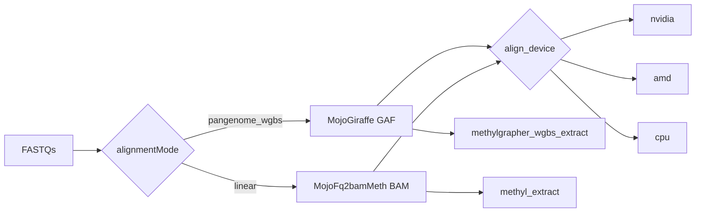

# Mojo multi-GPU dual Align (pangenome + linear)

## Why both

- **Science / ops preferred path:** `alignmentMode=pangenome_wgbs` (Mojo Giraffe → GAF → MethylCall). Already on GH200; AMD stubs exist in mojo-align `giraffe/src/giraffe_device.mojo` / `giraffe_gpu_kernels.mojo`.
- **Political / legacy path:** `alignmentMode=linear` today = NVIDIA-only Clara Parabricks `fq2bam_meth`. Leadership may force this; without a Mojo linear aligner, leaving Lambda means losing linear GPU Align or staying CUDA-locked.
- **Leverage:** ship **both** under one portable device contract (`cpu|nvidia|amd|auto`) so switching modes is profile/site `actionConfig`, not a vendor rewrite.

## Honest accelerator scope

| Target | Near-term | Notes |
|--------|-----------|--------|
| NVIDIA (CUDA) | Yes | GH200 path live today |
| AMD (ROCm / Instinct MI300-class) | Phase 1–2 | Mojo GA for AMD; fill kernels + bakeoff |
| Google Cloud NVIDIA/AMD VMs | Yes via above | Same images; no special “Google GPU” backend |
| Google TPU | **Out of scope** | Mojo GPU surface today is NVIDIA / AMD / Apple Metal — not TPU |

Do **not** promise TPU in operator docs; promise **vendor-portable GPU Align via Mojo** (NVIDIA + AMD + CPU fallback).

## Phase 0 — Contracts and messaging

- This plan file + leadership one-pager [`docs/architecture/mojo-multi-gpu-dual-align.md`](../architecture/mojo-multi-gpu-dual-align.md).
- Production default remains **`buffy_wgbs_pangenome_gene_fc`**; linear via `buffy_wgbs_linear_gene_fc` / plasma packs.
- Shared device vocabulary: `giraffe_device` / `align_device`: `auto|cpu|nvidia|amd` via `resolvedConfig`.

## Phase 1 — ROCm-harden Mojo Giraffe

Dual image tags `:1.70-mojo-cuda` / `:1.70-mojo-rocm`; site selects `actionConfig.methylgrapher_wgbs.image`. Gates: toy + Buffy wall + DS20M parity vs NVIDIA Mojo.

## Phase 2 — Mojo linear fq2bam_meth

`actionConfig.parabricks.engine=mojo|parabricks` on capability `parabricks.fq2bam`. MVP BAM + QC fields inventoried in [`docs/reference/mojo-fq2bam-meth-parity.md`](../reference/mojo-fq2bam-meth-parity.md). Rollback: `engine=parabricks`.

## Phase 3 — Flexibility productization

Procedure packs pin `align_device=auto`; side-by-side canary script for stakeholder demos.

## What we will not do

- Full Clara feature surface (every Picard metric / BQSR).
- Promise Google TPU until Modular exposes a target.
- Encode SKU magic numbers in Python.
