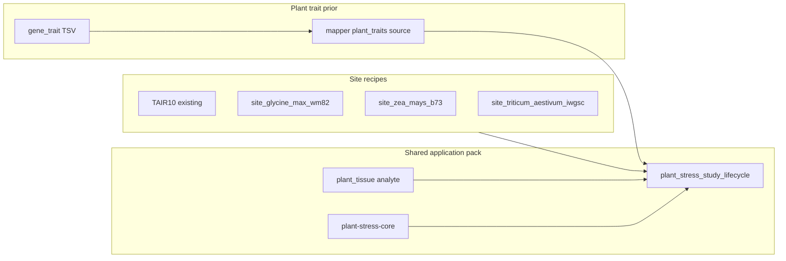

# Multi-crop plant sites + plant trait priors

## Decisions locked

| Topic | Choice |
|-------|--------|
| Crops in this wave | **Soybean (Wm82 / *Glycine max*)**, **maize (B73 / *Zea mays*)**, **wheat (IWGSC RefSeq / *Triticum aestivum*)** — same Ensembl Plants release family as TAIR10 (release-58 pins) |
| Open Targets | **Do not enable** for plant packs — Platform is human therapeutic targets only. Replace the deferred “OpenTargets for plants” item with a **plant trait prior** seam |
| Trait prior source | Offline / config-driven **gene↔trait association TSV** (drought / abiotic stress terms) loaded by the mapper when `enrich_source` includes a new `plant_traits` token; seed a small committed Arabidopsis drought demo table + document how operators add SoyBase / MaizeGDB / WheatIS extracts |
| Still deferred | Grafting; plant cell-type deconvolution atlases; epi-GBS modality; ag SaMD pivotal ladder |

## Delivered

### 1. Crop site examples + download scripts

| Crop | Site example | Script | STRING taxon |
|------|--------------|--------|--------------|
| Soybean | `site_glycine_max_wm82.example.json` | `scripts/download_glycine_max_wm82.sh` | `3847` |
| Maize | `site_zea_mays_b73.example.json` | `scripts/download_zea_mays_b73.sh` | `4577` |
| Wheat | `site_triticum_aestivum_iwgsc.example.json` | `scripts/download_triticum_aestivum_iwgsc.sh` | `4565` |

### 2. Application-pack crop overlays

Under `docs/examples/samd/plant-abiotic-stress/`: per-crop project manifests + context overlays; ch.23 / pack README updated.

### 3. Plant trait prior

- `enrich_source=plant_traits` + `plant_traits_path` on `MapperStepConfig` / CLI / `BedtoolsMapper`
- `PlantTraitEnricher` joins offline TSV into existing `disease_*` columns (`source=plant_traits`)
- Demo: `data/arabidopsis_drought_gene_traits.tsv`; Arabidopsis overlay enables it
- Schema export: `schemas/config/mapper.schema.json`

### 4. CI + docs

- Crop smoke manifests under `workflow_engine/domain/checks/plant_abiotic_stress/`
- Extended `test_plant_abiotic_stress_pack.py` + mapper unit tests
- Regulatory roadmap, ch.24, ANALYTE_PROFILES, historical plant pack plan note

## Explicitly still deferred

- Graft / trait-introgression pack
- Plant cell-type deconvolution atlases
- epi-GBS / new aligners
- SaMD pivotal / clinical claim ladder for agriculture
