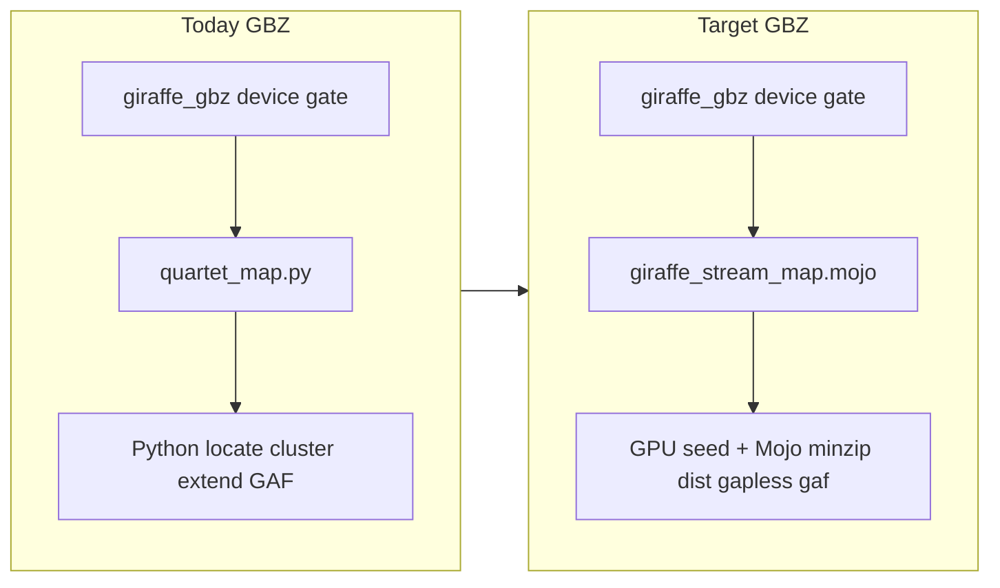

# Native Mojo Align Hotpath (≤2h pangenome + faster-than-Clara linear)

## Context

- Fleet already has `:1.70-mojo` with GPU gate/warmup (`36686778` / OCI manifest `a8286ef4`) on all four GH200s.
- **Bottleneck:** production `pangenome_wgbs` still does locate→cluster→extend→GAF in Python [`engine/quartet_map.py`](/home/ubuntu/methylGrapher-mojo/engine/quartet_map.py) (~75% wall in `cluster_extend`). Mojo [`giraffe_gbz.mojo`](/home/ubuntu/methylGrapher-mojo/src/giraffe_gbz.mojo) only gates device, warms GPU, then calls that streamer.
- **Linear:** native mapper exists ([`src/linear_*.mojo`](/home/ubuntu/methylGrapher-mojo/src/)), but DeviceContext seed is still largely probe/warmup; Clara wall gate PENDING.
- **Scale:** ~238 Aligns pending + ~500 inbound ⇒ must not cut fleet over until Buffy ≤~2h **and** DS20M MethylCall parity pass. In-flight instance 59 keeps current image until the new digest is proven.

## Decisions (locked)

| Item | Choice |
|------|--------|
| Scope | Hot-path rewrite first; fleet image + gates after green smoke |
| Pangenome SLA | Full Buffy dual-map (C2T∥G2A) ≤ **~2 h** wall on GH200 |
| Linear SLA | Mojo wall **strictly &lt; Clara** `pbrun fq2bam_meth` on same sample/SKU (not ±10%) |
| Science | DS20M `graph.methyl` parity vs `cpu_vg`; PE `ri`/`os`/`rc`; keep named-coordinates GAF contract |
| Cutover | New image digest only after gates; sisters `enable_fleet_mojo_align.sh`; no DomainProgram topology change |
| Fallback | Bakeoff/fleet: `METHYLGRAPHER_GPU_REQUIRE=1`; `gpu_giraffe_fallback=mojo` (no silent multi-hour `vg`) |

## Phase A — Native Mojo GBZ stream map (methylGrapher-mojo)

Replace the production call in `map_gbz_native` so it **does not** import `engine.quartet_map` for the hot loop.

1. **Add streaming Mojo mapper** (new module e.g. `src/giraffe_stream_map.mojo`):
   - Stream FASTQ batches (reuse batch size semantics of `METHYLGRAPHER_MOJO_READ_BATCH`; never full-file Mojo load).
   - Batch minimizer / seed on DeviceContext (`giraffe_gpu_kernels`) — hashes must feed extend (no discard-after-count).
   - Locate via Mojo `.min` path ([`giraffe_minzip.mojo`](/home/ubuntu/methylGrapher-mojo/src/giraffe_minzip.mojo)); cluster via [`giraffe_dist.mojo`](/home/ubuntu/methylGrapher-mojo/src/giraffe_dist.mojo).
   - Extend via [`gapless_extend_native`](/home/ubuntu/methylGrapher-mojo/src/giraffe_gapless.mojo) (remove Python `_gapless_extend` from production).
   - Stream GAF emit ([`giraffe_gaf_emit.mojo`](/home/ubuntu/methylGrapher-mojo/src/giraffe_gaf_emit.mojo)); PE primary tags `ri`/`os`/`rc`; aim for vg-compatible `-M 2` multimapping enough for MethylCall.
2. **Retarget** [`giraffe_gbz.mojo`](/home/ubuntu/methylGrapher-mojo/src/giraffe_gbz.mojo) `map_gbz_native` → stream mapper; keep dense-pack ensure; fail closed if pack/device missing.
3. **Demote** `engine/quartet_map.py` to reference/oracle for parity tests only (not production Align).
4. **Stage timers** stay (`METHYLGRAPHER_PROFILE_STAGES`) so bakeoffs show seed / locate / cluster_extend / gaf_emit shares.
5. **Tests:** toy GBZ PE golden; known-mapped Buffy C2T subset (13/13 today); smoke that production path logs Mojo stages with **no** `quartet_map seed_backend=` / Python extend.

Update [`docs/GIRAFFE_SPEC.md`](/home/ubuntu/methylGrapher-mojo/docs/GIRAFFE_SPEC.md) / README status row to match (GBZ = native stream, not Python).

## Phase B — Linear faster than Clara (methylGrapher-mojo)

1. Make [`linear_gpu_kernels`](/home/ubuntu/methylGrapher-mojo/src/linear_gpu_kernels.mojo) seeds the actual input to [`extend_read_with_seeds`](/home/ubuntu/methylGrapher-mojo/src/linear_extend.mojo) (same fail-closed DeviceContext rules as Giraffe).
2. Tune streaming (`METHYLGRAPHER_LINEAR_READ_BATCH`), index cache, fused BS convert on-mapper path; keep Python only for convert orchestration / samtools / QC JSON in [`engine/fq2bam_meth.py`](/home/ubuntu/methylGrapher-mojo/engine/fq2bam_meth.py).
3. Bakeoff: [`scripts/benchmark_clara_fq2bam_meth.sh`](/home/ubuntu/methylGrapher-mojo/scripts/benchmark_clara_fq2bam_meth.sh) + MethylPipeline [`scripts/compare_mojo_fq2bam_vs_clara.py`](/home/ubuntu/MethylPipeline/scripts/compare_mojo_fq2bam_vs_clara.py) gates (flagstat Δ, CpG Spearman) **plus** wall **Mojo &lt; Clara**.
4. Fleet linear procedure already exists: `buffy_wgbs_linear_mojo_gene_fc` (`parabricks.engine=mojo`). Flip site/procedure only after gate.

## Phase C — Image, site bake, fleet (MethylPipeline)

1. Rebuild `:1.70-mojo` via [`scripts/build_methylgrapher_mojo_image.sh`](/home/ubuntu/MethylPipeline/scripts/build_methylgrapher_mojo_image.sh); write NFS tar + update [`/work/epimethyl/images/methylgrapher-1.70-mojo.image_id`](/work/epimethyl/images/methylgrapher-1.70-mojo.image_id) (document both config + OCI manifest digests to avoid sister confusion).
2. Harden [`enable_fleet_mojo_align.sh`](/work/epimethyl/images/enable_fleet_mojo_align.sh) expected-id check to accept config **or** OCI manifest digest from the tar.
3. Confirm C2T/G2A dense packs under `/work/cache/mojo_segments/` (already ~145M nodes); rebuild only if stream mapper needs pack format changes.
4. Site `actionConfig.methylgrapher_wgbs`: keep `align_engine=gpu_giraffe`, `gpu_giraffe_fallback=mojo`, image pin to new digest; `METHYLGRAPHER_GPU_REQUIRE` already baked in runner.
5. Sisters: `bash /work/epimethyl/images/enable_fleet_mojo_align.sh` after digest lands (no SQL restore on sisters).

## Phase D — Science + wall gates (block cutover)

| Gate | Pass |
|------|------|
| Toy GBZ PE golden | Bit/tag parity vs current oracle |
| Buffy-subset mapped reads | ≥ current 13/13 |
| DS20M `graph.methyl` vs `cpu_vg` | Existing `parity_compare.py` thresholds |
| Full Buffy dual-map | ≤ ~2 h wall (C2T∥G2A) on GH200 |
| Linear vs Clara | Mojo wall &lt; Clara; concordance gates green |
| methyl_qc | Pass on Mojo QC BAM + ConversionRate path |

Only then: requeue / continue Align for remaining + inbound ~500 on all four workers. Do **not** start the 500-sample wave on Python `quartet_map`.

## Phase E — Ops for 738-scale

- One Align per GPU worker (current omnibus); four GH200s ⇒ ~4 concurrent dual-maps.
- At ≤2 h/sample ⇒ ~6 samples/worker/day ⇒ ~24/day fleet; 738 ≈ **~31 GPU-days** — plan wave scheduling / reclaim hygiene (already have `methyl-reclaim-leases`).
- Monitor first new-digest Align: GPU mem ~index resident, stage timer shares, no `vg_autoscale` fallback.

## Out of scope

- DomainProgram topology changes (already branches on `useWgbsPangenome`).
- Parabricks Giraffe for WGBS GAF (Phase 0 NO-GO).
- Changing study manifests / encoding science knobs in Python.
