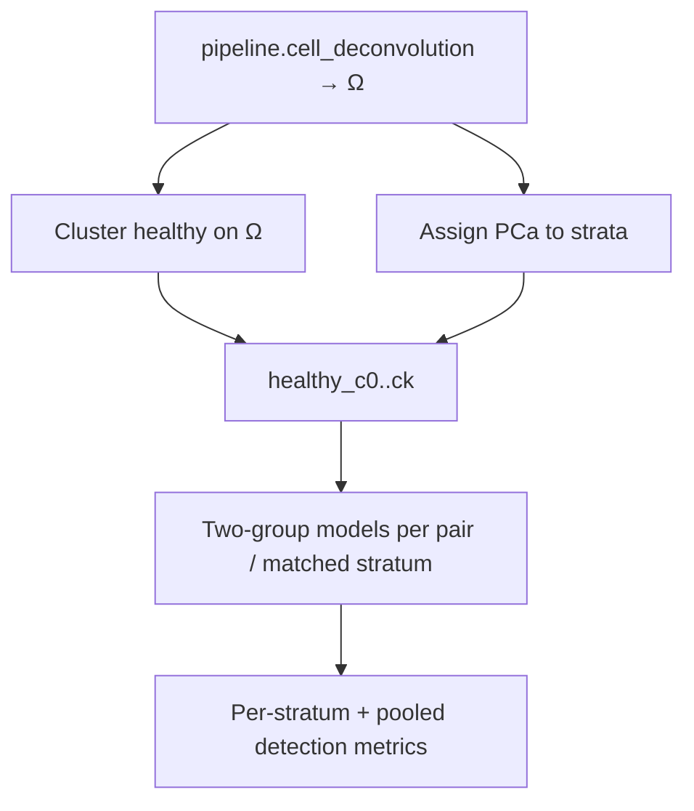

# Ω-cluster cancer detection (research first)

## Does it make sense?

**Yes**, as a *heterogeneity reduction* strategy consistent with buffy-coat biology in [`docs/research/BuffyCoat_vs_cfDNA_for_Cancer_Detection.md`](../research/BuffyCoat_vs_cfDNA_for_Cancer_Detection.md):

- Buffy signal is largely **host immune / leukocyte composition**, not tumor DNA.
- CellDeconv Ω (6 cell types) is a low-dimensional summary of that composition.
- Baseline set-points → multiple healthy clusters; disease may sit as shifts within those set-points.
- A single `healthy vs PCa` model mixes set-points and can dilute stratum-specific signatures.

**Default design (locked):** research analysis first; compare (A) matched-stratum and (B) all-pairs; recommend one for later pipeline work. No new DomainProgram until metrics justify it.

## Delivered

| Artifact | Path |
|----------|------|
| Analysis module | `packages/methyldeconv/methyl_deconv/analysis/omega_cluster.py` |
| CLI | `methyl-omega-cluster` / `scripts/omega_cluster_detection.py` |
| Tests | `packages/methyldeconv/tests/test_omega_cluster.py` |
| Research note | [`docs/research/omega-cluster-detection.md`](../research/omega-cluster-detection.md) |

## Buffy gate outcome

Matched-stratum can beat baseline on a single seed (e.g. BA 0.72 vs 0.63) but typically with **one** usable stratum. Multi-seed sensitivity never set `pipeline_follow_on_justified`. Prefer matched-stratum as the *pairing rule*; **defer** Ω→cohort leaves until the gate passes.

## Later pipeline (only if research wins)

If routed matched-stratum beats baseline with ≥2 stable strata:

- Emit Ω-derived leaves into study groups (same shape as existing subcluster leaves).
- Expand comparisons with matched-stratum pairs only.
- Reuse existing centroid/detector/ECDF+covariates MC.

## Out of scope

- Changing Houseman / FlowSorted math
- Disease–disease differential discovery as a detection claim
- Auto-enabling in SaMD production profiles without the research gate
