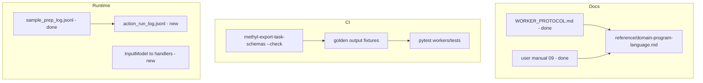

# Optional Observability Follow-ups

The core plan (CLI manifests, typed handlers, collector tests) is **already implemented** — 98 worker tests pass and `methyl-export-task-schemas --check` is green. These four items were explicitly marked out of scope; below is what each entails and a sensible implementation order.



---

## 1. `docs/reference/domain-program-language.md` — result_code section

**Gap:** [`docs/reference/domain-program-language.md`](../reference/domain-program-language.md) documents IF on boolean scope vars (`qcPass`, `runDmpSelection`) but not integer **`result_code`** branching. [`workers/WORKER_PROTOCOL.md`](../../workers/WORKER_PROTOCOL.md) and [`docs/usage/09-artifacts-and-qa-checks.qmd`](../usage/10-artifacts-and-qa-checks.md) already cover worker/operator view.

**Add (~40 lines) after the "Conditions (IF)" section:**

- **Semantics:** `node_execution.result_code` from worker submit; engine reads via `wf_try_task_result_code(instance, nodeKey)` for IF/SWITCH (same table as WORKER_PROTOCOL: `<0` fail, `0` default/false, `1` true, `2+` multi-way).
- **Two branching styles in DomainProgram:**
  - **Boolean scope bindings** (existing): e.g. `sample.methyl_qc` → `qcPass`, `remediateAlignment` (see [`schemas/actions/catalog.json`](../../schemas/actions/catalog.json) `output_bindings`).
  - **Integer result_code** (new doc): use when programs need explicit SWITCH on worker branch codes (e.g. methyl_qc `0/1/2` without duplicating guardrail logic).
- **Example program snippet** for remediation loop using `${remediateAlignment}` (matches [`workflow_engine/domain/fixtures/sample_prep.program.json`](../../workflow_engine/domain/fixtures/sample_prep.program.json)) plus optional SWITCH example on numeric code.
- **Cross-links** to WORKER_PROTOCOL and user manual § observability; mention `.action_results/` manifests briefly (author doesn't write them, but may inspect `/work`).

**Effort:** Small, docs-only.

---

## 2. CI golden-fixture test per catalog action

**Gap:** [`methyl-export-task-schemas --check`](../../workers/methyl_worker/task_schema_export.py) proves Pydantic → JSON Schema drift only. There is **no** committed example payload per action validated end-to-end. Worker tests exist per-handler but not catalog-wide. [`.github/workflows/db-parity.yml`](.github/workflows/db-parity.yml) does **not** run `pytest workers/tests/` today.

**Recommended approach (output-only goldens, not full handler runs):**

| Piece | Location | Purpose |
|-------|----------|---------|
| Golden outputs | `workers/tests/golden/{action_name}.output.json` (34 files, dots → underscores) | Minimal **valid** example `output_json` per catalog entry |
| Parametrized test | `workers/tests/test_golden_task_outputs.py` | For each `TaskSchemaSpec` in [`task_schema_registry.py`](../../workers/methyl_worker/task_schema_registry.py): load golden → `OutputModel.model_validate()` |
| Optional input goldens | `workers/tests/golden/{action_name}.input.json` | Same for `InputModel` (catches forbid-extra regressions) |
| CI step | Extend `db-parity.yml` (already watches `workers/**`) | `source .venv/bin/activate && pip install -e workers/ ... && pytest workers/tests/ -q && methyl-export-task-schemas --check` |

**Fixture authoring strategy:**

- Start from `OutputModel.model_json_schema()` / a one-liner factory script (`scripts/generate_golden_fixtures.py`) that emits skeleton JSON, then hand-tune required nested fields (e.g. `MethylQcTaskOutput.guardrails`, `ValidationStabilityOutput.summary`).
- Keep fixtures **minimal** — only fields required by `extra="forbid"` models plus one representative optional field where useful.
- For CLI-only pipeline actions, goldens mirror manifest/collector field sets (same as [`DetectorTaskOutput`](../../workers/methyl_worker/task_models/pipeline_models.py), etc.).

**Out of scope for this item:** running real CLIs or mocked handlers for all 34 actions (too heavy; keep existing targeted handler tests).

**Effort:** Medium (34×2 files if inputs included, ~1 parametrized test module, CI wiring).

---

## 3. `action_run_log.jsonl` for MC run dirs

**Gap:** Sample prep has [`sample_prep_log.py`](../../workers/methyl_worker/sample_prep_log.py) → `{sampleDir}/{sampleId}.sample_prep_log.jsonl`. Validation/MC actions write artifacts under `{monteCarloRunsRoot}` / `{runDir}` but **no unified timeline**.

**Design (mirror sample prep):**

```python
# workers/methyl_worker/action_run_log.py (new)
def action_run_log_path(mc_root: Path) -> Path:
    return mc_root / "action_run_log.jsonl"

def append_action_run_log(mc_root, *, action, capability, result_code, inputs, outputs, run_dir=None, ...):
    # same record shape as sample_prep_log: ts_utc, action, capability, result_code, inputs, outputs
```

**Hook point (central, not per-handler):** in [`execute_task()`](../../workers/methyl_worker/handlers.py) after successful `ActionExecutionResult`, when `entry.category == "validation"` (from [`action_catalog.py`](../../workers/methyl_worker/action_catalog.py)):

1. Resolve log root via existing `_resolve_monte_carlo_runs_root(input_json)` (fallback: `input_json.runDir` parent).
2. Append one JSONL line with trimmed `result.output.model_dump(mode="json")` in `outputs`.
3. Never fail the action if log append fails (try/except + debug log, same as CLI manifests).

**Also log:** `validation.prepare_freeze`, `validation.stability`, `validation.model_mc`, etc. — all validation-category entries (~14 actions).

**Docs:** one bullet in WORKER_PROTOCOL + user manual 09 (parallel to sample_prep_log bullet).

**Effort:** Small–medium (one helper + one hook + 1–2 tests with tmp_path).

---

## 4. Pass validated `InputModel` directly to handlers

**Gap:** [`InProcessCallable`](../../workers/methyl_worker/actions/base.py) is already typed as `(str, str, BaseModel) -> BaseModel`, but [`InProcessAction.execute()`](../../workers/methyl_worker/actions/base.py) still calls `input_model.model_dump(mode="json")` and all handlers take `Dict[str, Any]` with ~100 `.get()` calls.

**Migration steps:**

1. Change handler signature to `(capability: str, action_name: str, input: BaseModel) -> BaseModel`.
2. **`InProcessAction`:** pass `input_model` directly; remove `model_dump` on input path.
3. **Per handler:** either use typed fields (`task.sampleDir`) or a single line `payload = input.model_dump(mode="json")` at the top for helpers that still expect dicts (`_resolve_monte_carlo_runs_root`, `run_fastp_trim`, archive helpers). Prefer typed access for new/edited code.
4. Update [`_handle_stub_external`](../../workers/methyl_worker/handlers.py) and stub path in `execute_task`.
5. Narrow shared helpers to accept `Mapping[str, Any]` from `input.model_dump()` at call sites (minimal churn).

**Do not change:** CLI `CliAction` (still uses dict for argv building); `validate_input()` stays the single validation gate.

**Tests:** existing handler tests keep passing; add one test asserting handlers receive the validated model type (e.g. `DownloadFastqTaskInput` instance, not dict).

**Effort:** Medium (mechanical, ~24 handlers + helpers; low behavioral risk if helpers keep dict adapter at boundary).

---

## Recommended order

| Order | Item | Rationale |
|-------|------|-----------|
| 1 | DomainProgram result_code docs | Zero code risk; completes author doc triangle |
| 2 | CI golden fixtures + worker pytest in CI | Locks schema contract before refactors |
| 3 | MC `action_run_log.jsonl` | Independent runtime feature |
| 4 | InputModel to handlers | Largest touch surface; do after CI guardrails |

---

## Verification (all items)

```bash
source .venv/bin/activate
pytest workers/tests/ -q
methyl-export-task-schemas --check
```

After doc changes: spot-check DomainProgram examples compile (optional: `methyl-workflow-run --program ... --stub-external` on sample_prep fixture).
