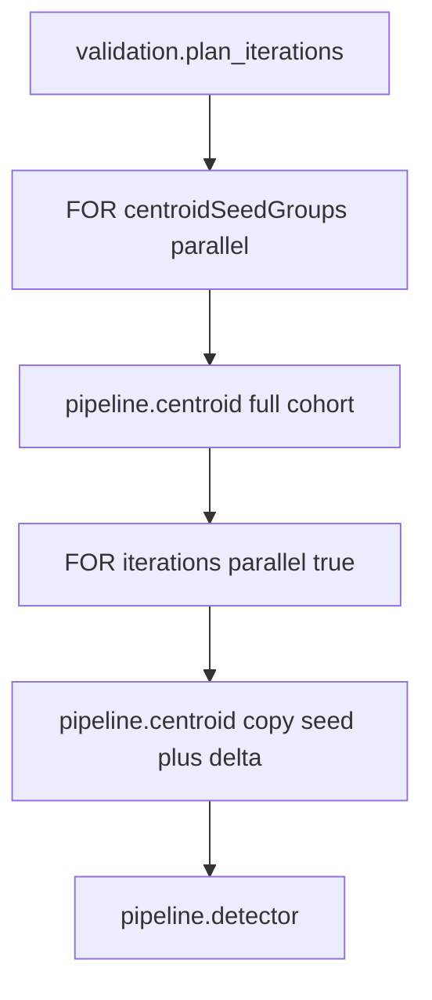

# Parallel MC centroid seed (schemas + DB propagation)

## Problem

Today [`workflow_planner.py`](packages/methylvalidation/methyl_validation/workflow_planner.py) chains iterations via `previous_train_by_label` and `prepare_incremental_centroid_baseline(previous_run_dir, …)`. MC DomainPrograms set `"parallel": false` on the outer `iterations` FOR loop ([`mc_stability_staged.program.json`](workflow_engine/domain/fixtures/mc_stability_staged.program.json)) because parallel workers would race on incomplete centroids copied from the prior run.

**Target behavior (engine-agnostic):** `validation.plan_iterations` materializes a **shared per-group seed** once, then each iteration applies cohort-relative deltas (`removeSamples = full_cohort \ train`) by copying that seed into the run’s `centroidDir` before `methyl-centroid` runs.



## Schema / contract layers (what changes where)

| Layer | Artifact | Change |
|-------|----------|--------|
| Planner output | `ValidationPlanContext` | New top-level `centroidSeedGroups[]`; per-iteration `centroidGroups[]` gains `centroidSeedDir`; deltas vs **full cohort**, not previous iteration |
| Worker input | `CentroidTaskInput` | Add optional `addSamples`, `removeSamples`, `centroidSeedDir` (wire fields currently in templates but **stripped** by strict validation — must be first-class) |
| Worker output | `ValidationPlanTaskOutput` | Emit **full** planner payloads (not stripped `ValidationIterationRef`) + `centroidSeedGroups` |
| Action catalog | `_DE_PLAN_ITERATIONS` | Add `scope_bindings`: `("centroidSeedGroups", "$.centroidSeedGroups")`; keep `iterations` binding |
| Queue | `DiscoveryRunTaskV1` | Optional `centroid_seed_root` or per-group seed paths for `plan-runs` / `run-task` |
| Domain | `methyldomain` | `CentroidSeedGroup` (+ reuse `MethylGroup` where appropriate) as tagged types in `schemas/domain/` — required, not opaque JSON |
| JSON schemas | `schemas/tasks/*.schema.json`, `schemas/actions/catalog.json` | Regenerated via export CLIs |
| DB — catalog | `wf.workflow_action`, `wf.workflow_action_schema` | Re-seed both dialects (no DDL) |
| DB — workflows | `wf.workflow_def` / `wf.workflow_version` / nodes / `wf.variable_output_binding` | Deploy **new compiled** MC/lifecycle programs (graph topology change) |
| DB — instances | `wf.workflow_instance.context_json` | Opaque JSON; gains `centroidSeedGroups` at plan time via `wf_apply_validation_plan` or ACTION output bindings |

**No new `wf` tables or columns** — MC semantics stay in `context_json` and task `input_json` ([`db_objects.md`](workflow_engine/contract/db_objects.md)).

## Cross-cutting: typed models (no generic `Dict`)

**Requirement:** Every parameter, field, and return value introduced or touched by this work must use **explicit Pydantic models** with matching exported JSON Schema artifacts. **Do not** use `Dict[str, Any]`, `List[Dict[str, Any]]`, or `extra="allow"` as escape hatches for MC planner / centroid / queue contracts.

### Models to introduce (single source of truth)

| Model | Purpose | Home package |
|-------|---------|--------------|
| `CentroidSeedGroup` | Seed-phase FOREACH item (`label`, `addSamples`, `removeSamples`, `centroidDir`) | `methylvalidation` planner models (+ `methyldomain` tagged export for scope docs) |
| `CentroidGroupScope` | Per-iteration centroid unit (`label`, `addSamples`, `removeSamples`, `centroidDir`, `centroidSeedDir`) | same |
| `McIterationTaskConfig` | Structured `taskConfig` (replaces `taskConfig: Dict`) — `runId`, `phase`, `iteration`, `layout`, `trainFraction`, `seed`, `projectJson`, `runDir`, `monteCarloRunsRoot` | `methylvalidation` |
| `ValidationPlannedIteration` | **Strict** iteration object — typed `taskConfig`, `centroidGroups: List[CentroidGroupScope]`, binary dirs (`centroid1Dir`, `centroid2Dir`, `detectOutDir`), optional legacy `previousRunDir`; composes with `StratifiedCohortDraw` tagged fields via explicit optional fields or nested model, not open dict merge | `methylvalidation` + worker `validation_models.py` |
| `ValidationPlanSummary` | Planner audit blob incl. `parallelMcCentroidSeed: bool` | `methylvalidation` |
| `ValidationPlanContext` | Top-level `centroidSeedGroups`, typed `iterations`, `validationPlan` — `extra="forbid"` | `methylvalidation` |
| `ValidationPlanTaskOutput` | Handler output mirrors `ValidationPlanContext` subset (typed lists, not stripped refs) | `workers` `validation_models.py` |
| `DiscoveryRunTaskV1` | Remove `extra="allow"`; add explicit optional seed fields (`centroidSeedRoot` and/or `centroidSeedGroups: List[CentroidSeedGroup]`) | `methylvalidation` `task_schema.py` |

### Refactors (replace existing `Dict` usage in scope)

| Current | Target |
|---------|--------|
| `ValidationPlannedIteration` with `extra="allow"` and `taskConfig: Optional[Dict]` | Strict model + `McIterationTaskConfig` |
| `build_group_centroid_scope` → `List[Dict[str, Any]]` | `List[CentroidGroupScope]` |
| `_attach_iteration_centroid_scope(iteration: Dict, …)` | `ValidationPlannedIteration` in/out (or builder that returns model) |
| `plan_validation_context` `iterations: List[Dict[str, Any]]` | `List[ValidationPlannedIteration]` |
| `StratifiedCohortDraw.taskConfig: Optional[Dict]` | `Optional[McIterationTaskConfig]` (update [`methyldomain/types.py`](packages/methyldomain/methyl_domain/types.py) + domain schema export) |
| `DiscoveryRunTaskV1` `extra="allow"` + `detector_step_override: Dict` | Explicit optional fields; `detector_step_override` → `DetectorStepOverride` or dedicated queue override model |
| Handler `_normalize_validation_iteration_payload` strip | **Delete** — validate full `ValidationPlannedIteration` instead |

### Schema export obligations

- Task I/O: `methyl-export-task-schemas` → `schemas/tasks/validation_plan_iterations.output.schema.json` gains `$defs` for all nested models.
- Domain: `methyl-export-domain-schemas` → `schemas/domain/centroid_seed_group.schema.json` (and update `registry.json`) when seed groups appear in scope contract.
- Queue: register `DiscoveryRunTaskV1` refresh in [`config_schema_registry.py`](packages/methylvalidation/methyl_validation/config_schema_registry.py) → `schemas/config/queue_discovery_task_v1.schema.json`.
- CI: `methyl-export-task-schemas --check`, `methyl-export-domain-schemas --check` (if domain types added), existing worker schema validation tests.

Internal helpers that today accept `project: Dict[str, Any]` for raw `project.json` parsing in `project_gen.py` may remain dict-based at the JSON load boundary, but **any value crossing planner ↔ worker ↔ workflow scope ↔ DB seed boundary** must be a typed model.

## 1. Planner and project_gen

**Files:** [`workflow_planner.py`](packages/methylvalidation/methyl_validation/workflow_planner.py), [`project_gen.py`](packages/methylvalidation/methyl_validation/project_gen.py)

- Add Pydantic models:
  - `CentroidGroupScope` — `label`, `addSamples`, `removeSamples`, `centroidDir`, `centroidSeedDir` (iteration groups only)
  - `CentroidSeedGroup` — `label`, `addSamples` (full resolved cohort pool), `removeSamples: []`, `centroidDir` under `{monteCarloRunsRoot}/_centroid_seed/{label}/`
- Add `build_centroid_seed_groups(cohort_paths_list, base_project)` — one entry per MC cohort label with **all** sample paths.
- Change `build_group_centroid_scope` / `_attach_iteration_centroid_scope`:
  - **Stop** passing `previous_train_by_label` for delta computation in the parallel path.
  - New helper `build_cohort_relative_centroid_scope(full_cohort_paths, train_paths, seed_dir, …)` → `removeSamples = full \ train`, `addSamples` usually `[]`, `centroidSeedDir` = that label’s seed path.
- In `plan_validation_context`:
  - Compute `centroidSeedGroups` once after cohort resolution.
  - Set `parallelMcCentroidSeed: true` flag in `validationPlan` summary (documentation/ops; optional).
  - **Gate** `prepare_incremental_centroid_baseline` + `previousRunDir` behind a legacy sequential mode (or remove when all MC programs migrate).
- Persist seed dirs on disk only when planner runs (same as today for `run_*` dirs); seed phase builds HDF5 under `_centroid_seed/`.

## 2. Fix validation.plan_iterations handler output (critical)

**File:** [`handlers.py`](workers/methyl_worker/handlers.py)

Today `_handle_validation_plan_iterations` maps iterations through `_normalize_validation_iteration_payload` into slim [`ValidationIterationRef`](workers/methyl_worker/task_models/validation_models.py), **dropping** `centroidGroups`, `centroid1Dir`, `taskConfig`, etc. That breaks cold-start workflows where `scope_bindings` populate `iterations` from ACTION output (pre-planned instances via [`study_lifecycle.py`](workflow_engine/rest/study_lifecycle.py) work only because full context is written before start).

**Fix:**
- Extend `ValidationPlanTaskOutput` with `centroidSeedGroups: List[CentroidSeedGroup]` and `iterations: List[ValidationPlannedIteration]` (strict models; `extra="forbid"`).
- Handler returns `ValidationPlanContext` subset via `.model_dump(mode="json")` on typed models — **remove** `_normalize_validation_iteration_payload` / `ValidationIterationRef` stripping.
- Update [`action_catalog.py`](workers/methyl_worker/action_catalog.py) `_DE_PLAN_ITERATIONS.scope_bindings`.
- Relocate shared iteration/seed models to a single module (e.g. `packages/methylvalidation/methyl_validation/planner_models.py`) imported by both `workflow_planner.py` and `workers/.../validation_models.py` to avoid drift.

## 3. Centroid worker: seed copy hook

**Files:** [`actions/base.py`](workers/methyl_worker/actions/base.py) (or dedicated `centroid.py`), [`action_skip.py`](workers/methyl_worker/action_skip.py)

Before `methyl-centroid` subprocess (in `CliAction.execute` or centroid-specific subclass):

1. If `centroidSeedDir` is set and `outputDir` is set, copy seed tree → `outputDir` (reuse `carry_forward_centroids_from_previous_run` or thin wrapper `copy_centroid_seed_baseline(seed_dir, output_dir)`).
2. Then run CLI with `addSamples` / `removeSamples` from wire (or `stepOverride`).
3. Idempotency: extend [`action_skip.py`](workers/methyl_worker/action_skip.py) signature to include seed dir + delta lists so re-claim after partial parallel completion is safe.

Mirror in [`pipeline_runner.py`](packages/methylvalidation/methyl_validation/pipeline_runner.py) and [`executor.py`](packages/methylvalidation/methyl_validation/executor.py) for queue/`run-task` paths.

## 4. DomainProgram JSON (no engine changes)

**Pattern** (all MC stability + lifecycle programs):

```json
[
  { "do": "validation.plan_iterations", "node_key": "plan_iterations" },
  {
    "for": { "in": { "ref": "centroidSeedGroups" }, "as": "seedGroup", "parallel": true },
    "do": [ /* chr × context × pipeline.centroid with seedGroup.addSamples, outputDir=seedGroup.centroidDir */ ]
  },
  {
    "for": { "in": { "ref": "iterations" }, "as": "iteration", "parallel": true },
    "do": [ /* existing inner loops; centroid with group.centroidSeedDir + cohort-relative add/remove */ ]
  }
]
```

**Programs to update** (configs + recompile):

- [`mc_stability_staged.program.json`](workflow_engine/domain/fixtures/mc_stability_staged.program.json) (+ smoke)
- [`mc_stability.program.json`](workflow_engine/domain/fixtures/mc_stability.program.json)
- [`h_pca_good_mc_stability.program.json`](workflow_engine/domain/fixtures/mc_stability.program.json)
- [`healthy_pca_mc_stability.program.json`](workflow_engine/domain/fixtures/mc_stability.program.json)
- [`mc_gene_enricher_stability.program.json`](workflow_engine/domain/fixtures/mc_gene_enricher_stability.program.json)
- [`pca1_5_full_lifecycle.program.json`](workflow_engine/domain/fixtures/full_lifecycle.program.json), [`study_validation_lifecycle.program.json`](workflow_engine/domain/fixtures/study_validation_lifecycle.program.json)

Recompile via [`check_pipeline.py`](workflow_engine/domain/checks/pca1_5_cg/check_pipeline.py) / `compile_workflow_program.py`; commit updated `compiled_workflow.json` trees.

## 5. Pydantic + JSON schema export

See **Cross-cutting: typed models** above for the full model inventory. Implementation order:

1. Add `planner_models.py` with shared strict models.
2. Refactor planner / `project_gen` public APIs to accept and return models.
3. Wire worker task models to import shared types (no duplicate field definitions).
4. Export schemas and seed DB catalog.

| Model | File |
|-------|------|
| `CentroidTaskInput` (+ wire fields) | [`pipeline_models.py`](workers/methyl_worker/task_models/pipeline_models.py) |
| `CentroidSeedGroup`, `CentroidGroupScope`, `McIterationTaskConfig`, `ValidationPlannedIteration`, `ValidationPlanContext`, `ValidationPlanSummary` | new [`planner_models.py`](packages/methylvalidation/methyl_validation/planner_models.py) |
| `ValidationPlanTaskOutput` | [`validation_models.py`](workers/methyl_worker/task_models/validation_models.py) — imports from `planner_models` |
| `DiscoveryRunTaskV1` (strict) | [`task_schema.py`](packages/methylvalidation/methyl_validation/task_schema.py) |
| `CentroidSeedGroup`, `StratifiedCohortDraw.taskConfig` | [`methyldomain/types.py`](packages/methyldomain/methyl_domain/types.py) |

**Export pipeline** (CI must pass `--check`):

```bash
source .venv/bin/activate
methyl-export-task-schemas
methyl-export-action-catalog
# if domain type added:
methyl-export-domain-schemas
```

Affected artifacts:

- `schemas/tasks/pipeline_centroid.input.schema.json`
- `schemas/tasks/validation_plan_iterations.output.schema.json`
- `schemas/actions/catalog.json` (`domain_effects.scope_bindings`, `context_vars` for `pipeline.centroid`)
- Optional: `schemas/config/queue_discovery_task_v1.schema.json` via [`config_schema_registry.py`](packages/methylvalidation/methyl_validation/config_schema_registry.py)

Update [`action_catalog.py`](workers/methyl_worker/action_catalog.py) `context_vars` for `pipeline.centroid` to include `centroidSeedDir`, `addSamples`, `removeSamples`.

## 6. Azure SQL + PostgreSQL propagation

Both databases are **reachable via MCP** in the current environment. Use MCP for **read verification and parity checks**; use the seed/deploy scripts (or gateway admin API) for **bulk writes**.

| Role | Azure SQL | PostgreSQL |
|------|-----------|------------|
| MCP server | `user-azure-sql-dev` — `mcp_execute_query`, `mcp_paginated_query`, `mcp_discover_tables`, … | Operator PostgreSQL MCP (e.g. `epimethyl` / `postgres_dba` profile) |
| Bulk catalog seed | [`seed_action_catalog.py`](workflow_engine/sql/seed_action_catalog.py) with `BACKEND_DB=mssql`, or `POST /v1/admin/catalog/seed` | Same script with `--dsn` / `POSTGRES_*`, or gateway admin seed |
| Bulk workflow deploy | `POST /v1/workflows/definitions` / `check_pipeline.py --deploy` | Same gateway path (dialect-agnostic) |
| Post-deploy verify | MCP `mcp_execute_query` | MCP SQL execute (parity queries below) |

### 6a. Action catalog + schemas (both DBs)

**Write path:** [`workflow_engine/sql/seed_action_catalog.py`](workflow_engine/sql/seed_action_catalog.py) (idempotent upsert of all actions + schemas from `schemas/actions/catalog.json` and `schemas/tasks/`).

```bash
source .venv/bin/activate
methyl-export-task-schemas && methyl-export-action-catalog
python workflow_engine/sql/seed_action_catalog.py          # Azure SQL (BACKEND_DB=mssql env)
python workflow_engine/sql/seed_action_catalog.py --dsn …  # PostgreSQL
```

**Verify via MCP** (run on **both** DBs; compare row counts and key JSON paths):

```sql
-- Catalog row counts (expect 37 actions, 74 schemas after export)
SELECT COUNT(*) AS action_count FROM wf.workflow_action;
SELECT COUNT(*) AS schema_count FROM wf.workflow_action_schema;

-- Changed actions for this feature
SELECT action_name, direction, schema_id, updated_at
FROM wf.workflow_action_schema
WHERE action_name IN ('pipeline.centroid', 'validation.plan_iterations')
ORDER BY action_name, direction;

-- pipeline.centroid input must expose new wire fields in stored JSON schema
SELECT action_name, direction,
       JSON_VALUE(schema_json, '$.properties.centroidSeedDir') AS has_centroid_seed_dir
FROM wf.workflow_action_schema
WHERE action_name = 'pipeline.centroid' AND direction = 'input';
-- PostgreSQL equivalent: schema_json->'properties'->'centroidSeedDir'

-- validation.plan_iterations output must expose centroidSeedGroups + typed iterations
SELECT action_name, direction,
       JSON_VALUE(schema_json, '$.properties.centroidSeedGroups') AS has_seed_groups
FROM wf.workflow_action_schema
WHERE action_name = 'validation.plan_iterations' AND direction = 'output';
```

**Parity gate:** Azure SQL MCP and PostgreSQL MCP results must agree on action/schema counts and presence of `centroidSeedDir`, `centroidSeedGroups`, and nested `$defs` for typed iteration models.

**Fallback:** If MCP is unavailable, use `psql` / gateway admin seed; Azure SQL local ODBC issues can use `pymssql` one-off — MCP is preferred when connected.

### 6b. Workflow definition deploy (both DBs)

Compiled graphs change (new FOREACH over `centroidSeedGroups`, `parallel: true` on iterations, new `variable_output_binding` for `centroidSeedGroups` from compiler).

**Paths:**

- Dev/local: [`scripts/deploy_workflow_definitions.sh`](scripts/deploy_workflow_definitions.sh) (sample prep + lifecycle) — **extend** or add `scripts/deploy_mc_workflow_definitions.sh` for MC programs.
- Per-check: `check_pipeline.py --deploy` or POST `compiled_workflow.json` to `POST /v1/workflows/definitions` ([`gateway.py`](workflow_engine/rest/gateway.py)).
- Creates new `workflow_version_id`; existing instances keep old versions until restarted with new version.

**Verify via MCP** (both DBs):

```sql
SELECT wd.name, wv.id, wv.version_tag, wv.created_at
FROM wf.workflow_def wd
JOIN wf.workflow_version wv ON wv.workflow_def_id = wd.id
WHERE wd.name LIKE '%MC%' OR wd.name LIKE '%Stability%'
ORDER BY wv.id DESC;

SELECT vob.var_name, vob.source_json_path, wn.node_key
FROM wf.variable_output_binding vob
JOIN wf.workflow_node wn ON wn.id = vob.workflow_node_id
JOIN wf.workflow_version wv ON wv.id = wn.workflow_version_id
WHERE wn.node_key = 'plan_iterations'
ORDER BY wv.id DESC, vob.var_name;
```

Expect bindings on latest MC versions: `iterations` → `$.iterations`, `centroidSeedGroups` → `$.centroidSeedGroups`.

### 6c. MCP parity checklist (agent / operator)

After catalog seed and workflow deploy, run this checklist **through both MCPs** and confirm matching results:

1. `wf.workflow_action` / `wf.workflow_action_schema` counts match.
2. `pipeline.centroid` input schema JSON contains `centroidSeedDir`, `addSamples`, `removeSamples`.
3. `validation.plan_iterations` output schema JSON contains `centroidSeedGroups` and strict `iterations` items with `centroidGroups` / `centroidSeedDir` in `$defs`.
4. Latest MC `workflow_version` has `plan_iterations` output bindings for `centroidSeedGroups`.
5. Optional smoke: `JSON_QUERY` / `jsonb_path_query` on a test instance `context_json` after plan (if a smoke instance exists).

Document MCP verification outcomes in the implementation PR / commit notes (which MCP profiles were used).

### 6d. Instance context (runtime, not migration)

No SQL migration. New runs get `centroidSeedGroups` via:

- `POST /v1/studies/validation/start` ([`study_lifecycle.py`](workflow_engine/rest/study_lifecycle.py)), or
- `POST /v1/validation/plan-iterations` + `wf_apply_validation_plan`, or
- In-workflow `plan_iterations` ACTION (after handler fix).

Update example: [`workflow_engine/sql/instance_context_examples/validation_mc.json`](workflow_engine/sql/instance_context_examples/validation_mc.json).

## 7. Tests

| Area | File |
|------|------|
| Seed group materialization | `test_workflow_planner.py`, `test_workflow_planner_groups.py` |
| Cohort-relative deltas | `test_centroid_deltas.py` |
| Handler emits full typed payload | `test_validation_planner_handler.py` |
| Schema round-trip (model → JSON → model) | New tests for `ValidationPlannedIteration`, `CentroidSeedGroup`, `DiscoveryRunTaskV1` |
| Centroid argv + seed copy | `test_centroid_argv.py`, new `test_centroid_seed_copy.py` |
| Parallel iteration independence | New test: two iterations same seed, different train splits |
| Schema export drift | `methyl-export-task-schemas --check`, `methyl-export-action-catalog --check` |
| Compiler smoke | `test_domain_compiler.py`, `check_pipeline.py` tests |

## 8. Documentation

- [`validation_planner_capabilities.md`](workflow_engine/contract/validation_planner_capabilities.md) — document `centroidSeedGroups`, parallel iteration contract, deprecate `previousRunDir` for parallel MC.
- [`domain_types.md`](workflow_engine/contract/domain_types.md) — planner writes `centroidSeedGroups` + enriched `iterations[]`.
- [`packages/methylvalidation/docs/DISTRIBUTED_QUEUE.md`](packages/methylvalidation/docs/DISTRIBUTED_QUEUE.md) — queue task seed fields.
- [`pca1_5_cg/README.md`](workflow_engine/domain/checks/pca1_5_cg/README.md) — operator note: enable parallel iterations after seed phase.
- Promote this plan to [`docs/plans/parallel-mc-centroid-seed.plan.md`](docs/plans/parallel-mc-centroid-seed.plan.md) on approval; add row to [`docs/plans/README.md`](docs/plans/README.md).

## 9. Rollout order

1. Shared strict Pydantic models (`planner_models.py`) + refactor away from `Dict` / `extra="allow"`.
2. Planner logic + handler fix (unblocks correct typed `context_json`).
3. Centroid worker seed copy + `CentroidTaskInput` wire fields.
4. Export schemas (`task`, `domain`, `config`); unit + round-trip tests green.
5. DomainProgram updates + recompile.
6. **Seed catalog on PostgreSQL + Azure SQL**; **MCP parity verify** on both.
7. **Deploy new workflow versions**; **MCP verify** bindings on both.
8. Smoke: one MC program via `methyl-workflow-run` or `POST /v1/studies/validation/start` with `parallel-workers > 1` on outer iterations.

## Risks / decisions

- **Handler strip bug** must ship with planner changes — otherwise DB-deployed workflows lose `centroidGroups` on cold start.
- **Disk under `_centroid_seed/`** is shared storage; parallel seed FOR must not collide (per-group dirs prevent this).
- **Legacy sequential MC** — keep `previousRunDir` path behind profile flag (e.g. `validation.parallel_mc_centroid_seed: false`) until all studies migrate, or remove if no production dependency.
- **Strict `CentroidTaskInput`** — adding wire fields fixes today’s silent drop of `addSamples`/`removeSamples` from workflow templates.
- **No generic Dict** — any PR introducing `Dict[str, Any]` for MC contracts should be rejected; use `planner_models` types and export schemas in the same commit.
