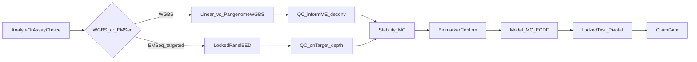

# Prostate Cancer Application Deep-Dive Document

## Deliverable

Create one primary document:

[`docs/research/Prostate_Cancer_Application_Deep_Dive.md`](docs/research/Prostate_Cancer_Application_Deep_Dive.md)

Audience: scientists, physicians, and insurance/medical-director readers who need to understand **why** the platform choices matter—not an operator runbook. Cross-link the Alzheimer-style pack pattern ([`docs/usage/24-methylation-application-packs.qmd`](docs/usage/24-methylation-application-packs.qmd)) as the follow-on operator surface; do **not** build `docs/examples/samd/prostate-*` in this pass.

Also update:

- [`docs/research/README.md`](docs/research/README.md) — index entry
- [`docs/regulatory/Regulatory-Ready Platform for Multiomics Diagnostics.md`](docs/regulatory/Regulatory-Ready%20Platform%20for%20Multiomics%20Diagnostics.md) — roadmap row for `App_oncology` / prostate pointing at the new deep-dive

## Source material to synthesize (do not reinvent)

| Topic | Anchor |
|-------|--------|
| Buffy vs plasma | [`docs/research/BuffyCoat_vs_cfDNA_for_Cancer_Detection.md`](docs/research/BuffyCoat_vs_cfDNA_for_Cancer_Detection.md), [`docs/ANALYTE_PROFILES.md`](docs/ANALYTE_PROFILES.md) |
| Physician gatekeeper / NPV + EM-Seq SOW | [`docs/research/Prostate Cancer Detection.md`](docs/research/Prostate%20Cancer%20Detection.md) (GRAIL comparison; EM-seq + hybrid capture), fitness sibling |
| EM-Seq procedure pack | [`workflow_engine/domain/profiles/procedures/cfdna_emseq_targeted.procedure.json`](workflow_engine/domain/profiles/procedures/cfdna_emseq_targeted.procedure.json), `sample_prep_emseq.program.json` |
| Alignment compare (WGBS arms) | [`docs/plans/linear-vs-wgbs-sampleprep-compare.plan.md`](docs/plans/linear-vs-wgbs-sampleprep-compare.plan.md), [`workflow_engine/docs/sample_prep_test_bed.md`](workflow_engine/docs/sample_prep_test_bed.md) |
| informME + deconv | theory ch.07a, [`docs/architecture/end-to-end-workflow.md`](docs/architecture/end-to-end-workflow.md) §covariates |
| Stability / WF1–3 / SaMD | usage ch.05–08, 18; theory ch.12, 15 |
| Current evidence honesty | [`docs/regulatory/validation-evidence-index.md`](docs/regulatory/validation-evidence-index.md) EV-PCA-* (feasibility, **no partitions**) |

## Document outline (maps to your a–h)

Front matter: audience, claim boundary (platform controls ≠ FDA clearance; EV-PCA packages are feasibility-only).

### a) Chosen analyte / assay modality — four documented options

Present as a **decision table**, not a premature single winner:

1. **Buffy coat, ~30× WGBS** — host-response / leukocyte epigenome; Houseman/HiTIMED deconv; abundant DNA; research and aggressiveness signals; **not** the preferred gatekeeper for tumor-shed NPV alone.
2. **Plasma / cfDNA, ~30× WGBS** — genome-wide tumor-shed + fragmentomics; tumor-fraction–aware design; discovery / MCED-adjacent research path when clinical performance is proven.
3. **Paired / complementary** — when both tubes exist: plasma for tumor signal, buffy for host background / CHIP-analogue control (industry pattern).
4. **Plasma / cfDNA EM-Seq + hybrid-capture panel (GRAIL-style chemistry, gatekeeper geometry)** — operator-supplied `target_panel_bed`; procedure [`cfdna_emseq_targeted`](workflow_engine/domain/profiles/procedures/cfdna_emseq_targeted.procedure.json) (“inch-wide, mile-deep”); no genome-wide DMP hunt; no cell deconvolution by default. Frame explicitly against GRAIL Galleri:
   - **Same biology** as GRAIL: cfDNA methylation as the liquid-biopsy signal; EM-Seq preferred over bisulfite for low-yield cfDNA.
   - **Different clinical objective**: GRAIL = multi-cancer population screen (miles-wide, moderate depth, ultra-high specificity); this option = **single-cancer pre-biopsy gatekeeper** (50–100 prostate / GG≥2 regions, extreme depth ~2,000–5,000×) so early localized PCa is not “structurally quiet.”
   - Cite the existing GRAIL comparison in [`Prostate Cancer Detection.md`](docs/research/Prostate%20Cancer%20Detection.md); do not imply Galleri-equivalent claims or clearance.

Include: when each benefits a physician workflow (elevated PSA → biopsy decision) vs when it does not; depth guidance (~30× buffy often adequate; WGBS plasma needs TF-aware interpretation; EM-Seq panel needs a locked BED + extreme on-target depth, not “more genome-wide depth”).

### b) Alignment options (WGBS arms) + EM-Seq SamplePrep

**WGBS arms** (options 1–2): document three SamplePrep modes and how the linear vs `pangenome_wgbs` compare selects the production default:

| Mode | Role |
|------|------|
| `linear` (`fq2bam_meth`) | Biological baseline |
| `pangenome_wgbs` (methylGrapher C2T/G2A) | Bisulfite-aware pangenome — candidate production default for buffy research packs |
| Stock `pangenome` / Giraffe | Engineering comparator only (no WGBS methylation parity) |

State explicitly: **live 4-arm compare is incomplete** (latest `/work/samples/_comparisons/latest` has BAMs without H5/QC metrics). Until compare completes, the deep-dive recommends **running the compare harness**, then locking the winner into procedure packs (`buffy_wgbs_*_gene_fc`, plasma WGBS procedures). Do not invent a biological winner in the doc.

**EM-Seq arm** (option 4): separate SamplePrep path (`sample_prep_emseq.program.json` / `useEmseqTargeted`). Alignment/extraction are panel-constrained; compare harness above does **not** pick EM-Seq vs WGBS—that is a **clinical assay-design** choice (gatekeeper depth vs genome-wide discovery), not an aligner bake-off.

### d) Improving read / signal quality

Wire SamplePrep QC → modeling covariates:

- Alignment QC / extraction QC guardrails (sample eligibility)
- **informME** (`pipeline.info_measures`) — NME/MML/ESI/MSI from `*.patterns.h5`
- **Cell deconv** — Houseman (buffy 6 Ω) / HiTIMED (cfDNA leaves e.g. tumor_fraction)
- `derived_measures` + ALR stacking into ECDF second-stage (`covariates_path`)

Explain physician-facing meaning: adjust for immune-cell mix and methylation heterogeneity so the classifier is less confounded by composition noise.

### e) Benefit to physician / insurance

Clinical scenario: elevated PSA / secondary biomarkers → **pre-biopsy gatekeeper** aimed at clinically significant PCa (GG≥2), high NPV, complement (not replace) mpMRI / 4Kscore.

Payer lens: analytical validity → clinical validity → utility (avoid unnecessary biopsy vs missed csPCa). Map platform artifacts (locked model spec, evidence packages, SaMD ladder) to what a medical director asks for—without claiming coverage readiness today.

### f) Cancer vs noise

Translate WF1/WF2/WF3 into plain language:

- Stability MC + recurrence thresholds (biology vs lucky splits)
- Patient-disjoint `development_train` / `locked_test` / `pivotal_validation`
- Code claim gates (`regulatory.stage`, `allow_clinical_performance_claims`)
- Honest gap: current prostate EV packages lack partitions

### g) Detect / confirm biomarkers

Pipeline story: DMP discovery → stability / FeatureCuts → freeze → mapper → enricher (`cancer-core` / PPI) → biological readiness.

Emphasize: genes for interpretability; enricher/PPI as **independent pathway support**, not circular proof; known prostate genes (e.g. GSTP1) as literature context without hardcoding disease logic in code.

### h) Good model and validation

ECDF (+ covariates) vs tabular backends; model-MC selection; freeze → post-model → locked_test; SaMD ladder research → holdout enrichment → pivotal.

Include what “good” means for gatekeeper (NPV LCB, operating point, GG≥2 positive class) vs what current healthy-vs-pooled-PCa runs report (BA)—and that GG≥2 staging + NPV gates are product gaps called out in the fitness analysis.

## Diagrams (mermaid in the doc)

Plus a decision table comparing Options 1–4 (analyte × chemistry × alignment / panel rule), including the GRAIL-vs-gatekeeper contrast for EM-Seq.

## Writing rules

- Synthesize and cite existing docs; avoid duplicating full stage manuals.
- Keep **claim boundary** visible in front matter and again before physician/payer sections.
- Prefer relative links; no `file:///c:/...` paths.
- Do not present unfinished linear-vs-pangenome results as a winner.
- Do not equate EM-Seq gatekeeper design with GRAIL Galleri claims; cite GRAIL only as shared methylation biology + contrasting width/depth/objective.
- Lettering in the doc: use **a, b, d–h** as requested (no invented “c”), or renumber continuously with a footnote that alignment was formerly “c”—prefer continuous **§1–§8** with subsection titles matching your themes for readability.

## Out of scope for this plan

- Implementing `docs/usage/25-prostate-cancer-pack.qmd` or example manifests (follow-on after the deep-dive lands)
- Finishing the live SamplePrep compare on GPU (document the gate only)
- Changing pipeline code or EV package status
