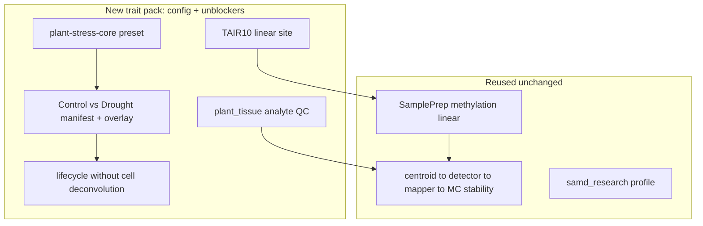

# Plant Abiotic Stress Methylation Pack

> **Status: Implemented** (2026-07). Arabidopsis drought (Control vs Drought) ships as the first non-human methylation trait pack: config plus targeted unblockers (`plant_tissue` analyte, TAIR10 site, deconvolution-free lifecycle program, `plant-stress-core` preset) on the existing methylation control plane. No new aligner or workflow action. Grafting / trait-introgression is explicitly deferred to a later pack.

> **Follow-on (2026-07):** Multi-crop Ensembl Plants site recipes (soybean / maize / wheat) and an offline mapper `plant_traits` prior were pulled forward in [`multi-crop-plant-expansion.plan.md`](multi-crop-plant-expansion.plan.md). Open Targets remains human-only.

## Framing: trait pack on the methylation modality

> **Terminology (2026-07):** The umbrella term is now **application pack** (config overlay on an existing process). Plant abiotic stress is a *trait application* instance; see [Usage ch.24](../usage/24-methylation-application-packs.md). Historical “trait pack” / “modeled on Alzheimer” wording below is superseded by that pattern doc.

Like the [Alzheimer cfDNA pack](../usage/21-alzheimer-cfdna-pack.md), this is config on the existing DNA-methylation process rather than a new omics modality. Plants need a few platform unblockers because human blood/cfDNA defaults are biologically wrong for plant WGBS (CG/CHG/CHH are all real biology; no blood cell types).

**Locked demo design:** *Arabidopsis thaliana*, binary Control vs Drought, leaf tissue, contexts `["CG","CHG","CHH"]`, chromosomes `["1","2","3","4","5"]`, `primary_modality: methylation`, `primary_analyte: plant_tissue`.

## Implemented components

### Plant tissue analyte profile
- `packages/methylutils/methyl_utils/analyte_profiles.py`: `plant_tissue` (aliases `plant`, `leaf`, `root`, `meristem`, `seed`) with plant-safe defaults — bisulfite conversion gate kept but non-CpG cap opened (`max_non_cpg_methylation_pct = 100`), extraction QC CHG/CHH caps lifted (`= 1.0`), fragmentomics off, enricher `library_preset = plant-stress-core` + `organism = Arabidopsis_thaliana`, `enforce_training_analyte_match = false`.
- `docs/ANALYTE_PROFILES.md`: `plant_tissue` column + narrative. `primary_analyte` is free-text in the schema (no enum change). Unit tests in `packages/methylutils/tests/test_analyte_profiles.py`.

### Site + genome provision (TAIR10)
- `workflow_engine/domain/profiles/site_tair10.example.json`: linear FASTA + GTF pins under `/work/genomes`, no pangenome/RNA/proteomics blocks (plants align linear only).
- `scripts/download_arabidopsis_tair10.sh`: Ensembl Plants recipe writing the pinned paths; documents `METHYL_SITE_CONFIG`.

### Lifecycle program without blood deconvolution
- `workflow_engine/domain/fixtures/plant_stress_study_lifecycle.program.json`: `study_validation_lifecycle` with the `pipeline.cell_deconvolution` node removed; progression config-gated off for the binary study.

### Enrichment preset + species threading
- `plant-stress-core` in `packages/methylenricher/methyl_enricher/data/library_presets.json` (`include_default: false`; organism-general GO term libraries; human oncology/CNS/disease libraries dropped).
- `EnricherStepConfig.string_species` (`config.py`) and `--string-species` CLI arg; `organism` / STRING species threaded through the previously human-hardcoded helpers in `module_pipeline.py` (`run_ppi_hubs_only`, `run_cisbp_only`, `run_module_pipeline` network refinement). Enricher config schema regenerated.

### Study scaffold + overlay
- `docs/examples/samd/plant-abiotic-stress/`: `project_Control_vs_Drought.json`, `context_plant_abiotic_stress.json` (`enricher.library_preset=plant-stress-core`, `organism=Arabidopsis_thaliana`, `string_species=3702`, `mapper.enrich_disease=false`, progression off), `data/{control,drought}.csv`, README.

### CI fixture + tests
- `workflow_engine/domain/checks/plant_abiotic_stress/` smoke manifest + CSVs; `workflow_engine/tests/test_plant_abiotic_stress_pack.py` (binary comparison resolution, plant-safe QC keys, `plant-stress-core` resolves without human disease libs, overlay targets Arabidopsis, lifecycle program has no `cell_deconvolution` node).

### Docs
- `docs/usage/23-plant-abiotic-stress-pack.qmd`; links from `docs/usage/18-samd-study-lifecycle.qmd` and `docs/ANALYTE_PROFILES.md`; regulatory roadmap row + extensibility narrative in `docs/regulatory/Regulatory-Ready Platform for Multiomics Diagnostics.md`.

## Explicitly NOT in scope
- Grafting / trait-introgression (donor drought resistance into a commercial rootstock) — planned separate pack.
- Soybean / maize / wheat site recipes (documented as "swap site pins").
- A plant cell-type deconvolution basis asset (shipped bases are human blood; the node is omitted).
- OpenTargets / human disease priors for stress traits.
- New aligners, epi-GBS modality, or SaMD pivotal / clinical-performance claim ladder (stays on `samd_research`).

## Validation
- `methyl-study-validate-manifest --profile samd_research` passes on the example manifest.
- Comparison resolves to `all` vs `drought`; contexts `CG/CHG/CHH`, chromosomes `1..5`.
- `packages/methylutils/tests/test_analyte_profiles.py` and `workflow_engine/tests/test_plant_abiotic_stress_pack.py` green; enricher tests green; config-schema drift check passes after regeneration.
