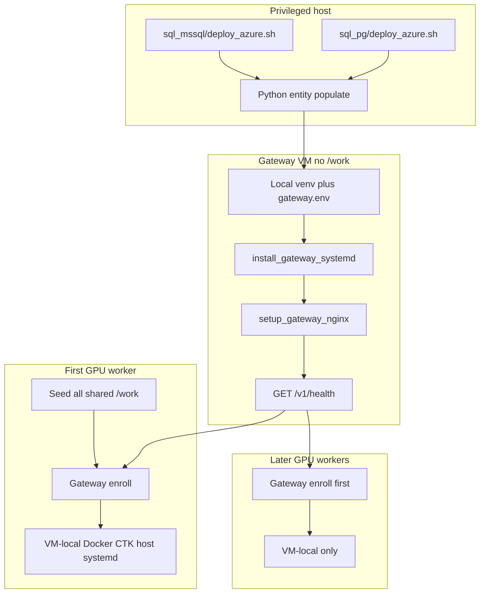

# Platform deploy — database twins, gateway, workers

GPU workers do **not** create a database. A **privileged host** does: dual-dialect SQL in [`workflow_engine/sql_mssql/`](../../workflow_engine/sql_mssql/) and [`workflow_engine/sql_pg/`](../../workflow_engine/sql_pg/), then Python scripts that populate process packs and other entities. Gateway and workers assume that work is already done.

Two filesystems, two roles:

| Where | Who | What |
|-------|-----|------|
| **`/work` (shared, QNAP)** | Every GPU worker | Genomes, samples, projects, cache, site, release, worker venv, extractor, Parabricks layers |
| **Gateway VM local disk** | Gateway process only | `methyl-gateway` binary/venv, `gateway.env`, systemd. **Not** genomes, samples, or worker artifacts |

The gateway local root (`/opt/methyl-gateway` by default) is only “a folder on the gateway box’s own disk so the gateway process can start without mounting the worker share.” It is **not** a new shared tree and it does **not** replace `/work`. Workers keep `/work` exactly as today.



**Order**

1. **Database (privileged host):** `deploy_azure.sh` for the chosen backend, then Python populate. MSSQL and PG script trees stay twins.
2. **Gateway VM** — local install; no `/work` mount. Health 200 on `https://<fqdn>/v1`.
3. Portal preregisters each GPU public IP.
4. **First GPU worker** seeds all shared `/work`, then enrolls, then VM-local.
5. **Joiners:** enroll first, then VM-local only.

## Database — dual-dialect SQL + Python populate (privileged host)

Folders (do not invent new names): [`workflow_engine/sql_mssql/`](../../workflow_engine/sql_mssql/) and [`workflow_engine/sql_pg/`](../../workflow_engine/sql_pg/).

| Backend | Schema entrypoint | Notes |
|---------|-------------------|--------|
| Azure SQL (production portal) | [`sql_mssql/deploy_azure.sh`](../../workflow_engine/sql_mssql/deploy_azure.sh) | After base `MethylPipeline.sql` when greenfield |
| PostgreSQL (`goliath`) | [`sql_pg/deploy_azure.sh`](../../workflow_engine/sql_pg/deploy_azure.sh) | Schema twin / CI; default `PGDATABASE=goliath` |

**Keep them synchronized.** Every new table, proc, seed SQL, or `cfg_*` object is added to **both** trees and listed in **both** `deploy_azure.sh` arrays. Drift is a deploy bug. Existing gates: [`workflow_engine/contract/db_objects.yaml`](../../workflow_engine/contract/db_objects.yaml), [`validate_contract.py`](../../workflow_engine/contract/validate_contract.py), [`.github/workflows/db-parity.yml`](../../.github/workflows/db-parity.yml), [`scripts/check_sql_deploy_twins.py`](../../scripts/check_sql_deploy_twins.py). Widen the contract when `cfg` / process-pack objects are required at greenfield, not only `wf`.

DDL applies recipes (for example `cfg_reference_assets_seed.sql`, `cfg_site_reference_assets_seed.sql`, `cfg_process_pack_catalog.sql`). **Rows from git** are Python, after schema:

| Script | Populates |
|--------|-----------|
| [`seed_action_catalog.py`](../../workflow_engine/sql_mssql/seed_action_catalog.py) | `wf.workflow_action` + `wf.data_type` from `schemas/actions/catalog.json` (both backends via `BACKEND_DB`) |
| [`sync_cfg_profiles_and_action_catalog.py`](../../scripts/sync_cfg_profiles_and_action_catalog.py) | `cfg.pipeline_profile`, `cfg.assay_procedure`, `cfg.analyte`, re-seed catalog |
| [`deploy_process_pack_catalog.sh --sync`](../../scripts/deploy_process_pack_catalog.sh) | Process-pack / analyte catalog SQL if needed, then Python row sync |
| `methyl-cfg sync-library-presets` | Enrichment library presets |
| [`deploy_workflow_definitions.sh`](../../scripts/deploy_workflow_definitions.sh) | SamplePrep / lifecycle / RNA / proteomics DomainProgram graphs |

[`bootstrap_distributed_workers.sh`](../../scripts/bootstrap_distributed_workers.sh) is **this privileged-host sequence only** (schema optional via `--skip-schema`, then the Python list). It does not init `/work`, register GPUs, or start the gateway. GPU provision must not call it.

## Shared `/work` (GPU workers only)

First GPU worker creates this tree; every later worker mounts the same share. Modes stay as [`init_work_layout.sh`](../../scripts/init_work_layout.sh):

| Path | Access | Contents |
|------|--------|----------|
| `/work/samples/` | read/write all workers | Sample archive |
| `/work/projects/`, `/work/cache/` | read/write | Study outputs, mapper caches |
| `/work/genomes/`, `/work/site/` | read for workers; ops/first-seed write | References, site manifest |
| `/work/goliath/` | read for workers after seed | `current` release, `venv-<arch>`, extractor, `docker/` Parabricks layers, `env/worker.env` |

Gateway does **not** read or write this tree.

## Gateway VM (local disk only)

[`deploy/systemd/methyl-gateway.service`](../../deploy/systemd/methyl-gateway.service) uses `__GOLIATH_ROOT__` placeholders. Installers default to `/opt/methyl-gateway` and refuse a `--root` under `/work`.

Install on the gateway host (no QNAP mount): [`scripts/provision_gateway_node.sh`](../../scripts/provision_gateway_node.sh).

1. Install gateway wheels into a **local** venv on that VM.
2. Local `gateway.env` from [`deploy/env/gateway.mssql.env.example`](../../deploy/env/gateway.mssql.env.example) + [`gateway.security.env.example`](../../deploy/env/gateway.security.env.example). Essentials: `BACKEND_DB=mssql`, `WF_USE_MANAGED_IDENTITY=1`, `AZURE_SQL_SERVER` / `AZURE_SQL_DB`, `WF_GATEWAY_HOST=127.0.0.1`, `GATEWAY_WORKER_IP_BIND=1`, `GATEWAY_REQUIRE_ARC_ATTEST=1`.
3. `install_gateway_systemd.sh --root <gateway-local-root>` so unit paths stay on that disk. Reclaim timer uses the same local env.
4. Certs at `/etc/ssl/methyl-gateway/`; [`setup_gateway_nginx.sh`](../../scripts/setup_gateway_nginx.sh) `--hostname <fqdn>`. NSG: 443 from workers/VPN; 8080 localhost only.
5. `https://<fqdn>/v1/health` must be 200.

Workers set `WORKER_API_BASE=https://<gateway-fqdn>/v1`. They still run from `/work/goliath/venv-<arch>`.

## First GPU worker — all shared `/work`

When `/work/goliath/current/manifest.json` is missing (`--join-mode auto` or `first`):

1. [`init_work_layout.sh`](../../scripts/init_work_layout.sh) — samples/projects/cache writable; genomes/site/goliath worker-readable
2. [`promote_release.sh`](../../scripts/promote_release.sh) / [`install_release.sh`](../../scripts/install_release.sh) — `/work/goliath/current`, `venv-<arch>`, extractor
3. One Parabricks pull into `/work/goliath/docker`
4. [`write_worker_env.sh`](../../scripts/write_worker_env.sh)
5. If still missing: genomes/site bytes onto `/work/genomes` and `/work/site` — download only

Then enroll (gateway already up), then VM-local.

`--join-mode first|join` remains an override; default is auto-detect on the manifest.

## Later GPU workers

Manifest present → **enroll first** → VM-local only. Never re-promote. Never re-pull Parabricks.

## Every GPU — enroll

Portal must already have `(cluster_key, public_ip, external_worker_key)`.

```bash
export WORKER_API_BASE=https://<gateway-fqdn>/v1
methyl-worker enroll --api-base "$WORKER_API_BASE" --cluster "$CLUSTER" --key "$(hostname -s)"
```

- Python from `/work/goliath/venv-${ARCH}`
- Writes `/etc/methyl/worker-token`
- Fail closed on missing API, missing venv, or HTTP 403
- No SQL fallback (`METHYL_ALLOW_WORKER_SQL=1` is lab-only)

## Every GPU — VM-local

- [`setup_host.sh`](../../scripts/setup_host.sh) `--system-deps --no-venv --gpu`
- Local Docker + NVIDIA CTK, data-root `/work/goliath/docker` (joiners skip pull)
- [`install_worker_systemd.sh`](../../scripts/install_worker_systemd.sh) after token exists

## Out of scope

- Full Azure SQL → PostgreSQL **data** cutover
- Mounting `/work` on the gateway
- Automating QNAP mounts, portal prereg UI, or issuing TLS certs
