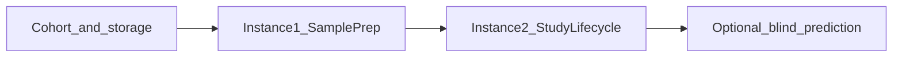
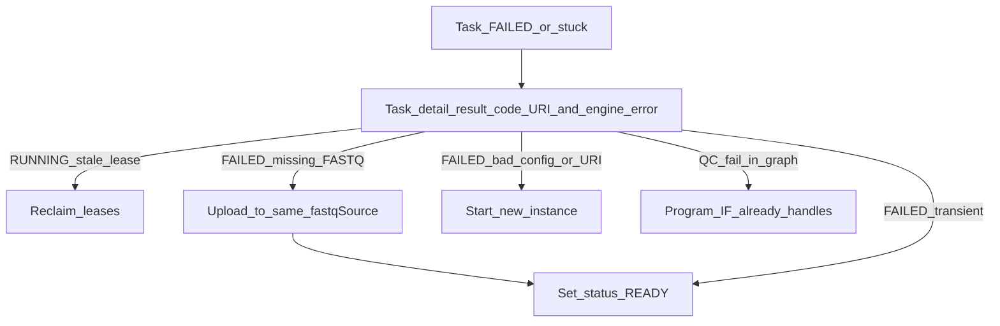
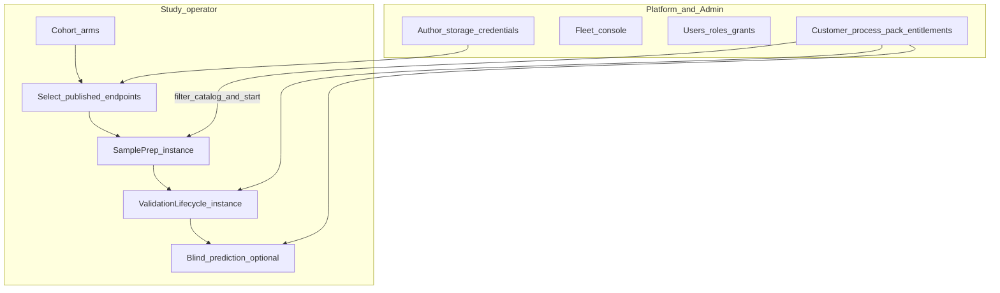

# Portal pipeline IA, RBAC admin, and contract packs

> **Status: IMPLEMENTED.** Feature under Epic **AB#413**. This repo owns the **IA contract + SQL API**; EpiPortal Delphi/uniGUI screens stay in the other repo.

## What shipped

- [`docs/architecture/portal-ia.md`](../architecture/portal-ia.md) rewritten around the operator pipeline, monitor/retry, Admin RBAC, and Contracts.
- SQL twins: `portal_study_pipeline_api.sql`, `portal_ops_recovery_api.sql`, `portal_rbac_api.sql`, `portal_contract_api.sql` (MSSQL + PG), wired in `deploy_azure.sh` and [`db_objects.yaml`](../../workflow_engine/contract/db_objects.yaml).
- Canvas: [`docs/canvas/portal-ia.canvas.tsx`](../canvas/portal-ia.canvas.tsx).

## What is true today

[`docs/architecture/portal-ia.md`](../architecture/portal-ia.md) organizes the UI as **database floors** (Platform / Study / Operations / Workflows / HPO / Admin). That matched an earlier cfg/wf split. The schemas now describe a **full execution story**, but the IA does not:

| Layer | What it now owns | Operator meaning |
|-------|------------------|------------------|
| **portal** | Sample identity (`Samples`, `LabSamples`, import, `AlignmentQC`) | Who/what the specimen is |
| **cfg** | Study arms (`study_group` / `study_group_member`), storage endpoints, process packs, `study_instance_link` | Which samples, from where, which procedure, which run |
| **wf** | Published graphs + `workflow_instance` / `node_execution` | Execution of SamplePrep then StudyValidationLifecycle |
| **RBAC** (+ Meta, Onboarding) | Users, roles, scoped grants, sessions, invitations | Who may see/do each floor |
| **Contract** | Customer commercial terms, scopes, quotas, role policies | Which process packs a tenant may run |

Two DomainPrograms in sequence ([`portal_study_lifecycle.md`](../../workflow_engine/docs/portal_study_lifecycle.md), [`end-to-end-workflow.md`](../architecture/end-to-end-workflow.md), [`pipeline-stages.md`](../architecture/pipeline-stages.md)):



1. **SamplePrepPipeline** — download (`fastqSource`) → align → QC → extract → **archive** (`sampleDestination`, `full` / `qc_only`; BAM never uploaded)
2. **StudyValidationLifecycle** — MC → stability → freeze → mapper/enricher → model MC → selection → hold-out
3. **Blind prediction** — standalone `pipeline.predictor` / `methyl-predictor`; **not** a validation accuracy claim ([ch.09](../usage/09-stage-blind-prediction.md))

**Admin is a stub in the IA.** RBAC has a real model (`Users`, `Roles`, `Groups`, `UserRoleGrants`, `Scopes`, `Sessions`, `BypassScopeApprovals`, `ExternalIdentities`) and **session/nav** procs (`RBAC.spGetUserNavTree`, `usp_session_*`). There is almost **no** `portal.sp_*` user-admin façade. Invite **accept** exists (`Onboarding.spAcceptInvitation`); invite **create/list** does not. Legacy uniGUI still uses `e_portal.spAddUserRole` / `spGetUserNavTree`.

**The procedure inventory in `portal-ia.md` is stale.** Several “known gaps” already shipped in [`portal_modern_api.sql`](../../workflow_engine/sql_mssql/portal_modern_api.sql): `sp_list_ops_instances`, `sp_list_recent_instances` (not study-filtered), `sp_list_worker_health` (desired_state + leases), `sp_list/get/upsert/publish_site`, `sp_list_studies`, `sp_get_workflow_instance`, project/archive resolve. Real remaining API holes: **instances by study**, **stage rollup**, **failure detail + retry failed node**, **RBAC admin CRUD**, **invitation authoring**, **contract / process-pack entitlement**, instance pause/cancel, affinity columns, `resolvedConfig` snapshot.

Three different “groups” must not share a UI label:

| Table | UI label |
|-------|----------|
| `cfg.study_group` | **Study arms** (control / disease) |
| `portal.Groups` | **Customer cohorts** (legacy clinical nav) |
| `RBAC.Groups` | **User groups** (role inheritance) |

### Contract gap — customers are limited to process packs

The `Contract` schema already exists ([`contract_schema.sql`](../../workflow_engine/sql_mssql/contract_schema.sql), [`contract_api.sql`](../../workflow_engine/sql_mssql/contract_api.sql)) and is used at onboarding (`Onboarding.spAcceptInvitation` calls `Contract.spContractValidateScopeAccess` / `spContractValidateRoleGrant`). It is **absent from portal-ia.md** and has **no `portal.sp_*` admin surface**.

What it entitles today is the wrong commercial grain:

| Today | Needed |
|-------|--------|
| `Contract.ContractWorkflowEntitlements` → `wf.workflow_def.id` | Customer licensed for **process packs** (`regulatory.primary_modality`: `methylation` \| `rnaseq` \| `proteomics`) |
| Start wizard / `*_catalog` lists every operator-visible pack | Pickers show **only entitled packs**; hide the rest (same rule as RBAC nav — no disabled tease) |
| `spContractValidateWorkflowExecution` gates a graph id | Start run also rejects a program/profile/procedure whose modality is not entitled |
| Quotas (`MaxRunsPerPeriod`, `WorkflowUsageCounters`) per workflow def | Keep as **derived** limits on SamplePrep vs lifecycle graphs inside an entitled pack |

A process pack is the omics modality (actions + DomainPrograms + QC), not an assay procedure and not a disease application pack ([assay-procedure-packs plan](assay-procedure-packs.plan.md), [platform overview](../overview/methylpipeline-platform-overview.md)). Example: a methylation-only customer may pick buffy/cfDNA **procedures** and SaMD **profiles**, but must not see RNA-Seq or proteomics in Study defaults or Start run.

Finer-grained assay-procedure SKUs (e.g. licensed for buffy WGBS but not EM-Seq) are **out of v1** unless the contract row already needs them; v1 is pack/modality.

Existing Contract tables to surface, not reinvent:

- `Contracts` (1:1 `portal.Customers`) — status DRAFT/ACTIVE/SUSPENDED/EXPIRED/TERMINATED, dates, `PlanCode`
- `ContractScopes` — which `RBAC.Scopes` (Institution/Lab) the contract covers
- `ContractRolePolicies` — which RBAC roles the tenant may grant (ties Admin RBAC to commercial terms)
- `ContractLimits` — max users / storage / runs
- Keep `ContractWorkflowEntitlements` for **quota on derived graphs**; add pack entitlements as the operator-facing list

## Target navigation (still ≤6)

Keep six top-level items. Change **what Studies and Admin contain**, not the chrome count. Hide items the role cannot use.

| Nav | Audience | Purpose |
|-----|----------|---------|
| **Home / Ops** | Operator / infra | Cross-study instances, stale leases, fleet strip — wire **existing** `sp_list_ops_instances` / `sp_list_worker_health` / `sp_list_stale_leases` |
| **Studies** | Operator / study lead | **Pipeline workspace** (primary change) |
| **Workflows** | Author | Definitions / versions / graph (unchanged) |
| **Platform** | Lab / infra | Site, packs, catalog, **author** storage/credentials, fleet console |
| **Hyperparameters** | Study lead | Grids/trials; also linked from Study |
| **Admin** | Platform admin | **RBAC** + **Contracts** (customers, entitled process packs, quotas, role policies) |

### Studies — operator pipeline (replace schema-shaped tree)

```
Studies / {Study}
  Overview                 stage rollup across instances
  Cohort                   enroll portal.Samples into cfg.study_group arms
  Storage                  pick published fastqSource + sampleDestination
  Sample prep              Instance 1: download → align → QC → extract → archive
  Study lifecycle          Instance 2: stability → freeze → model → validation
  Prediction               optional blind / predictor-only (gated; not accuracy)
  Runs                     all linked instances → {Instance} monitor
  Start next stage…        wizard: next unpublished DomainProgram only
```

**Start-run wizard** becomes stage-aware **and contract-filtered**: after SamplePrep completes (all samples archived or terminal QC), offer StudyValidationLifecycle; after freeze+model, offer hold-out / optional prediction. Still: published version only; analyte / procedure / profile from `*_catalog` procs **intersected with the session scope’s active contract packs**; `context_json` carries `pipelineProfile`, `pipelineProcedure`, `researchMode`, `projectPath`; link via `cfg.study_instance_link`. If the study’s `primary_modality` is not entitled, do not offer Start.

**Instance detail** is the primary **monitor + recover** screen (Gantt, tasks, errors, recovery verbs). **Overview** is the named science-stage rollup, not a raw task dump. Stage mapping must come from **action catalog metadata or a small `wf`/`cfg` stage map** — do not hard-code SamplePrep stickiness in UI logic (existing affinity rule).

**Storage:** operators **select published redacted** endpoints on the study. Lab/infra **author** endpoints under Platform (existing storage RBAC). Do not put credentials on the study screen.

### Study / workflow monitoring, failure inspection, and recovery

This is first-class operator UX, not an afterthought. Today the old IA mentions an Errors tab and lease reclaim, but:

- `portal.sp_get_instance_tasks` returns `status`, `result_code`, `attempt_no`, `input_json` / `output_json` — **not** `engine_error_code` / `engine_error_message`, lease worker, or affinity key.
- The engine **does not** auto-requeue `FAILED` nodes ([workflow-idempotency-retry-lease](../architecture/workflow-idempotency-retry-lease.md)). Lease expiry requeues **stuck RUNNING** only (`sp_reclaim_expired_leases`).
- Usage [ch.11](../usage/11-troubleshooting-and-recovery.md) tells operators to inspect SQL and start a **new instance** when config is wrong. There is **no** `portal.sp_retry_*`.
- One sample action `fail_task` does **not** fail the whole instance (FOREACH siblings keep running); graph-level failures do mark `workflow_instance` `FAILED`.

**Where operators watch**

| Screen | What they see |
|--------|----------------|
| Home / Ops | Running/failed instances, stale leases, fleet strip |
| Study Overview | Stage rollup (prep / QC / stability / freeze / model / validation / prediction) with fail counts |
| Study → Runs → **Instance** | Gantt + task table; click a failed row |
| **Task / action detail** | Why it failed + which recovery verb applies |

**Task detail (must-have)**

- Action name, node_key, status, `attempt_no`, affinity key, lease worker / age
- `result_code` (typed action observability) + `engine_error_code` / `engine_error_message` (incl. `4099` `WORKER_STOPPED`)
- Truncated `output_json` / stderr excerpt — not a raw JSON dump as the primary view
- For download actions: **source URI(s)** from `input_json` (the path someone must upload to)
- Pointer to `/work` `.action_results` / JSONL when present (path in output; portal does not SSH)
- Catalog `control.can_stop` for in-flight abort only

**Recovery verbs (keep them distinct)**

| UI verb | When | Backend | Do not confuse with |
|---------|------|---------|---------------------|
| **Reclaim expired leases** | Node `RUNNING`, lease expired/missing (worker crash) | Existing `portal.sp_reclaim_expired_leases` | Fleet Drain/Stop |
| **Retry this action** (set status **READY**) | Node `FAILED`; same `input_json` is still correct after an **external** fix — missing FASTQ now on `fastqSource`, transient GPU/network, `4099` | **New** `portal.sp_retry_failed_node`: `FAILED` → `READY`, increment `attempt_no`; if instance is `FAILED` and this was the blocking node, set instance back to `RUNNING` so the scheduler/workers claim it again | Starting a new study run; editing baked `input_json` |
| **Start new instance** | Science/config was wrong (`actionConfig`, procedure, sample list) | Existing Start wizard; do not retry a node to “fix” bad knobs | Reclaim |
| **Stop this task** | In-flight, catalog `can_stop` | Existing fail_task / 4099 | Instance cancel (still a later gap) |

In-graph QC remediation (trim → realign → QC retry) is **program control flow**, not an operator Retry button.

**Worked case — missing FASTQ on source.** `sample.download_fastq` fails because the object is not at the lab ingress URI in `input_json` (same pattern for RNA/proteomics download actions). The portal does **not** upload the FASTQ. A lab operator puts the file on the **same** `fastqSource` path/prefix the task already points at, then on Task detail clicks **Retry** (`FAILED` → `READY`). The next claim uses the **same** baked URI; no new instance, no graph edit. Task detail must show the expected source URI(s) so they know where to place the file. Optional confirm: *I have placed the missing files at this source location.*

Do **not** treat this as a config change. Do **not** require `forceRerun` (that bypasses CAAS success skip; a `FAILED` node has no successful CAAS entry). Do **not** expose a generic status dropdown — only this gated READY transition.

Operator copy on Retry: *Sets this task back to READY with the same inputs so a worker will claim it again. If you changed profile/procedure knobs or the sample URI, start a new run instead.*

RBAC: study operator can Retry and Reclaim on instances they can see; fleet Stop stays infra admin.





### Admin — first-class RBAC (new floor content)

```
Admin
  Users                    RBAC.Users + Active + ExternalIdentities
  User groups              RBAC.Groups / Group_Users / Group_Roles
  Roles and permissions    Roles, Role_Permissions → Meta.Objs/Operations
  Scoped grants            UserRoleGrants + Scopes (Institution / Lab)
  Bypass-scope approvals   BypassScopeApprovals (GLOBAL grants)
  Invitations              Onboarding.InvitationBatches / Invitations
  Nav grants               portal.Role2Node + NavTree (until nav is data-driven from IA)
  Sessions and audit       Sessions, Session_Roles, effective permissions
  Contracts                portal.Customers + Contract.Contracts
    ├─ Scopes covered        ContractScopes → RBAC.Scopes
    ├─ Process packs         entitled modalities (new)
    ├─ Graph quotas          derived ContractWorkflowEntitlements + usage counters
    ├─ Role policies         ContractRolePolicies (which roles this tenant may grant)
    └─ Limits                ContractLimits (users / storage / runs)
```

Session/nav stays `RBAC.spGetUserNavTree` + `usp_session_is_authorized`. **CRUD** for the Admin screens should be **`portal.sp_*` wrappers** (same rule as studies/storage): EpiPortal does not call `RBAC.*` write procs or raw tables. Deprecate `e_portal.spAddUserRole` for new screens; keep twins for the live uniGUI until cutover.

RBAC matrix in the IA stays, but each Admin screen lists **who can open it** (platform admin only for grants; study lead never sees Users).

## Work in this repo

### 1. Rewrite [`docs/architecture/portal-ia.md`](../architecture/portal-ia.md)

- Lead with **operator pipeline** + **admin RBAC** + **customer Contracts**, not schema floors.
- Keep the three control layers (fleet ≠ instance lifecycle ≠ science knobs).
- Refresh **screen → procedure inventory** from live MSSQL/PG (include `portal_modern_api.sql` procs the current doc omitted).
- Mark stale “gaps” that already shipped (`sp_list_worker_health`, `sp_list_sites`, `sp_list_ops_instances`).
- Add the Admin inventory, Contract/process-pack entitlement, **instance monitor + failure/recovery**, and the three-groups naming table.
- Cross-link `portal_study_lifecycle.md`, `end-to-end-workflow.md`, `pipeline-stages.md`, `config-registry.md`, `workflow-idempotency-retry-lease.md`, usage ch.11.
- Revise **EpiPortal build priority**: (1) Study pipeline workspace + **monitor/failure/retry**, (2) Admin RBAC façade, (3) Contracts + entitled process-pack catalogs, (4) wire already-shipped ops/fleet procs, (5) instance pause/cancel + config snapshot.

Keep [`portal-UI.md`](../architecture/portal-UI.md) as the stable pointer.

### 2. SQL contracts (MSSQL + PG twins + `db_objects.yaml`)

**Study pipeline**

- `portal.sp_list_study_instances` — filter `wf.workflow_instance` via `cfg.study_instance_link` (study, status, workflow_def).
- `portal.sp_get_study_pipeline_progress` — rollup: latest SamplePrep / lifecycle / prediction instance, per-stage task counts (map action_name → stage from catalog metadata or an explicit map table; no disease-specific names).
- Extend `sp_get_instance_tasks` with `engine_error_code`, `engine_error_message`, `affinity_key`, lease `worker_id` / expiry (old IA listed these as gaps; columns exist on `wf.node_execution` / `wf.task_lease`).
- `portal.sp_get_node_execution_detail` — one failed/stuck row: errors, truncated output, `result_code`, attempt, worker, catalog `control` flags.
- `portal.sp_retry_failed_node` — only `FAILED` → `READY`; bump `attempt_no`; reopen instance to `RUNNING` when it was `FAILED` solely due to this node. Refuse `SUCCEEDED` / `SKIPPED` / `RUNNING`. Do not copy a new `input_json` (same baked payload). MSSQL + PG twins of the engine write.

**RBAC admin façade** (new `portal_rbac_api.sql` / PG twin)

- List/get/upsert user (Active flag); list external identities (read).
- List roles; list permissions; grant/revoke role on user or user-group (scoped + GLOBAL with BypassScope approval check).
- List/get scopes; list user-group membership.
- List sessions / effective roles for a user (read; revoke session optional).
- Invitations: create batch/invite, list, revoke (wrap `Onboarding.*`; accept stays as-is).
- Nav: list Role2Node for a role/scope; grant/deny node (replace ad-hoc `e_portal.spRoleGrant` for new Admin UI).

Do **not** expose secrets, raw `Meta` editors, or a free-form permission designer in v1 — bind the six IA roles to seeded `Meta.Operations`.

**Contracts / process-pack entitlement** (new `portal_contract_api.sql` / PG twin + small DDL)

- `Contract.ContractProcessPackEntitlements` (name may vary): `(ContractID, modality)` where modality is `methylation` \| `rnaseq` \| `proteomics` (same vocabulary as `regulatory.primary_modality`). Optional `Enabled`, dates. Do **not** invent a parallel pack catalog — modality is the pack id.
- Derive workflow-def rows for quota: assay procedure → `sample_prep_program_id` / `lifecycle_program_id` → `cfg.domain_program.compiled_workflow_version_id` → `wf.workflow_def`. Sync or resolve at validate time so `spContractValidateWorkflowExecution` still works.
- `portal.sp_*` list/get/upsert contract; set pack entitlements; list scopes/limits/role policies; read usage counters (redacted).
- Filter operator catalogs: `sp_list_pipeline_profile_catalog` / `sp_list_assay_procedure_catalog` / `sp_list_analyte_catalog` / workflow-definition picker take session `@scope_id` (or resolve from session) and return only packs entitled on the active `ContractScopes` row. Platform admin browse (`sp_list_pipeline_profiles`) stays unfiltered.
- `sp_create_and_start_instance` (or a thin wrapper) must call existing `Contract.spContractValidateWorkflowExecution` **and** pack-modality check before insert. Reason codes surfaced to the wizard (`WORKFLOW_NOT_ENTITLED`, `NO_ACTIVE_CONTRACT_FOR_SCOPE`, plus a new `PROCESS_PACK_NOT_ENTITLED`).
- Platform admin only authors contracts; operators never see the Contract screens — they only see a filtered catalog.

**Out of this plan unless already trivial:** instance pause/resume/cancel (engine status machine — distinct from Retry), `resolvedConfig` snapshot read, fleet Drain (already shipped), billing/invoicing (`PlanCode` is metadata only), assay-procedure SKUs inside a pack.

### 3. Visual spec for the other repo

Add a Cursor docs canvas under [`docs/canvas/`](../canvas/) (sync via `scripts/sync_cursor_canvases.sh`) that shows: new nav, Study pipeline screens, **instance monitor + failure/retry**, Admin RBAC + Contract screens, schema swimlanes (portal/cfg/wf/RBAC/Contract), entitled vs hidden process packs, and which procs exist vs to-build. Update [`docs/canvas/README.md`](../canvas/README.md).

### 4. Traceability

Promote this plan to `docs/plans/portal-pipeline-ia.plan.md`, add a row in [`docs/plans/README.md`](README.md), Feature under **AB#413**. EpiPortal FrameKeys / NavTree seed remains **documented for the other repo** (same pattern as storage SoT).

## Out of scope

- Implementing Delphi/uniGUI or React screens in MethylPipeline.
- Rewriting `e_portal` nav runtime used by production until the other repo cuts over.
- Auto-starting Instance 2 when SamplePrep finishes (portal middle-tier may later; IA only requires a **gated Start next stage**).
- Putting tunable science knobs on study manifests (unchanged: site/profile/procedure → `resolvedConfig`).
- Payment, invoicing, or self-serve plan changes — `PlanCode` / `BillingCycle` stay metadata on `Contract.Contracts`.
- Entitling individual assay procedures or application packs in v1 (customer buys a **process pack** / modality).
- Automatic requeue of every `FAILED` node (Retry is operator-gated). In-graph QC retry branches stay in the DomainProgram.
