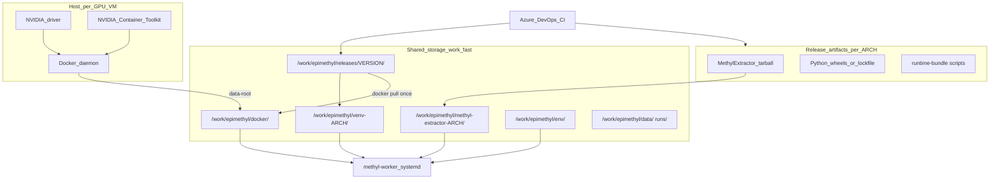
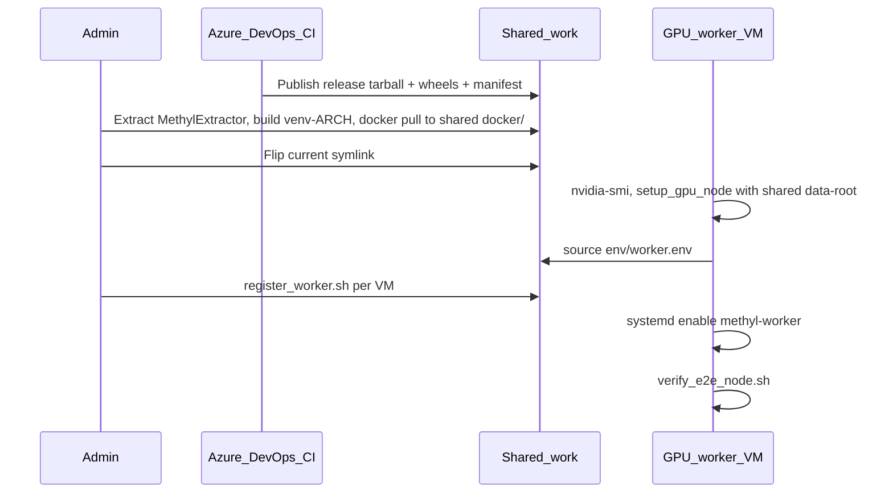

# Production-ready GPU worker deployment strategy

## Target architecture

Separate concerns into three layers that map to your three requirements:



| Layer | What runs | Source in production | Shared on `/work`? |
|-------|-----------|----------------------|--------------------|
| **GPU / alignment** | `nvidia-smi`, Docker, Parabricks fq2bam | Host driver + container from **shared Docker data-root** | **Yes** — one image store for all VMs |
| **MethylExtractor** | `MethylExtractor`, HDF5 zstd plugin | **Binary tarball only** (no git) | **Yes** — extract once per arch |
| **Python stack** | `methyl-worker`, all `methyl-*` CLIs | **venv** per arch from pinned wheels | **Yes** — one venv per CPU arch |

**Design principle:** Treat fast shared storage as the single runtime store for all heavy artifacts. GPU VMs only need drivers, Docker daemon config, and NVIDIA Container Toolkit locally.

*(Assumption: “MethylExplorer” in your note means **MethylExtractor**, the native extract binary documented in [`workers/docs/methyl_extractor.md`](workers/docs/methyl_extractor.md).)*

---

## Canonical directory layout on shared storage

Use a **release pointer** so workers never depend on git paths:

```
/work/epimethyl/
  current -> releases/2026.6.1          # symlink; flip on promote
  releases/
    2026.6.1/
      manifest.json                      # version, arch, digests, parabricks tag
      methyl-extractor-linux-aarch64.tar.gz
      methyl-extractor-linux-amd64.tar.gz
      requirements-worker.lock           # fully pinned pip set (Py 3.12)
      wheels/                            # Phase 1: local wheelhouse
        *.whl
      runtime-bundle/                    # minimal non-Python assets
        schemas/
        scripts/verify_*.sh
        deploy/systemd/
  docker/                                # shared Docker data-root (all GPU VMs)
    # image layers for METHYL_PARABRICKS_IMAGE + any pinned aux images
  venv-aarch64/                          # one venv per CPU arch (not per VM)
  venv-amd64/
  methyl-extractor-aarch64/              # extracted binary + HDF5 plugin
  methyl-extractor-amd64/
  env/
    worker.env                           # per-node or shared + per-node overrides
    parabricks.env
    workflow_versions.json               # from control-plane deploy
  data/
  runs/
```

**Per GPU VM (local disk only — lightweight):**

- `/etc/docker/daemon.json` — `"data-root": "/work/epimethyl/docker"` (points daemon at shared store)
- NVIDIA driver + Container Toolkit (packages on local OS disk)

**Shared on `/work` (same pattern as venv + MethylExtractor):**

- `/work/epimethyl/docker/` — Parabricks and any other pinned container images
- `/work/epimethyl/venv-<arch>/` — Python environment
- `/work/epimethyl/methyl-extractor-<arch>/` — native binary

**Do not put on workers:** `repos/MethylExtractor/` sources, editable git checkouts, or dev clones like `/work/MethylPipeline` (keep dev trees separate from `releases/`).

---

## Layer 1 — NVIDIA driver, CUDA libraries, Parabricks

### Host responsibilities (operator / golden image)

| Component | Purpose | Notes |
|-----------|---------|-------|
| **NVIDIA driver** | `nvidia-smi`, GPU passthrough to Docker | Pin driver version in runbook; upgrade window separate from app releases |
| **Docker Engine** | Run Parabricks container | Installed by [`setup_gpu_node.sh`](scripts/setup_gpu_node.sh) |
| **NVIDIA Container Toolkit** | `--gpus all` in Docker | Same script; run `nvidia-ctk runtime configure` |
| **libnvrtc12** (optional) | Host-side CuPy/NVRTC for centroid GPU paths | [`setup_host.sh`](scripts/setup_host.sh) `--system-deps --gpu` installs via apt when needed |

**Alignment does not need a full host CUDA toolkit.** Parabricks ships CUDA inside the container. Image tag comes from [`scripts/platform_matrix.env`](scripts/platform_matrix.env) (`PARABRICKS_IMAGE_amd64`, `PARABRICKS_IMAGE_aarch64`); override with `METHYL_PARABRICKS_IMAGE` in [`worker.env`](docs/deployment/worker_node.md).

### Shared Docker data-root (Parabricks on `/work`)

All GPU VMs use the **same** container store so images are pulled **once per release**, not once per VM.

**Daemon config** (`/etc/docker/daemon.json` on each GPU node):

```json
{
  "data-root": "/work/epimethyl/docker"
}
```

After changing `data-root`, restart Docker. New nodes joining the cluster inherit images already on shared storage — no `docker pull` needed if the release is current.

**Release promote (once, from one admin node or CI agent with NGC credentials):**

```bash
export DOCKER_DATA_ROOT=/work/epimethyl/docker
# Ensure daemon on this node uses data-root (or use DOCKER_HOST / same config)
docker pull nvcr.io/nvidia/clara/clara-parabricks:4.7.0-1
```

Optional fallback if shared `data-root` ever causes friction: ship `parabricks-<ver>-<arch>.docker.tgz` in `releases/` via `docker save` / `docker load` — same pattern as the MethylExtractor tarball.

### Parabricks contract (already in repo)

Environment written to `parabricks.env` / `worker.env`:

- `METHYL_PARABRICKS_IMAGE=nvcr.io/nvidia/clara/clara-parabricks:4.7.0-1` (verify on NGC per SKU)
- `METHYL_PARABRICKS_GPU_FLAGS=--gpus all`

Document in `manifest.json`: driver min version + Parabricks tag + digest (`docker inspect`) tested together.

### Per new GPU VM (repeatable — no image pull if release current)

```bash
# 1. Driver must work first
nvidia-smi

# 2. Install Docker + NVIDIA Container Toolkit; configure shared data-root
bash /work/epimethyl/current/runtime-bundle/scripts/setup_gpu_node.sh \
  --docker-data-root /work/epimethyl/docker \
  --env-dir /work/epimethyl/env
# Skip --pull-parabricks on worker join if promote step already pulled to shared docker/
```

**Operational notes for shared Docker store:**

- Run **`docker pull` / `docker load` serially** during release promote (one job), not from every VM simultaneously.
- Pin image by digest in `manifest.json` so all nodes run the same layers.
- Requires a filesystem Docker supports for `overlay2` (your fast cluster storage is the intended fit; validate once with `docker run --gpus all` from two VMs concurrently).
- Container **runtime** temp dirs (`/tmp`, bind mounts under sample dirs) still use local paths or `/work/epimethyl/runs/` — only the **image layers** live in shared `docker/`.

---

## Layer 2 — MethylExtractor as binary-only artifact

### CI build (MethylExtractor repo — separate Azure DevOps pipeline)

For **each release tag** and **each arch** (`arm64`, `x64` per [`platform_matrix.env`](scripts/platform_matrix.env)):

1. Build on native agent (`make`)
2. Package tarball:

```
methyl-extractor/
  bin/MethylExtractor
  lib/hdf5_zstd_plugin/   # from build/dynamic/{arm64|x64}/
  VERSION.txt
```

3. **Phase 1:** copy to `/work/epimethyl/releases/<ver>/methyl-extractor-linux-<arch>.tar.gz`
4. **Phase 2:** upload same tarball to Azure Artifacts (Universal Package or Pipeline artifact)

### Install on shared storage (once per release + arch)

```bash
ARCH=aarch64   # or amd64 -> x64 subdir mapping via detect_platform.sh
RELEASE=/work/epimethyl/releases/2026.6.1
DEST=/work/epimethyl/methyl-extractor-${ARCH}   # read-only after extract

mkdir -p "$DEST"
tar -xzf "$RELEASE/methyl-extractor-linux-${ARCH}.tar.gz" -C "$DEST"
chmod -R a-w "$DEST"
```

### worker.env pointers (no sources)

```
METHYL_EXTRACTOR_BIN=/work/epimethyl/methyl-extractor-aarch64/bin/MethylExtractor
HDF5_PLUGIN_PATH=/work/epimethyl/methyl-extractor-aarch64/lib/hdf5_zstd_plugin
```

Smoke test: [`scripts/verify_methyl_extractor.sh`](scripts/verify_methyl_extractor.sh).

---

## Layer 3 — Python venv + MethylPipeline packages + worker

### What must be in the venv

From [`scripts/packages.list`](scripts/packages.list) + [`workers/pyproject.toml`](workers/pyproject.toml):

- All `packages/*` CLIs (`methyl-centroid`, `methyl-detector`, `methyl-validation`, …)
- **`methyl-worker`** and in-process handlers (import monorepo packages — see [`workers/WORKER_PROTOCOL.md`](workers/WORKER_PROTOCOL.md))

Third-party stack from [`requirements-pipeline.txt`](requirements-pipeline.txt) + [`requirements-gpu-cuda12.txt`](requirements-gpu-cuda12.txt) (CuPy/cuDF for GPU centroid paths).

### Phase 1 — Shared storage wheelhouse (no git on workers)

**CI job (MethylPipeline repo, on tag):**

1. `python -m build` for each package in `packages.list` + `workers/`
2. Write **`requirements-worker.lock`** via `pip compile` (add `pip-tools` to CI)
3. Publish to `/work/epimethyl/releases/<ver>/wheels/`

**Install script (once per arch, on shared storage):**

```bash
PY=python3.12
VENV=/work/epimethyl/venv-aarch64
RELEASE=/work/epimethyl/releases/2026.6.1

$PY -m venv "$VENV"
source "$VENV/bin/activate"
pip install -U pip wheel
pip install --no-index --find-links "$RELEASE/wheels" -r "$RELEASE/requirements-worker.lock"
# Installs methyl-* packages non-editable (code copied into site-packages)
```

Today [`install_packages.sh`](scripts/install_packages.sh) only supports `-e`; add a **`install_release.sh`** (or `--release` flag) that installs wheels without editable mode — small repo change for production path.

Host deps still need [`setup_host.sh --system-deps`](scripts/setup_host.sh) once per VM (bedtools, hdf5, ODBC, libnvrtc, etc.).

### Phase 2 — Azure Artifacts PyPI feed

Same lockfile; replace `--find-links` with:

```bash
pip install --index-url https://pkgs.dev.azure.com/EpiMethyl/_packaging/<feed>/pypi/simple/ \
  -r requirements-worker.lock
```

Pin Epimethyl package versions in the lockfile (`methyl-validation==0.1.0`, …).

### Runtime bundle (still needed without full source)

Even with wheels, ship a thin **runtime-bundle** tarball with:

| Path | Why |
|------|-----|
| [`schemas/`](schemas/) | Task I/O validation, action catalog JSON export |
| [`scripts/verify_*.sh`](scripts/) | Node acceptance tests |
| [`deploy/systemd/`](deploy/systemd/) | Worker units |
| [`workflow_engine/domain/`](workflow_engine/domain/) | Only for **control-plane** compile, not every worker |

Workers do **not** need the full git tree at runtime; action dispatch is in Python ([`action_catalog.py`](workers/methyl_worker/action_catalog.py)). Control-plane one-time: [`deploy_workflow_definitions.sh`](scripts/deploy_workflow_definitions.sh) → `env/workflow_versions.json`.

---

## Release manifest (`manifest.json`)

Single source of truth per deploy:

```json
{
  "version": "2026.6.1",
  "python": "3.12",
  "parabricks_image": "nvcr.io/nvidia/clara/clara-parabricks:4.7.0-1",
  "parabricks_image_digest": "sha256:...",
  "docker_data_root": "/work/epimethyl/docker",
  "min_driver_version": "550.xx",
  "artifacts": {
    "aarch64": {
      "methyl_extractor": "methyl-extractor-linux-aarch64.tar.gz",
      "sha256": "..."
    },
    "amd64": {
      "methyl_extractor": "methyl-extractor-linux-amd64.tar.gz",
      "sha256": "..."
    }
  },
  "requirements_lock": "requirements-worker.lock"
}
```

Promote release: update `/work/epimethyl/current` symlink; reinstall venv only when lockfile changes.

---

## Node lifecycle (production)



| Step | Where | Frequency |
|------|-------|-----------|
| Build & publish release | CI | Per tag |
| Extract binary + pip install venv + docker pull | Shared storage | Per release × arch (pull once) |
| Docker daemon + NVIDIA toolkit + data-root config | Each GPU VM | Once per node |
| `register_worker.sh` | Each GPU VM | Once per node |
| `verify_e2e_node.sh` | Each GPU VM | After install / driver upgrade |

---

## systemd and env files

Keep using [`deploy/systemd/methyl-worker.service`](deploy/systemd/methyl-worker.service) with paths parameterized to your root:

- `ExecStart=/work/epimethyl/venv-aarch64/bin/methyl-worker`
- `EnvironmentFile=/work/epimethyl/env/worker.env`
- Literal `PATH=` line (systemd does not expand `$PATH` — see [`worker_node.md`](docs/deployment/worker_node.md))

Generate `worker.env` from manifest + arch (not from `bootstrap_epimethyl.sh` git clone flow). Extend bootstrap later with `--release /work/epimethyl/current` mode.

---

## Recommended repo / CI work (engineering backlog)

1. **MethylExtractor pipeline** — build + tarball per arch; publish to `/work/.../releases/` then Azure Artifacts
2. **MethylPipeline release pipeline** — build wheels, `pip compile` lockfile, runtime-bundle tarball
3. **`scripts/install_release.sh`** — non-editable install from wheelhouse or Azure feed; replaces editable path in [`install_packages.sh`](scripts/install_packages.sh)
4. **Refactor [`bootstrap_epimethyl.sh`](scripts/bootstrap_epimethyl.sh)** — add `--release-dir`, `--arch`, skip git clones; write `worker.env` from manifest
5. **Extend [`setup_gpu_node.sh`](scripts/setup_gpu_node.sh)** — `--docker-data-root`, write `daemon.json` snippet; split **pull** (release job) from **install** (node join)
6. **Docs** — new `docs/deployment/production_release.md` with driver/Parabricks matrix, shared Docker data-root setup, promote/rollback
7. **Version alignment** — bump package versions in `pyproject.toml` files coherently on release tags

---

## Interim path (this week, before CI)

If you need a working GPU worker before pipelines exist:

1. Manually build MethylExtractor on each arch once → tarball to `/work/epimethyl/releases/manual/`
2. Tag MethylPipeline → build wheels locally → `pip install` into `/work/epimethyl/venv-<arch>`
3. `chmod -R a-w` on extractor + optional read-only runtime-bundle copy
4. Per VM: driver, `setup_gpu_node.sh --docker-data-root /work/epimethyl/docker` (no pull if image already on shared store), `register_worker`, systemd
5. One-time on shared storage: `docker pull` Parabricks into `/work/epimethyl/docker/`

This matches your phased choice: **shared storage first** (venv, MethylExtractor, **and Docker images** on fast `/work`), Azure Artifacts as the target without blocking initial deployment.
