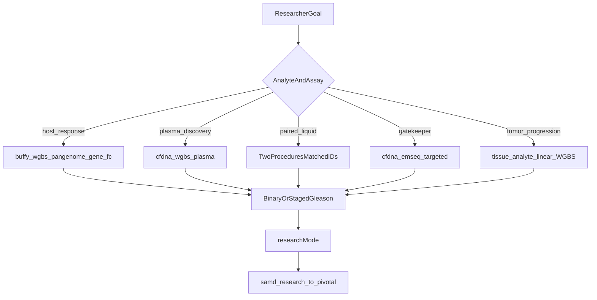

# Prostate cancer researcher options catalog

## Why this document

MethylPipeline is **disease-agnostic**. Prostate cancer is the primary worked example, not a separate PRAD pipeline. Researchers already have a **why** note ([`docs/research/Prostate_Cancer_Application_Deep_Dive.md`](../research/Prostate_Cancer_Application_Deep_Dive.md)) for physicians/payers. They did **not** have the promised operator/researcher surface (`docs/usage/25-prostate-cancer-pack.md`) that lists **what they can choose** and how to select it.

This plan writes that catalog. It does not invent a single winner among buffy WGBS / plasma WGBS / paired liquid / EM-Seq / **tumor tissue**, and it does not treat current EV-PCA packages as diagnostic claims. Tumor tissue is included as a first-class **progression and biomarker-anchor** option (see §5b), with honest gaps: `tissue` is in the analyte catalog and HiTIMED tree, but there is no shipped human-tumor procedure pack and no dedicated `analyte_profiles.py` branch.

## Deliverable

One primary chapter:

- [`docs/usage/25-prostate-cancer-pack.md`](../usage/25-prostate-cancer-pack.md)

Audience: researchers and study operators choosing **analyte, assay, alignment, extraction, cohort design, statistical axis, and SaMD tier** for prostate cancer. Style matches other usage chapters (decision tables, config keys, copy-paste `methyl-workflow-run` examples) rather than the physician/payer deep-dive.

Unlike the Alzheimer pack ([`docs/usage/21-alzheimer-cfdna-pack.md`](../usage/21-alzheimer-cfdna-pack.md)), which documents **one** procedure, this chapter is a **multi-path options catalog**. Prostate is the indication that already ships several valid procedures, staged Gleason designs, and both research and diagnostic ladders.

## Out of scope (this pass)

- New Python, profiles, procedures, or DomainPrograms (including **no new** `tumor_wgbs_*.procedure.json` — document how to run `primary_analyte: tissue` on existing linear SamplePrep + lifecycle, and name the missing procedure as a follow-on)
- New `docs/examples/samd/prostate-*` stubs or CI check bundles (roadmap follow-on; ch.24 checklist items 9–10 beyond the usage chapter)
- Choosing a biological winner for linear vs `pangenome_wgbs` (point at the compare harness; keep both procedures)
- Shipping a HiTIMED prostate-tumor atlas (operator-provisioned; tissue tree is not in the wheel)

## Document outline

Front matter: disease-agnostic platform + prostate as worked example; claim boundary (same honesty as the deep-dive: EV-PCA-* are feasibility only); pointer to the deep-dive for *why*, this chapter for *what to set*.

### 1. Start here — pick a research or diagnostic goal

Decision table mapping clinical/scientific intent to a **procedure + analyte + typical profile**:

- Host / immune / aggression research → `buffy_coat` + `buffy_wgbs_pangenome_gene_fc` (linear / Mojo / residual alternates)
- Genome-wide plasma discovery → `cfdna` + `cfdna_wgbs_plasma`
- Paired buffy + plasma → two manifests / matched IDs
- Pre-biopsy GG≥2 gatekeeper **geometry** → `cfdna` + `cfdna_emseq_targeted` + operator `target_panel_bed` (claims only after `samd_pivotal` + partitions)
- **Tumor / adjacent-normal tissue for progression and panel anchoring** → `regulatory.primary_analyte: tissue` on a separate study (or matched-ID trio with buffy/plasma). Use linear WGBS SamplePrep today; enable HiTIMED `method: hitimed` + operator tumor/stromal atlas when purity covariates are needed. Do **not** mix tumor DNA into a buffy or cfDNA primary-analyte study.

### 2. Assay procedure options (shipped)

Table of PCa-relevant procedures from [`workflow_engine/domain/profiles/procedures/`](../../workflow_engine/domain/profiles/procedures/):

- `buffy_wgbs_pangenome_gene_fc` — default buffy research
- `buffy_wgbs_linear_gene_fc` / `buffy_wgbs_linear_mojo_gene_fc` — Clara vs Mojo linear
- `buffy_wgbs_mvalue_residual_gene_fc` — confounder-adjusted host DMPs
- `cfdna_wgbs_plasma` — fragmentomics, no deconv lifecycle
- `cfdna_emseq_targeted` — locked panel, elevated `min_cov`, `sample_prep_emseq`
- **Tumor tissue — no shipped procedure.** Catalog analyte [`workflow_engine/domain/analytes/tissue.analyte.json`](../../workflow_engine/domain/analytes/tissue.analyte.json) exists. Researchers set `primary_analyte: tissue` and reuse `sample_prep.program.json` + `study_validation_lifecycle.program.json`. Prefer **linear** WGBS for FFPE/fresh-frozen tumor BAMs. Name the missing `tumor_wgbs_linear_gene_fc` as a follow-on, not a fictional shipped ID.

### 3. Alignment options

Researcher choices only (details stay in [alignment-engines.md](../usage/alignment-engines.md) / [03-sample-prep-and-qc.md](../usage/03-sample-prep-and-qc.md)).

### 4. Extraction options

From MethylExtractor + `actionConfig.methyl_extract` ([`schemas/config/methyl_extract.schema.json`](../../schemas/config/methyl_extract.schema.json)).

### 5. Study-design options (prostate-specific overlays)

What researchers set in `/work/projects/prostate-cancer/configs/project_*.json` (and CI mirrors under `workflow_engine/domain/checks/`).

### 5b. Tumor tissue when analyzing disease progression

Progression scoring is **comparison/stage-driven** (mapper combined CSVs per Gleason/stage label), not analyte-aware. Catalog tissue-only staged, adjacent-normal vs tumor, tissue-anchored then liquid transfer, matched trio, and tissue + HiTIMED purity. Honesty: no `tissue` branch in `analyte_profiles.py`; no `ffpe` token; tissue does not make EV-PCA diagnostic.

### 6. Statistical axis and modeling options

`researchMode`, FeatureCuts/caps, Houseman vs HiTIMED vs no-deconv, ECDF covariates, backends. Hyperparameter search on a **fixed** procedure.

### 7. Research vs diagnostic (SaMD ladder)

`samd_research` → `samd_holdout_enrichment` → `samd_pivotal`. Diagnostic path = EM-Seq (or proven plasma WGBS) + partitions + pivotal — not buffy-only NPV, and not tissue-only.

### 8. Worked commands

Copy-paste blocks for buffy pangenome, plasma WGBS, staged OvR, EM-Seq, and tissue staged progression.

### 9. Existing fixtures and `/work` tree

Index CI mirrors and `/work/projects/prostate-cancer/` without treating repo smoke `project_*.json` as production source of truth.

## Indexing

- [`docs/usage/index.md`](../usage/index.md)
- [`docs/usage/24-methylation-application-packs.md`](../usage/24-methylation-application-packs.md)
- [`docs/research/Prostate_Cancer_Application_Deep_Dive.md`](../research/Prostate_Cancer_Application_Deep_Dive.md)
- [`docs/research/README.md`](../research/README.md)
- [`docs/regulatory/Regulatory-Ready Platform for Multiomics Diagnostics.md`](../regulatory/Regulatory-Ready%20Platform%20for%20Multiomics%20Diagnostics.md)

## Writing rules

- Catalog **options and where they are set** (site / procedure / profile / study overlay). Do not re-explain theory already in ch.03–08, 16, 18, or the deep-dive — link out.
- Keep config-not-code: no invented numeric defaults; cite schema/profile/site examples.
- Keep claim-boundary language consistent with the deep-dive and validation-evidence index.
