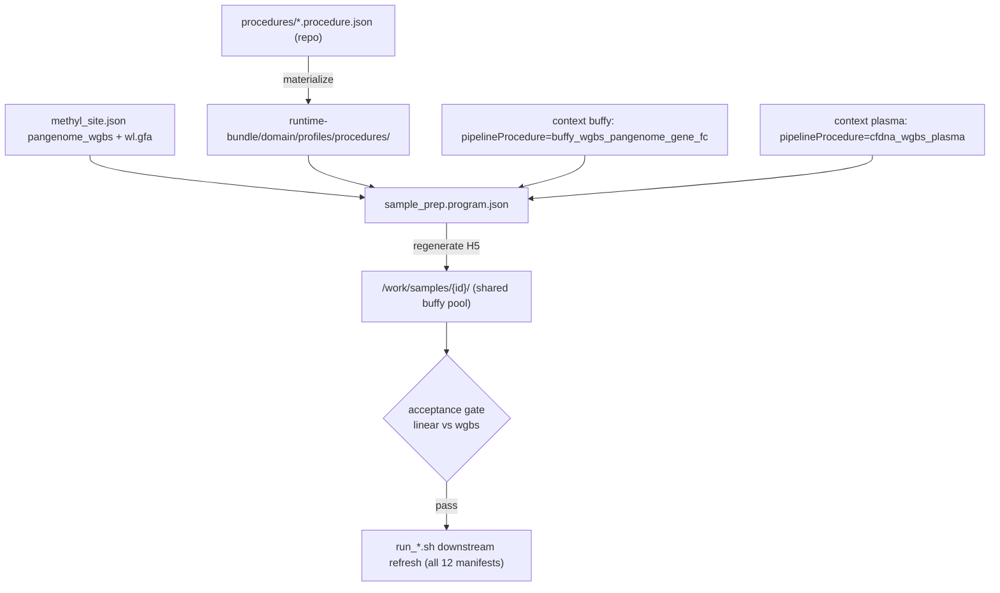

# Prostate study alignment update

## Situation

- **One study** under `/work/projects`: `prostate-cancer` (12 `project_*.json` manifests, ~last month). The 15v15 target is the paired pair [`project_Plasma_healthy_vs_PCa.json`](/work/projects/prostate-cancer/configs/project_Plasma_healthy_vs_PCa.json) (cfdna, 15/15) and [`project_Buffy_healthy_vs_PCa.json`](/work/projects/prostate-cancer/configs/project_Buffy_healthy_vs_PCa.json) (buffy_coat, 15/15).
- **Upstream-only change** (SamplePrep/alignment): actions `sample.methylgrapher_wgbs_align` / `_extract`, procedure packs, accepted default **buffy = `pangenome_wgbs`** via [`buffy_wgbs_pangenome_gene_fc.procedure.json`](../../workflow_engine/domain/profiles/procedures/buffy_wgbs_pangenome_gene_fc.procedure.json); plasma stays **linear** via `cfdna_wgbs_plasma`.
- **Downstream science is decoupled**: `context_*.json` files drive detection/mapper/validation and consume per-sample H5s from `/work/samples/{id}/`.
- Manifests are analyte-only (no aligner knobs) — correct per config-not-code. **No science-manifest edits.**

## What was implemented

1. **Runtime-bundle procedures** copied to `/work/epimethyl/current/runtime-bundle/domain/profiles/procedures/` (all five packs). `resolve_procedure_path` / `apply_pipeline_procedure` resolve `buffy_wgbs_pangenome_gene_fc` → `pangenome_wgbs` and `cfdna_wgbs_plasma` → `linear`.
2. **Site assets validated** (`pangenome_wgbs_genome` C2T/G2A indexes, `wl.gfa`, `cpg.tsv`, `node.replacement.json`, linear FASTA).
3. **Catalog sync**: `methyl-cfg sync-actions --from-json` wrote `sample.methylgrapher_wgbs_align` / `_extract` into `/work/epimethyl/cfg-store/action_definition/`.
4. **SamplePrep contexts** (study, not git):
   - `context_sampleprep_buffy.json` → 15v15 buffy
   - `context_sampleprep_buffy_pool.json` + `project_Buffy_sampleprep_pool.json` → full 238-sample buffy union
   - `context_sampleprep_plasma.json` → 15v15 plasma
5. **Operator runbook** with emit-only re-align, acceptance-gate, and downstream refresh commands: [`/work/projects/prostate-cancer/ALIGNMENT_UPDATE.md`](/work/projects/prostate-cancer/ALIGNMENT_UPDATE.md).

## Flow

## Operator next steps (not executed by this plan)

1. Run full buffy pool SamplePrep (`context_sampleprep_buffy_pool.json`).
2. Gate with `scripts/compare_sample_prep_linear_vs_wgbs.sh` + `thresholds.acceptance.json`.
3. Re-run existing `configs/run_*.sh` scripts after PASS.
