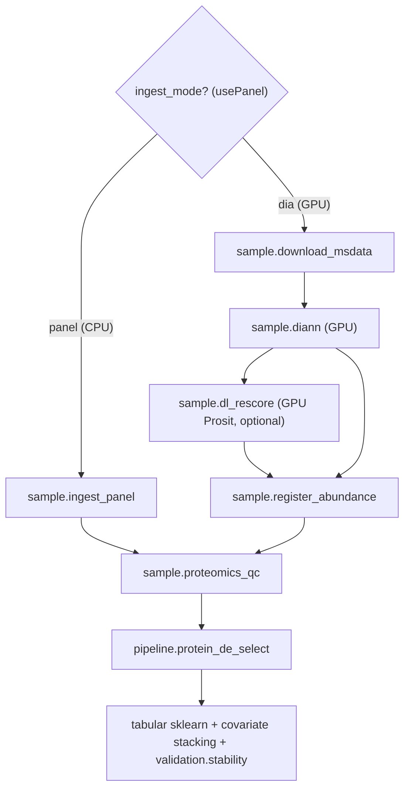

# Proteomics GPU Process Pack

> **Status: Implemented** (2026-07). Proteomics is a third omics modality on the shared control plane. GPU DIA-NN + panel ingest + Prosit + Casanovo ship as capabilities on the same GH200 VMs; RNA-Seq and proteomics now share the `omics_features` seam. DDA/MSFragger deferred. Operators must confirm an arm64 GPU DIA-NN image before enabling `proteomics.diann` on Grace/Hopper.

## Framing
Proteomics is a third `primary_modality` (`proteomics`), like RNA-Seq but **not a Parabricks drop-in**: the front is a GPU mass-spec search engine (DIA-NN) or a CPU panel-matrix ingest; the back reuses the generalized `samples x features` seam.

## Implemented components
- **Shared seam:** `packages/omicsfeatures/omics_features` (`feature_store`, `matrix.load_feature_matrix` with transform/normalize/impute, `de_select`); `rna_express` refactored to delegate (public API preserved); `BackendSharedParams.feature_mode` gains `proteomics_abundance`.
- **Ingest:** `workers/methyl_worker/diann_runner.py` (GPU DIA-NN, `METHYL_DIANN_IMAGE`), `prosit_runner.py`, `casanovo_runner.py`; `sample.download_msdata`; task models + handlers in `proteomics_prep`. Generalized capability probe `_PROBE_DOCKER_GPU` (`DOCKER_GPU_TOOL_IMAGE_ENV`) with `proteomics.diann/prosit/casanovo` in `GPU_REQUIRED_CAPABILITIES`; `proteomics.panel_ingest` is CPU.
- **Adapters/QC:** `packages/proteomicsfeatures` (DIA-NN report + panel ingest -> `abundance.h5`, `pipeline.protein_de_select`), `packages/proteomicsqc` (`sample.proteomics_qc`); domain schemas `abundance_matrix_ref` + `protein_sample_ref`.
- **Programs/profile/config:** `sample_prep_proteomics` + `proteomics_study_lifecycle` programs, `proteomics_research` profile, `proteomics_quant/proteomics_qc/protein_de_select` config keys, site `proteomics_reference`; `ingest_mode`->`usePanel` / `rescore`->`useRescore` resolution in `pipeline_profiles.py`.
- **Provisioning:** `platform_matrix.env` `PROTEOMICS_*_IMAGE_{amd64,aarch64}`, `detect_platform.sh:resolve_proteomics_image`, `setup_gpu_node.sh` writes `proteomics.env`, systemd unit loads it, `gpu_worker_runbook.md` GH200/arm64 + page-size caution.
- **Register/deploy/tests/docs:** actions in `action_catalog.py`; regenerated task/config/domain schemas + `catalog.json`; deploy script compiles the proteomics programs; tests in `packages/omicsfeatures/tests`, `packages/proteomicsfeatures/tests`, `workflow_engine/tests/test_proteomics_pack.py` + golden fixtures; E2E doc `end-to-end-workflow-proteomics.md`, usage ch.22, regulatory roadmap row.

## Explicitly NOT in scope
- DDA / MSFragger / FragPipe (commercial license) - later addition (CPU capability; can also build experimental spectral libraries for DIA-NN).
- Methylation/RNA science changes beyond the shared-seam refactor.

## Validation
- Catalog validates; task/config schema drift checks pass; RNA tests green after the refactor.
- Profile resolves `usePanel`/`useRescore`; both proteomics programs compile.
- Ingest (DIA-NN report + Olink NPX/wide panels) -> abundance.h5; DE recovers planted differential proteins; `feature_mode=proteomics_abundance` accepted.
