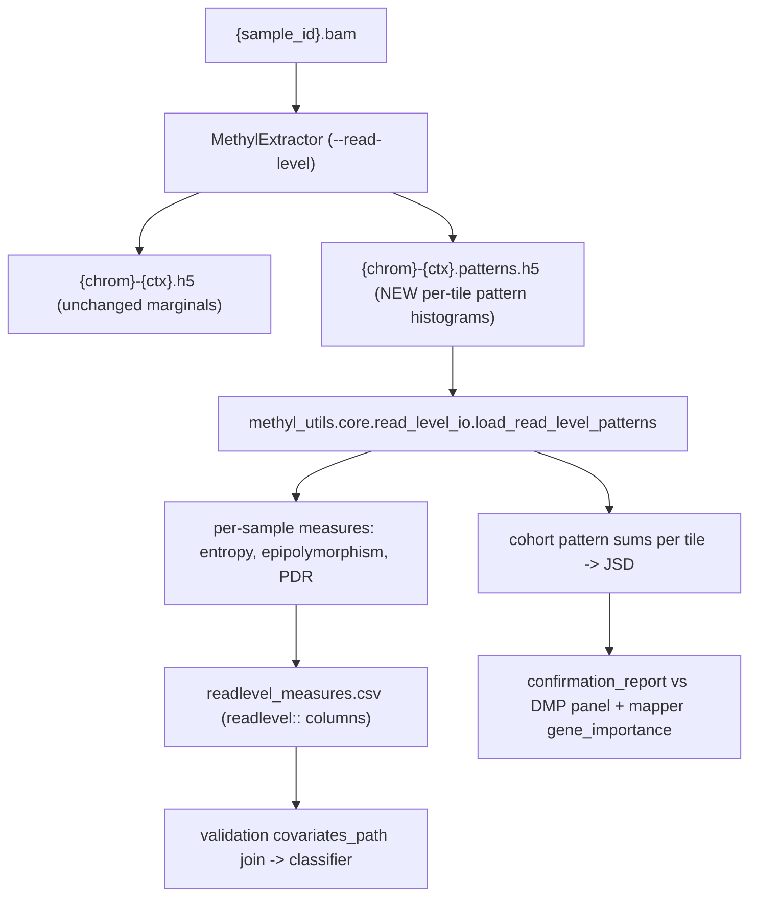

## Read-level information-theoretic measures

Design note this implements: [docs/research/methylpipeline_informme_integration.md](../research/methylpipeline_informme_integration.md).

Decisions locked in: read-level data comes from a **MethylExtractor** change (not Python BAM re-parsing); first cut is **pragmatic** read-level measures (no Ising alpha/beta/gamma fit); we ship the **covariates CSV first** and a **concordance report** second.

### Why read-level is required (context)

The per-sample `{chrom}-{ctx}.h5` stores only marginal counts (`pos, mC, uC, tnc` under group `methylation_data`; see [packages/methylutils/methyl_utils/core/io.py](../../packages/methylutils/methyl_utils/core/io.py)). Co-methylation across neighboring CpGs on the same read is not recoverable from marginals, so a new artifact is needed. `methylderivedmeasures` today only computes marginal proxies (`genome::global_entropy`, `pdr_proxy`) in [packages/methylderivedmeasures/methyl_derived_measures/core/genome_measures.py](../../packages/methylderivedmeasures/methyl_derived_measures/core/genome_measures.py).

### Data flow

### 1. Read-level HDF5 sidecar contract (spec + loader)

New sidecar file per chrom/context: `{chrom}-{ctx}.patterns.h5`, opt-in, written next to the marginal `.h5`. Keeping it a separate file leaves every existing consumer (`methylcentroid`, `methyldetector`, `methylclassifier`, `methylderivedmeasures`) untouched and lets `sample.delete_bam` proceed after extraction.

Schema (group `read_level_patterns`):
- attrs: `context`, `tile_size` (k consecutive CpGs, default 4), `pattern_encoding` = `"bitmask_msb_first"` (bit set = methylated), `min_tile_reads`.
- `tile_start_pos` uint32 [n_tiles], `tile_cpg_positions` uint32 [n_tiles, k], `tile_n_reads` uint32 [n_tiles] (reads fully covering all k CpGs).
- Sparse histogram triplets: `pattern_tile_id` uint32 [nnz], `pattern_id` uint16 [nnz] (0..2^k-1), `pattern_count` uint32 [nnz].

Deliverables in-repo:
- Contract doc `docs/reference/read_level_pattern_contract.md` (authoritative spec the external MethylExtractor C change targets).
- Loader `packages/methylutils/methyl_utils/core/read_level_io.py` with `load_read_level_patterns(path) -> ReadLevelPatterns` (per-tile positions + dense-or-sparse histograms), independent of `MethylSample`. Export from `methyl_utils/__init__.py`.

### 2. MethylExtractor wiring (external C change + in-repo runner flags)

External repo `/home/ubuntu/MethylExtractor` (native C) gains a `--read-level` mode that writes the sidecar per the contract above. In this repo:
- [workers/methyl_worker/extract_runner.py](../../workers/methyl_worker/extract_runner.py): add `read_level` (bool) and `tile_size` to `MethylExtractConfig` + `resolve_methyl_extract_config`, and emit `--read-level` / `--tile-size` in `build_methyl_extractor_command`; extend `expected_*`/completeness checks to optionally require `{chrom}-{ctx}.patterns.h5`.
- [workers/docs/methyl_extractor.md](../../workers/docs/methyl_extractor.md): document the new flag and sidecar output.
- Profile `methyl_extract` block gains `read_level: {enabled, tile_size}` (see step 5).

### 3. New package `methylinfotheory` (the embedded Python)

`packages/methylinfotheory/` mirroring `methylderivedmeasures`:
- `pyproject.toml` -> script `methyl-infotheory = "methyl_infotheory.cli:main"`.
- `methyl_infotheory/config.py`: `InfoTheoryStepConfig` (Pydantic, all tunable knobs `default=None` per config-not-code): `contexts`, `chromosomes`, `tile_size`, `min_tile_reads`, `jsd_top_windows`, `jsd_min_cohort_reads`, `output_dir`, `sample_id_column`.
- `core/patterns.py`: per-tile histogram -> Shannon methylation entropy (normalized by log2(2^k)), epipolymorphism `1 - sum p_i^2`, true PDR (fraction of reads discordant within tile).
- `core/sample_measures.py`: per-sample genome + per-chromosome aggregates -> row with `readlevel::global_entropy`, `readlevel::global_epipolymorphism`, `readlevel::global_pdr`, `readlevel::chrom_{c}::*` (parallels the `genome::` naming).
- `core/cohort_jsd.py`: sum per-tile histograms within each comparison group, compute Jensen-Shannon distance per tile between the two groups, rank top windows (candidate differentially-variable regions).
- `core/confirmation.py`: concordance of high-JSD windows with the existing DMP panel (locus overlap) and Spearman rank correlation / top-K overlap of gene-level mean-JSD vs mapper `gene_importance` (reads mapper `all-gene_name-combined.csv`).
- `core/runner.py`, `cli.py`, `project_resolver.py` (`resolve_for_project("info_measures", ...)`), following [packages/methylderivedmeasures/methyl_derived_measures/project_resolver.py](../../packages/methylderivedmeasures/methyl_derived_measures/project_resolver.py).

Outputs (order matches "sidecar first"):
1. `{output_base}/info_measures/readlevel_measures.csv` (+ `.manifest.json`).
2. `{output_base}/info_measures/confirmation_report.json` (+ optional HTML).

Graceful skip: if no `*.patterns.h5` exist, log a clear warning and exit success (keeps pipelines without re-extraction working).

Dependencies: numpy, pandas, h5py, scipy (JSD/entropy); no pysam.

### 4. Action registration (mirror `pipeline.derived_measures`)

- [workers/methyl_worker/action_catalog.py](../../workers/methyl_worker/action_catalog.py): add `pipeline.info_measures` (`_cli(...)`, `cli_tool="methyl-infotheory"`, `tool="MethylInfoTheory"`, `action_config_key="info_measures"`); add `"info_measures"` to `PROJECT_ACTION_CONFIG_KEYS`.
- [workers/methyl_worker/task_models/pipeline_models.py](../../workers/methyl_worker/task_models/pipeline_models.py): `InfoMeasuresTaskInput` / `InfoMeasuresTaskOutput`.
- `workers/methyl_worker/actions/info_measures.py`: `InfoMeasuresCliAction` + argv map (`project`, `outputDir`, `stepOverride`, `resolvedConfigPath`); register in [workers/methyl_worker/actions/base.py](../../workers/methyl_worker/actions/base.py).
- [packages/methylvalidation/methyl_validation/config_schema_registry.py](../../packages/methylvalidation/methyl_validation/config_schema_registry.py): register `InfoTheoryStepConfig` -> `schemas/config/info_measures.schema.json`.

### 5. Config + program wiring

- Profile [workflow_engine/domain/profiles/mc_gene_fc.profile.json](../../workflow_engine/domain/profiles/mc_gene_fc.profile.json): add `methyl_extract.read_level`, add `actionConfig.info_measures`, and make the read-level CSV reach the classifier.
- Covariate join: existing `covariates_path` takes one CSV ([packages/methylvalidation/methyl_validation/covariate_preprocessor.py](../../packages/methylvalidation/methyl_validation/covariate_preprocessor.py)). Extend `_load_covariate_table` to accept a **list** of paths (backward compatible; left-join on `sample_id`) so the profile can pass both `derived_measures.csv` and `readlevel_measures.csv` with no backend/model changes.
- DomainPrograms: add `{"do": "pipeline.info_measures", "node_key": "info_measures"}` after `mapper` in the lifecycle programs under `workflow_engine/domain/checks/pca1_5_cg/configs/` (parallels the existing `derived_measures` node).

### 6. Schema regen, seed, tests, docs

- Regenerate: `scripts/export_config_schemas.sh`, `methyl-export-task-schemas`, `methyl-export-action-catalog`, then `workflow_engine/sql_mssql/seed_action_catalog.py`.
- Tests: unit tests for `patterns.py` (entropy/epipolymorphism/PDR on synthetic tiles), `cohort_jsd.py` (known distributions), loader round-trip on a synthetic `*.patterns.h5`, and a `read_level=false` skip test. Run under `.venv`.
- Promote this plan to `docs/plans/read-level-info-measures.plan.md` per the plan-mode docs rule and add a row to `docs/plans/README.md`.

### Out of scope (first cut)

Full Ising/MRF estimation (alpha/beta/gamma, partition function, ESI/MSI, channel capacity, RDE) is deferred; the package structure leaves room to add it behind the same action later. No changes to the marginal `.h5` schema or existing consumers.

### v2 follow-on (equilibrium Ising — implemented)

- `packages/methylinfotheory/methyl_infotheory/core/ising.py` — batched max-entropy fit on GPU via `get_array_module`
- `ising_measures.py` — MML, NME, ESI, MSI sample covariates
- `differential.py` — cohort dMML/dNME, model JSD, MI gene ranking → `ising_regions.csv`
- `dynamics.py` — scaffold for channel capacity / RDE / turnover (`dynamics_enabled`)
- Profile knob: `actionConfig.info_measures.ising_enabled: true` in `mc_gene_fc.profile.json`
