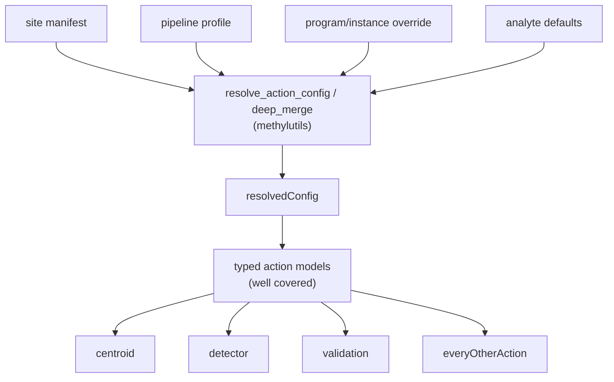

> **Status: implemented.** Tier-1 regression-protection tests were added across
> the shared config-resolution spine, contract-drift guards, untested MethylUtils
> and MethylDomain helpers, and a cross-package resolver→model handshake. A
> narrow, spine-scoped coverage ratchet with branch coverage was added as an
> opt-in CI step (global policy stays measure-and-report).

## The principle: test the seams, not the cores

Your read is right. The Pydantic-typed action I/O boundary (`workers/methyl_worker/task_models/*`, 99.7% covered; golden + catalog-linkage tests) already makes it hard for one action to produce output that breaks another. The low tier-1 numbers are GPU/real-H5 cores that the GPU and real-sample tiers exist to cover.

So a "wrong PR" that slips past tier 1 today would most likely land in **shared code that has no typed contract and sits upstream of every action**: the config resolver/merge layer in `methylutils`, the schema-drift guards that aren't enforced as pytest in the PR tier, and a few widely-imported helpers with zero tests. All of these are pure Python testable on hosted CI.

A bug in the resolver mis-feeds *every* box downstream, and the typed models won't catch it because the values are still type-valid — just wrong.

## Priority 1 — Config resolution / merge precedence (highest blast radius, currently under-tested)

All in [`packages/methylutils/methyl_utils/action_config_resolver.py`](../../packages/methylutils/methyl_utils/action_config_resolver.py) — pure functions, no GPU/DB/`/work`. There is no dedicated test that layer precedence resolves field-by-field.

- `deep_merge` (lines 41-48): nested-dict merge, overlay wins, base not mutated, lists replaced not concatenated.
- `resolve_action_config` (lines 134-161): assert the documented order **site slice → profile section → program override → instance override → analyte** with a fixture where each layer sets the *same* key to a different value, and confirm the highest layer wins at each step and untouched keys survive.
- `resolve_from_task_input` (lines 183-217): both branches — (a) `resolvedConfig` present with/without `stepOverride`; (b) fallback rebuild from `actionConfig`/`siteConfig`/`pipelineProfile`. This is the worker claim-time hot path with **zero** unit tests.
- `load_resolved_config` (lines 227-254) and `resolve_for_project` (lines 257-282): override-wins, and the routing decision (baked file vs env/profile fallback).
- `site_slice_for_action` (lines 75-108): the per-action path derivation (mapper gtf, alignment_qc/methyl_extract fasta, enricher cache) — a rename here silently drops reference paths.

Also add merge tests for the workflow-side layers (pure dict logic, tier-1 runnable):
- `apply_pipeline_profile` / `_deep_merge` in [`workflow_engine/domain/pipeline_profiles.py`](../../workflow_engine/domain/pipeline_profiles.py) — no dedicated test.
- `build_resolved_config_scope_vars` in [`workflow_engine/domain/workflow_context.py`](../../workflow_engine/domain/workflow_context.py) — extend beyond the single existing case to cover override precedence.

## Priority 2 — Promote contract-drift guards into the tier-1 pytest gate

This is the single best "wrong PR" catcher: change a Pydantic model, forget to regenerate the committed schema, and today tier 1 stays green.

- Config schema drift already has a pytest ([`packages/methylvalidation/tests/test_config_schema_export.py`](../../packages/methylvalidation/tests/test_config_schema_export.py) calling `check_config_schema_drift`) — confirm it actually runs inside `scripts/run_tests_ci.sh` and keep it there.
- Task schema drift has **no pytest mirror** — only a CI CLI (`methyl-export-task-schemas --check` in `db-parity.yml`). Add a pytest that calls `check_task_schema_drift` from [`workers/methyl_worker/task_schema_export.py`](../../workers/methyl_worker/task_schema_export.py) so the PR suite fails on `schemas/tasks/*.schema.json` drift.
- Wire/config boundary: [`scripts/check_task_input_config_boundary.py`](../../scripts/check_task_input_config_boundary.py) is CI-only — add a thin pytest wrapper so task-input fields overlapping `actionConfig` keys fail on tier 1.

## Priority 3 — Shared MethylUtils helpers with real blast radius and no tests

- [`packages/methylutils/methyl_utils/cli_resolved_config.py`](../../packages/methylutils/methyl_utils/cli_resolved_config.py) — imported by ~9 package CLIs, zero tests. Cover `resolve_cli_step_config` routing (worker `--resolved-config` path, standalone `--project` path, the "neither provided" `ValueError`) and `read_json_object` (missing file → None, non-object → `ValueError`).
- [`packages/methylutils/methyl_utils/logging_utils.py`](../../packages/methylutils/methyl_utils/logging_utils.py) — 3 packages, no tests.
- [`packages/methylutils/methyl_utils/memory_manager.py`](../../packages/methylutils/methyl_utils/memory_manager.py) and `beta_analytics.py` — smaller radius; cover the pure branches.

## Priority 4 — MethylDomain artifact/result layer

[`packages/methyldomain/methyl_domain/action_result.py`](../../packages/methyldomain/methyl_domain/action_result.py) is imported by 6 roots (artifact manifests, atomic writes) with no dedicated unit test — only indirect coverage via `workers/tests`. Add focused tests for manifest construction and atomic-write behavior, since a regression here corrupts outputs for every action that emits artifacts.

## Priority 5 — One cross-package contract meta-test

Add a parametrized test asserting that, for each catalog action, the resolver's output slice validates against that action's config Pydantic model (the resolver→model handshake). This locks the contract between Priority 1's merge output and the typed boundary so a field rename on either side fails loudly.

## Priority 6 — Ratchet, scoped to the spine (not a global gate)

Keep the global "measure and report" policy (no `fail_under` in [`pyproject.toml`](../../pyproject.toml)), but consider:
- Enabling `branch = true` for the resolver/merge modules so precedence branches are actually measured.
- A narrow ratchet on the shared-spine files (`action_config_resolver.py`, `cli_resolved_config.py`, `action_result.py`, `pipeline_profiles.py`) rather than the whole repo, so tier-1's GPU-depressed global number doesn't force a meaningless threshold.

## Out of scope (by design)
GPU numerical cores (`methylcentroid…core`, `methylcluster`, `methyldetector…core`), live-DB `rest.db`/`postgres.py`, and real-H5 paths — these are the GPU tier and real-sample tier's job; adding tier-1 line-rate there would mean mocking away the exact thing under test.
