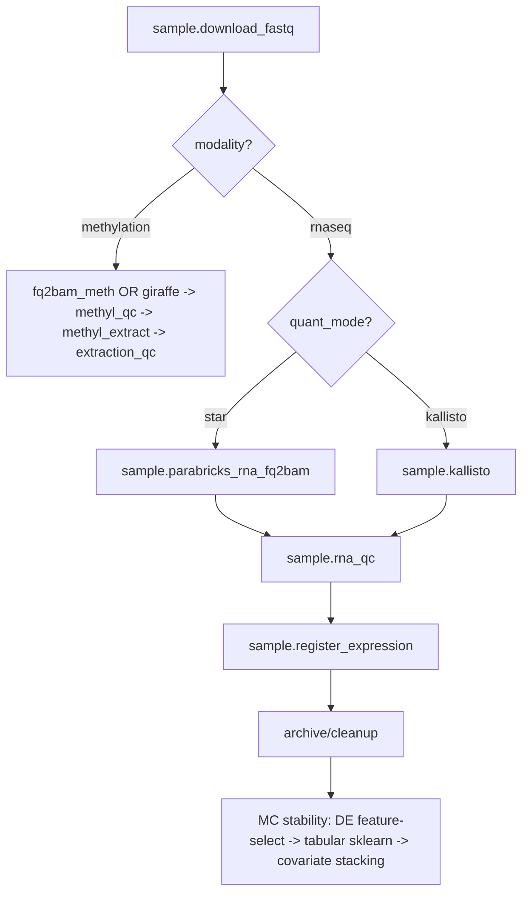

# RNA-Seq Process Pack

> **Status: Implemented** (2026-07). RNA-Seq is a second omics modality alongside DNA methylation. Programs, actions, profiles, packages, schemas, and tests are in the repo; DB seeding (`seed_action_catalog.py`) and `methyl-cfg materialize` run per deployment.

## Goal
Add RNA-Seq as a second analyte modality alongside DNA methylation, reusing the disease-agnostic control plane (DomainProgram, typed actions, cfg/wf, scheduler, CAAS) and replacing only the methylation-specific science.

## Architecture: where RNA-Seq forks from methylation

Reused as-is: Monte Carlo orchestration in `packages/methylvalidation`, `covariate_preprocessor` + `ecdf_second_stage` stacking, tabular sklearn, generic alignment metrics, DomainProgram/scheduler/CAAS/QC-gate pattern.
Not reused (methylation-only): `fq2bam_meth`/giraffe, `methyl_extract`, centroid/detector ECDF-on-beta, Houseman/HiTIMED (`packages/methyldeconv`), bisulfite/extraction QC, patterns/info-measures.

## Implemented components

### Phase 1 - Modality + reference assets
- `regulatory.primary_modality` (`methylation` | `rnaseq`) + `normalize_primary_modality` and `ProjectConfig.get_primary_modality()`.
- Site `rna_reference` block (STAR index, GTF, kallisto index, transcriptome FASTA, tx2gene) in `schemas/config/site_manifest.schema.json` + `site_grch38.example.json`; `resolve_rna_reference` + `site_slice_for_action` handling in `action_config_resolver.py`.
- `methyl-study-init --modality`; `scripts/download_rna_reference_grch38.sh`.

### Phase 2 - Alignment/quant actions
- `workers/methyl_worker/rna_fq2bam_runner.py` (`pbrun rna_fq2bam`, STAR gene counts) and `kallisto_runner.py` (`pbrun kallisto`).
- `task_models/rna_prep_models.py`, handlers in `handlers/rna_prep.py`, GPU capabilities `parabricks.rna_fq2bam` / `parabricks.kallisto`.

### Phase 3 - RNA QC + expression registration
- `packages/rnaalignmentqc` (`sample.rna_qc`), `packages/rnaexpress` (`sample.register_expression`), domain schemas `expression_matrix_ref.schema.json` + `rna_sample_ref.schema.json`.

### Phase 4 - Downstream
- `rna_express` cohort matrix loader (`load_expression_matrix`, log-CPM), DE gene selection + tabular classification action `pipeline.rna_de_select`, `feature_mode="rna_expression"` accepted by `MonteCarloConfig`; covariate stacking via `methyl_validation.covariate_preprocessor`.

### Phase 5 - Programs + profiles + config
- `workflow_engine/domain/fixtures/sample_prep_rnaseq.program.json`, `rnaseq_study_lifecycle.program.json`; `workflow_engine/domain/profiles/rnaseq_research.profile.json`.
- `quant_mode` (`star` | `kallisto`) → `useKallisto` resolution in `pipeline_profiles.py` (parallel to `alignment_mode`/`usePangenome`).

### Phase 6 - Registration / deploy / tests / docs
- Actions registered in `action_catalog.py`; `schemas/tasks/*` + `schemas/config/rna_*.schema.json` + `schemas/actions/catalog.json` regenerated.
- `scripts/deploy_workflow_definitions.sh` compiles the RNA programs when present.
- Tests: `workflow_engine/tests/test_rnaseq_sample_prep.py`, `packages/rnaexpress/tests`, `packages/rnaalignmentqc/tests`.

## Key decisions
- Two quantifiers selectable via `quant_mode` (star/kallisto), matching the linear/pangenome pattern.
- Modality is an explicit new field, not a reuse of `primary_analyte`.
- Downstream reuses MC orchestration + tabular sklearn + covariates; DE-based gene selection replaces centroid/ECDF; Houseman/HiTIMED and bisulfite QC are dropped for RNA.
