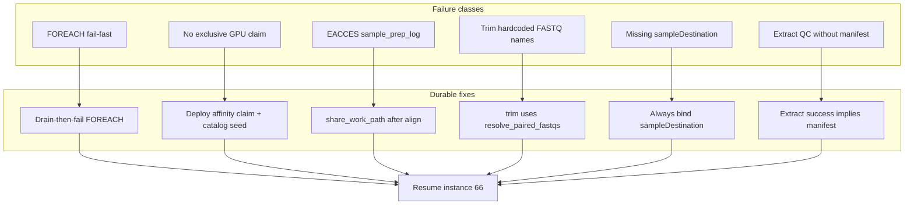

# SamplePrep durability (instance 66 classes)

> **Status: IMPLEMENTED.** Product fixes in git; Azure SQL FOREACH drain, dest-null token belt, and exclusive-GPU claim procs deployed 2026-08-19. Instance 66 resumed (download 2370 left FAILED).

Instance 66 (`Healthy_vs_PCa_low` SamplePrep) is **FAILED**. The original 23 even-FASTQ aligns succeeded; the cohort is not finished. Do **not** special-case this run in Python. Fix the product, deploy SQL, then resume 66 (leave download **2370** / `600138_21X_22_3` failed).

## 1. FOREACH: drain all samples, then fail

**Bug:** [`wf.wf_foreach_parallel_continue`](workflow_engine/sql_mssql/wf_sql_foreach_support.sql) marks the **instance FAILED** as soon as **any** child is `FAILED`, *before* other iterations finish. Action-fail already leaves the instance `RUNNING` so siblings stay claimable; continue then undoes that. Same logic in [`workflow_engine/sql_pg/08_foreach_support.sql`](workflow_engine/sql_pg/08_foreach_support.sql). Documented policy: one sample `fail_task` must not strand siblings ([`docs/plans/portal-pipeline-ia.plan.md`](docs/plans/portal-pipeline-ia.plan.md)).

**Fix:** Delete the early `IF EXISTS (... FAILED)` block. After `@finished = @max`, if any child `FAILED` then fail the FOREACH parent + instance; otherwise succeed. That is **drain-then-fail**, not ignore sample failures.

Add a SQL contract test beside [`workflow_engine/tests/test_foreach_continuation_sql.py`](workflow_engine/tests/test_foreach_continuation_sql.py) so a future base-script deploy cannot restore fail-fast.

**You deploy** the updated `wf_sql_foreach_support.sql` (and PG twin) via SSMS / `deploy_azure.sh`.

## 2. One Clara align per VM (claim + catalog)

**Bug:** Live `wf.sp_worker_request_task` has **no** `STOPPING` / `exclusive_worker` / `max_per_worker` (CHARINDEX 0). Catalog row for `sample.parabricks_fq2bam` was `exclusive_worker=false`. Worker 2 ran three aligns. Operators then held QC/extract/trim at `PENDING` so GPUs would take aligns.

**Fix (already started in git):** GPU align actions use `DISPATCH_EXCLUSIVE_ONE` in [`workers/methyl_worker/action_catalog.py`](workers/methyl_worker/action_catalog.py) (`fq2bam`, giraffe, rna_fq2bam; methylGrapher already exclusive). Regenerated [`schemas/actions/catalog.json`](schemas/actions/catalog.json). Azure row for fq2bam was upserted to `exclusive_worker=true`, `max_per_worker=1`.

**Still required:** deploy claim SQL in this order (see [`workflow_engine/sql_mssql/deploy_azure.sh`](workflow_engine/sql_mssql/deploy_azure.sh)):

1. [`wf_action_dispatch_concurrency.sql`](workflow_engine/sql_mssql/wf_action_dispatch_concurrency.sql)
2. [`wf_worker_desired_state.sql`](workflow_engine/sql_mssql/wf_worker_desired_state.sql)
3. [`wf_action_dispatch_affinity.sql`](workflow_engine/sql_mssql/wf_action_dispatch_affinity.sql) last (owns `sp_worker_request_task`)
4. Re-seed catalog: `seed_action_catalog.py`

Verify: `wf.wf_repo_list_actions` shows exclusive flags; a STOPPING worker gets `command=STOP` and no claim. One `methyl-worker` process per GPU VM (no omnibus + capability slices claiming the same worker id).

No more PENDING holds.

## 3. Writable `/work` after Docker align

**Bug:** QC/trim `EACCES` on `{sampleDir}/{sampleId}.sample_prep_log.jsonl`. Clara runs as `--user uid:gid` but does not `chmod` outputs. Sister VMs share NFS with **different numeric uids** named `ubuntu`. WGBS already has [`share_work_path` / `share_work_tree`](workers/methyl_worker/methylgrapher_wgbs_runner.py); Parabricks does not call them.

**Fix:**

- Move `share_work_path` / `share_work_tree` to a small worker helper (e.g. `workers/methyl_worker/work_share.py`); keep WGBS imports.
- After successful `fq2bam` / giraffe / trim, `share_work_tree(sample_dir)`.
- [`append_sample_prep_log`](workers/methyl_worker/sample_prep_log.py): if append gets `EACCES`, `share_work_path` on parent + file and retry once.

Tests: chmod-denied path retries; post-align share is invoked.

## 4. Trim FASTQ discovery = align discovery

**Bug:** [`run_fastp_trim`](workers/methyl_worker/fastq_trim_runner.py) requires `{sampleId}_1.fastq.gz` + `_2.fastq.gz` only. Align already uses [`resolve_paired_fastqs`](workers/methyl_worker/parabricks_runner.py) (even lane pairs, subdirs, `*_trimmed`).

**Fix:** Resolve inputs via `resolve_paired_fastqs`; fastp the first pair (or concatenate pairs if that is already defined for align — match align behavior, do not invent a third convention). Keep trimmed outputs as `{id}_1.trimmed.fastq.gz` / `_2.trimmed.fastq.gz` so realign keeps finding them. Tests in `workers/tests/` for multi-lane and missing-canonical-name cases.

## 5. Archive: `sampleDestination` must always resolve

**Bug:** Catalog templates bind `${var.sampleDestination}`. Planner [`_sample_entry`](packages/methylvalidation/methyl_validation/sample_prep_planner.py) **omits** the key unless `sampleStorage`/`h5Storage` was present. Activation then throws `Missing scope variable: sampleDestination` (qc-only archive NEs 3385, 3390, 3573). Handler already **skips** when destination is JSON `null` ([`docs/reference/action-parameter-contract.md`](docs/reference/action-parameter-contract.md)). `disableArchive` already seeds instance-level null ([`sample_lifecycle.py`](workflow_engine/ops/sample_lifecycle.py)).

**Fix (both layers):**

- Planner: always set `sampleDestination` / `h5Destination` on each sample (`null` if no archive profile).
- Gateway start: if archive profile exists, `apply_archive_profile_storage` must materialize per-sample dest (QNAP path for this study). If not configured, seed `null` like `disableArchive`.
- Optional belt: template substitution treats missing `sampleDestination`/`h5Destination` as JSON `null` instead of fail ([`wf_sql_foreach_support.sql`](workflow_engine/sql_mssql/wf_sql_foreach_support.sql) ~629–635) — needed so **already-planned** instance 66 archives can activate after requeue without rewriting every sample object.

Tests: planner emits null; archive handler skip; SQL/PG missing-var → null for those two names (or inherit parent scope).

**Follow-on (`rejectReason`):** full-archive `with` only set `mode: "full"`. Catalog still stamps `${var.rejectReason}`; nothing on the pass path writes that scope var, so bind dies with engine 10001 (instance 66 NE 4400). Treat missing `rejectReason` as JSON `null` in SQL (same belt as dest), compile unset `rejectReason` to null, and set `"rejectReason": null` on full-archive `with` blocks. QC-fail archives keep the literal reason.

## 6. Extract success ⇒ manifest on disk

**Bug:** `methyl_extract_retry` succeeded (iters 8, 26) then `extraction_qc_retry` failed: `{sampleDir}/{sampleId}.extraction_manifest.json` missing. Graph order is correct ([`sample_prep.program.json`](workflow_engine/domain/fixtures/sample_prep.program.json)). Extract skip/success must not return ok without writing the file QC reads.

**Fix:** [`ensure_extraction_manifest`](workers/methyl_worker/extract_runner.py) is mandatory on every successful extract path (including H5 skip). If the file is not at `sampleDir`, extract **fails**. Do not make QC invent a manifest. Align `sampleDir` (arm leaf vs sample root) between extract and QC — same path both handlers already take from input; if skip wrote to a different directory, that is the bug.

Tests: skip-existing-H5 still writes canonical manifest; QC unit already requires the file.

## 7. Tests, docs, plan file

- Worker pytest for trim, log EACCES retry, extract manifest invariant, catalog dispatch exclusive on GPU aligns.
- Engine SQL grep/contract for drain-then-fail.
- Update [`workflow_engine/sql_mssql/SamplePrepFlow.md`](workflow_engine/sql_mssql/SamplePrepFlow.md): FOREACH drains; one GPU align; archive null skip; no PENDING-hold runbook.
- After approval, copy this plan to [`docs/plans/sample-prep-durability.plan.md`](docs/plans/sample-prep-durability.plan.md) and a Feature row under Epic **AB#413** in [`docs/plans/README.md`](docs/plans/README.md).

## 8. Resume instance 66 (after code + SQL + worker bounce)

Do this only once workers are running the new tree and Azure SQL has the new claim + FOREACH procs.

1. `wf.wf_repo_set_instance_status @instance_id=66, @status=N'RUNNING'`.
2. Set **PENDING** `methyl_qc` / `methyl_extract` / `trim_fastq` on 66 back to **READY** (the 79/4/6 hold).
3. Requeue **FAILED** recoverables to **READY** (clear `output_json`): 7 leftover fq2bam (iters 9, 10, 12, 17–19, 63); permission-denied QC/trim; trim paired-FASTQ misses; archive qc-only (3385, 3390, 3573); extraction_qc_retry 8 and 26 (extract will rewrite manifest).
4. **Do not** requeue download **2370**.
5. Confirm one lease per worker on `parabricks_fq2bam`; do not freeze QC this time.

Idempotent aligns skip when BAM+QC artifacts exist; the 119 successful BAMs should not rerun Clara.
