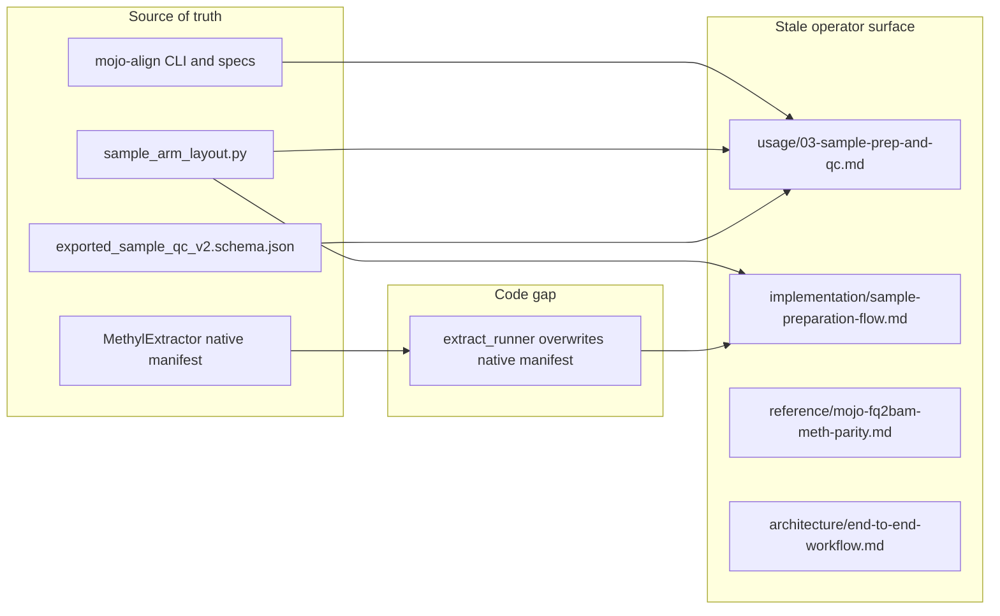

# SamplePrep documentation and extraction-manifest alignment

Last ~14 days in MethylPipeline (~111 commits) plus mojo-align (~24) and MethylExtractor (chrom-parallel, timing, native manifest) left **operator docs behind the code**. Architecture pages such as [sample-prep-tooling.md](../architecture/sample-prep-tooling.md) and [alignment-engines.md](../usage/alignment-engines.md) are largely current; [usage ch.03](../usage/03-sample-prep-and-qc.md) and [sample-preparation-flow.md](../implementation/sample-preparation-flow.md) are not.

This pass is **SamplePrep / mojo-align / MethylExtractor only**. Portal IA, Ensembl 116/GENCODE 50 inventory, and rewriting historical `docs/plans/*` are follow-ons (called out at the end).



---

## Audit findings (what is true vs what docs say)

### P0 — facts operators will get wrong

| Topic | Docs still say | Code / schema now |
|-------|----------------|-------------------|
| Sample layout | Ch.03 artifact table is a **flat** `/work/samples/{id}/` | Production binds **`sampleRoot`** = `/work/samples/{id}/` (FASTQs, `.caas/`) and **`sampleDir`** = `{sampleRoot}/align.{mode}.{engine}/` ([sample_arm_layout.py](../../packages/methylutils/methyl_utils/sample_arm_layout.py)). Flow doc mermaid + instance JSON still show a flat `sampleDir`. |
| QC export | Ch.03 table: normalized **V2**; note that **`alignmentMode` is not on the methyl_qc schema** | Export is **V2.1** `guardrail_summary`. `alignmentMode` **is** on [sample_methyl_qc.input.schema.json](../../schemas/tasks/sample_methyl_qc.input.schema.json). |
| MethylExtractor compute | “**GPU** MethylExtractor” in ch.03, [09a-methylextractionqc.md](../theory/chapters/09a-methylextractionqc.md), [end-to-end-workflow.md](../architecture/end-to-end-workflow.md) | Native **CPU** C/HTSlib/HDF5. GPU is alignment (Clara or mojo-align), not extract. |
| Standalone CLI paths | `methyl-qc --samples /work/samples/SAMPLE_ID` and `methyl-extraction-qc --sample-dir /work/samples/SAMPLE_ID` | After arm layout, `--sample-dir` must be the **arm leaf** (e.g. `.../align.linear.parabricks`). |
| Image env in checklist | Ch.03: `METHYL_METHYLGRAPHER_IMAGE` | Canonical pin is **`METHYL_MOJO_ALIGN_IMAGE`** (deprecated dual-read of the old name). |
| FOREACH failure | Ch.03 implies instance-level fail/handoff only | One sample `FAILED` does **not** fail the instance; siblings continue ([SamplePrepFlow.md](../../workflow_engine/sql_mssql/SamplePrepFlow.md)). |
| Linear Mojo BAM/QC | [mojo-fq2bam-meth-parity.md](../reference/mojo-fq2bam-meth-parity.md): k-mer/BWA-MEM, **samtools sort**, synthetic Picard | Production default is **`METHYLGRAPHER_LINEAR_ENGINE=fm`**: FM-index on `${REF}.bwameth.c2t`, native BGZF, GPU sort+markdup. Metrics remain `metrics_source: samtools+placeholders` until Picard enrichment. |

### P1 — extract contract (docs + code)

MethylExtractor **does** write `{sample}.extraction_manifest.json` (including `read_filtering`) and `{sample}.timing.json`. [sample-preparation-flow.md](../implementation/sample-preparation-flow.md) already claims `read_discard_fraction` is **Implemented**.

[extract_runner.py](../../workers/methyl_worker/extract_runner.py) still:

- Comments that the CLI “does **not** emit” the sample manifest (stale since 2026-06-23).
- Always calls `ensure_extraction_manifest()`, which **overwrites** the native file from legacy `{chrom}-{ctx}.json` sidecars and **drops `read_filtering`**.
- On H5 skip, rewrites the manifest specifically to kill `WORKER_STUB_EXTERNAL` leftovers ([test_idempotent_skip_when_all_h5_present](../../workers/tests/test_extract_runner.py)).

Result: linear extraction QC **skips** `read_discard_fraction` even though the binary and the docs say it votes.

Worker docs ([workers/docs/methyl_extractor.md](../../workers/docs/methyl_extractor.md)) mix the Universal Action Input Contract (`resolvedConfig`) with “workers read `project.json`”. MethylExtractor README options **table** omits `--chrom-parallel` / `--max-rss-gb` even though later sections mention them.

### Already current (do not rewrite; only cross-link)

- [alignment-engines.md](../usage/alignment-engines.md) — `MOJO_ALIGN_*`, `/opt/mojo-align`, archived methylGrapher-mojo
- [sample-prep-tooling.md](../architecture/sample-prep-tooling.md) — arm layout, compare arms, `mojo_linear` placeholder metrics
- [How to define samples.md](../user-manual/How%20to%20define%20samples.md) — `sampleRoot` / `sampleDir`
- [sample_prep_capabilities.md](../../workflow_engine/contract/sample_prep_capabilities.md) — arm layout + FOREACH skip semantics
- Package QC USAGE / V2.1 schema (touched 2026-08-25)

### Historical plans (do not rewrite)

Leave `methylgrapher-mojo-cutover*.md`, `native-mojo-align-hotpath.plan.md`, etc. as records. Add a **one-line superseded banner** only on plans that operators still open as runbooks (`METHYLGRAPHER_MOJO_*`, `build_methylgrapher_mojo_image.sh`, `/opt/methylgrapher-mojo`). Point to [archive-methylgrapher-mojo.plan.md](archive-methylgrapher-mojo.plan.md) and [alignment-engines.md](../usage/alignment-engines.md).

---

## 1. Preserve native extraction manifests (code)

In [extract_runner.py](../../workers/methyl_worker/extract_runner.py):

- Change `ensure_extraction_manifest` to **load native first** when `{id}.extraction_manifest.json` is a complete `methylextractor.extraction_manifest` (expected chromosomes present, `summary.cpg_weighted_mean_coverage` set).
- **Keep** `read_filtering`, `summary.cpg_fraction_sites_covered`, native `metadata`.
- **Overlay** worker-owned lists (`h5_files`, `pattern_files`, action provenance) if missing.
- If the file is a stub, incomplete (e.g. chr21-only leftover), or missing: synthesize from sidecars as today (existing skip-path behavior must still replace stubs).
- Fix the stale “does not emit” docstring.

Tests in [test_extract_runner.py](../../workers/tests/test_extract_runner.py):

- Keep stub-overwrite coverage (chr21-only must still be replaced).
- Add: complete native manifest with `read_filtering` **survives** skip and post-extract rewrite.
- Add: synthesized fallback when only sidecars exist (no native file).

Run: `source .venv/bin/activate && pytest workers/tests/test_extract_runner.py packages/methylextractionqc -q`

Then update flow/ch.03/worker docs so they describe **preserve-or-synthesize**, not “binary always wins” or “worker always synthesizes”.

---

## 2. Operator and implementation docs (MethylPipeline)

Canonical layout for ch.03 (link, do not duplicate the tooling diagram):

```text
/work/samples/<id>/                 # sampleRoot: FASTQs, .caas/
  align.linear.parabricks/          # sampleDir (Clara linear)
  align.linear.mojo/
  align.pangenome.parabricks/
  align.pangenome_wgbs.mojo/        # sampleDir (WGBS)
```

**[docs/usage/03-sample-prep-and-qc.md](../usage/03-sample-prep-and-qc.md)**

- Drop “GPU MethylExtractor”; say CPU MethylExtractor vs GPU alignment.
- Artifact table: FASTQs at `sampleRoot`; BAM/QC/H5/manifests in `sampleDir` arm leaf; add `timing.json`, V2.1 label, optional `*.patterns.h5`.
- Remove the “`alignmentMode` not on schema” note.
- Standalone commands: `--sample-dir` = arm leaf; mention `--alignment-mode` when relevant.
- Checklist: `METHYL_MOJO_ALIGN_IMAGE`; `chrom_parallel` / `max_rss_gb` live under `actionConfig.methyl_extract`.
- Short FOREACH note + link to SamplePrepFlow.
- Extraction GPU-time wording: extract is CPU; alignment is GPU.

**[docs/implementation/sample-preparation-flow.md](../implementation/sample-preparation-flow.md)**

- Storage mermaid: `sampleRoot` vs `sampleDir` arm.
- Instance JSON example: include `sampleRoot` and `sampleDir` ending in `align.linear.parabricks` (or equivalent). Config-surfaces table should list both keys.
- Manifest ownership paragraph (native + worker overlay).
- Keep `read_discard_fraction` as Implemented **with** preserve-or-synthesize so the guardrail actually sees `read_filtering`.

**Other active docs**

- [end-to-end-workflow.md](../architecture/end-to-end-workflow.md) mermaid: `CPU MethylExtractor`.
- [theory/chapters/09a-methylextractionqc.md](../theory/chapters/09a-methylextractionqc.md): same wording.
- [mojo-fq2bam-meth-parity.md](../reference/mojo-fq2bam-meth-parity.md): FM-index default, `${REF}.bwameth.c2t`, GPU sort/markdup, placeholders vs Clara Picard; point at mojo-align `fq2bam-meth/docs/LINEAR_ENGINES.md`.
- [alignment-engines.md](../usage/alignment-engines.md): one sentence that linear `engine=mojo` defaults to FM-index (not k-mer parity).
- [workers/docs/methyl_extractor.md](../../workers/docs/methyl_extractor.md): workers consume `--resolved-config` only; list `timing.json` + native manifest preserve; example `--sample-dir` uses an arm leaf.
- [DOCUMENTATION_AUDIT.md](../DOCUMENTATION_AUDIT.md): date this pass; SamplePrep row notes arm layout, V2.1, CPU extract, native manifest.

**Canvas / leftover `.qmd` links** (live UI, not plans): retarget SamplePrep-related links in [methylpipeline-architecture.canvas.tsx](../canvas/methylpipeline-architecture.canvas.tsx) (and sibling canvases) from `.qmd` to `.md`.

Do **not** duplicate the three-mode flowchart: keep [sample-prep-flow.mmd](../diagrams/src/sample-prep-flow.mmd) as the graph source.

---

## 3. Sibling READMEs (small, contract-only)

**MethylExtractor** [README.md](/home/ubuntu/MethylExtractor/README.md): add `--chrom-parallel`, `--max-rss-gb`, `{sample}.timing.json` to the options/outputs table so it matches later sections and MethylPipeline `actionConfig.methyl_extract`.

**mojo-align**: no README rewrite required if [LINEAR_ENGINES.md](/home/ubuntu/mojo-align/fq2bam-meth/docs/LINEAR_ENGINES.md) stays the science SoT; MethylPipeline parity doc will cite it.

---

## 4. Freshness CI so this class of drift cannot return

Extend [scripts/check_doc_freshness.sh](../../scripts/check_doc_freshness.sh) (active docs only; keep `docs/plans/**` excluded):

- `GPU MethylExtractor`
- `alignmentMode is not yet on the methyl_qc`
- `METHYL_METHYLGRAPHER_MOJO_IMAGE` as the primary pin (allow a “deprecated alias” sentence if needed via a tighter pattern)
- Optional: `does **not** emit` extraction_manifest wording

Copy this plan to [sampleprep-docs-audit.plan.md](sampleprep-docs-audit.plan.md) and add a row in [README.md](README.md) (Feature under Epic **AB#413**).

---

## Out of scope (separate follow-on)

- Default genomes Ensembl 116 / GENCODE 50 vs [genomes-multi-version-inventory.plan.md](genomes-multi-version-inventory.plan.md)
- Portal schema rename (`e_portal` → `portal`) beyond SamplePrep
- Rewriting completed science plans (`native-mojo-align-hotpath`, giraffe gates, etc.)
- Changing MethylExtractor binary defaults (MAPQ 30 vs profile 20) — document the **profile override**, do not change C defaults
