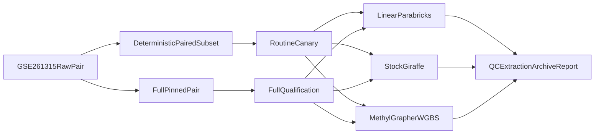

# SamplePrep Real-Data Canary

## Design
- Use a paired-end human WGBS run from [GSE261315](https://www.ncbi.nlm.nih.gov/geo/query/acc.cgi?acc=GSE261315), the public dataset produced for methylGrapher on HPRC individuals. **Pinned:** `SRR28293403` / `GSM8140413` / `WGBS-HG00621-Rep1` (see [`tests/real_data/sample_prep_canary/provenance.json`](../../tests/real_data/sample_prep_canary/provenance.json)).
- Ingest the complete FASTQ pair once into the configured `fastqStorage` (myQNAPcloud today), then create and checksum a stable paired-read subset. Tests consume these immutable objects rather than downloading or subsampling SRA at run time.
- Treat `pangenome`/stock Giraffe as a workflow and robustness comparator only: require successful execution/artifact contracts, but do not impose biological parity with bisulfite-aware modes.

## Delivered artifacts
| Artifact | Role |
|----------|------|
| [`tests/real_data/sample_prep_canary/provenance.json`](../../tests/real_data/sample_prep_canary/provenance.json) | Pinned accession |
| [`tests/real_data/sample_prep_canary/registry.example.json`](../../tests/real_data/sample_prep_canary/registry.example.json) | Typed canary config example |
| [`scripts/provision_sample_prep_canary.sh`](../../scripts/provision_sample_prep_canary.sh) | SRA → full + subset + checksums |
| [`scripts/smoke_sample_prep_real.sh`](../../scripts/smoke_sample_prep_real.sh) | Three-mode real orchestrator entry |
| [`workflow_engine/ops/sample_prep_canary.py`](../../workflow_engine/ops/sample_prep_canary.py) | DB start / poll / report |
| [`packages/methylutils/methyl_utils/testing/sample_prep_canary.py`](../../packages/methylutils/methyl_utils/testing/sample_prep_canary.py) | Artifact validation + JUnit/Markdown |
| [`.github/workflows/sample-prep-canary.yml`](../../.github/workflows/sample-prep-canary.yml) | Manual + monthly subset schedule |

## Operator notes
1. Provision FASTQs once; merge SHA-256 into site `testing.sample_prep_canary`.
2. Run subset routinely (`--tier subset`); run `--tier full` after subset success / quarterly.
3. Stock Giraffe failures of biological parity are expected; only workflow/artifact contract is gated.
4. Do not conflate this canary with catalog/golden PR gates or `WORKER_STUB_EXTERNAL=1` smoke.
