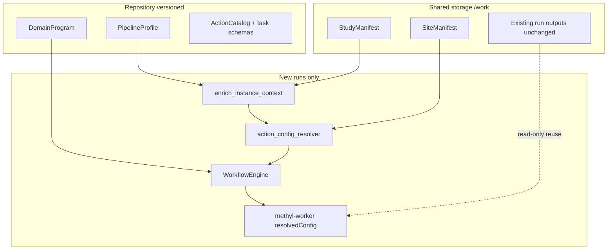

# Simplify Study Configuration (Four-Layer Model, Hard Cut)

## Context

[Composable pipeline flexibility](docs/plans/composable-pipeline-flexibility.plan.md) is **implemented**. The remaining work is to **retire `step_config`** and make the four-layer stack the **only** configuration path for new processing.

**Policy (explicit):**

- **No backward compatibility** for `step_config` in project JSON after this plan ships.
- **Existing outputs on `/work`** (centroids, detections, stability, progression, frozen models) are unchanged and remain valid artifacts — no reprocessing implied.
- **Any new workflow run, MC iteration, freeze, or standalone tool invocation** must use: **study manifest + program + profile + site manifest** (with materialized `resolvedConfig` on tasks).

| Layer | Artifact | Owns |
|-------|----------|------|
| Study manifest | `/work/<disease>/configs/project_*.json` | Cohorts, stages, comparisons, paths, regulatory, validation_partitions |
| Program | `workflow_engine/domain/**/*.program.json` | Control flow, per-action `with` / `stepOverride` |
| Profile | `workflow_engine/domain/profiles/*.profile.json` | Reusable `actionConfig` packs + scope booleans |
| Site | `/work/site/methyl_site.json` | Genomes, GTF, caches, cluster defaults |



---

## Design rules

1. **Hard cut**: `step_config` removed from [`project_config.schema.json`](schemas/config/project_config.schema.json) and [`ProjectConfig`](packages/methylutils/methyl_utils/pipeline_config.py). Projects containing `step_config` fail validation (migration script produces compliant files).
2. **Precedence** (highest wins): instance override → program `with` / `stepOverride` → profile `actionConfig` → analyte defaults (`regulatory.primary_analyte`) → site manifest → package defaults. **No project-level tool parameters.**
3. **Staged progression in manifest**: `diseases.groups[].stages[]`, `comparisons`, optional `description`, `progression_order`, `validation_partitions`.
4. **Progression order** (disease-agnostic): `from_stages` | `from_comparisons` | `explicit` + `progression_labels[]`; optional `order_index` on stages. **Remove** `ordering_mode: auto_gleason` and `step_config.progression` entirely.
5. **Topology in programs + profiles**: stability flags, optional `pipeline.progression`, MC settings live in profile `actionConfig.validation` and program IF branches — not in study manifest.

### Profile shape change

Rename profile tuning from `step_config_overrides` → **`actionConfig`** (same inner keys as today's catalog slices: `detection`, `mapper`, `enricher`, `validation`, `progression`, …):

```json
{
  "pipelineProfile": "staged_ovr_mc",
  "runDmpSelection": true,
  "actionConfig": {
    "detection": { "alpha": 0.05, "detection_mode": "discovery_only" },
    "validation": { "n_iterations": 30, "run_stability": true }
  }
}
```

Update [`pipeline_profiles.py`](workflow_engine/domain/pipeline_profiles.py) and [`enrich_instance_context`](workflow_engine/domain/workflow_context.py) accordingly.

---

## Phase 1 — Schemas and contracts (breaking)

**Goal:** Define the new-only config surface; reject `step_config`.

- Promote plan to [`docs/plans/simplify-study-config.plan.md`](docs/plans/simplify-study-config.plan.md); update [docs/plans/README.md](docs/plans/README.md).
- **Remove** `step_config` from [`schemas/config/project_config.schema.json`](schemas/config/project_config.schema.json).
- Add top-level study fields: `regulatory`, `validation_partitions`, `progression_order`, `progression_labels[]`, `order_index` on stage entries.
- Add [`schemas/config/site_manifest.schema.json`](schemas/config/site_manifest.schema.json).
- Add [`schemas/config/profile.schema.json`](schemas/config/profile.schema.json) with `actionConfig` (optional JSON Schema export for editor).
- Rewrite [docs/reference/domain-program-language.md](docs/reference/domain-program-language.md), [docs/reference/config-parameter-matrix.md](docs/reference/config-parameter-matrix.md), [docs/architecture/index.md](docs/architecture/index.md) — **new-only** config model.
- Slim manifest target ~60–80 lines ([project_Healthy_vs_PCa1-5-CG.json](tools/methyl-config-editor/configs/project_Healthy_vs_PCa1-5-CG.json) reference).

---

## Phase 2 — Resolver (single source of truth)

**Goal:** All action parameters flow through one resolver; no `get_step_config()`.

- New [`packages/methylutils/methyl_utils/action_config_resolver.py`](packages/methylutils/methyl_utils/action_config_resolver.py):
  - `load_site_manifest()` — `METHYL_SITE_CONFIG` or `/work/site/methyl_site.json`
  - `resolve_action_config(action_name, *, site, profile_action_config, program_with, instance_override, regulatory_analyte) -> dict`
  - Analyte merge via existing [`analyte_profiles.merge_step_config`](packages/methylutils/methyl_utils/analyte_profiles.py) (rename internally to `merge_analyte_defaults` if desired)
- **Delete** `ProjectConfig.get_step_config()` and `step_config` field.
- Refactor every `project_resolver.py` and worker runner to accept **`resolvedConfig`** dict (or call resolver with profile context), not project JSON slices:
  - [workers/methyl_worker/extract_runner.py](workers/methyl_worker/extract_runner.py), [parabricks_runner.py](workers/methyl_worker/parabricks_runner.py)
  - Package resolvers: centroid, detector, mapper, enricher, validation, progression, alignment_qc, fragmentomics
- Catalog: rename `step_config_key` → **`action_config_key`** in [action_catalog.py](workers/methyl_worker/action_catalog.py) (maps action → profile `actionConfig` section).

---

## Phase 3 — Profiles as parameter packs

**Goal:** All tunable parameters live in versioned profiles, not project JSON.

- Add profiles: `staged_ovr_mc`, `staged_full_lifecycle`, `staged_progression_interpretation`, `buffy_mc_gene_fc`.
- Migrate content from current bloated project `step_config` blocks into these profiles + [site_grch38.example.json](tools/methyl-config-editor/configs/site_grch38.example.json).
- `runProgressionAnalysis` scope flag for IF around `pipeline.progression`.
- Update all existing [workflow_engine/domain/profiles/*.profile.json](workflow_engine/domain/profiles/) to use `actionConfig` instead of `step_config_overrides`.

---

## Phase 4 — Materialize on every task (required)

**Goal:** Workers never infer config from project file.

- [`enrich_instance_context`](workflow_engine/domain/workflow_context.py): load site + merge profile `actionConfig` into context.
- Gateway / local engine: before worker claim, **`resolve_action_config`** → inject `resolvedConfig` into `input_json` for every ACTION.
- [`CliAction`](workers/methyl_worker/actions/base.py): workflow path uses `resolvedConfig` only (`--step-override` from materialized dict); **`--project` retained only for cohort path resolution** (output dirs, comparisons), not tool params.
- [`action_skip.py`](workers/methyl_worker/action_skip.py): hash `resolvedConfig` only; remove project file step_config slice reads.
- **Standalone CLIs** (`methyl-centroid`, `methyl-detector`, …): require `--profile` + site env **or** explicit `--config` JSON; reject legacy project files that contain tool parameters (migration script strips them).

---

## Phase 5 — Purge step_config and legacy paths

**Goal:** Codebase has zero `step_config` references in runtime paths.

- Remove from [`ProgressionStepConfig`](packages/methyldiseaseprogression/methyl_disease_progression/config.py) / progression runner: read progression params from **`resolvedConfig`** passed by workflow; delete `auto_gleason`, `ordered_disease_groups`, project-file progression block.
- Delete [`migrate_detection_config.py`](packages/methylvalidation/methyl_validation/utils/migrate_detection_config.py) and [`migrate_step_config`](packages/methylvalidation/methyl_validation/utils/migrate_detection_config.py) call sites.
- Remove legacy orchestration flags: `run_mapper_and_enricher`, `skip_enricher`, `validator` alias paths.
- Update **all** tests, smoke project JSONs under `workflow_engine/domain/checks/`, [tools/methyl-config-editor/configs/](tools/methyl-config-editor/configs/), [`.smoke/`](.smoke/).
- CI: fail if any committed `project*.json` contains `"step_config"`.

---

## Phase 6 — One-way migration tool

**Goal:** Convert existing operator configs once; not a compatibility layer.

Script [`scripts/migrate_project_config.py`](scripts/migrate_project_config.py):

| Input | Output |
|-------|--------|
| Legacy `project_*.json` with `step_config` | Slim `project_*.json` + suggested `*.profile.json` snippet + `site` keys for infra paths |
| | Migration report (what moved where) |

- **Replace in place** repo reference projects (Buffy, PCa1–5); operators re-run script on `/work/<disease>/configs/`.
- Old project files: archive to `project_*_legacy.json.bak` (optional flag); **not** read by pipeline.
- Document: existing `/work/.../centroids`, `detections`, `monte_carlo_runs`, `production/` are **not invalidated** — only new runs need new config triple (manifest + profile + site).

---

## Phase 7 — Config editor and manual

- [methyl-config-editor](tools/methyl-config-editor/): Study | Profile | Site | Program picker; **no step_config editor**.
- Usage manual + theory chapters: new-only authoring path; remove step_config tables.

---

## Study manifest (final shape)

```json
{
  "project_name": "Healthy_vs_PCa1-5-CG",
  "output_base": "/work/projects/prostate-cancer",
  "samples_base_path": "/work/samples",
  "controls": { "label": "healthy", "groups": [{ "label": "all", "sample_paths": ["..."] }] },
  "diseases": {
    "label": "cancer",
    "groups": [{
      "label": "PCa",
      "stages": [
        { "label": "PCa1", "order_index": 1, "description": "Grade group 1", "sample_paths": ["..."] }
      ]
    }]
  },
  "comparisons": "control_vs_each_disease",
  "progression_order": "from_stages",
  "chromosomes": ["1", "...", "Y"],
  "contexts": ["CG"],
  "regulatory": { "primary_analyte": "buffy_coat" },
  "validation_partitions": { "development_train": ["..."] }
}
```

No `step_config` key — schema rejects it.

---

## Acceptance criteria

| Scenario | Expected |
|----------|----------|
| Project JSON with `step_config` | **Validation error** at load |
| New MC run (Buffy) | `methyl-workflow-run --program ... --context-file discovery_gene_featurecuts.profile.json --context '{"projectPath":".../project_Buffy.json"}'` succeeds, site manifest present |
| Staged PCa1–5 | 5 comparisons from manifest; profile supplies detection/validation params |
| Progression | Order from `stages[]`; no `auto_gleason` code path |
| Re-run on existing `/work` outputs | Idempotent skip via manifests under output dirs (unchanged) |
| Standalone `methyl-centroid --project X` | Works for **paths/cohorts only**; params from `--profile` or `--config` |
| `grep step_config schemas/config/project_config.schema.json` | No matches |

---

## Implementation order

1. Phase 1 schemas (breaking flag day coordinate with Phase 5 purge in same release train).
2. Phase 2 resolver + Phase 3 profiles (can develop in parallel).
3. Phase 4 materialization (blocks production cutover).
4. Phase 5 purge + Phase 6 migration script + reference project replacement.
5. Phase 7 docs/editor.

**Builds on:** [composable-pipeline-flexibility.plan.md](docs/plans/composable-pipeline-flexibility.plan.md) (programs + IF flags — done).

**Explicitly removed:** dual-read paths, `step_config` deprecation warnings, `_slim.json` side-by-side coexistence, legacy standalone `--project` tool-parameter resolution.
