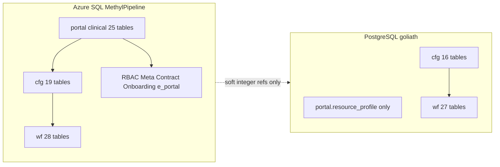

# SQL backend schema parity

> **Status: Planning** — Feature under Epic **AB#413**. Live inventories taken 2026-08-16 via Azure SQL MCP and PostgreSQL MCP (`goliath` + `postgres` databases).

Make both backends equivalent **as schemas we control**, including the real portal↔cfg↔wf links that already exist on Azure SQL. Do **not** migrate production data until MSSQL is the working system. PostgreSQL stays a schema/procedure twin (plus catalog seeds) until cutover.

## What is true today

**Azure SQL is the populated production twin.** Cross-schema FKs that matter for enrollment and publish:

- `cfg.study_group_member` → `portal.Samples` / `portal.LabSamples` (59 members)
- `portal.Samples.analyte_id` → `cfg.analyte` (438 samples)
- `cfg.domain_program` / `program_publish` / `action_definition` → `wf.workflow_def` / `workflow_version` / `workflow_action`
- `cfg.study_instance_link` / `cfg.hyperparameter_trial` → `wf.workflow_instance`
- `RBAC.Scopes` → `portal.Institutions` / `Labs`; `portal.Role2Node` → `RBAC`
- `Contract.*` → `portal.Customers` and `wf.workflow_def`

**PostgreSQL is not empty, but it is not equivalent.** Two databases exist on `goliath.postgres.database.azure.com`:

- [`goliath`](workflow_engine/sql_pg/README.md) (MCP default): `wf` + most of `cfg` + `portal.resource_profile`. Missing `wf.data_type*`, `cfg.analyte`, `cfg.assay_procedure`, `cfg.enrichment_library_preset`, `portal.sample_field_contract`. No clinical portal / RBAC / Meta.
- `postgres` (default of [`deploy_azure.sh`](workflow_engine/sql_pg/deploy_azure.sh)): older **wf-only** deploy. Do not treat this as the parity target.

Repo contract already covers the **engine slice**: parallel trees [`workflow_engine/sql_mssql/`](workflow_engine/sql_mssql/) and [`workflow_engine/sql_pg/`](workflow_engine/sql_pg/), [`db_objects.yaml`](workflow_engine/contract/db_objects.yaml) (~63 required `wf.*` / `portal.*` objects), [`validate_contract.py`](workflow_engine/contract/validate_contract.py), CI [`.github/workflows/db-parity.yml`](.github/workflows/db-parity.yml). That contract does **not** include `cfg.*` objects or the clinical/RBAC stack. PG `cfg.study_group_member` is documented as **soft refs** ([`cfg_registry_tables.sql`](workflow_engine/sql_pg/cfg_registry_tables.sql) line 178); enrollment procs such as `portal.sp_set_sample_analyte` already `RAISE` if `portal.samples` is absent.

**Out of scope for the twin:** `dbo` SSMS diagram procs, numbered junk tables (`dbo.25834`, …), and one-off extract tables (`dbo.PCa1`, `dbo.breast`, …). Those are not platform schema.

## Hard constraints for a full twin

- **Identifier case.** Azure SQL uses PascalCase (`portal.Samples`, `RBAC.Users`). Unquoted PG folds to lowercase. Existing PG code already probes `portal.samples`. For EpiPortal (direct SQL) to switch backends without a rewrite, PG DDL must use **quoted PascalCase** identifiers that match Azure SQL, plus lowercase synonyms/views only where MethylPipeline SQL already uses them.
- **Routine kind.** MSSQL `PROCEDURE` + result sets vs PG `FUNCTION … RETURNS TABLE` (already the convention in [`db_objects.md`](workflow_engine/contract/db_objects.md)). Keep that mapping; do not invent OUTPUT params.
- **JSON / identity.** `json` vs `jsonb`; `IDENTITY` vs `GENERATED … AS IDENTITY`. Data migration later must preserve integer IDs so FKs survive.
- **EpiPortal stays on MSSQL until the twin is complete.** Gateway/workers can already use either backend via `BACKEND_DB`.

## Phase 0 — One PostgreSQL database and a live inventory

- Canonical PG database: **`goliath`**. Change [`sql_pg/deploy_azure.sh`](workflow_engine/sql_pg/deploy_azure.sh) default `PGDATABASE` from `postgres` to `goliath` (keep override). Document the leftover `postgres` DB as stale.
- Add a **live object inventory** script (read-only; MCP / `sqlcmd` / `psql`) that diffs tables, views, routines, and cross-schema FKs for `wf`, `cfg`, `portal`, `RBAC`, `Meta`, `Contract`, `Onboarding`, `e_portal`. Commit the first snapshot under `docs/plans/` or `workflow_engine/contract/`.
- Expand [`db_objects.yaml`](workflow_engine/contract/db_objects.yaml) in later phases as objects land; Phase 0 only records the gap.

## Phase 1 — Close existing `sql_pg` drift on `goliath`

These objects **already exist in git** and on Azure SQL; live `goliath` is just behind deploy:

- Apply remaining files from [`sql_pg/deploy_azure.sh`](workflow_engine/sql_pg/deploy_azure.sh): [`wf_data_type.sql`](workflow_engine/sql_pg/wf_data_type.sql), [`cfg_registry_tables.sql`](workflow_engine/sql_pg/cfg_registry_tables.sql) / [`cfg_analyte_catalog.sql`](workflow_engine/sql_pg/cfg_analyte_catalog.sql) / [`cfg_process_pack_catalog.sql`](workflow_engine/sql_pg/cfg_process_pack_catalog.sql), [`portal_sample_extras_schema.sql`](workflow_engine/sql_pg/portal_sample_extras_schema.sql).
- Seed types/catalog with existing dual-backend tools (`seed_data_types.py`, `seed_action_catalog.py`, `sync_cfg_profiles_and_action_catalog.py`) — **reference metadata only**, not instances/leases.
- After this, `wf` + `cfg` table sets should match Azure SQL (19 `cfg`, 28 `wf` minus PG-only test-bed tables). Clinical FKs remain soft until Phase 3.

## Phase 2 — Take ownership of the Azure-only stack in `sql_mssql/`

Today the clinical/RBAC/Meta stack lives in the monolith [`MethylPipeline.sql`](workflow_engine/sql_mssql/MethylPipeline.sql), not in the incremental deploy list. Split it into idempotent scripts that `deploy_azure.sh` can apply (same pattern as `cfg_*`):

- `portal_clinical_schema.sql` — Institutions, Labs, Patients, Samples, LabSamples, Groups, GroupSamples, Diseases, disease extension tables, import batches, NavTree, Customers, …
- `rbac_schema.sql`, `meta_schema.sql`, `contract_schema.sql`, `onboarding_schema.sql`, `e_portal_schema.sql`
- Matching `*_api.sql` for the 69 legacy routines (skip `dbo.sp_*diagram*`)

MSSQL remains source of truth for behavior. Git becomes source of truth for DDL so PG twins have a file-to-file pair.

## Phase 3 — Port DDL to `sql_pg/` and turn soft refs into FKs

- Create quoted-identifier PG twins for every Phase 2 table, index, check, and cross-schema FK.
- Change [`sql_pg/cfg_registry_tables.sql`](workflow_engine/sql_pg/cfg_registry_tables.sql) so `cfg.study_group_member` gains the same FKs as MSSQL (`portal.Samples`, `portal.LabSamples`) once those tables exist.
- Add `portal.Samples.analyte_id` → `cfg.analyte` on both sides (already live on Azure SQL).
- Keep PG test-bed tables optional and out of the contract.

## Phase 4 — Port procedures (largest effort)

Work in dependency order. Each object gets an MSSQL/PG pair and a `db_objects.yaml` entry.

1. **Modern portal API already twinned** — finish any missing `portal.sp_*` that exist on Azure SQL but not in [`sql_pg/`](workflow_engine/sql_pg/) (sites, studies, assay/analyte catalogs, enrollment pickers, project archive, worker health, graph save/activate). Many names are listed in [`docs/architecture/portal-ia.md`](docs/architecture/portal-ia.md).
2. **Enrollment that needs clinical tables** — `sp_list_samples_for_study_enrollment`, `sp_set_sample_analyte`, `sp_list_groups_for_*`, `spGetSamples*`. These become real on PG after Phase 3.
3. **Clinical write path** — `dbo.spAddSample` / `spAddPatient` / `spAddLab` / … and `portal.spCollection*` / `spDiseaseFieldContract*`. Move new twins to `portal.*` where possible; keep `dbo` wrappers only if EpiPortal still calls them.
4. **RBAC / e_portal / Meta / Contract / Onboarding** — 49 non-diagram routines. Translate T-SQL (MERGE, OPENJSON, OUTPUT, `@@IDENTITY`) to PL/pgSQL. Preserve result-set column names.

Do not rewrite EpiPortal in this plan. The success test is: the same `portal.sp_*` / `RBAC.sp_*` names and result shapes work on both backends.

## Phase 5 — Contract, CI, and docs

- Extend [`validate_contract.py`](workflow_engine/contract/validate_contract.py) to required `cfg.*` and the new portal/RBAC objects.
- Add a **live-vs-live** job (or operator script) that fails when Azure SQL has a controlled object with no PG twin.
- Update [`sql_pg/README.md`](workflow_engine/sql_pg/README.md), [`distributed-workers-bootstrap.md`](docs/deployment/distributed-workers-bootstrap.md), and [`config-registry.md`](docs/architecture/config-registry.md): PG is no longer “soft refs / clinical Azure-only”; it is a schema twin. Data still stays on MSSQL until cutover.
- Promote this plan to [`docs/plans/sql-backend-schema-parity.plan.md`](docs/plans/sql-backend-schema-parity.plan.md) and add a row in [`docs/plans/README.md`](docs/plans/README.md).

## Phase 6 — Data migration (later, after MSSQL is working)

Not started now. When cutover is approved:

- Identity-preserving copy of `portal` / `RBAC` / `Meta` / `Contract` / `Onboarding` / `e_portal` / `cfg` / compiled `wf` graphs.
- Do **not** copy live `wf.task_lease`, `node_execution`, or worker tokens into PG unless that environment is the cutover target.
- Extend [`populate_postgres_reference_data.py`](scripts/populate_postgres_reference_data.py) or replace it with a dedicated ETL; today’s script is catalog-only by design.

## Recommended sequence vs “MSSQL first”

Keep implementing and operating on Azure SQL. Every new `portal.sp_*` / `cfg_*` / `wf_*` change lands in **both** trees in the same PR (existing rule). Phases 0–1 can happen immediately without blocking MSSQL work. Phases 2–4 are the migration prerequisite. Phase 6 waits for “everything working on MSSQL.”
